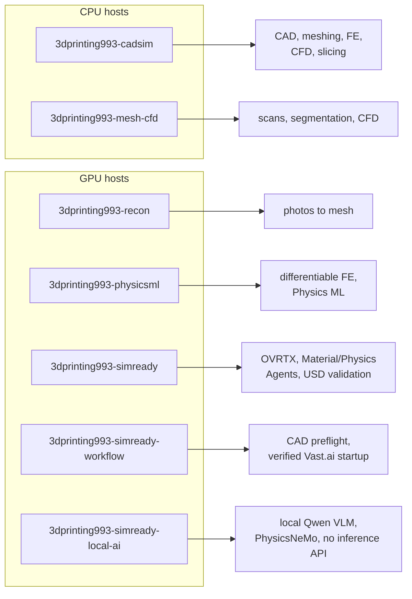
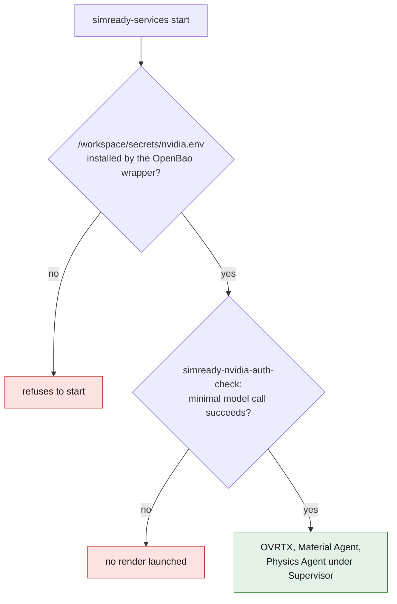

# Compute images

Seven reproducible images for the work that does not fit on an ordinary
workstation. They are not needed to contribute to the catalogue.

| File | Image | Requirement |
|---|---|---|
| `recon.Dockerfile` | `3dprinting993-recon` | CUDA GPU: photos to mesh |
| `cadsim.Dockerfile` | `3dprinting993-cadsim` | CPUs: CAD, meshing, FE, CFD, slicing |
| `mesh-cfd.Dockerfile` | `3dprinting993-mesh-cfd` | CPUs and memory: scans, segmentation and CFD |
| `physicsml.Dockerfile` | `3dprinting993-physicsml` | CUDA GPU: CAD, differentiable FE and Physics ML |
| `simready.Dockerfile` | `3dprinting993-simready` | RTX GPU: OVRTX, Material/Physics Agents and USD validation |
| `simready-workflow.Dockerfile` | `3dprinting993-simready-workflow` | RTX GPU: SimReady image, CAD preflight and verified Vast.ai startup |
| `simready-local-ai.Dockerfile` | `3dprinting993-simready-local-ai` | 48–80 GB GPU: SimReady, local Qwen VLM and PhysicsNeMo with no inference API |



Every embedded tool runs without a graphical interface, so that a script can
replay a complete chain identically.

```bash
make container-cadsim
make container-smoke
make container-physicsml
make container-smoke-physicsml
make container-simready
make container-simready-workflow
make container-simready-local-ai
make container-smoke-simready
make container-smoke-simready-workflow
make container-smoke-simready-local-ai
```

`simready` is deliberately a single container. Vast.ai already runs the image
in an unprivileged container and does not allow Docker-in-Docker. OVRTX,
Material Agent and Physics Agent are therefore installed in separate Python
environments and launched directly by Supervisor. No secret is included in the
image: `simready-services start` refuses to start before the OpenBao wrapper has
installed `/workspace/secrets/nvidia.env`. It then runs
`simready-nvidia-auth-check`: a minimal call to the configured model must
succeed before OVRTX and the agents are launched, so as not to pay for a render
bound to end on an authorization error.



The `simready-workflow` image embeds `simready-vast-onstart`. This script fixes
the permissions of the `authorized_keys` file injected by Vast.ai, checks the
GPU and the SimReady runtime, then creates `/workspace/READY`. The OpenBao
wrapper can therefore call this script instead of copying a shell sequence that
could drift.

The validation environment includes Pillow: OVRTX renders can thus fail
automatically when a PNG is empty or uniform, instead of only validating that a
file exists. The smoke test blocks publication if this pixel inspection is not
available.

`simready-profile-validate <asset.usd> --profile <name> --version <version>`
adds the paths of the SimReady rules, functions and profiles installed in the
image. This wrapper prevents a profile that is present from being wrongly
reported as unregistered.

`simready-local-ai` embeds the vLLM runtime, PhysicsNeMo 2.2.0 and an immutable
snapshot of `Qwen/Qwen2.5-VL-7B-Instruct`. Material Agent and Physics Agent both
use `http://127.0.0.1:8000/v1`: no NVIDIA key and no remote inference API is
needed. The vLLM wheel is CUDA 12.9; its process prepends NVIDIA's immutable
`cuda-compat-12-9` package to its library path so it can be checked on the
reviewed r570/CUDA 12.8 Vast offer. The startup gate still requires a real GPU
run: NVIDIA reports errors 803 or 804 when the provider driver or GPU cannot
use forward compatibility. The weights add about 16.6 GB to the image; this
variant is therefore reserved for rentals with 500 GB of disk and at least 48 GB
of VRAM, 80 GB being preferable so that OVRTX and the solvers can coexist.

This image combines components under distinct licenses. The NVIDIA CAD
converter remains subject to its own Omniverse license and must not be presented
as a free component, even though the repository's orchestration is.

`physicsml` bundles JAX-FEM, PhysicsNeMo and DeepXDE with the
geometry/meshing/FE tools of `cadsim`. The PhysicsNeMo GNN extra is disabled by
default to keep a build reproducible across several architectures; enable it
with `--build-arg PHYSICSNEMO_EXTRAS=cu12,sym,mesh-extras,model-extras,gnns`.

`examples/cad_to_fea.py` runs the complete chain — parametric solid, STEP,
tetrahedral mesh, CalculiX analysis — without a single graphical interaction.
That is the useful check: a tool that answers `--version` proves nothing.

`smoke-test.sh` fails if an announced tool does not respond; `entrypoint.sh`
makes the container environment visible in sessions injected by a host;
`provision-vastai.sh` installs on demand what is too heavy for the image.

Deployment, costs and data hygiene:
[../docs/COMPUTE_ENVIRONMENT.md](../docs/COMPUTE_ENVIRONMENT.md).
Rationale for the software choices:
[../docs/decisions/0002-scriptable-toolchain.md](../docs/decisions/0002-scriptable-toolchain.md).
