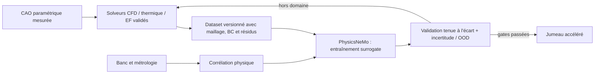

# Image PhysicsNeMo CAE CUDA 12

Cette image est le module GPU de **surrogate learning** du jumeau numérique.
Elle installe PhysicsNeMo 2.2.1 sur Python 3.12, PyTorch 2.10 et CUDA 12.8.
Elle vérifie les imports publics de `DoMINO`, `GeoTransolver` et
`MeshGraphNet` observés dans le tag NVIDIA `v2.2.1`.

L'extra amont `gnns` n'est pas demandé directement : ses métadonnées 2.2.1
référencent un paquet PyPI inexistant nommé `stl`. Les dépendances PyTorch
Geometric réellement nécessaires au smoke test sont donc installées et
épinglées explicitement avant PhysicsNeMo. Le méta-extra `cu12` n'est pas non
plus nécessaire aux trois modèles : il ajouterait notamment RAPIDS, cuML et
DALI à cette image. CUDA 12.8 est fourni par la base et les wheels PyTorch ; les
outils de préparation de données accélérés resteront dans une image séparée si
un cas d'usage les exige.

`hydra-core`, dépendance de base, exige `antlr4-python3-runtime` 4.9.x, dont
PyPI ne publie qu'une archive source. Cette archive est la seule exception à
`--only-binary` : son SHA-256 est épinglé et vérifié, puis elle est convertie en
wheel sans isolation réseau avant installation. Le smoke test d'image reste la
preuve que les imports publics attendus sont effectivement résolus.

Elle n'embarque volontairement aucun scan, dataset, poids de modèle, fichier
Porsche, solveur CFD/EF, outil CAO, Omniverse, serveur SSH ou client d'API.
Les entrées et sorties sont montées à l'exécution.

## Construction et vérifications

La cible est volontairement `linux/amd64`, qui correspond aux machines Vast.ai
et aux roues PyTorch Geometric épinglées :

```bash
docker buildx build \
  --platform linux/amd64 \
  --file containers/physicsnemo-cae-cu12.Dockerfile \
  --tag 3dprinting993-physicsnemo-cae-cu12:2.2.1 \
  --load \
  .
```

Le smoke test par défaut fonctionne sans GPU et sans réseau. Il vérifie Python,
les versions installées, `pip check` et les trois imports, mais n'interroge pas
CUDA :

```bash
docker run --rm --network none \
  3dprinting993-physicsnemo-cae-cu12:2.2.1
```

Le prévol d'une location GPU doit être explicite :

```bash
docker run --rm --network none --gpus all \
  3dprinting993-physicsnemo-cae-cu12:2.2.1 \
  physicsnemo-cae-smoke --require-gpu
```

Ce second test ajoute la visibilité du GPU et un petit calcul tensoriel CUDA.
Il ne prouve toujours aucune simulation moteur.

Un job monte son code, ses données de solveur et sa sortie au lieu de les
copier dans l'image :

```bash
docker run --rm --gpus all --network none \
  --volume "$PWD/work/917/reference-dataset:/workspace/input:ro" \
  --volume "$PWD/work/917/physicsnemo-output:/workspace/output" \
  --volume "$PWD/work/917/jobs:/workspace/jobs:ro" \
  3dprinting993-physicsnemo-cae-cu12:2.2.1 \
  python /workspace/jobs/train_surrogate.py
```

Avant toute dépense Vast.ai, l'image doit être reconstruite en CI pour
`linux/amd64`, son smoke test GPU doit passer, elle doit être publiée sur GHCR,
et la location doit utiliser son **digest immuable**, pas le tag. La liste
exacte des dépendances résolues est conservée dans
`/opt/physicsnemo/environment.freeze.txt`.

## Artefact CI verrouillé

Le workflow GitHub Actions no 6 est vert et a publié un manifeste OCI simple
`linux/amd64`. Le digest, les tailles, les versions, les hashes des recettes et
les gates fail-closed sont enregistrés dans
[`physicsnemo-cae-cu12.lock.json`](physicsnemo-cae-cu12.lock.json).

```text
ghcr.io/cluster2600/3dprinting993-physicsnemo-cae-cu12@sha256:045e8bc3151e0938d0f339aceb74c8583878effe5d0e316715e10818a018598a
```

La [preuve CI](https://github.com/cluster2600/porscheparts/actions/runs/33567830241)
confirme le pull public anonyme du digest et le smoke hors GPU. Elle ne contient
aucun scan, dataset ou poids. Le runtime GPU, le transport SSH d'une future
location, les solveurs moteur, l'entraînement et la corrélation au banc restent
explicitement non vérifiés ; le lock interdit donc encore un job Vast long.
L'image ne porte pas encore de label de révision OCI, de provenance attestée ni
de SBOM : l'association au commit repose donc sur l'artefact du workflow, et une
diffusion externe qualifiée exige encore ces trois éléments.

## Frontière solveur / surrogate

PhysicsNeMo n'est pas le solveur physique de référence. Le flux admissible est :



- `DoMINO`, `GeoTransolver` et `MeshGraphNet` sont des familles candidates,
  pas une sélection finale ni des modèles pré-entraînés.
- Les résultats CFD, thermiques, EF et multibody doivent d'abord provenir de
  solveurs classiques avec conditions aux limites, convergence et études de
  maillage documentées.
- L'entraînement est bloqué tant que ces références et une corrélation physique
  tenue à l'écart ne sont pas disponibles.
- Une prédiction PhysicsNeMo ne rend pas une pièce fonctionnelle, sûre ou
  imprimable. Tolérances, matériaux, fatigue, coupons, CT, usinage, étanchéité,
  équilibrage et essais banc restent des gates séparées.

## Pourquoi CUDA 12 et pas NGC/CUDA 13

La voie retenue est PhysicsNeMo core avec les extras de maillage nécessaires,
PyTorch CUDA 12.8 et une image de base CUDA épinglée par digest. Le méta-extra
`cu12` de PhysicsNeMo est réservé à une éventuelle image data-pipeline parce
qu'il installe des bibliothèques sans rapport avec les trois imports testés ici.
La voie CUDA 13 et l'image NGC ne sont pas utilisées tant qu'un prévol du pilote
de la machine cible n'a pas été archivé. Ce choix évite de confondre
compatibilité supposée et preuve d'exécution.

## Licences et provenance logicielle

| Composant | Licence ou condition principale |
|---|---|
| PhysicsNeMo | Apache-2.0 |
| PyTorch / torchvision | BSD-3-Clause |
| PyTorch Geometric et extensions | MIT |
| ANTLR4 Python runtime | BSD-3-Clause |
| Image de base NVIDIA CUDA/cuDNN | NVIDIA Deep Learning Container License et NVIDIA CUDA Toolkit EULA |
| Scripts de ce dépôt | licence du dépôt |

La construction ne transfère aucune licence sur les scans, plans, données
Porsche ou datasets montés à l'exécution. Un SBOM et les notices générées pour
l'image publiée restent nécessaires avant diffusion externe, notamment pour
inventorier les dépendances Python et paquets Ubuntu transitifs.

Sources de version : tag officiel
[`NVIDIA/physicsnemo v2.2.1`](https://github.com/NVIDIA/physicsnemo/tree/v2.2.1)
et métadonnées du paquet
[`nvidia-physicsnemo 2.2.1`](https://pypi.org/project/nvidia-physicsnemo/2.2.1/).

## Limites actuelles

- Cette image n'intègre pas les exemples d'entraînement NVIDIA ni un dataset
  moteur ; les imports seuls ne constituent pas un entraînement.
- Les roues GNN épinglées rendent cette variante `linux/amd64` uniquement.
- Les dépendances de premier niveau sont épinglées ; les transitives sont
  capturées au build, puis figées opérationnellement par le digest de l'image.
- Les quelques paquets système Ubuntu suivent les correctifs de sécurité
  disponibles au jour du build ; le digest GHCR et le SBOM, et non une
  reconstruction ultérieure du même Dockerfile, définissent l'artefact publié.
- Aucun prévol de pilote NVIDIA ou smoke GPU n'est possible sur un Mac sans GPU
  NVIDIA. Ces preuves doivent être produites en CI GPU ou sur une location
  courte avant le job long.
- Cette image ne comporte ni serveur SSH ni contrôleur Vast.ai ; l'accès et la
  récupération des artefacts restent la responsabilité du wrapper de
  déploiement approuvé.
