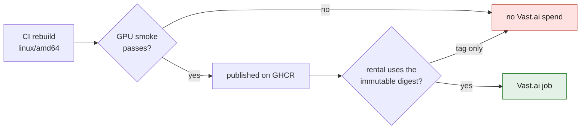
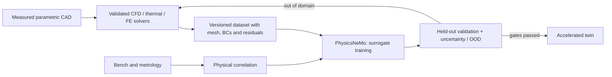

# PhysicsNeMo CAE CUDA 12 image

This image is the GPU **surrogate learning** module of the digital twin. It
installs PhysicsNeMo 2.2.1 on Python 3.12, PyTorch 2.10 and CUDA 12.8. It
checks the public imports of `DoMINO`, `GeoTransolver` and `MeshGraphNet`
observed in the NVIDIA tag `v2.2.1`.

The upstream `gnns` extra is not requested directly: its 2.2.1 metadata
references a nonexistent PyPI package named `stl`. The PyTorch Geometric
dependencies actually needed by the smoke test are therefore installed and
pinned explicitly before PhysicsNeMo. The `cu12` meta-extra is not needed by
the three models either: it would add, among others, RAPIDS, cuML and DALI to
this image. CUDA 12.8 is provided by the base and the PyTorch wheels; the
accelerated data-preparation tools will stay in a separate image if a use case
requires them.

`hydra-core`, a base dependency, requires `antlr4-python3-runtime` 4.9.x, for
which PyPI publishes only a source archive. This archive is the only exception
to `--only-binary`: its SHA-256 is pinned and verified, then it is converted to
a wheel without build isolation (`--no-build-isolation`) before installation. The image smoke test
remains the evidence that the expected public imports actually resolve.

It deliberately embeds no scan, dataset, model weights, Porsche file, CFD/FE
solver, CAD tool, Omniverse, SSH server or API client. Inputs and outputs are
mounted at run time.

## Build and checks

The target is deliberately `linux/amd64`, which matches the Vast.ai machines and
the pinned PyTorch Geometric wheels:

```bash
docker buildx build \
  --platform linux/amd64 \
  --file containers/physicsnemo-cae-cu12.Dockerfile \
  --tag 3dprinting993-physicsnemo-cae-cu12:2.2.1 \
  --load \
  .
```

The default smoke test works without a GPU and without network. It checks
Python, the installed versions, `pip check` and the three imports, but does not
query CUDA:

```bash
docker run --rm --network none \
  3dprinting993-physicsnemo-cae-cu12:2.2.1
```

The preflight of a GPU rental must be explicit:

```bash
docker run --rm --network none --gpus all \
  3dprinting993-physicsnemo-cae-cu12:2.2.1 \
  physicsnemo-cae-smoke --require-gpu
```

This second test adds GPU visibility and a small CUDA tensor computation. It
still proves no engine simulation.

A job mounts its code, its solver data and its output instead of copying them
into the image:

```bash
docker run --rm --gpus all --network none \
  --volume "$PWD/work/917/reference-dataset:/workspace/input:ro" \
  --volume "$PWD/work/917/physicsnemo-output:/workspace/output" \
  --volume "$PWD/work/917/jobs:/workspace/jobs:ro" \
  3dprinting993-physicsnemo-cae-cu12:2.2.1 \
  python /workspace/jobs/train_surrogate.py
```

Before any Vast.ai spend, the image must be rebuilt in CI for `linux/amd64`,
its GPU smoke test must pass, it must be published on GHCR, and the rental must
use its **immutable digest**, not the tag. The exact list of resolved
dependencies is kept in `/opt/physicsnemo/environment.freeze.txt`.


```mermaid
flowchart LR
    A["CI rebuild<br/>linux/amd64"] --> B{"GPU smoke<br/>passes?"}
    B -- no --> X["no Vast.ai spend"]:::stop
    B -- yes --> C["published on GHCR"]
    C --> D{"rental uses the<br/>immutable digest?"}
    D -- "tag only" --> X
    D -- yes --> E["Vast.ai job"]:::ok
    classDef stop fill:#fde2e1,stroke:#c0392b,color:#1a1a1a;
    classDef ok fill:#e3f1e6,stroke:#2e7d32,color:#1a1a1a;
```

## Locked CI artifact

GitHub Actions workflow run no. 6 is green and published a single-platform
`linux/amd64` OCI manifest. The digest, sizes, versions, recipe hashes and
fail-closed gates are recorded in
[`physicsnemo-cae-cu12.lock.json`](physicsnemo-cae-cu12.lock.json).

```text
ghcr.io/cluster2600/3dprinting993-physicsnemo-cae-cu12@sha256:045e8bc3151e0938d0f339aceb74c8583878effe5d0e316715e10818a018598a
```

The [CI evidence](https://github.com/cluster2600/porscheparts/actions/runs/33567830241)
confirms the anonymous public pull of the digest and the non-GPU smoke test. It
contains no scan, dataset or weights. The GPU runtime, the SSH transport of a
future rental, the engine solvers, training and bench correlation remain
explicitly unverified; the lock therefore still prohibits a long Vast job. The
image does not yet carry an OCI revision label, attested provenance or an SBOM:
the link to the commit therefore rests on the workflow artifact, and a qualified
external distribution still requires those three elements.

## Solver / surrogate boundary

PhysicsNeMo is not the reference physics solver. The admissible flow is:


```mermaid
flowchart LR
    CAD[Measured parametric CAD] --> SOLVER[Validated CFD / thermal / FE solvers]
    SOLVER --> DATA[Versioned dataset with mesh, BCs and residuals]
    TEST[Bench and metrology] --> CORR[Physical correlation]
    DATA --> TRAIN[PhysicsNeMo: surrogate training]
    CORR --> TRAIN
    TRAIN --> HOLDOUT[Held-out validation + uncertainty / OOD]
    HOLDOUT -->|gates passed| TWIN[Accelerated twin]
    HOLDOUT -->|out of domain| SOLVER
```

- `DoMINO`, `GeoTransolver` and `MeshGraphNet` are candidate families, not a
  final selection and not pretrained models.
- CFD, thermal, FE and multibody results must first come from classical solvers
  with documented boundary conditions, convergence and mesh studies.
- Training is blocked as long as these references and a held-out
  physical correlation are not available.
- A PhysicsNeMo prediction does not make a part functional, safe or
  printable. Tolerances, materials, fatigue, coupons, CT, machining, sealing,
  balancing and bench tests remain separate gates.

## Why CUDA 12 and not NGC/CUDA 13

The chosen path is PhysicsNeMo core with the necessary meshing extras, PyTorch
CUDA 12.8 and a CUDA base image pinned by digest. The PhysicsNeMo `cu12`
meta-extra is reserved for a possible data-pipeline image because it installs
libraries unrelated to the three imports tested here. The CUDA 13 path and the
NGC image are not used until a driver preflight of the target machine has been
archived. This choice avoids confusing assumed compatibility with evidence of
execution.

## Licenses and software provenance

| Component | Main license or condition |
|---|---|
| PhysicsNeMo | Apache-2.0 |
| PyTorch / torchvision | BSD-3-Clause |
| PyTorch Geometric and extensions | MIT |
| ANTLR4 Python runtime | BSD-3-Clause |
| NVIDIA CUDA/cuDNN base image | NVIDIA Deep Learning Container License and NVIDIA CUDA Toolkit EULA |
| Scripts in this repository | repository license |

The build transfers no license over the scans, drawings, Porsche data or
datasets mounted at run time. An SBOM and generated notices for the published
image are still required before external distribution, notably to inventory the
transitive Python dependencies and Ubuntu packages.

Version sources: official tag
[`NVIDIA/physicsnemo v2.2.1`](https://github.com/NVIDIA/physicsnemo/tree/v2.2.1)
and package metadata
[`nvidia-physicsnemo 2.2.1`](https://pypi.org/project/nvidia-physicsnemo/2.2.1/).

## Current limits

- This image does not include the NVIDIA training examples or an engine
  dataset; imports alone do not constitute training.
- The pinned GNN wheels make this variant `linux/amd64` only.
- First-level dependencies are pinned; transitive ones are captured at build
  time, then frozen operationally by the image digest.
- The few Ubuntu system packages follow the security fixes available on the
  build date; the GHCR digest and the SBOM, not a later rebuild of the same
  Dockerfile, define the published artifact.
- No NVIDIA driver preflight or GPU smoke test is possible on a Mac without an
  NVIDIA GPU. That evidence must be produced in GPU CI or on a short rental
  before the long job.
- This image has neither an SSH server nor a Vast.ai controller; access and
  artifact retrieval remain the responsibility of the approved deployment
  wrapper.
