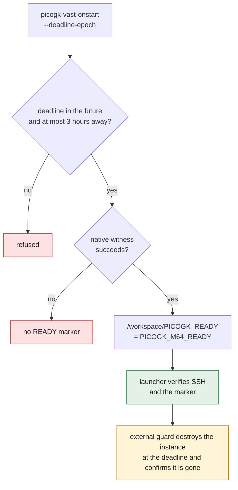

# PicoGK M64 workstation for Vast — headless geometry

The canonical Dockerfile is `containers/picogk-m64.Dockerfile`, with the
repository as the build context. It compiles the pinned official C++ runtime and
C# code, keeps their sources/licenses, then adds SSH, a geometry witness and the
`HeadVoxels` application. It contains no scan and no private CAD.

## Build and test

```sh
docker build --platform linux/amd64 -f containers/picogk-m64.Dockerfile \
  -t 3dprinting993-picogk-m64:preflight .
docker run --rm --network none --cpus 2 --memory 4g \
  3dprinting993-picogk-m64:preflight smoke-test.sh picogk-m64
```

To reuse the native runtime already checked on Kali: first verify that the
image `3dprinting993-m64-leap71:native-preflight` carries the identifier
`sha256:f38695f9ecc99ceef65c5e1fe02adf5dbfa95ee1ae925f95fd47bdba9ebb6178`,
then add to the build:

```text
--build-arg NATIVE_IMAGE=3dprinting993-m64-leap71:native-preflight
```

This substitution is a verified local cache, not an immutable registry
reference. CI publication rebuilds the native stage from source. A rental must
use the **published and re-verified GHCR digest**, not the local tag nor the
local Docker identifier.

The base manifest is fixed by SHA-256, the verified SDK is **9.0.317**, the .NET
runtime **9.0.19**, and the sources and submodules are fixed by commits. The
resolved Debian packages are inventoried under `/opt/provenance/`, along with
the library hash and the witness report. The Debian mirrors and the transitive
NuGet dependencies are not frozen in a snapshot/lock: this build is
procedurally reproducible, **not guaranteed bit-for-bit identical**.

## Operation and interfaces

- `smoke-test.sh picogk-m64`: creates a witness sphere of radius 5 mm with
  0.5 mm voxels, exports/reloads its STL, compares its volume with the
  analytical solution against a 10 % smoke threshold, checks the effect of a
  positive offset, then runs `HeadVoxels` on this witness. No X server and no
  GPU.
- `dotnet /opt/m64/HeadVoxels.dll INPUT_STL NEW_OUTPUT_DIR VOXEL_MM`: processes
  a copy of the supplied mesh, without transforming the reference frame or
  overwriting the master. This program is geometric, not a physics solver.
- `LD_LIBRARY_PATH=/app` resolves the ABI runtime `picogk.26.2.so`.
- The official sources stay in `/upstream`; advanced APIs not covered by the
  witness are not declared tested.

## Vast startup and shutdown

Preflight command for `ssh_direct`:

```text
picogk-vast-onstart --deadline-epoch UNIX_SECONDS
```

It refuses a deadline in the past or more than three hours away. The native
witness succeeds before `/workspace/PICOGK_READY` is written, with the content
`PICOGK_M64_READY`; its report is `/workspace/picogk-smoke/report.json`. The
command exits after the preflight. Vast starts SSH before `onstart` and may
replace `ENTRYPOINT`: the repository's proven SSH shim therefore creates the
host keys before the real daemon. The preflight does not open a second server.
The file `/root/.no_auto_tmux` ensures non-interactive SSH commands. The
launcher must actually verify the SSH connection and the marker.



Authentication accepts only a public key supplied at run time through
`PUBLIC_KEY` or a mounted `authorized_keys` file. No secret or private key is
embedded. Host keys generated by the package installation are deleted in the
same layer; new keys are created at every container start. Passwords and
keyboard-interactive login are disabled.

**The deadline is recorded in `/workspace/PICOGK_DEADLINE_EPOCH`, but it is not
a billing stop.** Every computation needs its own `timeout`; an external guard
must destroy the instance at that deadline and confirm it is gone. The
preflight does not claim to perform this destruction.

## Limit of the evidence

The witness checks a software installation and some geometry operations. Its
sphere is never a cylinder head shape, a cooling proposal, a strength
calculation or a print validation. The PicoGK engine is volumetric: an STL
export is not an exact B-Rep reconstruction and establishes no mechanical
fitness and no M64 compatibility.
