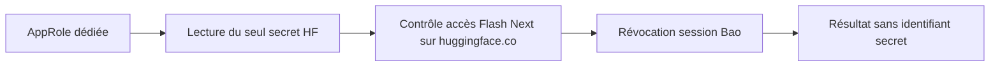

# Accès Hugging Face pour Flash Next

## Périmètre et état

Le wrapper `openbao-huggingface` effectue le prévol d'accès au modèle
`orcarouter/Qwen3.8-Flash-Next-Uncensored-NVFP4`. Il ne loue aucune machine,
ne télécharge aucun poids et n'exporte aucun token. L'injection distante dans
vLLM reste une étape distincte, à préparer après ce prévol.

Le chemin **nouveau, dédié** `secrets/data/huggingface-flashnext` est un contrat
d'installation, **pas un secret existant découvert**. Le 12 septembre 2026,
le répertoire d'identité `~/.config/openbao-huggingface-reader` était absent.
Les wrappers Vast, NVIDIA, GitHub et le writer de déploiement examinés ne
fournissent pas cet accès. Aucun de leurs droits n'a été élargi et aucune
identité administrative n'a été récupérée.



## Installation du code

Depuis ce dépôt :

```sh
python3 -m unittest discover -s tests -p 'test_openbao_huggingface_wrapper.py' -v
install -m 0755 deploy/openbao/openbao-huggingface /Users/maxime/.local/bin/openbao-huggingface
openbao-huggingface --check
openbao-huggingface --auth-check
```

`--check` contrôle les métadonnées privées de l'identité et le port local Bao,
sans lire les fichiers d'identité ni appeler Hugging Face. Il échoue tant que
l'identité n'est pas installée. `--auth-check` utilise l'identité, lit le seul
champ `HF_TOKEN` à l'emplacement fixé, contrôle l'accès au dépôt puis révoque
la session Bao, y compris en cas de refus Hugging Face. Une révocation en
échec interdit le statut de succès ; le TTL administratif borne alors la session.

## Activation administrative requise

À réaliser dans une session administrative OpenBao déjà autorisée, **pas avec
une identité de lecture Vast/NVIDIA/GitHub**, ni avec un token envoyé dans le chat :

1. Le propriétaire du compte Hugging Face accepte lui-même les conditions du
   modèle et crée un token **fine-grained, lecture de ce dépôt uniquement**.
   Vérifier dans Hugging Face les restrictions effectives du token ; le prévol
   ne prouve pas qu'un token donné est dépourvu de droits sur d'autres dépôts.
2. Déposer ce token directement dans le coffre : montage KV v2 `secrets`,
   clé `huggingface-flashnext`, champ `HF_TOKEN`. Ne pas utiliser les caches HF,
   le Trousseau, un fichier `.env` local ou une recherche de secrets existants.
3. Appliquer la politique versionnée
   [huggingface-flashnext-read.hcl](huggingface-flashnext-read.hcl), sous le nom
   `codex-huggingface-flashnext-read`. Elle autorise seulement la lecture de
   cette clé et la révocation de sa propre session ; aucune capacité `list`.
4. Créer l'AppRole `3dprinting993-huggingface-flashnext` sous `auth/codex-deploy`,
   avec cette seule politique, `token_no_default_policy=true`,
   `token_ttl=5m`, `token_max_ttl=10m`. Utiliser un SecretID de durée limitée
   (par exemple 24 h, 50 utilisations), à renouveler par l'administrateur.
5. Installer uniquement ses fichiers d'amorçage `role_id` et `secret_id` dans
   `~/.config/openbao-huggingface-reader`, propriétaire utilisateur courant,
   dossier **0700**, fichiers ordinaires **0600**, sans liens. Le token HF reste
   dans Bao, jamais dans ces fichiers. Ne pas imprimer les valeurs.
6. Exécuter les deux contrôles ci-dessus. L'administrateur n'a pas à transmettre
   de valeur secrète à Codex ; seul le résultat des contrôles est nécessaire.

Le wrapper n'a aucune commande de création de secret/politique, d'export,
de commande arbitraire, ni de sélection d'un autre chemin Bao ou modèle.
Les erreurs réseau restent génériques, sans corps de réponse ni en-têtes.
Les proxies hérités sont désactivés et toutes les redirections sont refusées.

## Vérification du 12 septembre 2026

- **28 tests hors ligne réussis**, dont une redirection HTTP locale réellement
  refusée, les droits/liens/types de fichiers, l'absence de lecture pendant
  `--check`, les refus d'accès, la révocation et l'absence de secrets en sortie.
- Relecture indépendante du code et de la correspondance à l'API officielle :
  aucun blocage identifié dans ce périmètre.
- Copie installée dans `~/.local/bin/openbao-huggingface`, identique à la source.
- Contrôle réel `--check` : **échec attendu, identité dédiée absente**.
  L'authentification Hugging Face n'est donc **pas vérifiée**. Aucun secret
  récupéré, aucun poids téléchargé, aucune dépense Vast pendant cette étape.

## Ce que le succès prouve — et ne prouve pas

Le contrôle utilise l'[API officielle `auth_check`](https://huggingface.co/docs/huggingface_hub/package_reference/hf_api#huggingface_hub.HfApi.auth_check)
en lecture, `GET /api/models/{repo_id}/auth-check`, et exige HTTP 200.
Ce n'est pas la fiche publique du modèle : son accès public ne prouve pas
l'accès aux poids restreints.

Un succès prouve l'autorisation de lecture du **dépôt**, pas l'existence d'une
révision précise, un transfert CDN, le chargement vLLM ou un serveur fonctionnel.
Avant une location, il faudra également revalider le digest linux/amd64 de
l'image existante, la révision des poids et la paire SSH, puis préparer une
injection distante bornée à l'instance relue. Le serveur restera sur loopback.

Références : [tokens à droits fins](https://huggingface.co/docs/hub/security-tokens),
[modèles à accès restreint](https://huggingface.co/docs/hub/models-gated).
L'accès est accordé au compte individuel ; créer un wrapper n'accorde pas
automatiquement cet accès et n'accepte pas les conditions à sa place.
