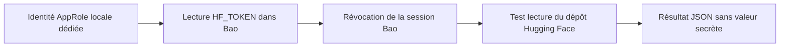

# Accès Hugging Face pour Flash Next

## État confirmé le 12 septembre 2026

**L'accès en lecture au dépôt Flash Next est opérationnel.** Le contrôle a été
réexécuté depuis le wrapper fourni/configuré par l'utilisateur, puis après
réinstallation du même wrapper. Aucun poids n'a été téléchargé et aucune
machine Vast n'a été louée pendant ces vérifications.

Le projet source est `/Users/maxime/projects/openbao-huggingface-wrapper`.
Sa source installée a été comparée à `src/openbao_huggingface.py` : les
fichiers étaient identiques. Ce dossier local n'était pas un dépôt Git lors
du contrôle ; il n'est pas présenté ici comme un logiciel publié par le dépôt Porsche.

| Élément vérifié | Résultat |
| --- | --- |
| Lanceur | `/Users/maxime/.local/bin/openbao-huggingface` |
| Version du wrapper | `0.1.1` |
| Bibliothèque | `huggingface-hub 1.31.0` |
| Secret KV v2 autorisé | `secrets/data/huggingface`, champ `HF_TOKEN` |
| Version du secret utilisée | `1` |
| Dépôt | `orcarouter/Qwen3.8-Flash-Next-Uncensored-NVFP4` |
| Droit confirmé | Lecture |

Ces noms sont des métadonnées : aucune valeur secrète n'est publiée.
L'indication utilisateur « la clé s'appelle vast » n'a pas servi à substituer
une clé API Vast.ai : le wrapper relu utilise le champ HF ci-dessus.

## Commandes vérifiées

```sh
cd /Users/maxime/projects/openbao-huggingface-wrapper
./scripts/deploy.sh install
./scripts/deploy.sh verify
./scripts/deploy.sh auth-check model orcarouter/Qwen3.8-Flash-Next-Uncensored-NVFP4
```

L'installation a réussi, avec les dépendances déjà présentes.
`verify` a retourné `ok: true` et `bootstrap: valid`. Le test d'accès a retourné :

```json
{
  "access": "read",
  "command": "auth-check",
  "ok": true,
  "repo_id": "orcarouter/Qwen3.8-Flash-Next-Uncensored-NVFP4",
  "repo_type": "model",
  "secret_version": 1
}
```

L'utilisateur a aussi demandé `./scripts/deploy.sh provision`. Cette commande
a été exécutée et a retourné le refus prévu :
`bootstrap already exists; refusing to create an orphaned SecretID`.
Elle n'a pas recréé l'AppRole ni remplacé les identifiants existants. Le contrôle
d'accès a réussi après ce refus. **Ne pas supprimer le bootstrap ni forcer
son remplacement pour faire passer cette étape** : elle sert à la première
initialisation, pas au contrôle courant.

## Circuit d'accès actuel



Le token HF passe explicitement en mémoire à la bibliothèque. Le wrapper ne
l'exporte pas dans l'environnement et ne réalise pas de `hf auth login`.
La session Bao est révoquée avant l'appel Hugging Face ; un échec de révocation
empêche cet appel. Installation et provisioning sont inutiles pour un simple
contrôle d'accès.

## Ancien prototype de ce dépôt

`deploy/openbao/openbao-huggingface` et `huggingface-flashnext-read.hcl`
restent l'historique du prototype initial, avec son ancien chemin
`secrets/data/huggingface-flashnext` et ses 28 tests hors ligne.
**Ne pas installer ce prototype par-dessus le lanceur actuel**, et ne pas
appliquer sa politique à l'identité désormais opérationnelle.
Le blocage « identité absente » décrit précédemment est dépassé. Les tests du
prototype ne constituent pas une qualification du nouveau wrapper.

## Limites et suite

Le succès de l'[API officielle `auth_check`](https://huggingface.co/docs/huggingface_hub/package_reference/hf_api#huggingface_hub.HfApi.auth_check)
prouve l'accès en lecture au dépôt, pas un téléchargement complet, une révision
précise, un chargement vLLM, une cadence d'inférence ou une validation physique
de la culasse.

Avant toute location : vérifier le crédit courant, le digest linux/amd64 de
l'image Flash Next existante, la révision des poids et la paire SSH, puis
préparer le transfert sécurisé ou le préchargement des poids pour l'instance
exacte. Un accès HF local fonctionnel ne vaut pas injection de credentials
sur Vast. Le serveur vLLM devra rester sur loopback, accessible par tunnel SSH.
