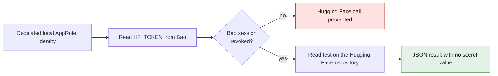

# Hugging Face access for Flash Next

## State confirmed on September 12, 2026

**Read access to the Flash Next repository is operational.** The check was
re-run from the wrapper supplied/configured by the user, then again after
reinstalling the same wrapper. No weights were downloaded and no Vast machine
was rented during these checks.

The source project is `/Users/maxime/projects/openbao-huggingface-wrapper`. Its
installed source was compared with `src/openbao_huggingface.py`: the files were
identical. This local folder was not a Git repository at the time of the check;
it is not presented here as software published by the Porsche repository.

| Item checked | Result |
| --- | --- |
| Launcher | `/Users/maxime/.local/bin/openbao-huggingface` |
| Wrapper version | `0.1.1` |
| Library | `huggingface-hub 1.31.0` |
| Authorized KV v2 secret | `secrets/data/huggingface`, field `HF_TOKEN` |
| Secret version used | `1` |
| Repository | `orcarouter/Qwen3.8-Flash-Next-Uncensored-NVFP4` |
| Confirmed right | Read |

These names are metadata: no secret value is published. The user's hint "la
clé s'appelle vast" ("the key is called vast") was not used to substitute a
Vast.ai API key: the reviewed wrapper uses the HF field above.

## Verified commands

```sh
cd /Users/maxime/projects/openbao-huggingface-wrapper
./scripts/deploy.sh install
./scripts/deploy.sh verify
./scripts/deploy.sh auth-check model orcarouter/Qwen3.8-Flash-Next-Uncensored-NVFP4
```

Installation succeeded, with the dependencies already present. `verify`
returned `ok: true` and `bootstrap: valid`. The access test returned:

```json
{
  "access": "read",
  "command": "auth-check",
  "ok": true,
  "repo_id": "orcarouter/Qwen3.8-Flash-Next-Uncensored-NVFP4",
  "repo_type": "model",
  "secret_version": 1
}
```

The user also asked for `./scripts/deploy.sh provision`. This command was run
and returned the expected refusal:
`bootstrap already exists; refusing to create an orphaned SecretID`. It did not
recreate the AppRole or replace the existing credentials. The access check
succeeded after this refusal. **Do not delete the bootstrap or force its
replacement to get past this step**: it serves the first initialization, not the
routine check.

## Current access circuit


```mermaid
flowchart LR
    A[Dedicated local AppRole identity] --> B[Read HF_TOKEN from Bao]
    B --> C{Bao session<br/>revoked?}
    C -- no --> X[Hugging Face call prevented]:::stop
    C -- yes --> D[Read test on the Hugging Face repository]
    D --> E[JSON result with no secret value]:::ok
    classDef stop fill:#fde2e1,stroke:#c0392b,color:#1a1a1a;
    classDef ok fill:#e3f1e6,stroke:#2e7d32,color:#1a1a1a;
```

The HF token is passed explicitly in memory to the library. The wrapper does not
export it into the environment and does not run `hf auth login`. The Bao session
is revoked before the Hugging Face call; a revocation failure prevents that
call. Installation and provisioning are unnecessary for a simple access check.

## Former prototype in this repository

`deploy/openbao/openbao-huggingface` and `huggingface-flashnext-read.hcl`
remain the history of the initial prototype, with its former path
`secrets/data/huggingface-flashnext` and its 28 offline tests. **Do not install
this prototype over the current launcher**, and do not apply its policy to the
identity that is now operational. The "missing identity" blocker described
earlier is resolved. The prototype's tests do not qualify the new wrapper.

## Limits and next steps

Success of the [official `auth_check` API](https://huggingface.co/docs/huggingface_hub/package_reference/hf_api#huggingface_hub.HfApi.auth_check)
proves read access to the repository, not a complete download, a specific
revision, a vLLM load, an inference rate or a physical validation of the
cylinder head.

Before any rental: check the current credit, the linux/amd64 digest of the
existing Flash Next image, the weights revision and the SSH key pair, then
prepare the secure transfer or preloading of the weights for the exact instance.
Working local HF access does not amount to injecting credentials on Vast. The
vLLM server will have to stay on loopback, reachable through an SSH tunnel.
