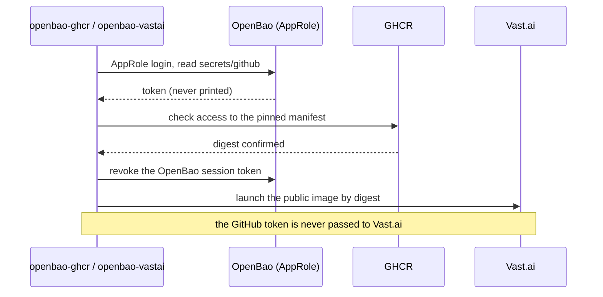
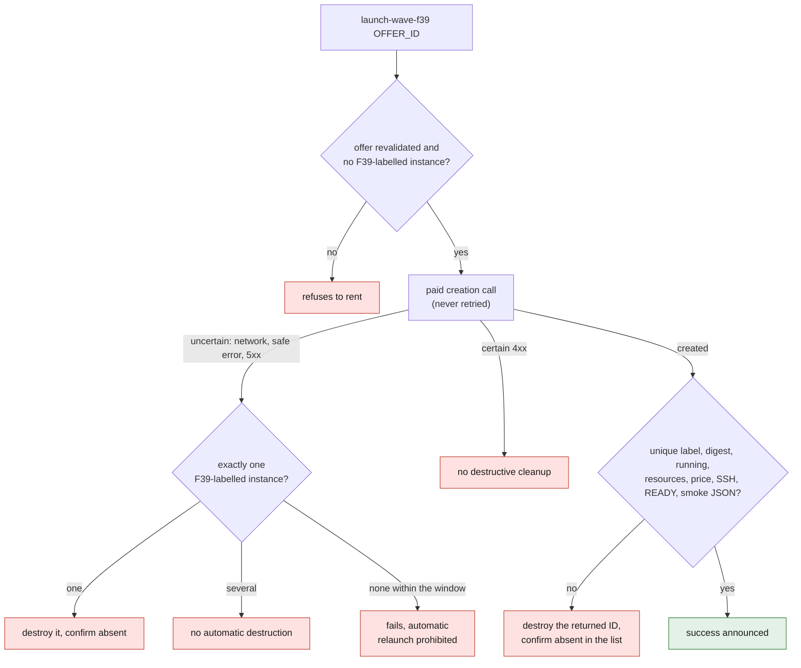

# OpenBao wrappers for GHCR and Vast.ai

Hugging Face access for Flash Next is now
[verified through the installed external wrapper and its routine procedure](HUGGINGFACE.md).
The HF prototype in this folder is historical: do not reinstall it over the
operational launcher. The GitHub, NVIDIA and Vast identities stay separate.

This folder versions the Vast.ai and GHCR wrappers used for the local SimReady
image. It contains no secret. `openbao-vastai` owns the rental, uniqueness and
destruction; `openbao-ghcr` checks access to the digest and then delegates only
the explicitly reviewed offer. The F39 path uses the immutable public image
directly and passes no GHCR credential to Vast.ai.

The wrapper is deliberately limited to:

- reading the existing secret `secrets/github` through a dedicated AppRole;
- the GHCR identity `cluster2600`;
- the image `cluster2600/3dprinting993-simready-local-ai`;
- the OCI digest declared in `openbao-ghcr`;
- an explicit SimReady launch operation of the `openbao-vastai` wrapper;
- the public F39 image
  `ghcr.io/cluster2600/3dprinting993-wave-action-f39@sha256:742569a45becdd00b9f8d32b057156e68d0bb0489cef1fa97d2e6543fce096a3`;
- an F39 offer reviewed by identifier, at 1.25 USD/h maximum, with at least
  64 effective CPU threads, 256,000 MB of RAM and 300 GB of disk;
- a verified machine, with minimum reliability 0.985, rentable and not already
  rented.

It accepts a token stored under one of the fields `GITHUB_TOKEN`, `GH_TOKEN`,
`github_token` or `token`. Its value is never printed. The wrapper checks access
to the pinned manifest locally, then launches the public image without passing
the token to Vast.ai.



## Routine installation

The GitHub secret and the two dedicated AppRoles must already exist. The routine
path installs only the versioned sources, with no OpenBao administrative
operation:

```zsh
cd /Users/maxime/projects/3dprinting993
install -m 0755 deploy/openbao/openbao-vastai /Users/maxime/.local/bin/openbao-vastai
install -m 0755 deploy/openbao/openbao-ghcr /Users/maxime/.local/bin/openbao-ghcr
rehash
openbao-vastai --check
openbao-vastai --auth-check
openbao-ghcr --check
openbao-ghcr --auth-check
```

`--check` does not read the secret. `--auth-check` reads the token temporarily
through the AppRole, checks the GHCR manifest, then revokes the OpenBao session
token.

The script `provision-openbao-ghcr.sh` is reserved for the one-off
administrative initialization of a missing AppRole. It is outside the routine
procedure and must not be re-run when the dedicated identity already exists.

Launching stays separate from installation:

```zsh
openbao-vastai heavy-offers
openbao-ghcr launch-vast-simready-heavy OFFER_ID

openbao-vastai wave-offers
openbao-vastai launch-wave-f39 OFFER_ID
```

The identifier is mandatory: the offer must be reviewed before rental. For
SimReady, the Vast wrapper refuses a second contract carrying the project label
and checks uniqueness after creation.

For F39, `wave-offers` requests the total price with 300 GB of storage and then
reapplies each threshold locally. `launch-wave-f39` redoes the exact match on
the identifier and revalidates the offer immediately before the paid call. The
container uses `ssh_direct`; its `onstart` runs
`/opt/917-engine-wave-f39/smoke.py`. It first deletes any old
`/workspace/READY`, then recreates this marker only if the smoke test finishes
with no error output.

This `onstart` is mandatory: the official Vast.ai documentation states that the
SSH/Jupyter modes replace the image's `ENTRYPOINT` with Vast's own, then run
`onstart` after that initialization. See
[Creating Instances with the API](https://docs.vast.ai/api-reference/creating-instances-with-api).
The wrapper also runs a uniqueness preflight under a local lock and refuses to
rent if an instance already carrying the F39 label exists. After creation, it
rereads the complete list and requires the returned identifier to be the only
instance carrying that label. It then rereads the Vast contract and requires the
immutable digest, the label, a final `running` state, at least 64 effective CPU
threads, 256,000 MB of RAM, 300 GB of disk, a total price of at most 1.25 USD/h
and a verified machine. Success is announced only after an OpenSSH connection in
`BatchMode`, with the approved private key `~/.ssh/id_vastai` explicitly
selected, followed by reading and validating `/workspace/READY`, the smoke JSON
and the absence of error output. The key therefore does not need to be loaded
into `ssh-agent`; its private content is never read or displayed by the wrapper.

Any error in this post-creation check destroys exactly the returned identifier
and requires its disappearance to be confirmed in the paginated list. After an
uncertain creation result (network error, safe wrapper error or HTTP 5xx), the
wrapper reconciles the F39 label: it destroys the single matching instance and
verifies it is absent. It destroys nothing automatically if several identifiers
carry that label, and a certain HTTP 4xx response triggers no destructive
cleanup. The paid creation call is never retried automatically: no branch can
implicitly create a second instance.

If no instance is observable before the reconciliation window of an uncertain
launch expires, the wrapper fails explicitly and prohibits any automatic
relaunch: the instance list must be inspected first. Likewise, `stop ID`
requires both the Vast.ai acknowledgment and a reread of the final `stopped`
state before announcing success.



The offer `#49655039` is only a candidate communicated by the user on
September 2, 2026. Its presence in the tests is a fixture: it guarantees neither
its current availability nor its future price, and attests no rental. It must
be reviewed in the current output of `wave-offers` before launching the command
with this identifier or any other compliant identifier.
