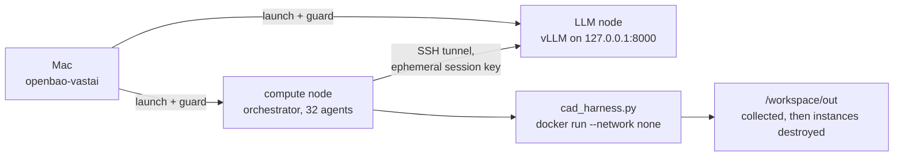
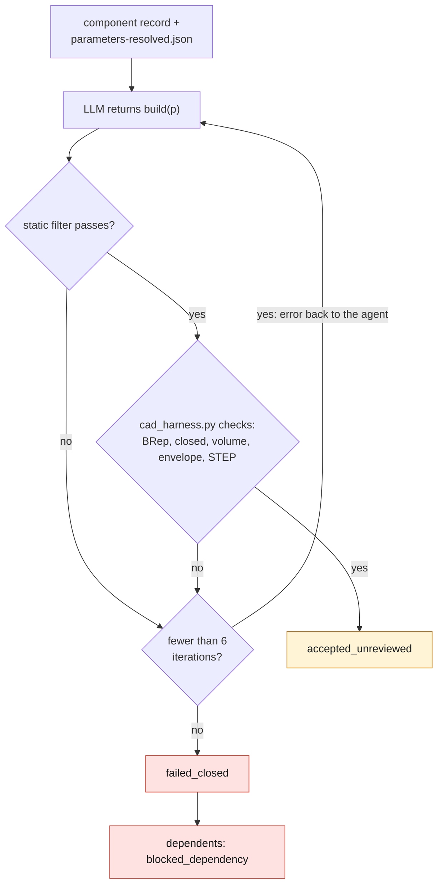
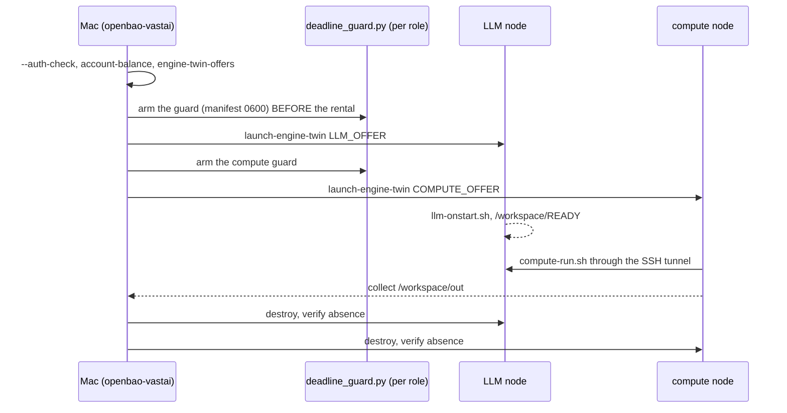

# GPU session of 2026-09-15: agent-driven M64 engine twin

Two Vast.ai instances, driven from the Mac, capped at **60 USD and 6 h**.
Manifest: [`twins/m64-engine-twin/session-20260915.json`](../../../twins/m64-engine-twin/session-20260915.json).
Nothing that comes out tonight is master geometry or a manufacturable part:
every accepted component is accepted at the status `accepted_unreviewed`.

## Architecture

| node | role | hardware | cap |
|---|---|---|---|
| LLM | vLLM, `Qwen3-Coder-30B-A3B-Instruct-FP8` at a pinned revision, 64 concurrent sequences | 1 × H100 80 GB (or RTX PRO 6000) | 2.60 USD/h |
| compute | orchestrator, 32 agents, network-less CadQuery execution, GPU CFD/FEA, USD | ≥ 64 cores, ≥ 256 GB RAM, 1 GPU ≥ 48 GB, 500 GB | 2.60 USD/h |

Worst-case budget: (2.60 + 2.60) × 6 h + 5 USD reserve = 36.20 USD, under the cap.

The model is the one already qualified by the `research-qwen-v1` profile. A 30B
MoE (3B active) serves several dozen agents on a single card; a bigger model
would require 4 to 8 GPUs and would break the budget.

The vLLM API listens only on `127.0.0.1`. The compute node reaches it through an
SSH tunnel with an ephemeral session key, authorized only on the LLM node and
destroyed with the instances.



## An agent's loop

1. Component record (brief, envelope, reports of accepted dependencies) and G1
   resolved parameters (`parameters-resolved.json`).
2. The LLM returns a CadQuery `build(p)` module. Static filter: no `os`,
   `subprocess`, network, `open`, `eval`.
3. `cad_harness.py` runs it in `docker run --network none --memory 6g`.
   Checks: valid BRep, closed solid, volume > 0, bounding box inside the
   envelope, STEP export.
4. On failure, the error goes back to the agent (6 iterations at most),
   otherwise `failed_closed`. The dependents of a failed component go to
   `blocked_dependency`.
5. No new work in the last hour: it is kept for assembly, collection and
   destruction.



## Already verified on 2026-09-15

- `tests/test_m64_engine_twin_session.py`: budget, digests, topological order,
  filter, envelope, error recovery, blocking of dependents, deadline.
- `cad_harness.py` in `3dprinting993-cadsim:dev` without network: valid
  cylinder, STEP exported.
- `cad-author-f28` and `mesh-cfd` **do not have CadQuery**; the chosen CAD image
  is `simready-local-ai`, which installs it in `/opt/venv`.

## FEA (CPU, `cadsim` image)

`twins/m64-engine-twin/source/fea_screens.py`: Gmsh C3D10 mesh, CalculiX, two
mesh sizes and a convergence gap, output `screen_unreviewed`.

- `--kind modal`: free-free elastic modes. Ground springs at 0.5 Hz isolate the
  six rigid modes; the script refuses the result if it does not find exactly six
  below 5 Hz. Pure free-free produced spurious results (surplus near-zero
  values, 0.6 Hz and 18 Hz).
- `--kind static`: one slice clamped, a total force on another; the force is a
  declared assumption.
- Self-check (`--self-check`), steel beam L 400 r 10: f1 = 571.8 Hz against
  575.5 Hz analytical (0.65 %); deflection 1.2917 mm against 1.2934 mm (0.14 %).
  Evidence: `twins/m64-engine-twin/evidence/fea-self-check-20260915.json`.

`ccx` is missing from `simready-local-ai`: the FEA runs on the collected STEP
files, in `cadsim`, one part at a time with capped memory.

```sh
docker run --rm --network none --memory 10g -v "$PWD:/repo:ro" -v "$OUT:/out" \
  --entrypoint python3 3dprinting993-cadsim:dev /repo/twins/m64-engine-twin/source/fea_screens.py \
  --kind modal --component crankshaft --material steel_42crmo4_hypothesis \
  --step /out/agents/crankshaft/iter-NN/out/part.step --out /out/fea/crankshaft --mesh-sizes 8 5
```

## The wrapper's `engine-twin-v1` profile

Two **paired but independent** rentals, one per role, each with its own
manifest, its label, its single paid attempt and **its own guard**:

| | llm | compute |
|---|---|---|
| label | `3dprinting993-engine-twin-llm-<hex20>` | `3dprinting993-engine-twin-compute-<hex20>` (same hex) |
| image | `vllm/vllm-openai@sha256:7a0f0f…` | `simready-local-ai@sha256:5a69a6…` |
| hardware | 1 GPU ≥ 80 GB, 16 cores, 64 GB, 150 GB | 1 GPU ≥ 48 GB, 64 cores, 256 GB, 500 GB |
| onstart | vLLM `127.0.0.1:8000`, relative `timeout` | bounded `sleep`; jobs over SSH |

Common caps: 2.60 USD/h, 6 h, 30 USD per role (hence 60 USD for the pair),
transfers ≤ 0.01 USD/GB, reliability ≥ 0.99, verified machine.

The uniqueness check tolerates **only the exact sibling label** of the same
session; any other rental on the account blocks the launch. The guard
`deploy/vast/engine-twin/deadline_guard.py` (SHA pinned in the wrapper) is a
policy on top of the unchanged PicoGK engine: it hides the exact sibling in its
inventory view, so that the two guards do not destroy each other, and stays
sensitive to everything else.

Tests: `tests/test_openbao_vastai_engine_twin.py`; wrapper, research and guard
non-regression (205 tests) green.

## Still to do before renting

1. **Reinstall the wrapper on the Mac** (`install -m 0755 …`) then
   `openbao-vastai --check`: the digest changes, and no guard from another
   session may be armed at that moment.
2. **Qualifications** `llm-qualification.json` and `compute-qualification.json`:
   digest reread anonymously, image and weight sizes measured.
3. **Real execution of `cad_harness.py` in `simready-local-ai`** on the compute
   node, before launching the agents (`--executor local`).

## The evening's run



```sh
# Mac, before any paid call
openbao-vastai --auth-check
openbao-vastai account-balance
openbao-vastai engine-twin-offers llm
openbao-vastai engine-twin-offers compute

# once per role: manifest 0600, then guard armed BEFORE the rental
python3 deploy/vast/engine-twin/deadline_guard.py /abs/engine-twin-llm-20260915.json &
openbao-vastai launch-engine-twin LLM_OFFER /abs/engine-twin-llm-20260915.json
python3 deploy/vast/engine-twin/deadline_guard.py /abs/engine-twin-compute-20260915.json &
openbao-vastai launch-engine-twin COMPUTE_OFFER /abs/engine-twin-compute-20260915.json
# on an uncertain failure: openbao-vastai reconcile-engine-twin /abs/<manifest>.json

# LLM node: onstart = deploy/vast/engine-twin/llm-onstart.sh; wait for /workspace/READY

# compute node: harness rehearsal, then agents
python3 twins/m64-engine-twin/source/orchestrate_agents.py --help
deploy/vast/engine-twin/compute-run.sh root@LLM_HOST:LLM_PORT DEADLINE_EPOCH

# in parallel on the compute node's GPU, existing jobs
make turbo-cold-side
twins/m64-cylinder-head/run_cht_runtime_smoke.sh

# end: collect /workspace/out, then destroy and verify absence
```

Local rehearsal without GPU, with the `cadsim` image:

```sh
python3 twins/m64-engine-twin/source/orchestrate_agents.py \
  --params twins/m64-cylinder-head/evidence/g1-four-valve-20260914/parameters-resolved.json \
  --out work/m64-engine-twin-rehearsal --deadline-epoch $(( $(date +%s) + 7200 )) \
  --llm-base-url http://127.0.0.1:8000/v1 --cad-image 3dprinting993-cadsim:dev --cad-python python3
```
