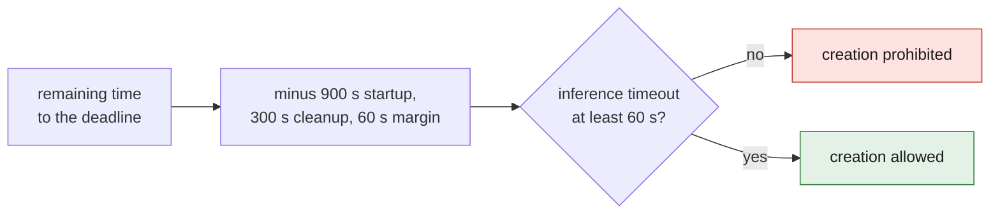
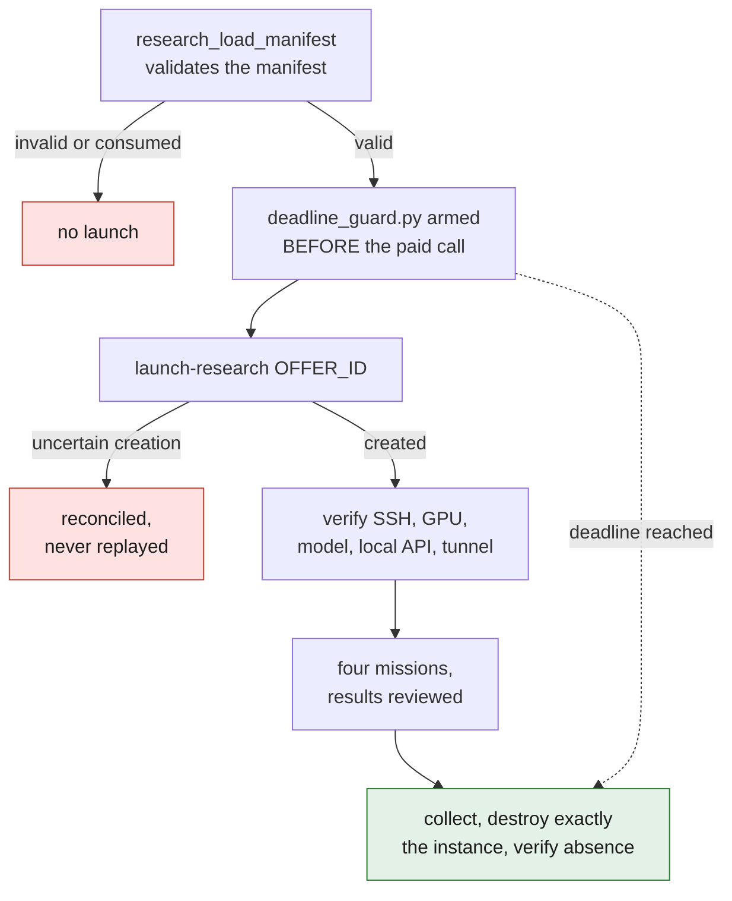

# M64 document readers on Vast

This profile runs a public LLM to analyze a supplied document corpus. It
launches no CAD, no solver and no manufacturing; the answers are never published
automatically. See the [execution dossier](../../../docs/reports/M64_RESEARCH_EXECUTION_20260912.md).

## Bounded profile

- vLLM 0.19.0 image pinned to the `linux/amd64` manifest; public model
  `Qwen/Qwen3-Coder-30B-A3B-Instruct-FP8` at an immutable revision in the
  wrapper.
- One L40S or RTX 6000 Ada, at least 45,000 MB of VRAM, 64,000 MB of RAM, 12
  effective CPUs and 100 GB of disk; offer verified and reread before creation.
- Maximum 0.85 USD/h and 4 USD per attempt, transfers and reserve included in
  the estimate; absolute deadline at most two hours away, preparation included.
- API on `127.0.0.1:8000`, SSH tunnel only; no HF/GitHub token sent.
- `gpu_frac` is the ratio between rented GPUs and the server's GPUs, not a
  fraction of a card; one GPU and its VRAM are required and reread separately.

The local guard is armed **before** the paid call. It uses the historical PicoGK
engine verified by SHA, watches the exact label and destroys the instance before
the deadline, then verifies its absence. This mechanism does not replace a
provider-side billing limit: a lasting loss of the workstation/network or a Vast
outage can delay the destruction. The server's internal timeout stops inference
but does not, on its own, end billing.

The inference timeout is computed on the controller, not with the remote clock:
remaining time minus 900 seconds of startup, 300 of cleanup and 60 of margin. A
result below 60 seconds prohibits creation. The metadata check may wait up to
900 seconds, always inside the global deadline. These bounds include loading and
do not guarantee that the model will be ready within that time.



## Controlled execution

The private local manifest is validated by `research_load_manifest`: digests of
the image, the weights, their qualification and the guard; exact path, unique
label, budget, timestamp and guard receipt. The values are prepared for one
specific attempt: do not reuse a consumed manifest.

1. Check the credit, `research-offers`, the public image and the weights without
   downloading them to the Mac. Install only the tested wrapper, without
   modifying the existing OpenBao identity.
2. Run `python3 /absolute/path/deadline_guard.py /absolute/path/manifest.json`
   and keep the process running until destruction is proven.
3. Run `openbao-vastai launch-research OFFER_ID /absolute/path/manifest.json`.
   Any uncertain creation is reconciled, never replayed.
4. Verify the SSH connection, GPU, model and local API, then open a tunnel. A
   return from the provisioner does not attest these steps.
5. Run four missions with the dispatcher, review the results before the rest of
   the queue, then collect and destroy exactly the instance.



Example document command, **once the tunnel and the corpus are verified**:

```sh
python3 twins/m64-cylinder-head/source/run_research_readers.py \
  --corpus /private/path/corpus.json \
  --endpoint http://127.0.0.1:18000/v1 \
  --model Qwen/Qwen3-Coder-30B-A3B-Instruct-FP8 \
  --output /private/path/new-pilot \
  --limit 4
```

Each source contains `url`, `text`, `read_level`, and the `sha256` of the UTF-8
text. The dispatcher passes at most 8,000 characters per source and three
sources per mission. Maximum: 24 missions, four concurrent, 1,600 response
tokens, 180 seconds per request, 1,800 seconds overall. No automatic retry,
autonomous browsing, code execution or access to secrets.

The JSON answers, citations and raw reports stay private. URL and excerpt must
match the corpus actually transmitted; that does not prove the conclusion
follows correctly from the excerpt. A review keeps the reading limits, removes
contradictions and produces the publishable synthesis.

## Verification

```sh
python3 -m unittest discover -s tests -p 'test_*research*.py' -v
```

These tests are offline. Neither their success nor an LLM answer validates the
cylinder head. Modifying the shared wrapper makes some fingerprints of historical
reports drift, notably F46: do not regenerate them to wrongly announce that the
old runs were re-executed.

Source for the offer semantics: [official Vast documentation](https://docs.vast.ai/cli/reference/search-instances).

## CAD specialists trial mode

The optional manifest field `execution_mode: "cad-specialists-v1"` reuses the
image and the financial guardrails, but starts only a bounded waiting process: no
Qwen server, no download of its weights and no API port. Leaving the field out
keeps the historical document profile. `cad-specialist-offers` searches for
explicitly admitted GPUs of 24 GB or more, with 8 effective CPUs and 32 GB of
RAM at minimum. The 0.85 USD/h cap, the bounded transfer fees and the deletion
guard stay unchanged.

`cad-specialist-offers OFFER_ID` provides a review diagnostic without creation:
offer counts, integer identifiers and query fingerprint. A displayed offer is
not a reservation; launch requires a new exact match before the paid call.

The Qwen qualification fields attest only the base profile and keep a cautious
download allowance. The specialist receipt states `model: null`,
`api_bind: null` and `specialist_weights_verified: false`. The effective
revisions and inference of cadrille and CAD-Recode must therefore be verified
separately, then their generated code run in an independent sandbox. See the
[specialist report](../../../docs/reports/M64_CAD_SPECIALISTS_20260912.md).
