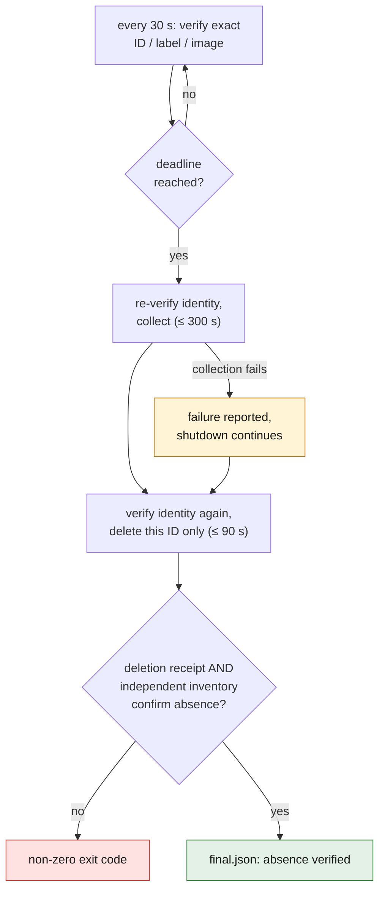
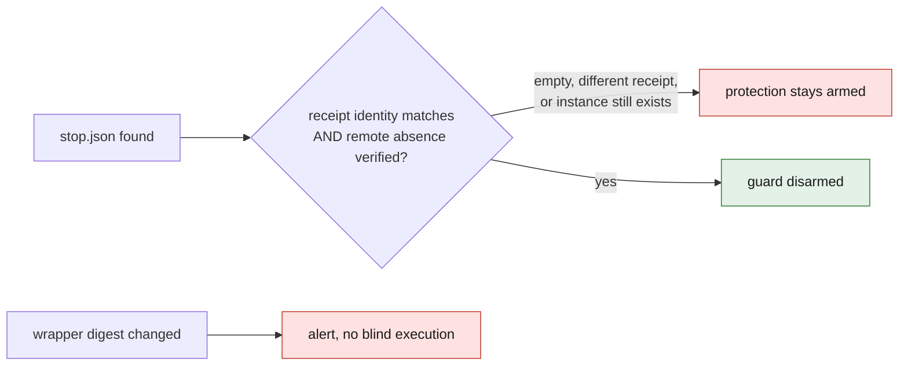

# Local M64 deadline guard

This program rents nothing and runs no phase. After a successful launch, it
watches only the instance already named in the manifest:

```sh
python3 deploy/vast/simready/m64-deadline-guard.py \
  --manifest /absolute/path/to/the/bundle/job-manifest.json \
  --state-dir /new/private/guard/folder
```

The only command tool allowed is the **installed** local wrapper
`/Users/maxime/.local/bin/openbao-vastai`, with four commands: `show`,
`m64-collect`, `destroy --confirm`, `instances`. No SSH, raw API call, key
change, relaunch or other mutation is exposed.

The state folder is created as 0700, its receipts as 0600. The manifest and the
wrapper are pinned by SHA256 at arming time. The manifest deadline, at most two
hours after its creation, is never renewed. A second, monotonic deadline prevents
a clock rollback from extending the watch.

Every 30 seconds, the guard verifies the exact ID/label/image identity. At the
deadline:

1. Identity re-verified and collection into `deadline-collection`, limited to
   300 seconds. A collection failure stays reported, without preventing the
   shutdown.
2. Identity verified again, then deletion of that ID only.
3. Verification of the deletion receipt **and** of an independent inventory.

Read commands are bounded at 45 seconds, deletion at 90 seconds: retrieval and
closing checks may run past the compute deadline. They do not make an unlimited
budget. `final.json` reports verified collection and verified absence
separately; any closing failure returns a non-zero code.



## Early stop

After collecting with the wrapper, then deleting and verifying the instance,
create `stop.json` as 0600 in the state folder:

```json
{
  "job_id": "exact value from the manifest",
  "instance_id": 123456,
  "label": "exact value from the manifest",
  "image": "exact digest from the manifest",
  "manifest_sha256": "exact digest recorded in guard.json",
  "collection_receipt": "/absolute/path/collection-receipt.json"
}
```

The guard verifies the identity of the collection receipt and the remote
absence. An empty file, a different receipt, or a marker while the instance
still exists does not disarm the protection. Do not reinstall the wrapper during
the watch: a change of its digest raises an alert, never a blind execution.



## Important limit

This is a **local** protection, not a provider-side kill switch. The Mac and the
process must stay awake, supervised and connected. A shutdown, a suspension or
a network outage can prevent the remote deletion; no absence receipt is then
claimed. The guard is neither evidence of global billing nor a manufacturing
validation.
