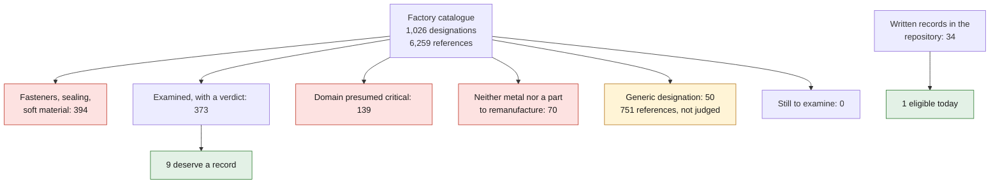

# What remains to be examined — the 70 designations of the factory catalogue

An answer to a fair objection: "a single titanium part on the whole car?" No.
That figure counted the records in the repository, not the automobile. Here is
the wide sweep, and its result.



*Diagram: the three counts of this page. The left chain sweeps the car's catalogue; the right one measures the state of the repository, and the two must not be quoted one for the other. It adds no number to the tables below.*

## The whole catalogue is disposed of — not one silent loss left

The screenings published what they kept, and **956 of 1,026 designations fell
away without a reason**. That is how `oil pipe`, then `pulley`, then `muffler`
got lost. Every designation now leaves with a category and a written reason.

| category | designations | references |
|---|---:|---:|
| fasteners, sealing, soft material | 394 | 3,126 |
| **examined, with a verdict** | **373** | **1,245** |
| domain presumed critical | 139 | 598 |
| neither metal nor a part to remanufacture | 70 | 539 |
| **generic designation** — see below | **50** | **751** |
| still to examine | **0** | 0 |

| stage | covers | keeps |
|---|---:|---:|
| disposition of the factory catalogue | 1,026 designations, 6,259 references | 373 examined |
| verdict on the examined designations | 373 | **9 deserve a record** |
| screening of the written records | 34 records | 1 eligible today |

The three do not say the same thing and must never be quoted one for the other.
The first sweeps the car. The last measures the state of the repository.

## What remains open, and must not be dressed up

**50 designations, 751 references, are "generic".** `support` covers
142 references, `cover` 118, `lid` 69. These are not parts, they are words:
judging them at that level would be a fake, because they cover parts that have
nothing to do with one another.

For those, the unit of judgment is not the designation but **the reference**,
and there are 6,259 of them. That is work of another order, and it is not done.
It is counted here rather than hidden.

## The seven designations to examine

| ref. | designation | plate | presumed material |
|---:|---|---|---|
| 21 | `tail pipe` | 202-00, 202-15 | stainless steel — **record opened** |
| 12 | `muffler` | 202-00, 202-15 | stainless steel |
| 5 | `hot-air manifold` | 108-10 | sheet steel |
| 4 | `air tube` | 108-05, 108-07 | sheet steel |
| 4 | `heating tube` | 202-05, 202-10, 202-20 | sheet steel |
| 3 | `distributor housing` | 108-05, 302-05 | sheet steel |
| 2 | `heat control box` | 202-20 | sheet steel |
| 2 | `y-piece` | 108-07, 107-14 | sheet steel |
| 1 | `air distributor tube` | 202-05 | sheet steel |

**They form a single family.** Seven of the nine are sheet-metal parts of the
hot-air and secondary-air circuit around the exhaust heat exchangers; the other
two, the tip and the muffler, are the exhaust outlet. All share the same
profile, and that profile is what gets them through:

- **hot, but not at gas temperature** — the air heated by the exchangers stays
  under titanium's creep ceiling, whereas the exchanger itself, at 900 °C, is a
  nickel case;
- **in sheet steel today** — titanium genuinely wins there, in mass and in
  resistance to condensate corrosion, which it never wins against aluminum;
- **thin and consolidable** — tubes, manifolds, flap boxes;
- **benign on failure** — you lose heating or emissions compliance, not control
  of the vehicle.

It is the first coherent titanium seam this repository has found, and it does
not look like what one would have guessed: not the engine, not the running
gear, not the body. The heating.

## Why the other 63 fall

The reasons are mechanical, derived and not declared — the script recomputes
every verdict and **refuses to run if a written verdict no longer follows from
its reasons**. That is the guard the earlier screenings lacked.

| reason | examples |
|---|---|
| titanium does not improve on the original material | intake and coolers in aluminum, polymer trim |
| domain presumed critical | brake, clutch and fuel lines, bumper absorber tubes |
| none of the three additive families | flat heat shields, brackets, guides |
| physical impossibility | oil cooler and electronics heat sink: their function is to conduct heat |

The most instructive case remains `heat exchanger`, the best raw score of the
triage: it falls on temperature. And `oil pipe`, the second-best consolidation
case on the car, falls on fire and on fitting galling — examined separately in
[`993_CIRCUIT_HUILE_TURBO_202-16.md`](993_CIRCUIT_HUILE_TURBO_202-16.md).

## What this document is not

An `open_a_fiche` verdict does not say that a part is good. It says the part
deserves a record, and that the record will decide — with measurements, an
identified material and a load case. Everything above is deduced from a
three-word designation and its plate.

Eight records to write, then. That is the next job, and it is bounded.

The muffler deserves a mention: it was not among the 70 of the lexical triage,
because the word `muffler` contained none of the terms in my vocabulary. It
took the complete disposition to see it. Yet it is, with the tip, the best
titanium candidate on the car — internal chambers, downstream of the engine,
benign failure, and a series product at the aftermarket suppliers.

## Reproduction

```bash
make pet-part-triage PET_LISTING=<path>/oem-listed.json
make pet-disposition PET_LISTING=<path>/oem-listed.json
make pet-verdict
make pet-verdict-check
make pet-explain PET_LISTING=<path>/oem-listed.json REF="993 105 011 05"
```

## Without access to the parts: where the dimensions come from

The repository asks everywhere to "measure a specimen". Without access to the
parts, the question becomes: what can be obtained otherwise?

| candidate | dimensions available? | from where |
|---|---|---|
| switch trim ring | **yes, complete** | supplier sheet: Ø30.5 × 10.5, bore 23 → 28 |
| exhaust tip | **partial** | FVD publishes the 120 × 85 mm outlet envelope; the rest is an F0 hypothesis |
| chain case lid | **no** | two reproducers make it, neither publishes a dimension |
| muffler | **not verified** | aftermarket suppliers publish part numbers, not drawings |
| hot-air sheet metal | **no** | no source identified |

**The general lesson:** what puts a dimension online is not the manufacturer,
it is **a seller who has to convince the buyer that the part fits**. That is
exactly how the ring got its four dimensions and the tip its envelope. When
nobody needs to convince, nobody publishes.

**The practical consequence:** the right question is not "where to find the
dimensions" but **"what is the cheapest object that carries them"**. For the
lid, it is its gasket, at $13. For most of the others, it is the used part. In
both cases it is mail, not vehicle access.
