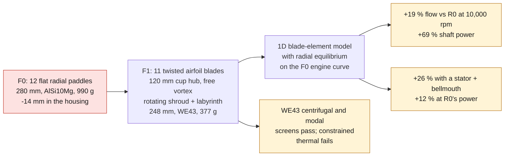

# 993 engine cooling impeller — high-flow WE43 F1

F1 iterates the F0 impeller
(`993-eng-cooling-impeller-alsi10mg-f0-0001`) with one goal: **move more
cooling air through the same engine**. The part is
`993-eng-cooling-impeller-we43-f1-0001`. Every number below comes from the
synthetic F0 case and a one-dimensional model. None is measured, and none
compares against the original Porsche impeller `964 106 015 31`, whose
performance is not known here.



*Diagram: this dossier's path, restated from the text below. It adds no number and proves nothing about a physical part.*

## Place in the fan programme

F1 is a variant study inside the `FAN-993-VERTICAL` programme
([fan development programmes](../FAN_DEVELOPMENT_PROGRAMMES.md)). It
measures its gains against R0, a synthetic conventional rotor, not against
the characterised reference that programme still has to build. The
[alloy comparison](../../twins/fan-alloy-comparison-f0/README.en.md) runs
FEA on the reference rotor's visual rebuild and reaches the same
conclusion on WE43: lighter and lower centrifugal stress, but softer, with
no published tensile allowable for our process. Both stay exploratory: no
gain over the original Porsche fan is claimed.

## Why not a Dyson trick

Dyson's bladeless fans push a thin jet over a Coandă lip, and the jet drags
surrounding air along with it. That adds flow only when blowing into open air.
A cooling fan has to push air through the housing and the cylinder and head
fins, whose resistance grows with the square of the flow. Entrained air brings
flow but no pressure, so against that resistance it loses. What does carry
over from Dyson's motors is **a rotor matched to a fixed diffuser** that turns
swirl back into pressure. F1 reports that option separately, because the
stator vanes belong in the housing.

## What changed from F0

| | F0 | F1 |
|---|---|---|
| Blades | 12 flat 102 × 7 × 20 mm paddles, no pitch | 11 lofted airfoils, circular-arc camber, NACA thickness |
| Blade angle, hub → tip | 0° (radial plate) | stagger 51.7° → 71.1° from the axis, camber 18° → 4° |
| Tips | free, 3 mm rim | shroud 119.5/122 mm, two 1.5 mm labyrinth teeth to 248 mm |
| Hub | solid | 120 mm cup: 4 mm rim, 5 mm web on the plate face, 50 mm boss, 30 mm bore |
| Diameter | 280 mm (clearance −14 mm) | 248 mm (clearance +2 mm in the 252 mm throat) |
| EOS M 290 plate | does not fit | 248 mm < 250 mm |
| Alloy | AlSi10Mg T6 | WE43 LPBF, solutionized and aged |
| CAD mass | 990 g | 377 g |

Eleven blades are coprime with the six housing spokes and with a
seventeen-vane stator option, so no two rows line up at the same moment.

## What is published about the original fan

A search on 2026-09-25 found no Porsche fan curve, airflow or power figure
for impeller `964 106 015 31` that is openly available. Those figures live in
the factory workshop manual and technical-introduction literature. What is
online is forum-level, unsourced, and used here **only as an
order-of-magnitude check**, not as model input:

| claim | where | caveat |
|---|---|---|
| early 911 fan: about 1,400 l/s at 6,100 engine rpm | [PistonHeads thread](https://www.pistonheads.com/gassing/topic.asp?h=0&f=48&t=251110) | early 911, not 964/993; no source |
| 964 twelve-blade fan driven at the 959 ratio | [Supercar Nostalgia, 964 guide](https://supercarnostalgia.com/blog/porsche-911-carrera-964) | no ratio value given |
| fan pulley ratio 1.6:1 on 964, 1.8:1 on 993 Turbo | forum claim surfaced by search | unverified |
| fan power roughly 6–10 hp for 911 fans, up to about 22 hp at 7,800 rpm with a 1.68 ratio | [DDK forum](https://www.ddk-online.com/phpBB2/viewtopic.php?t=72443), relaying Pelican Parts posts | second-hand, no primary source |

Read together, they put the synthetic F0 case in the right range. At a 1.6
ratio, 10,000 fan rpm is about 6,250 engine rpm. The F0 case's 1.01 m³/s
there is the same order as the 1.4 m³/s claimed for early fans. R0's
1.2 kW shaft power (about 1.7 hp) sits below the forum's 6–10 hp, which
suggests the real engine resistance is higher than the synthetic curve. The
synthetic case is therefore kept, and no gain over the original part is
claimed. A copy of the workshop manual's cooling section, which the
repository must not store, would be the way to calibrate it.

## The model

`source/cooling_impeller_f1.py` solves eleven equal-area streamlines:

- Euler work `Δp0 = ρ·U·c_u2`, no inlet swirl;
- simple radial equilibrium behind the rotor,
  `(1/ρ)·dp0/dr = c_x·dc_x/dr + (c_u/r)·d(r·c_u)/dr`, marched implicitly
  from the hub so the exit axial velocity varies with radius and the mean
  carries the flow. Off design, each station's swirl and loss are solved
  with its own axial velocity. The Lieblein terms use the local axial
  velocity ratio, and the uneven exit profile is mixed out with a
  Borda–Carnot loss;
- blade angles from velocity triangles, with Carter deviation
  `δ = (0.23 + 0.002·κ2)·θ/√σ` inverted exactly;
- chord from a target diffusion factor of 0.45, capped at 25 mm axial
  projection;
- losses: Lieblein equivalent diffusion with incidence,
  `θ/c = 0.004/(1 − 1.17 ln D_eq)`, stall flagged above `D_eq = 2.2`;
  unshrouded tip gap `Δη = 2τ/h`; labyrinth leakage `Q = Cd·A·√(2Δp/ρ)`
  recirculated; exit swirl lost unless a stator recovers it; inlet loss
  `K = 0.5` sharp or `0.05` bellmouth;
- engine resistance `Δp = K·Q²` through the F0 point 1.01 m³/s at 800 Pa.

**R0** is the fair comparison: a conventional rotor designed by the same
method for the F0 point, with twelve constant-chord bent plates, no shroud
and no stator. It is not the Porsche part.

## Radial equilibrium moved the hub

The first F1 revision assumed the same axial velocity at every radius
behind the rotor. A rotor whose work varies with radius cannot do that: the
swirl it leaves sets up a radial pressure gradient, and the axial velocity
redistributes until it balances. Once that equilibrium was added to the
model, the first revision no longer held up:

- its 80 mm hub and half-free vortex (`c_u ∝ r^-0.5`) starved the hub
  of axial flow, to 0.68 of the mean;
- the hub section fell to de Haller 0.58, well under the 0.72 guideline;
- one station stalled at the rotor-only operating point, and the stall margin
  went from +21 % to −1 %.

Changing the swirl law alone did not fix it. A stronger non-free vortex
starves the hub further (at constant swirl the hub gets 0.29 of the mean
flow). A free vortex keeps the exit flow even, but at 80 mm the hub
section still sits at 0.62. The lever is the hub-to-tip ratio. Free vortex,
same design target:

| hub diameter | hub-to-tip | min de Haller | flow vs R0 | rotor-only stall margin |
|---|---|---|---|---|
| 80 mm | 0.33 | 0.62 | +19.7 % | 0.4 % |
| 100 mm | 0.42 | 0.68 | +19.8 % | 6.3 % |
| **120 mm** | **0.50** | **0.75** | **+19.4 %** | **11.4 %** |
| 140 mm | 0.59 | 0.81 | +18.4 % | 15.5 % |
| 160 mm | 0.67 | 0.85 | +16.6 % | 20.9 % |

F1 now uses 120 mm, the smallest hub on this grid that clears 0.72. A solid
hub that size would weigh about 590 g in WE43 alone, so the hub is a cup: a 4 mm rim under the blades,
a 5 mm web on the plate face and a 50 mm boss around the bore. The original
Turbo rotor carries its blades on a large ventilated cup too. Its
[visual rebuild](../../twins/993-engine-cooling-fan-system-f0/REFERENCE_REBUILD.md)
puts the cup at about 82 mm radius, an unmeasured hypothesis.

The shorter blades, tied at both ends by the shroud, then had a first mode
16 % below the 17-vane stator order, short of the 20 % screen. The blade
thickness ratio went from 0.10/0.06 (hub/tip) to 0.090/0.054. That
moves the mode to 24 % below it, with blades at least 1.76 mm thick.

R0 is re-evaluated by the same model. Its stall margin drops from 13 % to
4 %, so the earlier revision flattered both rotors.

## Results at 10,000 rpm


| | flow | vs R0 | shaft power | efficiency | flow at R0's power | stall margin |
|---|---|---|---|---|---|---|
| R0 conventional rotor | 1.00 m³/s | — | 1.25 kW | 0.63 | — | 4 % |
| F1 rotor, F0 housing | 1.20 m³/s | **+19 %** | 2.11 kW | 0.64 | +0.2 % | 11 % |
| F1 + stator + bellmouth | 1.26 m³/s | **+26 %** | 1.77 kW | 0.89 | +12 % | 17 % |

How to read it:

- **More air costs power.** Engine resistance grows with the square of the
  flow, so +19 % flow needs about +42 % pressure. The F1 rotor alone draws
  69 % more shaft power. At R0's power it moves the same air: on its own,
  the rotor buys flow only by loading the blades harder.
- **The rotor alone pays for its hub at the inlet.** The 120 mm hub narrows
  the annulus, so the axial velocity rises. A sharp inlet then loses
  340 Pa, against 134 Pa for R0. A bellmouth cuts that to 38 Pa.
- **The housing changes are the real gain.** Stator plus bellmouth lift
  efficiency from 0.64 to 0.89. On R0's power budget that is about 12 % more
  air, and the wheel draws *less* power than the rotor-only F1 for more
  flow. The designed vane ring
  ([`993_FAN_STATOR_ALSI10MG_F1`](993_FAN_STATOR_ALSI10MG_F1.md)) splits
  that gain between the vanes and the bellmouth.
- **Stall margin.** F1 stays unstalled down to 1.07 m³/s, 11 % under its
  operating point, against 4 % for R0. That leaves more room if the fins
  clog or the engine resistance is higher than assumed.
- Flow scales linearly with speed from 3,000 to 12,000 rpm, as the fan laws
  predict.

## Lighter metal

| at 12,000 rpm | WE43 | Scalmalloy | AlSi10Mg |
|---|---|---|---|
| Wheel mass (model) | 379 g | 549 g | 549 g |
| Yield / shroud hoop | 4.90 | 7.40 | 3.78 |
| Yield / blade root, shroud carried by blades | 4.03 | 6.08 | 3.10 |
| Yield / hub rim, free ring carrying the blades | 4.70 | 7.11 | 3.63 |
| Yield / hub bore, web carrying the rim | 4.33 | 6.54 | 3.34 |
| Blade mode, cantilever → clamped by shroud | 381 → 2,144 Hz | 395 → 2,244 Hz | 395 → 2,244 Hz |
| Yield / fully constrained 150 °C | **1.43** | 2.29 | **1.28** |
| Bore loosening on a steel shaft at 150 °C | 0.057 mm | 0.043 mm | 0.035 mm |
| Overspeed kinetic energy | 1.95 kJ | 2.83 kJ | 2.83 kJ |

WE43 cuts about 31 % of the mass for the same shape, and it has the better
strength-to-weight ratio than AlSi10Mg. That also cuts the burst energy by
the same ratio. Scalmalloy is stronger but no lighter.

The cost of magnesium:

- the fully constrained thermal screen fails, as it did on F0. The shrouded
  wheel is free to grow, so the governing case is the bore loosening
  0.057 mm on a steel shaft. **A steel or titanium bore insert is required.**
- magnesium is anodic to the steel shaft, the fasteners and the aluminium
  housing. It needs a PEO or conversion coating and isolation.
- WE43 LPBF needs an inert, magnesium-rated machine and a powder fire
  procedure. Few service bureaus offer it.
- the WE43 figures are single-laboratory room-temperature coupons (Hyer et
  al. 2020, 219 MPa yield) plus a generic 44 GPa modulus.

The shroud does more than stop tip leakage. Tying the blade tips raises the
first blade mode from about 380 Hz, below the 1,000 Hz six-spoke order, to
about 2,140 Hz. That is more than twice the spoke order and 24 % under the
2,833 Hz order of a seventeen-vane stator. The mode sits between two
excitations, and this beam estimate is too coarse to rely on: an FE
Campbell diagram has to confirm it.

## Printability

The wheel fits the EOS M 290 plate flat. It is not yet printable in practice.
Near the tip the blades lie less than 20° off the plate, so they need supports,
and inside a closed shroud those supports cannot be reached. The next step is
an orientation study, or a split shroud bonded or machined after printing.

## Reproduction

```bash
docker run --rm --memory=6g --memory-swap=6g --cpus=4 \
  --user $(id -u):$(id -g) -e HOME=/tmp -e MPLCONFIGDIR=/tmp \
  -v "$PWD:/repo" -w /repo 3dprinting993-cadsim:dev \
  python3 parts/993-eng-cooling-impeller-we43-f1-0001/source/cooling_impeller_f1.py \
  --out parts/993-eng-cooling-impeller-we43-f1-0001/derived/cooling_impeller_we43_f1.step \
  --stl parts/993-eng-cooling-impeller-we43-f1-0001/derived/cooling_impeller_we43_f1.stl \
  --report parts/993-eng-cooling-impeller-we43-f1-0001/evidence/engineering-screen.json \
  --plot parts/993-eng-cooling-impeller-we43-f1-0001/evidence/fan-curves.png
```

The model alone (no CAD) runs on the host with the standard library:
`engineering_screen()` in the same file.

## Next gates

1. Housing F1: a seventeen-vane stator, a bellmouth and a machined land that
   closes the labyrinth gap from 2 mm to about 0.5 mm.
2. Alternator air through the cup. The original rotor's cup carries twelve
   windows. F1's web is closed until the alternator's cooling path is
   known.
3. Rotating CFD of R0 and F1 in the same domain to check the 1D ranking.
4. Orientation and support study, or a split shroud.
5. FEA with the bore insert, a Campbell diagram (the shrouded blade mode
   sits between the spoke and vane orders), and HCF with WE43 allowables.
6. Coating, balance, contained overspeed, then a flow rig.

The F1 stays `prohibited_pending_engineering` and `concept`: no manufacture,
rotation, installation or start-up is authorized.
