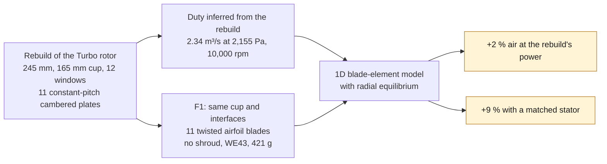
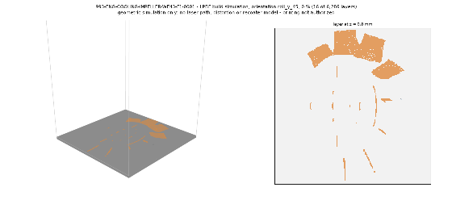
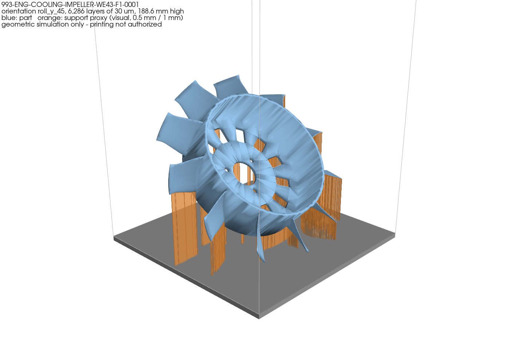
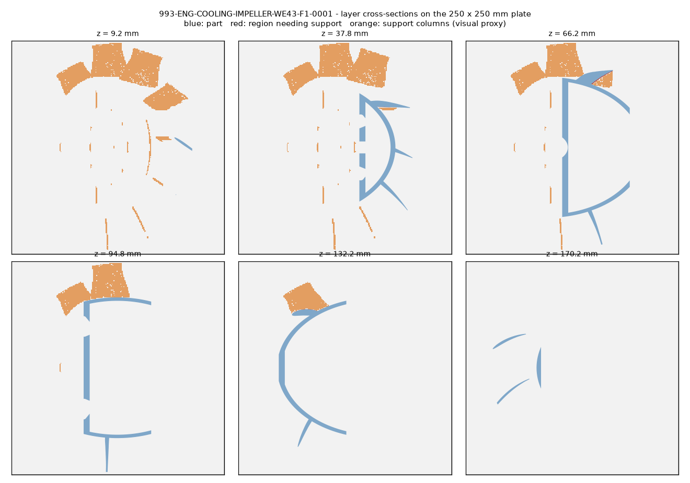

# 993 engine cooling impeller — WE43 F1, redesigned from the rebuild

F1 is an improved variant of the original 993 Turbo cooling fan rotor, in
the upright `FAN-993-VERTICAL` programme
([fan development programmes](../FAN_DEVELOPMENT_PROGRAMMES.md)). It is not
the 935 flat fan. The part is `993-eng-cooling-impeller-we43-f1-0001`.

F1 starts from the repository's
[visual rebuild of the Turbo rotor](../../twins/993-engine-cooling-fan-system-f0/REFERENCE_REBUILD.md)
and keeps its envelope and interfaces. It changes only the blades and the
alloy. Every number below comes from that rebuild and a one-dimensional
model. None is measured, and none is a claim against the Porsche part.



*Diagram: this dossier's path, restated from the text below. It adds no number and proves nothing about a physical part.*

## Why F1 was redone

The first F1 was a generic axial fan derived from the synthetic F0
paddle wheel: a 120 mm hub 30 mm deep, a closed shroud, 248 mm. Next to a
photograph of the original it looked nothing like it, and it had no room
for what the original cup does: wrap the alternator end and pass its
cooling air. That revision is superseded. Its radial-equilibrium model and
stator method are kept.

## What F1 keeps and what it changes

| | Rebuild of the original | F1 |
|---|---|---|
| Diameter | 245 mm | 245 mm |
| Cup | 165 mm, 56 mm deep, 4 mm wall, 5 mm web | same |
| Windows, bolt holes, bore | 12 windows, 3 × Ø6.8 on Ø50, Ø34 bore | same |
| Blades | 11 constant 48° pitch plates, 3.6 mm, chord 57 → 70 mm, 2 mm camber | 11 twisted airfoils, stagger 32° → 46° from the axis, camber 20° → 12°, chord 47 → 35 mm, 4.6 → 2.1 mm |
| Shroud | none | none |
| Volume | 284,700 mm³ | 229,000 mm³ (−20 %) |
| Mass in WE43 | 524 g | **421 g** |

The rebuild's ribs between the windows and its rounded web transition are
not reproduced. The bearing hub stays a separate part, bolted to the web as
in the rebuild. Every rebuild value except the blade and window counts, the
245 mm envelope and the FVD hub envelope is a visual hypothesis
([`reference.json`](../../twins/993-engine-cooling-fan-system-f0/source/picogk-reference/reference.json)).

FVD lists the original rotor at 0.9 kg without naming its material. That is
3.2 g/cm³ on the rebuild's volume, denser than aluminium, so the rebuild
probably carries less material than the real rotor. Mass is therefore
compared at equal alloy, on the rebuild's own volume.

## The duty, inferred from the rebuild

No 993 fan map, pulley ratio or engine resistance is published. The first
F1 used a synthetic point, 1.01 m³/s at 800 Pa. The rebuild cannot work
there: with its 48° pitch it would run stalled. Either that point or the
rebuild's pitch is wrong, and neither is measured.

F1 therefore uses the duty the rebuild implies. The engine-resistance curve
`Δp = K·Q²` runs through the rebuild rotor's best-efficiency point at
10,000 fan rpm, in a housing with a bellmouth inlet: **2.34 m³/s at
2,155 Pa, 9.3 kW of shaft power**. A sharp inlet puts the rebuild's best
efficiency (0.26) on its stall edge, so the inlet is assumed formed for both
rotors.

That power, about 12 hp at 10,000 fan rpm, sits in the 6–10 hp to 22 hp
range that forums give for 911 fans
([DDK forum](https://www.ddk-online.com/phpBB2/viewtopic.php?t=72443),
relaying Pelican Parts posts; second-hand, no primary source). This is an
order-of-magnitude consistency check, not a calibration. The workshop
manual's cooling section, which the repository must not store, would be the
way to calibrate it.

## The model

`source/cooling_impeller_f1.py` solves eleven equal-area streamlines
between the cup (82.5 mm) and the tip (122.5 mm):

- Euler work `Δp0 = ρ·U·c_u2`, no inlet swirl;
- simple radial equilibrium behind the rotor,
  `(1/ρ)·dp0/dr = c_x·dc_x/dr + (c_u/r)·d(r·c_u)/dr`, marched implicitly
  from the hub. Off design, each station's swirl and loss are solved with
  its own axial velocity. The Lieblein terms use the local axial velocity
  ratio, and the uneven exit profile is mixed out with a Borda–Carnot loss;
- blade angles from velocity triangles, with Carter deviation
  `δ = (0.23 + 0.002·κ2)·θ/√σ` inverted exactly;
- chord from a target diffusion factor of 0.30, capped at 50 mm axial
  projection inside the 56 mm cup;
- losses: Lieblein equivalent diffusion with incidence,
  `θ/c = 0.004/(1 − 1.17 ln D_eq)`, stall flagged above `D_eq = 2.2`; tip
  gap `Δη = 2τ/h` with the 3.5 mm gap of a 245 mm rotor in the 252 mm
  throat; exit swirl lost unless a stator recovers it; bellmouth inlet
  `K = 0.05`.

The rebuild rotor goes through the same model as eleven constant-pitch
plates, with its 2 mm parabolic camber read as a 13–16° circular arc and a
1.5× profile-loss factor for thick plates.

## Results at 10,000 rpm


| | flow | vs rebuild | shaft power | efficiency | flow at the rebuild's power | stall margin |
|---|---|---|---|---|---|---|
| Rebuild of the original | 2.34 m³/s | — | 9.28 kW | 0.54 | — | 20 % |
| F1 rotor, same housing | 2.38 m³/s | **+1.9 %** | 9.25 kW | 0.58 | +2.0 % | 20 % |
| F1 + matched stator | 2.51 m³/s | **+7.1 %** | 8.72 kW | 0.71 | +9.3 % | 26 % |

How to read it:

- **The blades alone buy little.** F1 moves 1.9 % more air on the same
  power. Its airfoils cut the profile loss from 238 to 99 Pa. But the
  3.5 mm tip gap (about 680 Pa) and the swirl left in the air (about
  650 Pa) are the same for both rotors, and they are larger.
- **The stator is the real gain.** It recovers the swirl. F1 then moves
  7 % more air on 6 % less power. The designed vane ring is
  [`993_FAN_STATOR_ALSI10MG_F1`](993_FAN_STATOR_ALSI10MG_F1.md).
- **Closing the tip gap is the next lever.** That is a housing change: a
  land machined to about 1 mm over the blade tips.
- **Stall margin is kept.** F1 stays unstalled down to 1.99 m³/s; the
  rebuild down to 1.94 m³/s.
- Flow scales linearly with speed from 3,000 to 12,000 rpm, as the fan laws
  predict.

### How much it depends on the guesses

| | F1 flow vs rebuild, same speed | F1 flow at the rebuild's power |
|---|---|---|
| engine resistance × 0.6 | +2.5 % | +2.8 % |
| engine resistance × 1.6 | +1.6 % | +1.8 % |
| rebuild pitch 43° instead of 48° | +11.7 % | +0.9 % |
| rebuild pitch 53° instead of 48° | −5.2 % | +4.0 % |

The gain at equal power stays positive in every case, and no station
stalls. The gain at the same speed depends on the rebuild's guessed pitch.
A flatter pitch moves less air, and F1 is designed to the 48° duty. Measuring the
original's blade angle is the most useful single measurement for this
comparison.

## Lighter metal

| at 12,000 rpm | WE43 | Scalmalloy | AlSi10Mg |
|---|---|---|---|
| Wheel mass (CAD) | 421 g | 611 g | 611 g |
| Yield / blade root, centrifugal + aero bending | 20.6 | 35.0 | 17.9 |
| Yield / cup rim, free ring carrying the blades | 8.3 | 12.5 | 6.4 |
| Yield / bore, web carrying the rim | 4.7 | 7.1 | 3.6 |
| First blade mode, cantilever | 1,351 Hz | 1,414 Hz | 1,414 Hz |
| Yield / fully constrained 150 °C | **1.43** | 2.29 | **1.28** |
| Overspeed kinetic energy | 2.1 kJ | 3.1 kJ | 3.1 kJ |

The blades are open cantilevers, like the original's. Their first mode,
about 1,350 Hz, is 35 % above the 1,000 Hz order of the six housing spokes,
and the root bending from the air load is small. The beam estimate is
coarse; an FE Campbell diagram has to confirm it.

The cost of magnesium:

- the fully constrained thermal screen fails, as for every candidate here
  except Scalmalloy. The wheel is free to grow, so the governing cases are
  the bolted joint to the bearing hub and the web around the bolts. **Steel
  inserts or creep-rated washers at the three bolts are required.**
- magnesium is anodic to the steel bolts, the bearing hub and the aluminium
  housing. It needs a PEO or conversion coating and isolation.
- WE43 LPBF needs an inert, magnesium-rated machine and a powder fire
  procedure. Few service bureaus offer it.
- the WE43 figures are single-laboratory room-temperature coupons (Hyer et
  al. 2020, 219 MPa yield) plus a generic 44 GPa modulus.

The [alloy comparison](../../twins/fan-alloy-comparison-f0/README.en.md)
runs FEA on the rebuild rotor itself and reaches the same conclusion on
WE43: lighter and lower centrifugal stress, but softer, with no published
tensile allowable for our process.

## Printability

Without a shroud the blades are open from outside, so every support can be
reached and removed. The print simulation below picks the orientation with
the least downward-facing area: tilted 45°, not flat on the web.

The first simulation run measured a 0.07 mm minimum wall: the NACA 4-digit
sections close to a knife edge of about 0.05 mm, which LPBF cannot hold.
The blade thickness now grows linearly toward the trailing edge to a
0.5 mm minimum. The rerun's minimum wall is 0.24 mm, at the rounded leading
edges, and the first percentile went from 0.32 to 0.71 mm. The change adds
7 g.

WE43 is not an EOS catalogue material. The simulation uses the M 290
envelope and the 30 µm layer of the published WE43 LPBF route (Hyer et al.
2020, 200 W); a magnesium-rated machine and its parameters remain to be
qualified.

## Reproduction

```bash
docker run --rm --memory=6g --memory-swap=6g --cpus=4 \
  --user $(id -u):$(id -g) -e HOME=/tmp -e MPLCONFIGDIR=/tmp \
  -v "$PWD:/repo" -w /repo 3dprinting993-cadsim:dev \
  python3 parts/993-eng-cooling-impeller-we43-f1-0001/source/cooling_impeller_f1.py \
  --out parts/993-eng-cooling-impeller-we43-f1-0001/derived/cooling_impeller_we43_f1.step \
  --stl parts/993-eng-cooling-impeller-we43-f1-0001/derived/cooling_impeller_we43_f1.stl \
  --report parts/993-eng-cooling-impeller-we43-f1-0001/evidence/engineering-screen.json \
  --plot parts/993-eng-cooling-impeller-we43-f1-0001/evidence/fan-curves.png
```

The model alone (no CAD) runs on the host with the standard library:
`engineering_screen()` in the same file. `matched_duty()` recomputes the
inferred duty from the rebuild.

## Next gates

1. Measure the original's blade pitch, chord and cup depth. The comparison
   rests on them.
2. Alternator air through the cup windows, which the model does not see.
3. Housing land over the blade tips, the matched stator and the inlet.
4. Rotating CFD of the rebuild and F1 in the same domain, to check the 1D
   ranking.
5. FEA with the bolted joint, a Campbell diagram, and HCF with WE43
   allowables.
6. Supplier support design and an EOSPRINT-class build file for the
   simulated 45° orientation, then coating, balance, contained overspeed and
   a flow rig.

The F1 stays `prohibited_pending_engineering` and `concept`: no manufacture,
rotation, installation or start-up is authorized.

## Print simulation, pictured

Drawn by `scripts/render_print_simulation_visuals.py` (`make print-visuals
PART=993-eng-cooling-impeller-we43-f1-0001`) from the simulation's own report: the same analysed surface
(hash-checked), the same orientation and the same 45° overhang rule. The
orange support columns are recomputed at 0.5 mm layers on a 1 mm grid for
the pictures; the table below keeps the report's 30 µm figures.



[Full-resolution video (MP4)](../../parts/993-eng-cooling-impeller-we43-f1-0001/media/print-simulation/build.mp4)





*Illustrations of a geometric simulation: no laser path, supplier supports,
distortion or recoater model. Printing is not authorized.*

<!-- print-screen:begin -->

## LPBF print simulation

The STEP was tessellated, then sliced over its full height at `30 µm`, on the EOS M 290 route of the candidate material. Orientation chosen by the automatic rule: `roll_y_45`.

| quantity | value |
|---|---:|
| layers | 6,286 |
| build height | 188.56 mm |
| layers with an unsupported region | 3595 |
| support proxy | 403,165.47 mm³ |
| local thickness p01 | 0.711 mm |
| trapped powder at 1.00 mm | 0.00 mm³ |


This screening is neither an EOSPRINT project, nor a distortion calculation, nor a recoater check. **Printing remains prohibited.**

<!-- print-screen:end -->
