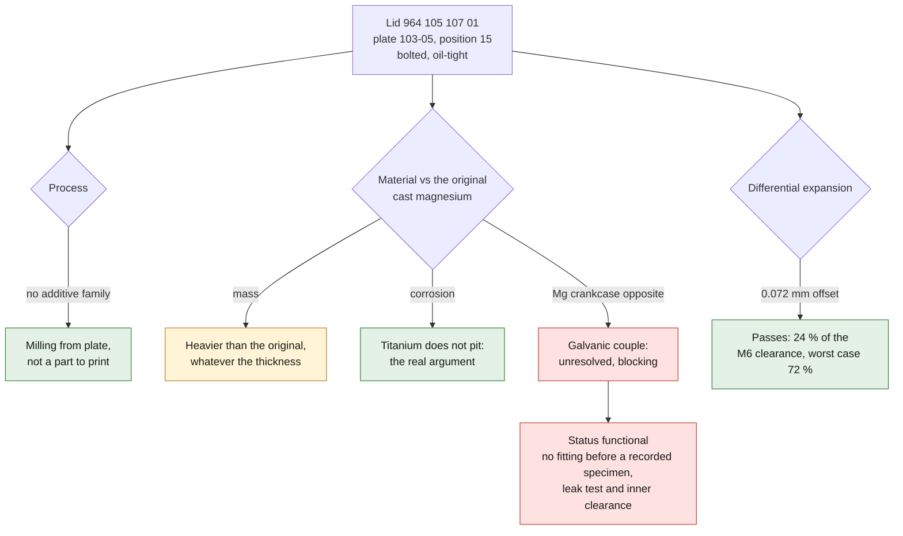

# Chain case lid `964 105 107 01` in Ti-6Al-4V

> **Major correction of September 11, 2026.** This whole document first compared
> titanium to **aluminum**. That was wrong: **the original part is cast
> magnesium**, and it is its corrosion that keeps the whole billet-lid market
> alive. The section "Against the real original material" below redoes the
> numbers, and it reverses the conclusion on mass while giving titanium a much
> stronger argument than the one it was credited with.

An explicit request. This document says what can be computed without the part,
what can be measured in an hour, and what has to be sent to the machinist.



*Diagram: the separate judgments of this page, restated from the text below. The missing dimensions `D03`, `D08` and `D13` still decide; the diagram adds no result and proves nothing about the physical lid.*

## Identity

Factory plate `103-05 Chain case`, **position 15**, designation `lid`. Three
lids share this plate: `993 105 022 01` at position 11, **`964 105 107 01` at
position 15**, `964 105 108 01` at position 19. This one is paired with the
gasket `964 105 181 01`, position 16 — the lid and its gasket follow each other
in the parts list.

It is therefore a bolted, **oil-tight** lid.

## Two caveats, stated once

**Titanium makes the part heavier — at equal geometry.** 4.43 against
2.70 g/cm³. On the screening's hypotheses, 122 g in aluminum would become 199 g
in titanium, +64 %. But the thickness has no reason to stay equal, and that is
treated in detail below: the lid **can** be thinner. By how much, and whether
that is enough to make it lighter, depends entirely on what sizes the original
thickness.

**This is not a part to print.** A flat bolted lid: no internal passage, no
subassembly to consolidate, no impossible core. None of the three families where
additive wins. **Milling from plate** is faster, cheaper, and above all more
precise where it matters, on the joint face.

Good news: that makes the part accessible right away, at any titanium shop.

## Can it be made thinner? Yes. Enough to save weight? It depends.

Three possible criteria, three different answers. For an original thickness of
5 mm taken as a hypothesis:

| criterion used | titanium thickness | mass vs aluminum |
|---|---|---|
| **equal bending stiffness** — `t_ti/t_al = (E_al/E_ti)^⅓` | 85.0 % → 4.25 mm | **×1.39**, heavier |
| **equal bending strength** — `t_ti/t_al = √(σ_al/σ_ti)` | 46.6 % → 2.33 mm | **×0.76**, 24 % lighter |
| **equal mass** — `t_ti/t_al = ρ_al/ρ_ti` | 60.9 % → 3.05 mm | only **37 %** of the stiffness is left |

### Why it tips over: the two indices

"Titanium is stronger, so thinner, so lighter" is **correct — provided strength
is what sizes the part.** For a plate of imposed outline whose thickness is
adjusted, each case has its own index:

| what sizes the part | index to maximize | aluminum | titanium | Ti/Al |
|---|---|---:|---:|---:|
| imposed **stiffness** | `E^⅓ / ρ` | 1.526 | 1.095 | **0.72 — aluminum wins** |
| imposed **strength** | `σ_y^½ / ρ` | 4.969 | 6.503 | **1.31 — titanium wins** |

A plate's stiffness varies as `t³`, its strength as `t²`. A stiffer material
therefore catches up at the power ⅓, a stronger material at the power ½.
Titanium is only **1.63×** stiffer than aluminum but **≈ 4.6×** stronger: it
loses the first trade-off and wins the second by a wide margin.

A surprising detail: in pure tension, `E/ρ` is 25.9 for aluminum and 25.7 for
titanium — they are **equivalent**. Only in plate bending, where the exponent
drops to ⅓, does aluminum take the advantage.

### And for this particular lid, four clues converge

| observation | what it says |
|---|---|
| tightening torque **9.7 Nm** | low clamping force → low gasket reaction → low bending demand |
| **M6** fasteners | small bolts, so probably many and closely spaced; deflection varies as `L⁴` over the spacing, and short spans cancel it |
| internal crankcase pressure | a few hundred millibar: negligible |
| **cast** part | thickness driven by the minimum castable wall and the draft |

Honest conclusion: it is **likely that neither stiffness nor strength sizes this
lid** — the foundry does. In that case the constraint disappears, a milled
titanium lid can simply be made thin, and it will be lighter.

This is not demonstrated. `D03` (the original thickness) and `D08` (the bolt
spacing, which drives deflection to the 4th power) are missing. But the four
clues point the same way, and none points the other way.

**And there is a third case, the most likely one here.** The thickness of a cast
part is often dictated neither by stiffness nor by strength, but by the foundry
itself: minimum castable wall, draft, filling. A milled part has none of these
constraints. In that case titanium can be thinner than the casting **and** stay
stiffer than required.

### Against the real original material: magnesium

| index | magnesium (original) | billet aluminum (replacement) | titanium |
|---|---:|---:|---:|
| imposed stiffness `E^⅓/ρ` | **1.965** | 1.526 | 1.095 |
| imposed strength `σ_y^½/ρ` | **6.988** | 4.969 | 6.503 |

Titanium is **2.45× denser** than magnesium. It loses the stiffness trade-off by
a very wide margin — and it **also** loses the strength one, narrowly.

So: "stronger so thinner so lighter" is correct against aluminum, and **wrong
against magnesium**. Its density is too low to be caught up, even by a material
5× stronger. A titanium lid will be heavier than the original, whatever
thickness is chosen.

### But titanium wins elsewhere, and that is stronger

The failure mode of the original part is **corrosion**: magnesium pits on its
sealing faces, and no gasket seals against a pitted face. That is exactly the
second criterion of `TITANIUM.md` — "problematic corrosion **with the original
material**" — and here it is at the heart of the matter.

A titanium lid does not pit. Ever. That is the only real argument, and it is
worth more than the mass argument it was credited with.

### The obstacle that remains, and it is serious

The lid bolts onto a crankcase **that is also magnesium**. Magnesium is the most
anodic of the structural metals, titanium one of the most cathodic: it is **the
least favorable couple in the grid**, and `TITANIUM.md` explicitly names
magnesium.

The gasket insulates the faces. It insulates neither the fasteners nor the
moisture paths. A titanium lid could therefore protect its own face **while
worsening the attack on the crankcase opposite** — that is, move the problem
onto the part that cannot be replaced.

This is unresolved, and the screening counts it as blocking.

**It is also why the market sells anodized aluminum**: corrosion-resistant
enough to solve the problem, close enough to magnesium for the couple to stay
mild, and lighter than titanium.

### The decidable threshold

One can go further than "it depends". Titanium machined **to the strictly
necessary stiffness** is lighter than the casting as soon as the casting carries

> **≈ 39 % more thickness than its own stiffness requirement.**

Formally: titanium wins ⟺ `t_required / t_cast < ρ_al / (ρ_ti · 0.851) = 0.717`.

On a cast part — minimum castable wall, draft, filling — 39 % of excess is not
an extravagant hypothesis. It is the common case.

**And it can be tested for almost nothing.** LN Engineering machines this same
lid from solid 6061, *without any casting constraint*. Its thickness, compared
with that of the original part, directly measures the excess. Two dimensions,
and the question is settled.

### What the tightening torque adds

The manual tightens this lid to **9.7 Nm on M6**. That is little. A low torque
means a low clamping force, hence a low gasket reaction, hence a low bending
demand on the lid. Added to an internal crankcase pressure counted in hundreds
of millibar, it says that **the part does almost no work**.

This is not a proof, but it points in the same direction: the original thickness
is probably dictated neither by stiffness nor by strength, but by the foundry.
And that is the case where titanium wins.

Measurement and the eye will decide: a generous uniform thickness with wide
fillets betrays the foundry; thin zones and ribs betray a sizing. `D03` remains
the dimension that decides the final weight.

One caveat does hold, however: thinning reduces stiffness between bolts, and
therefore the integrity of the joint face. On an oil-tight lid, that is the
constraint that bounds the exercise, and it is checked once the bolt spacings
have been recorded.

## What the calculation already settles, without the part

This is the point that sets this lid apart from the whole case, where titanium
had been refused.

**Differential expansion holds, and by a wide margin.** This calculation was
redone on September 11, 2026: the first version compared the expansion of an
entire face to a radial clearance, which overstated the problem by a factor of
two, and assumed M8 fasteners whereas the manual tightens this lid to 9.7 Nm,
that is, M6.

What must fit within the clearance is not the expansion of the parts, it is
their **offset at the hole farthest from the fixed point**:
`δ = r · (α_al − α_ti) · ΔT`.

| quantity | value |
|---|---|
| assumed extreme span | 100 mm |
| fixed point | center of the bolt pattern → `r` = 50 mm |
| assumed temperature difference | 100 K |
| **relative offset at the worst hole** | **0.072 mm** |
| radial clearance, M6 in a Ø6.6 hole | 0.300 mm |
| **margin** | **+0.228 mm — only 24 % of the clearance is used** |

And the sensitivity, because a margin without sensitivity is worthless:

| fixed point | Ø6.4 | Ø6.6 | Ø7.0 |
|---|---|---|---|
| center of the pattern | 36 % | **24 %** | 14 % |
| locating dowel at the edge | 72 % | 48 % | 29 % |

It passes in all six cases. The worst — dowel location and a tight hole — uses
72 % of the clearance, and it is the one to watch: plate 103-05 does carry a
locating dowel, `993 105 175 00`. If it holds this lid, the fixed point is no
longer the center of the pattern and the unfavorable radius doubles.

**A caveat of method.** All of this assumes the bolts centered in their holes at
cold assembly. A bolt already bearing on the wrong side would have no clearance:
half of the displayed margin is an assembly tolerance, not a calculation reserve.

This is exactly why the whole case, for its part, is refused: over a 500 mm span
located by a dowel, the offset reaches 0.72 mm and no common hole absorbs it.

**The galvanic couple is already handled by the parts list.** The gasket
`964 105 181 01` separates the two metals over the whole joint face. The main
insulation therefore already exists. Two paths remain: the fasteners, if they
touch both parts, and the outer face exposed to moisture. Insulating washers or
sleeves, anti-seize paste, anodizing of the lid.

## What to measure — one hour, one caliper

The lid removed, flat on a surface plate or a pane of glass. Datum: the farthest
corner or hole, declared once and kept for all dimensions.

| id | dimension | how |
|---|---|---|
| D01 | outline, length | with the caliper, twice, along the long axis |
| D02 | outline, width | same, perpendicular |
| D03 | thickness at the joint face | three spread-out points |
| D04 | overall thickness if the lid is domed | at the top |
| D05 | offset of the dome from the joint face | rule + shim |
| D06 | diameter of the fixing holes | three different holes |
| D07 | number of holes | count |
| D08 | hole-to-hole spacings | **all of them**, one after the other, plus the two extreme diagonals |
| D09 | width of the gasket face | caliper |
| D10 | thickness of the new, uncompressed gasket | on the gasket `964 105 181 01` |
| D11 | location: diameter and position of any stud, dowel or shoulder | |
| D12 | edge radii | radius gauge set or impression |
| D13 | inner clearance of the lid to the chain and tensioner | **critical**: the lid must touch nothing |

D08 and D13 are the two that decide. D08 validates or invalidates the expansion
margin computed above. D13 is the only one that cannot be recovered.

The repository has the capture tool:

```bash
python3 scripts/capture_caliper.py \
  --record catalog/measurements/meas-993-chain-case-lid.json \
  --dimension D08 --description "Center distance hole 1 to hole 2" \
  --manual --values 62.10,62.08,62.11
```

## What goes to the machinist

- **Ti-6Al-4V Grade 5** plate, ASTM B265, material certificate;
- milling of the outline, the holes and the joint face;
- **flatness held on the joint face** — this is the functional dimension, to be
  set after the dimensions are recorded;
- edge breaking;
- finish: bead blasting, or titanium anodizing if the color is wanted —
  titanium anodizing is interferential, with no significant thickness, so no
  effect on the fit;
- dimensional inspection of the outline, the spacings and the holes.

Keep the original steel fasteners, with anti-seize paste. Titanium galls on
itself; against steel with paste, it is under control.

## Status

`functional`, not `non_critical`: the part retains oil, and on an air-cooled
engine a leak has hot neighbors. Nothing is authorized for fitting before a
specimen has been recorded, a leak test performed and the inner clearance
checked.

## Reproduction

```bash
python3 parts/993-eng-chain-case-lid-ti-f0-0001/source/chain_case_lid_screen.py \
  --report parts/993-eng-chain-case-lid-ti-f0-0001/evidence/parametric-screen.json
```

Once the dimensions are recorded, the same script takes them as arguments and
the report stops being a hypothesis:

```bash
python3 parts/993-eng-chain-case-lid-ti-f0-0001/source/chain_case_lid_screen.py \
  --bolt-circle-mm <D08 max> --plan-area-cm2 <D01xD02> --thickness-mm <D03> \
  --bolt-diameter-mm <bolt> --clearance-hole-mm <D06> --measured \
  --report parts/993-eng-chain-case-lid-ti-f0-0001/evidence/parametric-screen.json
```

## Without access to the part — September 11, 2026

The measurement plan above assumes the lid in hand. Without access to the parts,
the question becomes: **can the dimensions be found online?**

Answer: **no**, and the search still brought back more than dimensions.

### What the market establishes

Two independent reproducers make this lid.

**LN Engineering** machines billet lids in **6061 aluminum**, given as a direct
replacement for `96410510801` (right) and **`96410510701` (left)**, designed to
reuse the original fasteners and gasket `96410518101`. **Auto-Service Schefter**
CNC-machines a left and right set, €585 per set.

Three things follow, and none is slight:

1. `964 105 107 01` is indeed the **left** lid, paired with the gasket
   `964 105 181 01` — confirmed by a source independent of the catalogue;
2. the part **is reproduced by machining from solid**. Until now this was only
   reasoning on my part; it is now what the market does;
3. both reproducers chose **aluminum**. Titanium is therefore a deliberate
   departure from what two professionals judged right.

What neither of them publishes: **a single dimension**. No thickness, no
outline, no spacing, no bolt count.

The workshop manual, on the other hand, provides one real data point: **"Chain
housing cover: 9.7 Nm"**. Such a torque puts the fasteners at **M6**, not M8.
The expansion margin computed above, which assumed M8 in a Ø8.4 hole, therefore
has to be redone once the hole is known.

### What really unblocks it, and it does not need the car

The right question is not "where to find the dimensions" but **"what is the
cheapest object that carries them"**.

| object | what it gives | price range |
|---|---|---|
| **the gasket `964 105 181 01`** | sealing outline, spacings, number and diameter of holes, face width | **~$13** (Victor Reinz 70-29108-00, Elring 471.200) |
| **a used lid** | everything, including thickness and inner clearance | a few tens of euros from a 964 parts breaker |

The gasket arrives in an envelope and on its own gives the two dimensions that
decided, `D08` the spacings, and the outline. A used lid additionally gives
`D03` the thickness — the one that will say whether it can be thinned and so
save weight — and `D13` the inner clearance, the only dimension that cannot be
recovered.

**Neither requires access to a car.** It is mail.

### What must not be done

Rebuild the dimensions from sales photos. `SOURCE_POLICY.md` is explicit: a
screenshot without scale is not a measurement. An oil-tight part whose joint
face came from a rescaled photo would not leak a little, it would leak.
