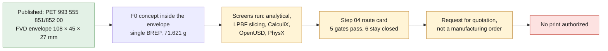

# 993 interior door opener lever, AlSi10Mg — F0 twin

## Decision

This lever is a more relevant additive candidate than a bolt or a simple plate:
small series, integrated clevis and bridge, five open pockets and possible bore
finishing in a single blank. The gain is not yet demonstrated against a forged
or machined part, but the geometric integration justifies the LPBF screening.

PorscheFanatics ties the function to the PET references left `993 555 851 00`
and right `993 555 852 00`. For its aftermarket pair, FVD publishes an envelope
of `108 × 45 × 27 mm`, a total mass of `180 g` and a "high-strength" aluminum
without grade. These data describe neither the OEM surfaces, nor the pivot, nor
the fixings, nor the linkage. The F0 is therefore an independent concept within
that envelope only, not a fittable copy.

*Diagram: the dossier's own path, restated from the text below. It adds no number or result, and it proves nothing about the physical part.*

## Screening material route

The coherent route chosen is `EOS Aluminium AlSi10Mg`, EOS M 290,
`AlSi10Mg_FlexM291 2.01`, `30 µm` layers, as-built condition. The EOS sheet
publishes in particular a minimum density of `2.67 g/cm³`, a vertical coupon
yield strength of `233 MPa`, a minimum ultimate strength of `461 MPa`, a fully
reversed turned-coupon endurance of `110 MPa` at `20 million` cycles and a
vertical conductivity of `100 W/(m·K)`.

These values remain coupon properties. They are not handle allowables: as-built
surface finish, notches, porosity, orientation, heat treatment, temperature,
corrosion and batch must be qualified.

## Results actually run

| Domain | Execution | Useful result | Limit of authority |
|---|---|---|---|
| CAD | build123d 0.11.1 / OCCT 7.9.3.1 | single BREP `108 × 45 × 27 mm`, reproducible normalized STEP, volume `26,824.19 mm³` | hypothetical functional shapes |
| Mass | `m=ρV` | `71.621 g` per lever, i.e. `143.241 g` per pair | the FVD pair may include other items |
| Analytical | bending, shear, von Mises, deflection, pressure, expansion | `45.633 MPa`, `0.282 mm`, free growth `0.1426 mm` under synthetic `150 N` and `+60 K` | nominal beam, not the real interface |
| LPBF | real section of every layer | `2,664` layers, `roll_y_45`, proxy supports `2,714.4975 mm³`, p01 `2 mm`, no trapped void at the `0.75 mm` voxel | not EOSPRINT nor a laser simulation |
| CalculiX | six C3D10 cases on three meshes | fine mesh `31,666` nodes; p95 `45.227 MPa` cold and `46.546 MPa` hot; max cold deflection `1.033 mm` | synthetic supports, force and temperatures |
| Fatigue | zero-to-peak Goodman against the EOS coupon | proxy ratio `4.626`, no life computed | not transferable to the part |
| OpenUSD | `usd-convert-cad 0.2.0`, OpenUSD 26.8 | binary Z-up asset, millimeters | exchange only |
| NVIDIA validation | `nvidia_usd_validate 1.21.0` | asset and scene with no failing rule | not a complete SimReady profile |
| PhysX | ovstage 0.1.1.355824, ovphysx 0.5.11 CPU | `10 g` witness settled from `35` to `29 mm` in `240` steps | software contact, not a door mechanism |
| PhysicsNeMo | not run | six synthetic cases do not make a surrogate dataset | blocked until correlated cases exist |
| Content Agents / OVRTX | preflight run then stopped | OpenBao access healthy, no active instance | no LLM property nor final render |

Comparing the two finest meshes gives a `1.143 %` variation of the cold p95 and
`0.276 %` of the hot p95, under the `10 %` numerical screening threshold. This
only indicates the stability of this model. The local cold maximum reaches
`174.657 MPa` and the hot maximum `185.636 MPa` near the idealized supports;
neither these peaks nor the p95 are a safety margin for the part.

*Geometric slicing of the F0 in `roll_y_45` (2,664 layers, labels in French). It shows a real section at every layer and a proxy support envelope; it is not a laser toolpath, a machine file or a distortion result, and proves nothing about a printed lever.*

## Step 04: material-machine-process card

`make route-lever-hook` confronts the LPBF screening with the EOS M 290 machine
card and the AlSi10Mg `30 µm` process card, then writes a route card and a
request-for-quotation package linked to the STEP and the STL by SHA-256.

Five consistency gates pass: same machine, same alloy, slicing at the qualified
`30 µm` layer (`2,664` layers), p01 wall `2.000 mm` above the process minimum of
`0.40 mm`, bare part within the envelope. The proxy deposited volume is
`29,538.68 mm³`, about `1.61 h` of exposure at the published rate, excluding
recoating, heating and inerting.

Six gates stay closed and do not open by calculation: DfAM review of the
orientation, temperature-calibrated constitutive card, heat treatment, machining
allowances, part allowables derived from coupons, and powder batch
traceability. The supplier package is a request for quotation, not a
manufacturing order.

Evidence: [`route-f0/`](../../twins/993-door-opener-lever-alsi10mg-f0/evidence/route-f0/).

## Why no print is authorized

- no measurement of the OEM lever, pins, bearing faces, fixings, stops or
  clearances;
- no geometry or stiffness of the lock, linkage, trim or door;
- no real force, misuse case, impact or cyclic spectrum;
- no analysis of contact, wear, preload, corrosion or galvanic couple;
- no melt-pool calculation, build distortion or recoater collision;
- no EOSPRINT project, batch coupon, first article, CT/NDT or metrology;
- no opening, endurance, aging or egress test;
- no signed automotive engineering review.

## Gates before any prototype

In this order, because each step conditions the next:

1. Acquire an identified pair and measure pivot, stops, interfaces, clearances,
   bearing faces and mechanism travel.
2. Measure the opening force and the off-axis cases, then define a cyclic
   spectrum.
3. Add radii, allowances and LPBF orientation based on the process actually
   chosen.
4. Inspect dimensionally, then run static, cyclic and emergency-opening tests on
   a rig before any fitting to a vehicle.

The comparison with CNC and sheet metal remains mandatory: if the measurements
show that the clevis can be machined or assembled simply, LPBF is not chosen.

The evidence, its digests and the release refusals are gathered in
[`twins/993-door-opener-lever-alsi10mg-f0/evidence/`](../../twins/993-door-opener-lever-alsi10mg-f0/evidence/).
