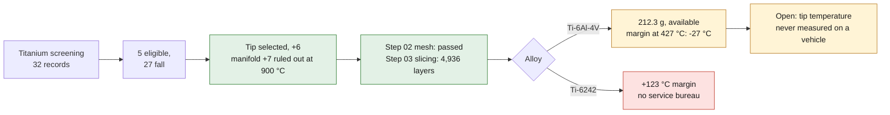

# Titanium exhaust tip — the repository's first titanium part

Selected by [decision 0007](../decisions/0007-premier-titane-embout-echappement.md).



*Diagram: the dossier's own path, restated from the text below. It adds no number or result, and it proves nothing about the physical part.*

## The selection, not the choice

The grid in [`TITANIUM.md`](../TITANIUM.md) and the three families where
additive wins were applied to the **32 records** of the catalogue by
`scripts/screen_titanium_candidates.py`. Only five parts come out eligible;
twenty-seven fall on the safety class, the absence of an additive family,
temperature, the need to conduct heat or the obligation to keep a steel
stiffness.

The screening **fails closed**: adding a record to the catalogue without judging
it makes it fail. A test checks this.

The exhaust manifold gets the best score of the batch, **+7**, and is ruled out
at 900 °C: it is a nickel case. The tip follows at +6 and wins because
everything converges — consolidation of the duct, the shell and the eight ribs
into a single body, an annular cavity no machining produces, small series,
benign failure, and a single interface to measure.

## What the geometry gives

Step 02 **`passed`**: watertight, single-component mesh, 13,820 triangles,
linked to the STEP by SHA-256.

Step 03 `completed_screening`, orientation `roll_y_25`, **4,936 layers actually
sliced at 30 µm**:

| quantity | value |
|---|---|
| build height | 148.1 mm |
| new islands | 2 |
| layers with unsupported area | 1,044 |
| maximum unsupported area | 0.603 mm² |
| conservative support envelope | 7.24 cm³ |
| local thickness, first percentile | 0.600 mm |
| minimum local thickness | 0.460 mm |
| trapped powder volume at the 1 mm voxel | none detected |

The 0.460 mm minimum wall passes the EOS process minimum of 0.3 to 0.4 mm, but
without comfort. And **depowdering is not demonstrated**: a 2.7 mm annular
channel over 120 mm of length cannot be judged by a 1 mm voxel screening.
Endoscopy or tomography required.


*Step 03 slicing screen of the titanium tip (labels in French). It shows the geometry layer by layer and a proxy support envelope; it does not demonstrate depowdering of the annular channel, and it proves nothing about a printed part.*

## The two alloys, and the figure that separates them

| | Ti-6Al-4V | Ti-6242 |
|---|---|---|
| screening mass | **212.3 g** — against 406.4 g in IN625, i.e. **−47.7 %** | 217.6 g |
| creep ceiling | 400 °C | 550 °C |
| margin at 427 °C | **−27 °C** | +123 °C |
| published layer thickness | 30 µm | none |
| published minimum wall | 0.3 to 0.4 mm | none |
| published heat treatment | 800 °C 2 h argon | none |
| service bureau | **everywhere** | **nowhere** |
| closed gates, step 04 | 6 | 10 |

The two routes exclude each other cleanly. Ti-6Al-4V is available, documented,
and blocked by **a single figure**. Ti-6242 fixes that figure and loses
everything else: first published LPBF processing in 2020, it is a research
topic.

## What has to be gone and fetched

The 427 °C come from a synthetic case of the F0 screening — gas at 850 K, a
3.8 L engine at 6,500 rpm, two outlets — **never measured on a vehicle**. A real
tip, downstream of the muffler, may run a hundred degrees lower.

An infrared thermometer on the outlet after a drive settles the question. At
350 °C or less, Ti-6Al-4V passes and the part can be ordered from any titanium
shop. At a confirmed 427 °C, titanium drops out at reasonable cost and the
answer goes back to IN625, twice as heavy but purchasable.

No calculation in this repository will replace that measurement.

## Reproduction

```bash
make titanium-screen        # screening of the 32 records
make tip-routes             # the two route cards, step 04
make titanium-screen-check tip-routes-check
python3 -m unittest tests.test_993_exhaust_tip_titanium_f1
```

The geometry and the LPBF screening need the repository's locked image:

```bash
docker run --rm -v "$PWD":/w -w /w ghcr.io/cluster2600/3dprinting993-mesh-cfd \
  python3 parts/993-exh-oval-tip-in625-f0-0001/source/oval_exhaust_tip.py \
  --material ti64 \
  --out parts/993-exh-oval-tip-ti-f1-0001/derived/oval_exhaust_tip_ti_f1.step \
  --surface parts/993-exh-oval-tip-ti-f1-0001/derived/oval_exhaust_tip_ti_f1.stl \
  --report parts/993-exh-oval-tip-ti-f1-0001/evidence/engineering-screen-ti64.json
```

The master is shared with the IN625 variant: **one geometry, several
metals**. It is `--material` that changes the card, not the drawing.
