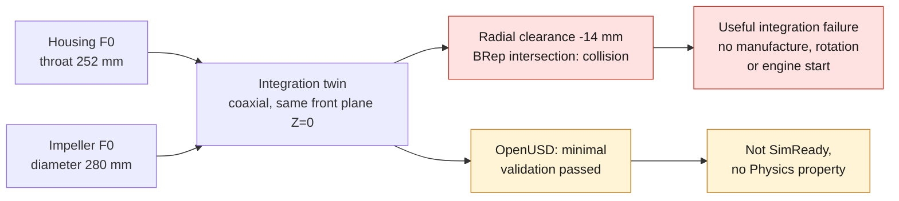

# 993 cooling fan housing–impeller subassembly F0

## Result

The fixed housing `993-ENG-FAN-HOUSING-ALSI10MG-F0-0001` and the rotating
impeller `993-ENG-COOLING-IMPELLER-ALSI10MG-F0-0001` have been brought together
in the first 993 engine subassembly twin. The verdict is a **useful integration
failure**: the two F0 concepts cannot work together in their current state.

| Check | Result | Verdict |
|---|---:|---|
| Synthetic housing throat | 252 mm | F0 hypothesis |
| Synthetic impeller diameter | 280 mm | F0 hypothesis |
| Cold radial clearance | **−14 mm** | failure |
| Free hot radial clearance | **−14.03822 mm** | failure |
| Throat required for 2 mm radial clearance | 284 mm | 32 mm short |
| Exact BRep intersection | **40,388.378651 mm³**, 2 solids | collision |
| Separate flow targets | 1.25 against 1.01 m³/s | inconsistent |
| Assumed passing frequencies | 1,100 against 2,000 Hz | inconsistent |

The BRep test uses the two STEP files re-read by OpenCascade, aligned on an
explicit hypothesis: coaxial axes and the same front plane `Z=0`. It complements
the analytical clearance calculation, but does not turn this synthetic alignment
into a measured Porsche position.

The twin's register is
[`catalog/twins/twin-993-engine-cooling-fan-system-f0.json`](../../catalog/twins/twin-993-engine-cooling-fan-system-f0.json).
The reproducible calculation is in
[`evaluate_integration.py`](../../twins/993-engine-cooling-fan-system-f0/source/evaluate_integration.py)
and its evidence in
[`integration-screen.json`](../../twins/993-engine-cooling-fan-system-f0/evidence/integration-screen.json).

*Diagram: the dossier's own path, restated from the text below. It adds no number or result, and it proves nothing about the physical part.*

## OpenUSD pass

The native preflight correctly blocked the ARM Mac: the active Python contained
neither the `usd-convert-cad` wheel, nor OpenUSD, nor Asset Validator, and
`usd-exchange 2.3.0` offers no macOS ARM wheel. The same preflight then
succeeded in the immutable Linux AMD64 image:

`ghcr.io/cluster2600/3dprinting993-simready-workflow@sha256:79e76882a8f493012eb4cc9ab061bce0ca2d075cd505d6e33a5200e7e1e9b126`

This run stayed on CPU, without GPU, without network during the conversions and
with `property_assignment_intent=skip`. It used the official converter
`usd-convert-cad 0.2.0`, then the minimal validator of the NVIDIA workflow:

- housing: 1 mesh, `300 × 300 × 170 mm`, minimal validation passed;
- impeller: 1 mesh, `280 × 280 × 30 mm`, minimal validation passed;
- assembly: 2 references, 2 meshes, `Z-up`, `metersPerUnit=0.001`, minimal
  validation passed;
- no rigid body, collider or joint was added.

The USD files are replayable derivatives and stay out of Git. Their SHA-256
digests, sizes, metadata and sanitized verdicts are published in
[`simready-conversion-summary.json`](../../twins/993-engine-cooling-fan-system-f0/evidence/simready-conversion-summary.json).
The composition script is
[`build_usd_assembly.py`](../../twins/993-engine-cooling-fan-system-f0/source/build_usd_assembly.py).

## Validity boundary

"Minimal USD validation passed" only means that the files open, have a
`defaultPrim`, units, an axis and a resolved composition. It proves neither the
Porsche geometry, nor the real clearance, nor the cooling, nor the overspeed,
nor the fatigue, nor the containment. This subassembly is not SimReady, has
received no Physics property, has run no PhysicsNeMo model and authorizes
neither manufacture, nor rotation, nor engine start.

The next pass must not silently correct the F0 values to make the collision
disappear. First the throat diameter, impeller diameter, axial position, runout,
shaft–bearings–alternator–pulley mounting and real cold clearance have to be
acquired. These measurements will allow an `F2_interface` twin; a measured fan
map and system curve will then be needed before CFD/CHT or PhysicsNeMo.
