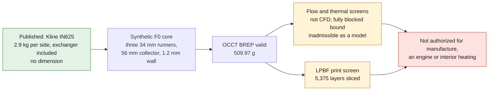

# 993 Turbo exhaust manifold — IN625 F0 concept

Kline publishes a 993 Turbo manifold in **Inconel 625** at **2.9 kg per side,
heat exchanger included**. PorscheFanatics corroborates this offer and
separately documents a 3-into-1 stainless manifold for the same vehicle family.
PET 202-10 identifies the heat exchangers left `993 211 039 55` and right
`993 211 040 55`. None of these sources publishes a diameter, thickness, path,
flange or tolerance.

The F0 is therefore the project's own flow core: three open `34 mm` runners
converge into an open `56 mm` collector, with a nominal wall of `1.2 mm` and an
axial length of `215 mm`. All these dimensions are synthetic. The STEP omits the
flanges, the turbine, the brackets and the heating exchanger.

*Diagram: the dossier's own path, restated from the text below. It adds no number or result, and it proves nothing about the physical part.*

## Why additive makes sense here

LPBF can produce the internal three-into-one junction in one piece, with no weld
bead in the gas path, while leaving three inlets and one outlet to evacuate the
powder. This benefit still has to be compared with bent and welded IN625 or
stainless tubes on cost, roughness, mass, repairability, distortion, inspection
and life.

The OCCT BREP and its STEP re-read are valid: one material solid, one connected
internal volume, three inlets and one outlet. The F0 envelope is
`146.4 × 66.4 × 215.0 mm` and the theoretical mass of the core is `509.97 g`
with `rho = 8.44 g/cm³`. This mass does not compare directly with the published
`2.9 kg`, which include the complete exchanger.

## Screenings run

The synthetic case takes a `3.6 L` engine, `5,750 rpm`, volumetric efficiency
`0.95`, gas at `900 K`, gauge pressure `50 kPa` and junction coefficient
`K=0.2`. It recomputes:

- four-stroke flow and ideal hot-volume correction;
- continuity, Reynolds, Mach and junction minor loss;
- membrane pressure and axial force;
- free expansion, fully restrained elastic bound, conduction and radiation;
- pulse frequency of one bank and quarter wave of the F0 path;
- mass from CAD volume and screening IN625 properties;
- BREP validity, continuity of the gas volume and STEP re-read.

The result gives `90.25 m/s` in each primary, `99.80 m/s` in the collector,
Reynolds `28,736` and `52,340`, Mach `0.170`, and a screening loss of
`391.78 Pa`, i.e. `96.30 W` per bank. This is not CFD: waves, cylinder
blowdown, roughness, real bends, the turbine and heat exchange are absent.

Free expansion reaches `1.79 mm`. The fully blocked bound gives `1,696 MPa`,
above the room-temperature comparison of `640 MPa`: it demonstrates that an
elastic blocking hypothesis is inadmissible and that interfaces, plasticity,
creep and cycles must be modeled, not that the part breaks at that value.

## Next gates

1. Scan a left/right set and measure ports, flanges, paths, thicknesses,
   brackets, turbine, exchanger, clearances and tolerances.
2. Measure pulsed pressures and temperatures, lambda, ignition, flow, vibration
   spectrum, turbine map and duty cycles of the chosen M64/60.
3. Redo the CAD with measured surfaces, allowances, flanges, brackets and an
   exchanger sealed against carbon monoxide.
4. Compare LPBF and bent/welded tubes by converged transient compressible CFD,
   CHT, shell/contact/modal FEA, creep and thermomechanical fatigue.
5. Qualify orientation, powder, parameters, witness coupons, heat treatment,
   roughness, distortion, CT, dye penetrant, leak and pressure.
6. Correlate pulsed rig, thermal cycles, shaker and dyno before the vehicle.

PhysicsNeMo will wait for a converged CFD/CHT/structure dataset, then for
training, holdout and out-of-distribution splits. SimReady will wait for the
measured interfaces and installed environment. The F0 STEP is authorized
neither for manufacture, nor for an engine, nor for interior heating.

<!-- print-screen:begin -->

## LPBF print simulation

The STEP was tessellated, then sliced over its full height at `40 µm`, on the EOS M 290 route of the candidate material. Orientation chosen by the automatic rule: `build_z`.

| quantity | value |
|---|---:|
| layers | 5,375 |
| build height | 215.00 mm |
| layers with an unsupported region | 1 |
| support proxy | 15,425.04 mm³ |
| local thickness p01 | 1.098 mm |
| trapped powder at 1.00 mm | 0.00 mm³ |

This screening is neither an EOSPRINT project, nor a distortion calculation, nor a recoater check. **Printing remains prohibited.**

<!-- print-screen:end -->
