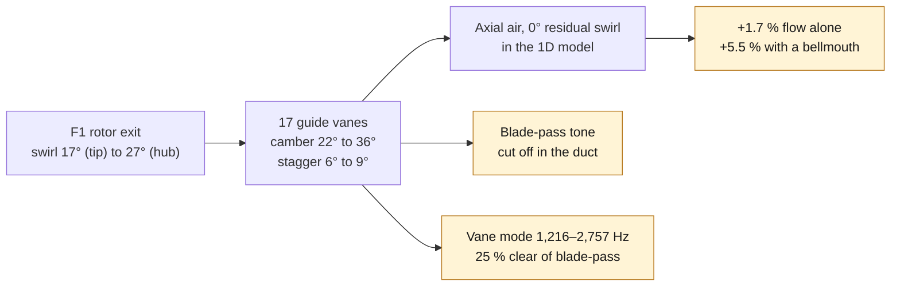

# 993 engine cooling fan guide-vane ring (stator) — AlSi10Mg F1

The F1 impeller (`993-eng-cooling-impeller-we43-f1-0001`) leaves the air
spinning. That swirl carries energy the engine fins never use. This part,
`993-eng-fan-stator-alsi10mg-f1-0001`, is a fixed ring of guide vanes set
15 mm behind the rotor, in the same annulus. It turns the swirl back into
pressure: the rotor-plus-diffuser idea behind Dyson's motors, and the one
Dyson idea that works against engine resistance.

Every number is synthetic: the rotor, speeds, engine resistance and
interfaces. None is measured.



*Diagram: this dossier's path, restated from the text below. It adds no number and proves nothing about a physical part.*

## Design

`source/fan_stator_f1.py` imports the F1 rotor model:

1. It finds the rotor-plus-stator-plus-bellmouth operating point on the
   synthetic engine curve: 1.26 m³/s at 10,000 rpm.
2. It computes the rotor's exit swirl at each of the eleven equal-area
   stations. The swirl angle runs from 27° at the hub to 17° at the tip. Radial
   equilibrium sets the axial velocity at each station; with the free-vortex
   rotor it stays nearly even.
3. Each vane section takes that angle at zero incidence and is cambered so
   that, after Carter deviation, the air leaves axial. Its chord is set for
   a diffusion factor of 0.40, with solidity held between 0.8 and 1.6.
4. The vanes are 7.9 % thick, with a 1.5 mm minimum. Stagger is only
   6–9°, so the vanes stand almost upright when the ring prints flat,
   unlike the rotor blades.

| | hub | tip |
|---|---|---|
| inlet swirl angle | 27.4° | 16.5° |
| camber | 35.9° | 21.9° |
| chord | 18.9 mm | 34.7 mm |
| thickness | 1.5 mm | 2.7 mm |

The ring is 248 mm across by 39 mm deep, with a 70 mm bore matching the F0
housing's synthetic alternator seat. The vanes stand on a 3 mm sleeve at the
rotor's 120 mm hub diameter, joined to a 3 mm seat sleeve by a 4 mm web on
the plate face. CAD mass in AlSi10Mg is 711 g. It fits the EOS M 290 plate.

## Vane count: the noise screen

Each rotor blade wake hitting a vane makes a tone. Whether that tone
travels down the duct depends on its spinning mode `m = n·B − k·V`, with
B = 11 blades and V vanes. In a thin annulus, a mode propagates when
`|m| ≤ n·B·M_tip`. The screen adds a 20 % margin on the overspeed tip Mach
number of 0.40.

The script takes the fewest vanes that are coprime with 11 and cut off
every blade-pass (n = 1) mode. That gives **17**. One second-harmonic mode
(n = 2, m = 5) stays cut on. Cutting it off too would take about 33 vanes,
more weight and blockage for a quieter tone. This thin-annulus rule is a
screen, not an acoustic model.

## Results at 10,000 rpm

| configuration | flow | shaft power | efficiency |
|---|---|---|---|
| F1 rotor, F0 sharp inlet | 1.195 m³/s | 2.11 kW | 0.64 |
| + designed vane ring | 1.216 m³/s | 2.00 kW | 0.70 |
| + vane ring + bellmouth | 1.261 m³/s | 1.77 kW | 0.89 |

The vanes alone add **+1.7 % air and use 5 % less power**. With a bellmouth
the total is **+5.5 %** over the rotor alone and +26 % over the reference
rotor R0. Most of that second step comes from the bellmouth, so the housing
F1 should get both.

Why only +1.7 %? The pressure recovered from the swirl is real, but the
F1 rotor's pressure falls steeply as flow rises, and the sharp F0 inlet
loses more as flow rises. The pressure gain therefore turns into a small
flow gain.

## Structure

| | value |
|---|---|
| vane span | 59.5 mm |
| first vane mode, pinned → clamped ends | 1,216 → 2,757 Hz |
| blade-pass at 10,000 / 12,000 rpm | 1,833 / 2,200 Hz |
| worst separation (both bounds, 1× and 2× blade-pass, nominal and overspeed) | 25 % |
| blade-pass meets the vane mode at | 6,600 – 15,000 fan rpm |
| swirl reaction torque | 1.6 N·m |
| aero bending stress, yield ratio | 2.6 MPa, 94 |

The real end fixity lies between pinned and clamped, so both bounds are
screened. The rotor's 120 mm cup hub shortened the span from 79.5 to
59.5 mm, which put the clamped bound 19 % from the overspeed blade-pass.
Thickening the vanes from 7.5 % to 7.9 % moves it to 25 %. The pinned
bound now sits between 1× and 2× blade-pass, and the clamped bound above
the overspeed line.

Any practical vane meets blade-pass somewhere between idle and redline.
Here that happens between about 6,600 and 15,000 fan rpm. A tap test of the
printed ring, then a forced-response check with the measured damping, are
the next gates.

## Why aluminium here

The ring does not spin, so magnesium's density buys little. It would also
put a magnesium surface in the hot, wet cooling stream. AlSi10Mg is the
material of the F0 housing it bolts into.

## Integration, and what it does not settle

The F0 housing has **no seat** for this ring. Its shell is 294 mm inside,
leaving a 23 mm radial gap around the ring. Its six spokes sit upstream of
the rotor, and their wakes are not modelled. The ring defines what a
housing F1 must provide: a seat 15 mm behind the rotor, a bellmouth inlet,
and a land that closes the rotor's labyrinth gap. Vane blockage is not
modelled either.

## Reproduction

```bash
docker run --rm --memory=6g --memory-swap=6g --cpus=4 \
  --user $(id -u):$(id -g) -e HOME=/tmp \
  -v "$PWD:/repo" -w /repo 3dprinting993-cadsim:dev \
  python3 parts/993-eng-fan-stator-alsi10mg-f1-0001/source/fan_stator_f1.py \
  --out parts/993-eng-fan-stator-alsi10mg-f1-0001/derived/fan_stator_alsi10mg_f1.step \
  --stl parts/993-eng-fan-stator-alsi10mg-f1-0001/derived/fan_stator_alsi10mg_f1.stl \
  --report parts/993-eng-fan-stator-alsi10mg-f1-0001/evidence/engineering-screen.json
```

The ring stays `prohibited_pending_engineering` and `concept`: no
manufacture, installation or start-up is authorized.
