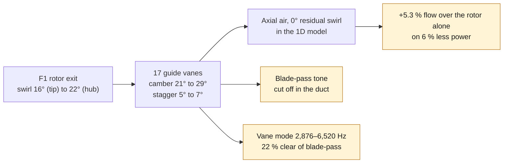
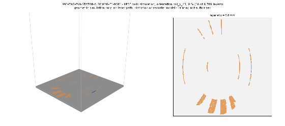
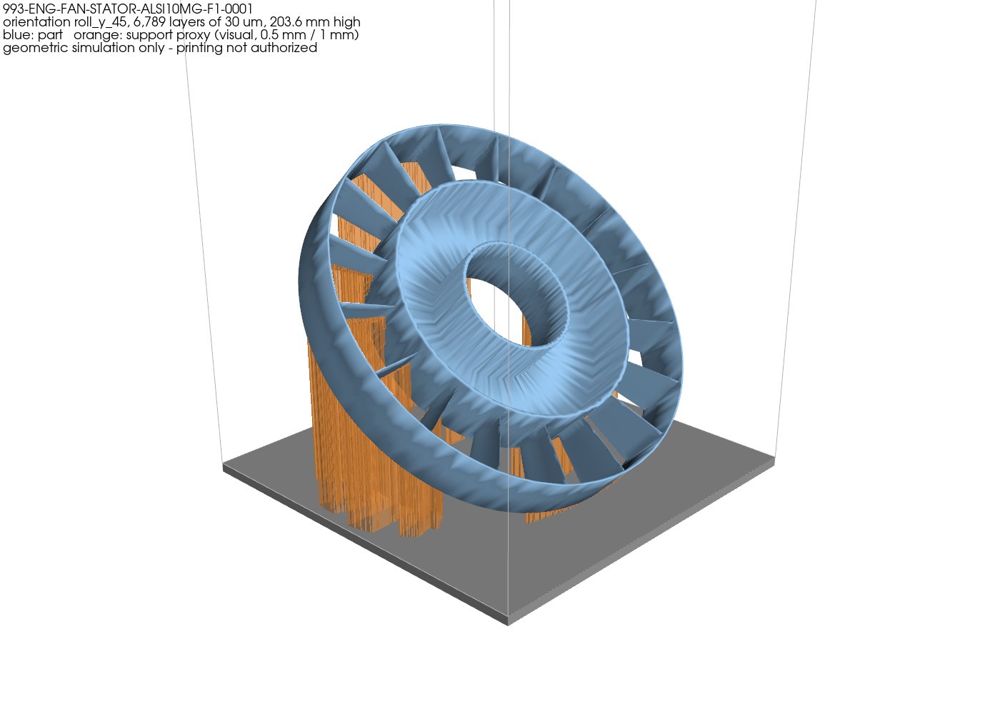
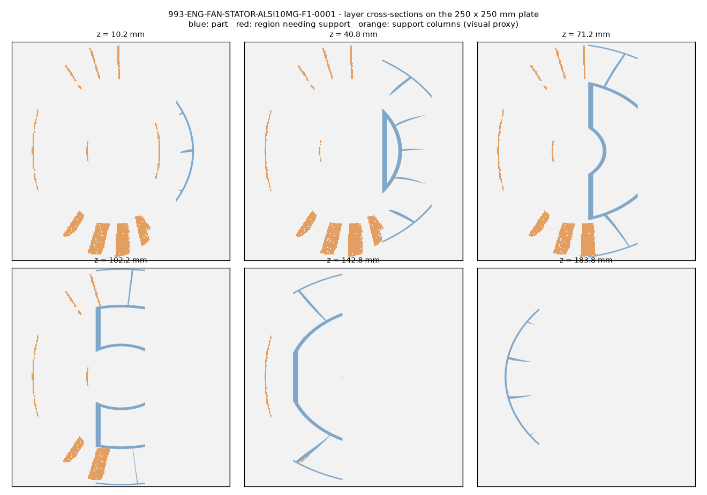
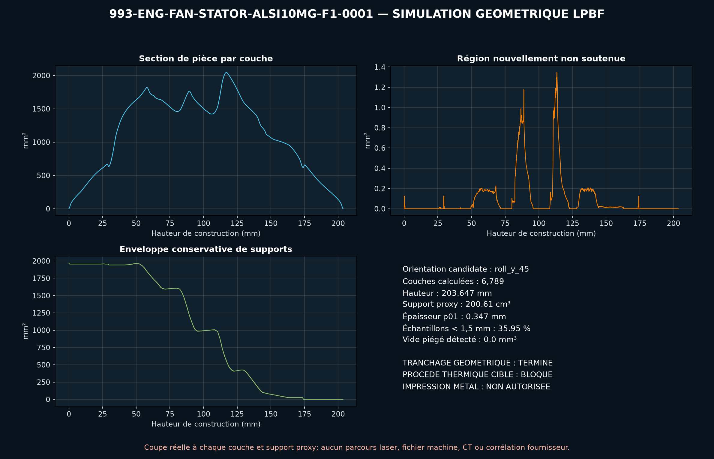

# 993 engine cooling fan guide-vane ring (stator) — AlSi10Mg F1

The F1 impeller (`993-eng-cooling-impeller-we43-f1-0001`) leaves the air
spinning. That swirl carries energy the engine fins never use. This part,
`993-eng-fan-stator-alsi10mg-f1-0001`, is a fixed ring of guide vanes set
15 mm behind the rotor, in the same annulus. It turns the swirl back into
pressure: the rotor-plus-diffuser idea behind Dyson's motors, and the one
Dyson idea that works against engine resistance.

The rotor follows the visual rebuild of the original Turbo rotor, and the
duty is inferred from that rebuild (see
[`993_COOLING_IMPELLER_WE43_F1`](993_COOLING_IMPELLER_WE43_F1.md)). The
housing interfaces are synthetic. None of it is measured.



*Diagram: this dossier's path, restated from the text below. It adds no number and proves nothing about a physical part.*

## Design

`source/fan_stator_f1.py` imports the F1 rotor model:

1. It finds the rotor-plus-stator operating point on the inferred engine
   curve, in the same bellmouth housing: 2.51 m³/s at 10,000 rpm.
2. It computes the rotor's exit swirl at each of the eleven equal-area
   stations. The swirl angle runs from 22° at the hub to 16° at the tip. Radial
   equilibrium sets the axial velocity at each station; with the free-vortex
   rotor it stays nearly even.
3. Each vane section takes that angle at zero incidence and is cambered so
   that, after Carter deviation, the air leaves axial. Its chord is set for
   a diffusion factor of 0.40, with solidity held between 0.8 and 1.6.
4. The vanes are 7.9 % thick, with a 1.5 mm minimum. Stagger is only
   5–7°, so the vanes stand almost upright when the ring prints flat,
   unlike the rotor blades.

| | hub | tip |
|---|---|---|
| inlet swirl angle | 21.7° | 16.0° |
| camber | 28.6° | 21.2° |
| chord | 25.1 mm | 35.8 mm |
| thickness | 2.0 mm | 2.8 mm |

The ring is 248 mm across by 40 mm deep, with a 70 mm bore matching the F0
housing's synthetic alternator seat. The vanes stand on a 3 mm sleeve at the
rotor's 165 mm cup diameter, joined to a 3 mm seat sleeve by a 4 mm web on
the plate face. CAD mass in AlSi10Mg is 614 g. It fits the EOS M 290 plate.

## Vane count: the noise screen

Each rotor blade wake hitting a vane makes a tone. Whether that tone
travels down the duct depends on its spinning mode `m = n·B − k·V`, with
B = 11 blades and V vanes. In a thin annulus, a mode propagates when
`|m| ≤ n·B·M_tip`. The screen adds a 20 % margin on the overspeed tip Mach
number of 0.41.

The script takes the fewest vanes that are coprime with 11 and cut off
every blade-pass (n = 1) mode. That gives **17**. One second-harmonic mode
(n = 2, m = 5) stays cut on. Cutting it off too would take about 33 vanes,
more weight and blockage for a quieter tone. This thin-annulus rule is a
screen, not an acoustic model.

## Results at 10,000 rpm

| configuration, bellmouth housing | flow | shaft power | efficiency |
|---|---|---|---|
| rebuild of the original rotor | 2.340 m³/s | 9.28 kW | 0.54 |
| F1 rotor | 2.384 m³/s | 9.25 kW | 0.58 |
| F1 rotor + designed vane ring | 2.510 m³/s | 8.71 kW | 0.71 |

The vanes add **+5.3 % air over the F1 rotor and use 6 % less power**.
Against the rebuild rotor the pair moves 7.3 % more air, or 9.6 % more on
the rebuild's power. In this envelope the stator is worth more than the new
blades: the swirl it recovers, about 650 Pa, is three times the profile
loss the airfoils save.

## Structure

| | value |
|---|---|
| vane span | 40.0 mm |
| first vane mode, pinned → clamped ends | 2,876 → 6,520 Hz |
| blade-pass at 10,000 / 12,000 rpm | 1,833 / 2,200 Hz |
| worst separation (both bounds, 1× and 2× blade-pass, nominal and overspeed) | 22 % |
| blade-pass meets the vane mode at | 15,700 fan rpm and above |
| swirl reaction torque | 8.3 N·m |
| aero bending stress, yield ratio | 3.4 MPa, 72 |

The real end fixity lies between pinned and clamped, so both bounds are
screened. On the rebuild's 165 mm cup the vanes span only 40 mm, so both
bounds sit above the overspeed blade-pass line. The pinned bound is 22 %
under twice blade-pass, the closest line.

Blade-pass would only meet the first vane mode above about 15,700 fan rpm,
outside the screened range. Twice blade-pass crosses it lower. A tap test
of the printed ring, then a forced-response check with the measured
damping, are the next gates.

## Why aluminium here

The ring does not spin, so magnesium's density buys little. It would also
put a magnesium surface in the hot, wet cooling stream. AlSi10Mg is the
material of the F0 housing it bolts into.

## Integration, and what it does not settle

The F0 housing has **no seat** for this ring. Its shell is 294 mm inside,
leaving a 23 mm radial gap around the ring. Its six spokes sit upstream of
the rotor, and their wakes are not modelled. The ring defines what a
housing F1 must provide: a seat 15 mm behind the rotor, a bellmouth inlet,
and a land that closes the 3.5 mm gap over the rotor blade tips. It also
has to leave the alternator's air path through the rotor cup open. Vane blockage is not
modelled either.

## Reproduction

```bash
docker run --rm --memory=6g --memory-swap=6g --cpus=4 \
  --user $(id -u):$(id -g) -e HOME=/tmp \
  -v "$PWD:/repo" -w /repo 3dprinting993-cadsim:dev \
  python3 parts/993-eng-fan-stator-alsi10mg-f1-0001/source/fan_stator_f1.py \
  --out parts/993-eng-fan-stator-alsi10mg-f1-0001/derived/fan_stator_alsi10mg_f1.step \
  --stl parts/993-eng-fan-stator-alsi10mg-f1-0001/derived/fan_stator_alsi10mg_f1.stl \
  --report parts/993-eng-fan-stator-alsi10mg-f1-0001/evidence/engineering-screen.json
```

The ring stays `prohibited_pending_engineering` and `concept`: no
manufacture, installation or start-up is authorized.

## Thin vane edges, still open

The print simulation below passes, but its thickness screen finds 1 % of
the surface under 0.35 mm, with a 0.10 mm minimum, and 36 % under 1.5 mm.
These are the vanes' NACA knife edges. The rotor's blades got a 0.5 mm
minimum trailing edge after the same finding; the vanes still need it. That
simulation run took about 14 hours, against two minutes for the rotor, so
its rerun is left for a separate change.

## Print simulation, pictured

Drawn by `scripts/render_print_simulation_visuals.py` (`make print-visuals
PART=993-eng-fan-stator-alsi10mg-f1-0001`) from the simulation's own report: the same analysed surface
(hash-checked), the same orientation and the same 45° overhang rule. The
orange support columns are recomputed at 0.5 mm layers on a 1 mm grid for
the pictures; the table below keeps the report's 30 µm figures.



[Full-resolution video (MP4)](../../parts/993-eng-fan-stator-alsi10mg-f1-0001/media/print-simulation/build.mp4)





*Illustrations of a geometric simulation: no laser path, supplier supports,
distortion or recoater model. Printing is not authorized.*

<!-- print-screen:begin -->

## LPBF print simulation

The STEP was tessellated, then sliced over its full height at `30 µm`, on the EOS M 290 route of the candidate material. Orientation chosen by the automatic rule: `roll_y_45`.

| quantity | value |
|---|---:|
| layers | 6,789 |
| build height | 203.65 mm |
| layers with an unsupported region | 3007 |
| support proxy | 200,614.09 mm³ |
| local thickness p01 | 0.347 mm |
| trapped powder at 1.00 mm | 0.00 mm³ |



This screening is neither an EOSPRINT project, nor a distortion calculation, nor a recoater check. **Printing remains prohibited.**

<!-- print-screen:end -->
