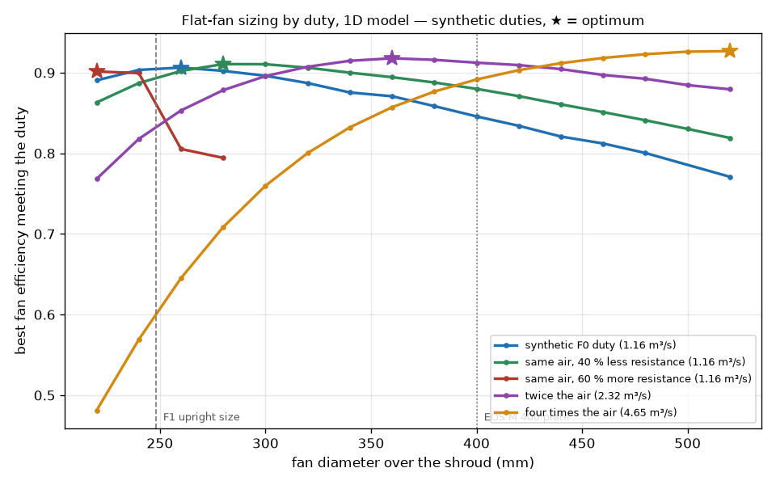

# 993 flat fan (horizontal, on top of the engine) — sizing study F2

The 993 fan stands upright behind the engine, with the alternator in its
hub, and is squeezed into a 252 mm housing throat. The 917, the 935/934, and
today Gunther Werks' 911s lie the fan flat on top of the engine instead.
This study uses the F1 impeller's model
(`993-eng-cooling-impeller-we43-f1-0001`) to ask one question: **what fan
diameter moves the engine's air most efficiently, once the housing no
longer limits it?**

Script: `parts/993-eng-cooling-impeller-we43-f1-0001/source/flat_fan_sizing_f2.py`.
Evidence: `evidence/flat-fan-sizing-f2.json` and `.png` in the same part.
All duties are synthetic; the model is one-dimensional, not CFD.

## What is known about real flat fans

| fact | source | caveat |
|---|---|---|
| Gunther Werks cars use "a flat-fan system" for cylinder cooling | [Driven](https://www.drivencarguide.co.nz/news/gunther-werks-bows-out-with-626kw-air-cooled-speedster-inspired-by-iron-man/) | press, no data |
| EB Motorsport's 935-derived kit: shaft, rubber coupling, right-angle gearbox; **1.5 hp at 4,000 fan rpm, 32 hp at 12,000 fan rpm** (about 8,000 engine rpm); better cooling of cylinders 1 and 4 | [Ferdinand](https://ferdinandmagazine.com/porsche-flat-fan-kit), `SRC-FERDINAND-EB-MOTORSPORT-FLAT-FAN-KIT` | builder's dyno, reported by a magazine |
| Reproduction factory 935 flat fan: 7075 fan, **aluminium stator**, oil-fed gear drive, **external Bosch alternator** on its own belt, USD 25,000 | [Jim Torres Racing](https://jimtorresracing.com/for-sale/reproduction-flat-fan), `SRC-JIM-TORRES-RACING-935-REPRODUCTION-FLAT-FAN` | sales page, no diameter or airflow |

Two lessons carry straight into this repository. The factory flat fan pairs
its rotor with a stator, just as F1 does with
[`993_FAN_STATOR_ALSI10MG_F1`](993_FAN_STATOR_ALSI10MG_F1.md). And the
alternator moves off the fan shaft.

The EB measurement is about **ten times** the power of this repository's
synthetic duty at the same fan speed. Real flat-fan duties are far bigger
than the synthetic F0 case, and that matters for sizing, as shown below.

## Method

For each duty case, the script redesigns the F1 rotor family at every
diameter from 220 to 520 mm:

- same velocity-triangle method, hub/tip ratio 0.50 (the F1 cup hub), shroud with a 2 mm
  labyrinth gap, generic stator and bellmouth;
- design speed swept from 2,000 to 12,000 rpm, blade loading from 1.15 to
  1.55 × the duty flow;
- tip speed capped at F1's 130 m/s, so no candidate is louder than F1;
- hub de Haller ratio at least 0.65, and no stalled station.

It keeps the **most efficient** design that delivers at least 115 % of the
duty flow on the duty's resistance curve. At equal shaft power, flow scales
as efficiency^(1/3), so efficiency is the figure of merit.

## Results

| duty | target flow | best diameter | best efficiency | gain at equal power vs 240 mm |
|---|---|---|---|---|
| synthetic F0 duty | 1.16 m³/s | **260 mm** | 0.906 | +0.1 % |
| same air, 40 % less resistance | 1.16 m³/s | 280 mm | 0.911 | +0.9 % |
| same air, 60 % more resistance | 1.16 m³/s | 220 mm | 0.901 | +0.1 % |
| twice the air | 2.32 m³/s | **360 mm** | 0.918 | +3.9 % |
| four times the air | 4.65 m³/s | **≥ 520 mm** | 0.927 | **+17.6 %** |

How to read it:

- **Size follows the duty.** At the synthetic duty the best size, 260 mm,
  is within 0.1 % of the upright F1 size (248 mm), so a flat fan would not
  help by size alone. Each doubling of the air the engine needs pushes the
  best diameter up by 100 mm or more. At four times the air the optimum sits
  on the 520 mm edge of the grid, with efficiency flat from 500 mm (0.926
  against 0.927).
- **At real, EB-scale duties a big fan wins clearly.** At four times the
  air, a 240 mm fan reaches only 0.57 efficiency against 0.92 at 460 mm. The
  upright 993 housing cannot package that; a flat layout can.
- **Resistance is the other lever.** A flat plenum above the engine can feed
  both banks with fewer turns. At fixed efficiency and power, flow scales as
  K^(-1/3): 40 % less path resistance gives about 19 % more air, whatever
  the fan.
- The high-resistance curve above 220 mm sits at the sweep's lowest speed
  (2,000 rpm), so that part of the curve is limited by the grid, not the
  physics.

## What a 993 flat-fan conversion needs

1. **The real duty.** Measuring the stock fan's flow, pressure and power is
   the calibration this study lacks. The EB figure is the only measured
   anchor so far.
2. **A right-angle drive.** Oil-fed gears, as on the 935, or a belt
   arrangement.
3. **An external alternator** on its own belt.
4. **A plenum** from the flat fan to the cylinder tinware of both banks,
   designed for low resistance and even distribution.
5. **Rotor and stator** at the chosen diameter, from the F1 method. Above
   400 mm they no longer fit the EOS M 400 plate, which points to casting,
   machining, or a split build.

Nothing here is authorized for manufacture, installation or start-up.
