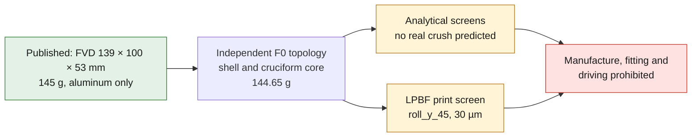

# 993 front impact support — AlSi10Mg F0 concept

PorscheFanatics corroborates FVD's front left or right `Lightweight Bumper
Support 993` at **145 g**. The FVD sheet publishes **139 × 100 × 53 mm** and
states only aluminum. No alloy, drawing, hole, interface, force-displacement
curve or crash test is available.

The F0 keeps this envelope and builds an independent topology: a `3 mm` back
plate, an open elliptical `60 × 38 mm` shell of `1.2 mm` and four segments of a
cruciform core tapering from `1.4` to `0.8 mm`. The four channels open at the
front face and do not trap powder. No mounting hole is invented.

*Diagram: the dossier's own path, restated from the text below. It adds no number or result, and it proves nothing about the physical part.*

## Why AM is tested

LPBF could combine plate, shell and graded core in a single BREP, with a crush
progression impossible to obtain with a simple tube. It still has to beat an
extruded or assembled aluminum support on scatter, cost, repairability and
above all the dynamic force-displacement curve.

The STEP theoretically weighs `144.65 g`, i.e. `99.76 %` of the published
`145 g`. This closeness is a scalar target of the concept, not a proof of
geometry or crash performance.

## Screenings run

The report recomputes:

- elliptical shell area and area of the four cruciform core thicknesses;
- volume, mass `rho V` and comparison with the commercial `145 g`;
- mean axial stress `F/A` and yield bound `A Rp0.2`;
- plate buckling by
  `k pi² E/[12(1-nu²)] (t/b)²` for the shell and the front web;
- elliptical inertia and Euler bound `pi² E I/L²`;
- synthetic energy `Fmean s`, equivalent speed `sqrt(2E/m)` and SEA;
- first mode of an equivalent cantilevered shell;
- free expansion `alpha L delta_T` and heat capacity;
- single OCCT BREP, envelope and STEP re-read.

Under a synthetic `15 kN`, the minimum section gives `59.03 MPa`; the
room-temperature yield bound is `62.26 kN`. The front web gives `199.41 MPa` in
the plate model, under the `245 MPa` comparison, which signals a possible
progressive onset. It does not predict a real crush.

The `15 kN × 80 mm` case gives `1,200 J` per support and an energy equivalent of
`6.55 km/h` for two supports and `1,450 kg`. It is neither a regulatory
procedure nor a proof of protection of the vehicle or its occupants.

## Mandatory gates

1. Scan the support, the body shell and the beam; measure interfaces, holes,
   fixings, clearances and tolerances per variant.
2. Define vehicle mass, barrier, pulse, intrusion, load distribution and
   regulatory criteria with a crash engineer.
3. Qualify LPBF AlSi10Mg in dynamic tension, anisotropy, fracture, porosity and
   defect sensitivity.
4. Run a complete nonlinear explicit model with contacts, fracture,
   imperfections, convergence and a target force-displacement curve.
5. Control powder, orientation, supports, distortion, CT, dye penetrant and
   metrology on representative batches.
6. Test coupons, quasi-static crush, dynamic subsystem then vehicle before any
   homologation.

PhysicsNeMo can serve as a surrogate model only after a set of correlated
explicit cases has been built, with uncertainty and out-of-domain rejection.
SimReady waits for the interfaces, contacts and material cards. Manufacture,
fitting and driving are prohibited at the F0 stage.

<!-- print-screen:begin -->

## LPBF print simulation

The STEP was tessellated, then sliced over its full height at `30 µm`, on the EOS M 290 route of the candidate material. Orientation chosen by the automatic rule: `roll_y_45`.

| quantity | value |
|---|---:|
| layers | 4,349 |
| build height | 130.46 mm |
| layers with an unsupported region | 22 |
| support proxy | 6,202.46 mm³ |
| local thickness p01 | 0.800 mm |
| trapped powder at 1.00 mm | 0.00 mm³ |

This screening is neither an EOSPRINT project, nor a distortion calculation, nor a recoater check. **Printing remains prohibited.**

<!-- print-screen:end -->
