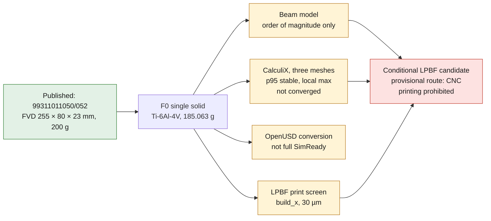
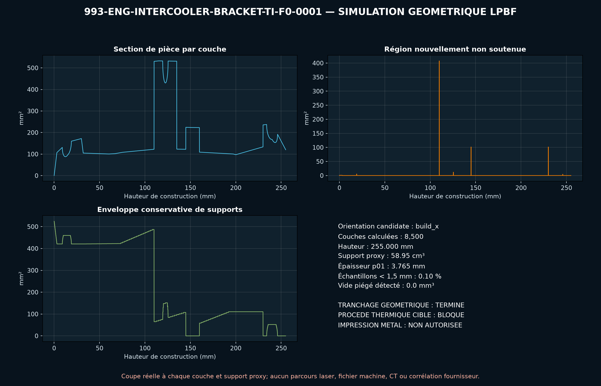

# 993 intercooler bracket, Ti-6Al-4V — F0 twin

## Verdict

The intercooler bracket is a **conditional LPBF candidate**, not a part ready to
print. Its F0 shape consolidates an open frame, two eyelets and a central boss
into a single solid, with no powder cavity. However, the current shape remains
largely flat and accessible to cutting followed by machining. LPBF will be
chosen only if a measured geometry and real loads justify a topology
optimization or a consolidation impossible to obtain economically by sheet
metal or CNC. For the current F0 shape, the provisional route recorded in the
catalogue is therefore CNC.

PorscheFanatics establishes the references `99311011050` and `99311011052` and
their place in the forced-induction circuit. FVD declares a
`255 × 80 × 23 mm` envelope and a mass of `200 g` for its reinforced bracket.
These sources provide neither the hole spacings, nor the bores, nor the contact
surfaces. All these details therefore remain project hypotheses.



*Diagram: the dossier's own path, restated from the text below. It adds no number or result, and it proves nothing about the physical part.*

## Geometry and material

- editable master: `build123d`;
- dimensional exchange: STEP, single OCCT solid;
- reproduced envelope: `255 × 80 × 23 mm`;
- CAD volume: `41,869.513 mm³`;
- mass computed with `ρ = 4.42 g/cm³`: `185.063 g`;
- candidate material: Ti-6Al-4V Grade 5 LPBF;
- screening elastic card: `E = 110 GPa`, `ν = 0.31`;
- comparison reference: wrought `Rp0.2 = 828 MPa`, never an LPBF allowable.

## Mathematical models

The existing analytical screening applies a synthetic central load
`F = 400 N` over a span `L = 220 mm`:

```text
A = n b t
I = n b t³ / 12
Mmax = F L / 4
sigma = Mmax (t/2) / I
tau_max = 1.5 F / A
sigma_VM = sqrt(sigma² + 3 tau²)
delta = F L³ / (48 E I)
delta_L = alpha L delta_T
```

It gives `σVM = 229.422 MPa`, `δ = 2.801 mm` and a free expansion of
`0.2376 mm` for `ΔT = 120 K`. This beam model replaces the real shape with two
8 mm strips and does not represent local concentrations.

## CalculiX calculation run

The exact STEP was meshed by Gmsh 4.12.1 with quadratic C3D10 tetrahedra, then
solved by CalculiX 2.21. The left eyelet is fixed in XYZ, the right eyelet is a
support sliding in X and the total load of `400 N` is spread over the top of the
central boss. Supports, load and direction are unmeasured regression
conditions.

| Target size | Nodes | C3D10 | p95 von Mises | p99 | Local maximum | Max. deflection |
| ---: | ---: | ---: | ---: | ---: | ---: | ---: |
| 5.0 mm | 8,132 | 3,730 | 69.156 MPa | 90.817 MPa | 232.178 MPa | 1.18565 mm |
| 3.5 mm | 13,352 | 6,311 | 68.056 MPa | 90.153 MPa | 253.708 MPa | 1.19357 mm |
| 2.5 mm | 29,854 | 15,419 | 73.006 MPa | 94.116 MPa | 328.332 MPa | 1.21033 mm |

Between the two finest meshes, the variation is `6.78 %` on the p95 and
`1.38 %` on the deflection, under the `10 %` regression threshold. The local
maximum, on the other hand, keeps increasing; it must not be presented as
converged. The fine p95 is `31.8 %` of the nominal analytical result, while the
local maximum is `143.1 %` of that result. This difference confirms that the
beam calculation is useful as an order of magnitude, not as a CAE substitute.

The meshes, decks and fields stay out of Git. The public report keeps their
sizes and SHA-256 digests in
[`calculix-screen.json`](../../parts/993-eng-intercooler-bracket-ti-f0-0001/evidence/calculix-screen.json).

## OpenUSD conversion

The `conversion-only` pass of the NVIDIA workflow used the locked
`simready-workflow` image, `usd-convert-cad 0.2.0`, SimReady Foundation
`v2026.04.1` and the pinned validation runtime. The derived USD:

- keeps the `255 × 80 × 23 mm` envelope;
- has a `defaultPrim`, a Z axis and `metersPerUnit = 0.001`;
- contains one mesh and passes the eight minimum USD checks;
- contains no rigid body, collider or joint;
- carries no qualified Ti-6Al-4V physics card.

The USD file remains a reproducible artifact outside Git; its name, size and
SHA-256 digest are recorded in
[`simready-conversion-summary.json`](../../parts/993-eng-intercooler-bracket-ti-f0-0001/evidence/simready-conversion-summary.json).
This success does not constitute full SimReady compliance.

## Reproduction

```bash
python3 parts/993-eng-intercooler-bracket-ti-f0-0001/source/intercooler_bracket.py \
  --out parts/993-eng-intercooler-bracket-ti-f0-0001/derived/intercooler_bracket_ti_f0.step \
  --report parts/993-eng-intercooler-bracket-ti-f0-0001/evidence/engineering-screen.json

python3 twins/993-intercooler-bracket-ti-f0/source/run_calculix_screen.py \
  --step parts/993-eng-intercooler-bracket-ti-f0-0001/derived/intercooler_bracket_ti_f0.step \
  --work-root /PRIVATE_OUTPUT/993-intercooler-bracket \
  --mesh-sizes 5.0,3.5,2.5 \
  --report parts/993-eng-intercooler-bracket-ti-f0-0001/evidence/calculix-screen.json
```

The second command must run in an environment containing Gmsh and CalculiX. The
local image used is identified in the report; no portable registry digest is
claimed for this CAE.

## Gates still closed

- geometry and tolerances of the three interfaces;
- intercooler mass, hose forces, accelerations and preloads;
- engine temperature, thermal stresses, vibration and fatigue;
- LPBF material card tied to the machine, the orientation and the heat
  treatment;
- support strategy, HIP, machining, CT and galvanic insulation;
- costed CNC/sheet metal/LPBF comparison;
- static, vibration and thermal tests and vehicle fitting;
- professional review and manufacturing authorization.

PhysicsNeMo stays out of scope: three meshes of the same synthetic case form
neither a correlated dataset nor an admissible training domain.

<!-- print-screen:begin -->

## LPBF print simulation

The STEP was tessellated, then sliced over its full height at `30 µm`, on the EOS M 290 route of the candidate material. Orientation chosen by the automatic rule: `build_x`.

| quantity | value |
|---|---:|
| layers | 8,500 |
| build height | 255.00 mm |
| layers with an unsupported region | 234 |
| support proxy | 58,945.40 mm³ |
| local thickness p01 | 3.765 mm |
| trapped powder at 1.00 mm | 0.00 mm³ |



This screening is neither an EOSPRINT project, nor a distortion calculation, nor a recoater check. **Printing remains prohibited.**

<!-- print-screen:end -->
