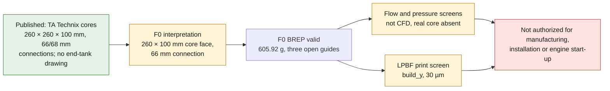

# 993 Turbo intercooler end tank — AlSi10Mg F0 concept

TA Technix publishes, for its 993 Turbo aftermarket intercooler, two cores of
`260 × 260 × 100 mm`, outer connections of `66 mm`, an inner connection of
`68 mm`, a maximum width of `860 mm`, a height of `240 mm` and a mounting
center distance of `690 mm`. Albert Motorsport cross-checks the two cores and
declares a welded aluminum assembly. These listings give no end-tank drawing,
no orientation of the three dimensions and no aluminum grade.

PorscheFanatics places the air-to-air charge cooling of the 993 Turbo and its
charge coolers, but provides no dimension. The F0 therefore interprets
`260 × 100 mm` as a core face and `66 mm` as the outer diameter of a
connection. The central `68 mm` connection, the second core, the fasteners
and the left/right geometry are not modeled.



*Diagram: the dossier's own path, restated from the text below. It adds no number or result, and it proves nothing about the physical part.*

## Why additive makes sense here

LPBF allows a continuous round-to-rectangle transition, three integrated flow
guides and a flange in a single open, depowderable part. It must still be
shown that this benefit beats a TIG-welded aluminum sheet end tank or a cast
part on flow, uniformity, mass, cost, inspection, repairability and fatigue.

The F0 has a synthetic `120 mm` transition, a `2.2 mm` wall, three open
`1.5 mm` guides, a core flange and a round collar. The candidate material is
LPBF AlSi10Mg; the alloy of the commercial intercooler remains unknown.

The re-read STEP contains a valid BREP solid and a connected fluid volume
between the rectangular face and the round port. Its envelope is
`134 × 274 × 114 mm`, its material volume `226,936.46 mm³` and its theoretical
mass `605.92 g` at `2.67 g/cm³`. It is neither an OEM geometry nor a
compatible part.

## Screenings run

The synthetic case takes `3.6 l`, `5,750 rpm`, a volumetric efficiency of
`0.95`, `1.8 bar` absolute, `330 K`, a core open area of `65 %`, a gauge
pressure of `0.8 bar`, `+100 K` and `100 h`.

The four-stroke and ideal-gas equations give `0.08194 m³/s` and
`0.1557 kg/s` per bank. The velocity goes from `27.49 m/s` at the connection to
`4.85 m/s` over the core open area, for Reynolds `169,408`. The
sudden-expansion screen gives `487 Pa` and `39.9 W` lost, with an ideal kinetic
recovery of `696 Pa`. This is not a CFD and the real core is absent.

At `0.8 bar`, the force on the face is `2.08 kN`, the connection membrane
`1.2 MPa` and the idealized guided panel `3.18 MPa`. The free expansion of the
flange is `0.575 mm`. The fully constrained bound reaches `147 MPa`, i.e. a
ratio of `1.67` against the room-temperature comparison value of `245 MPa`.
The `51.75 million` pulsations calculated over `100 h` give no life for lack
of a qualified fatigue map.

## Software reproduction

```bash
docker run --rm --platform linux/amd64 -v "$PWD:/work" -w /work \
  ghcr.io/cluster2600/3dprinting993-cad-author-f28@sha256:18dbfa559306a31c909480695acf0e89a9bc904c83d280065c1d9d29036fec57 \
  python parts/993-eng-intercooler-end-tank-alsi10mg-f0-0001/source/end_tank.py \
  --out parts/993-eng-intercooler-end-tank-alsi10mg-f0-0001/derived/end_tank_alsi10mg_f0.step \
  --report parts/993-eng-intercooler-end-tank-alsi10mg-f0-0001/evidence/engineering-screen.json
```

## Next gates

1. Scan the left/right assembly and measure cores, ports, flanges,
   welds/brazes, fasteners, hoses, engine lid duct and installed clearances.
2. Measure flow, pressure, temperature, uniformity, core loss, transients,
   engine movement, vibration and duty cycles.
3. Rebuild both end tanks with datums, tolerances, hose beads, machining
   allowances and real assembly interfaces.
4. Compare without/with guides by RANS then transient CFD, CHT and
   pressure-temperature/modal/fatigue FEA, with convergence.
5. Qualify AlSi10Mg, orientation, supports, distortion, heat treatment,
   machining, welding/brazing, CT, roughness, leak, proof and burst.
6. Correlate on a flow-pressure-temperature bench, cycles and shaker before
   dyno and vehicle, under engineering review.

PhysicsNeMo awaits a correlated CFD/CHT/structure dataset with train, holdout
and out-of-distribution sets. SimReady awaits the measured assembly. This F0
STEP is authorized neither for manufacturing, nor for installation, nor for
engine start-up.

<!-- print-screen:begin -->

## LPBF print simulation

The STEP was tessellated, then sliced over its full height at `30 µm`, on the EOS M 290 route of the candidate material. Orientation chosen by the automatic rule: `build_y`.

| quantity | value |
|---|---:|
| layers | 9,134 |
| build height | 274.00 mm |
| layers with an unsupported region | 7215 |
| support proxy | 1,779,507.45 mm³ |
| local thickness p01 | 1.044 mm |
| trapped powder at 1.00 mm | 0.00 mm³ |


This screening is neither an EOSPRINT project, nor a distortion calculation, nor a recoater check. **Printing remains prohibited.**

<!-- print-screen:end -->
