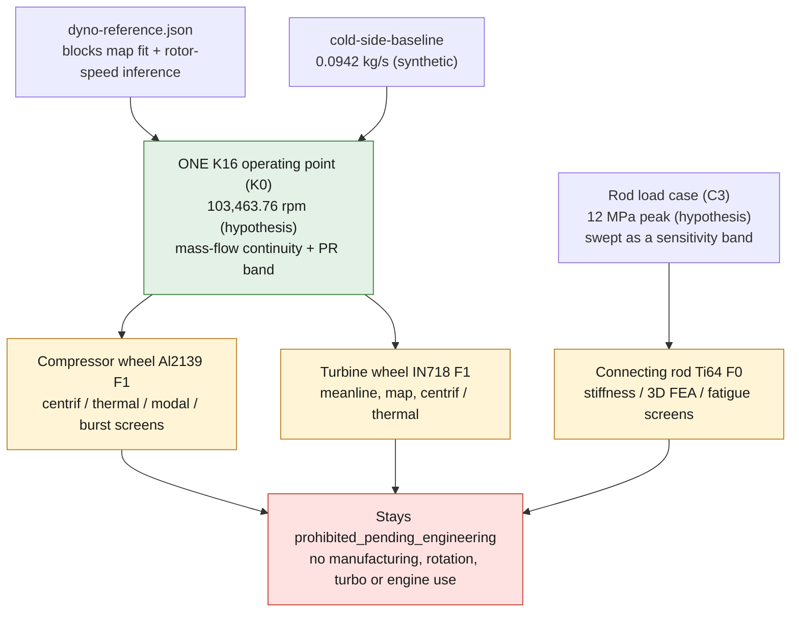

# Making the K16 wheels and the Ti rod measurably better

This programme covers three parts on one turbocharged M64/60 engine and answers a
single owner question with numbers, not adjectives:

- `993-ENG-K16-COMPRESSOR-WHEEL-AL2139-F1-0001`
- `993-ENG-K16-TURBINE-WHEEL-IN718-F0-0001` (work creates a successor
  `993-ENG-K16-TURBINE-WHEEL-IN718-F1-0001` and updates the F0 record in place)
- `993-ENG-CONNECTING-ROD-TI64-F0-0001`

## 1. "Are those more performant and lighter, did you do the math?"

Honest answer, per part.

**K16 compressor wheel (Al2139 F1).** The repository computed three
room-temperature algebra ratios (`1.986` blade root, `2.516` disc, `1.905`
thermal, all against `Rp0.2 460 MPa`, `SRC-EOS-AL2139-AM-M290-60UM`;
`parts/.../evidence/engineering-screen.json`) on synthetic loads, and a theoretical
CAD mass of `38.49 g` from the STEP solid
(`parts/993-eng-k16-compressor-wheel-al2139-f1-0001/derived/compressor_wheel_al2139_f1.step`).
It did **not** run any 3D FEA, CFD, modal, burst or fatigue analysis on this
geometry. About the OEM baseline: **no OEM compressor-wheel mass, map, rated
speed, material or blade profile is published anywhere** in the catalogue or the
open web (verified). So there is no defensible "more performant" or "lighter than
OEM" claim, and none is made.

**K16 turbine wheel (IN718 F0).** The repository computed an analytic
centrifugal root-pull ratio (`1.233`), a disc ratio (`2.022`) and a
fully-constrained thermal bound (`0.566`), and used a **hard-coded** efficiency
`eta_ts = 0.70` (`turbine_wheel.py`, `engineering-screen.json`). It did **not**
compute efficiency from real velocity triangles, run a map, run 3D CENTRIF/thermal
FEA, or check fatigue/creep. About the OEM baseline: **no OEM turbine map, wheel
mass, blade profile, rated speed or metal temperature exists** (verified); the
`103,464 rpm` speed is a compressor Mach-0.9 regression and the `950 C` is
BorgWarner gas context, not a measured K16 metal temperature.

**Connecting rod (Ti-6Al-4V F0).** The repository ran a 1D closed-form
room-temperature screen (`F0` mass `341.02 g`, peak-stress/yield ratio `1.636`,
out-of-plane Euler ratio `5.47`; `engineering-screen.json`) on a **fully
synthetic** load case (`12 MPa` peak cylinder pressure, `600 g` reciprocating
mass, `Kt 1.5`, `100 h`; constants in `connecting_rod.py`). It did **not** compute
stiffness, run 3D FEA, or estimate fatigue life. About the baseline: the **only
sourced mass is `535 g` total steel** (`SRC-TZR-PAUTER-993-CONNECTING-ROD-DIMENSIONS`);
the `373 g` big-end split and the `358.45 g` titanium figure (`535 x 0.67`, a
supplier percentage) are **hypotheses, not measured baselines**.

Across all three, nothing computed here raises the class. Every record stays
`validation.status = concept` and `classification.safety_class =
prohibited_pending_engineering` (SAFETY.md, QUALITY_GATES.md).

## 2. What "better" means

"Better" is higher analysis fidelity and dossier defensibility against an honest
comparator: the part's own documented baseline, or a published/reconstructed
value that carries a source id. Where no baseline can be published, mass is
demoted from a pass/fail gate to a **reported interval only**.

### K16 compressor wheel — `993-ENG-K16-COMPRESSOR-WHEEL-AL2139-F1-0001`

| metric | today's value (origin) | baseline | target | how measured |
|---|---|---|---|---|
| screen-vs-CAD inconsistencies | 5 documented (T1 / F1 dossier) | self | 0 | T1 recheck script |
| root/disc stress ratio | disc `2.516`, blade `1.986` (RT algebra, `engineering-screen.json`) | threshold `1.5` (regression) | bored-disk hoop value on the real `Ø6 mm` bore, quoted beside `2.516`; then 3D FEA ratio ≥ `1.5` | T1 bored-disk + T3 CalculiX C3D10, GCI<5% |
| peak vM at 1.2x overspeed | analytic blade `231.61 MPa` (F1 dossier) | RT `Rp0.2 460 MPa` (`SRC-EOS-AL2139-AM-M290-60UM`) | converged 3D peak vM / max-principal, ratio vs `460 MPa` (RT coupon comparison, **not** a rotor margin) | T3 |
| modal / Campbell | none | n/a | prestressed modal + Campbell vs 6/rev, 12/rev (6+6 blades, `SRC-INVASIONAUTOPRODUCTS-993-K16-INTERNAL-DATA`) | T5 prestressed `*FREQUENCY,PERTURBATION` |
| burst | none | overspeed `1.2x` | CalculiX centrifugal limit-load / area-averaged tangential-stress **screening bound** with uncertainty band (non-validated) | T6 |
| mass | F1 CAD `38.49 g` (STEP) | **not published** — bounded as interval `[m_low, m_high]` from published geometry + a sourced density interval | locate `38.49 g` in the interval; "lighter than OEM" only if `38.49 < m_low` | P2 reproducible bounds script |
| HCF capability | none | no Al2139-AM HCF/hot data on file (only RT T4 + literature) | Goodman-type interval + the coupon matrix that would replace it; **no pass verdict expressible** | T7 |
| provenance | 5 uncited sources; `lpbf-f0` folder mislabelled | n/a | every number carries a `source_id` or `absent+bounding-strategy`; make-check wording gate | P1 / T2 / Z1 |

### K16 turbine wheel — `993-ENG-K16-TURBINE-WHEEL-IN718-F0-0001`

| metric | today's value (origin) | baseline | target | how measured |
|---|---|---|---|---|
| unbounded-invented params | ~14 (`engineering-screen.json`) | n/a | 0 (each a `source_id`, an explicit band, or `hypothesis`) | M2 provenance table |
| efficiency `eta_ts` | `0.70` hard-coded (`turbine_wheel.py`) | no OEM map | **computed** total-to-static + itemised loss breakdown | M3 meanline |
| map | single point PR `1.419` (`engineering-screen.json`) | no OEM map | ≥5 speed-lines × ≥5 PR; F0 point within 10% | M4 |
| min wall | `p01 0.133 mm` — a non-certified geometric probe (F0 LPBF report) | EOS min wall `0.3–0.4 mm` (`SRC-EOS-IN718-API-M290-40UM`) | explicit, flagged wall-thickness map, `p01 ≥ 0.30 mm` | M5 |
| root stress ratio | analytic Kt=2.5 root ratio `1.233` (`engineering-screen.json`) | RT yield `865 MPa` (`SRC-EOS-IN718-API-M290-40UM`) | 3D CENTRIF filleted-root ratio ≥ `1.5`, GCI<5% | M6 |
| thermal ratio | fully-constrained bound `0.566` (`engineering-screen.json`) | RT yield `865 MPa` (**no hot yield on file** — hypothesis) | graded-temperature-field ratio | M7 Tier A |
| disc ratio | `2.022` (`engineering-screen.json`) | ≥ `2.0` | ≥ `2.0` | M6 |
| burst / modal | none | overspeed `1.20x` | prestressed modal + Campbell; average-tangential-stress burst **BOUND** vs the synthetic `103,464 rpm` redline (non-validated) | M8 |
| mass | F0 single point `139.17 g` (`engineering-screen.json`) | **not published** | reported as a band only, **no "lighter" claim** | M2 / M5 |
| HCF / creep life | none | no route-qualified hot S-N or Larson-Miller creep on file (hypothesis) | HCF margin + creep-life estimate that rules out only | M10 |

### Connecting rod — `993-ENG-CONNECTING-ROD-TI64-F0-0001`

| metric | today's value (origin) | baseline | target | how measured |
|---|---|---|---|---|
| manufacturability | LPBF print screen `failed_closed` (2-solid guard, `print-screen-status.json`) | n/a | full-part single-body slice, 0 non-manifold errors | C4 PrusaSlicer |
| stiffness | none | reconstructed solid I-beam yardstick (**not** an OEM section) | `k_ax [N/mm]`, `f1 [Hz]`, `k_ax/mass` | C5 / C6 CalculiX |
| stress / Kt | assumed `Kt 1.5`, ratio `1.636` (`engineering-screen.json`) | Ti64 yield `980 MPa` (`SRC-EOS-TI64-GRADE5`) | 3D vM field, real FEA Kt, GCI<5% | C5 |
| buckling | combined out-of-plane Euler `5.47` only (`engineering-screen.json`) | n/a | add per-strut in-plane Euler (`I = 1167 mm^4`) + diagonal-resolved strut load; governing (smaller) ratio | C4 |
| fatigue | none | open LPBF-Ti64 S-N (literature; Cecchel 2022 found an LPBF topology rod fatigued **below** conventional) | Goodman/Soderberg margin, R-corrected, refutable screen | C7 |
| load provenance | synthetic `12 MPa` / `600 g` / `100 h` (`connecting_rod.py`) | CR `8.0`, boost `0.8 bar` (`SRC-ELFERCLASSIC-993-TURBO-TECHNICAL-DATA`); BMEP envelope `reference_only` | source-tagged intervals; `12 MPa` carried as an explicit **hypothesis sensitivity band** | C3 |
| mass | F0 `341.02 g` (`engineering-screen.json`) | steel `535 g` total (`SRC-TZR-PAUTER-993-CONNECTING-ROD-DIMENSIONS`) **only**; `358.45 g` and `373 g` are hypotheses | report `k_ax/mass`; the `358.45 g` line is a hypothesis yardstick, not a sourced comparator | C6 / C9 |

## 3. One shared K16 operating point, one rod load case

The two wheels sit on one shaft in one turbocharger, so they must share **one**
operating-point definition, not three. The shaft speed is already the identical
synthetic `103,463.76 rpm` in both records; what is missing is a single mass-flow
continuity statement and PR band. This shared step reconciles the three
inconsistent anchors on file — cold-side baseline `0.0942 kg/s`
(`simulation/993-k16-cold-side-baseline`, a synthetic duct-area value), compressor
P3 `~0.156 kg/s`, and the dyno per-turbo `~0.05–0.09 kg/s` — into one
continuity-consistent band, carrying the shared `dyno-reference.json`
`blocked_uses` caveat (it blocks `compressor_map_fit`, `turbine_map_fit` and
`rotor_speed_inference` for **both** wheels). The rod's load case is a **separate**
step: it does not share the turbo operating point.

*Diagram: the dependency shape only. It restates the plan below, adds no number
or result, and proves nothing about any physical part.*

### Shared spine (de-duplicated across both wheels)

To avoid each wheel independently "first-using" the same capability:

- **K0 — one operating point** (above): supersedes compressor P3 and the turbine
  operating-envelope pieces of M2/M4.
- **K1 — one first-CENTRIF witness**: `*DLOAD CENTRIF` has never run in this repo
  (repo `*DLOAD` is pressure-only). Build one analytic rotating-disk verification
  case once, cite it from compressor T3/T4/T6 and turbine M6/M7/M8.
- **K2 — one prestressed-modal witness**: the plain `*FREQUENCY` chain already
  exists (`twins/m64-engine-twin/source/fea_screens.py` `modal()`); only
  `*STATIC,NLGEOM + *FREQUENCY,PERTURBATION` (with `PERTURBATION` on the `*STEP`)
  is new. Prove once, reuse for compressor T5 and turbine M8.
- **K3 — one MRF bring-up smoke**: `foamRun -solver fluid` + `constant/MRFProperties`,
  seeded from `simulation/993-k16-cold-side-baseline`; one gate for compressor A2
  and turbine M9.
- **K4 — one FAA AC 33.27-1A source record + one honest burst definition**: record
  the AC once (means-agnostic), define the burst screen once as a CalculiX
  limit-load / area-averaged tangential-stress bound, apply one overspeed factor to
  both rotors.
- **K5 — one provenance / AM-register / make-check discipline block**: shared by
  rod C1/C8, compressor P1/T2/Z1, turbine M1/M11.

## 4. Per-part plans

Effort key: S ≈ ≤1 day, M ≈ 1–3 days, L ≈ 3–7 days. "Run now" means it fits the
15 GB WSL host with the images already built locally (`cadsim`, `recon`,
`mesh-cfd`); geometry that must be reproducible is routed through the
`cad-author-f28` image, which pins and runtime-asserts `build123d==0.11.1` (the
`cadsim` build123d is **unpinned**).

### 4a. K16 compressor wheel

**Diagnosis.** The F1 record is a topology marker whose claims outrun its
evidence. Only the `40.6 / 60.5 mm` diameters and the 6+6 blade count are sourced
(one level-C vendor page); the `Ø6 mm` bore, `103,464 rpm`, PR `1.8`, `eta 0.72`,
Kt, and elastic constants are all hypotheses. The three "pass" ratios rest on
equations that contradict the CAD — the `engineering-screen.json` rotating-disk
equation is the **solid-disk** peak formula while the part has a through bore, the
root stress uses an assumed `t_root x h = 33 mm^2` section, and the taper
hypothesis says `0.8 mm` tips while the CAD produces `~1.075 / 1.0 mm`. No FEA,
modal, burst or CFD has touched this geometry. The cheap, high-value spine is:
repair provenance, correct the analytic screen on as-built sections, then run the
first real centrifugal/thermal/modal/burst FEA.

| id | step | inputs | tools | outputs | gate | run now / blocked by | effort |
|---|---|---|---|---|---|---|---|
| P1 | link 5 uncited sources; record open Kinugawa/Mamba pages (robots-checked); build OEM-baseline register; log the `40.5/40.6/44.15 mm` inducer conflict adopting none | F1 record + existing sources; open vendor pages | host python; `browser_page_read`; `make check` | `evidence/oem-baseline-2026-09-25/oem-baseline-register.json`; new source records; `docs/993/993_K16_CW_OEM_BASELINE.md` | make check green; every row a `source_id` or `absent+bounding-strategy`; 0 edits under evidence/** or any lock | now | S–M |
| P2 | compute OEM mass **interval** `[m_low,m_high]` from published geometry + a sourced density interval; locate `38.49 g` | P1 register; new density source; F1 STEP | `cad-author-f28` (pinned build123d) | `oem-envelope-reconstruction.json`; `oem_envelope_bounds.py` | mass appears **only** as `[m_low,m_high]`; solidity flagged hypothesis; "lighter than OEM" only if `38.49 < m_low` | blocked by P1 | M |
| T1 | reproduce F1 numbers exactly, then measure as-built sections from the BREP and recompute root stress with the bored-disk hoop solution | `compressor_wheel_f1.py`; pinned `engineering-screen.json` (read-only) | `cad-author-f28` python + build123d | `compressor_wheel_f1b_screen.py`; `screen-recheck-2026-09-25/screen-recheck.json` | reproduces `231.61/182.86/241.5 MPa` to 1e-6; bored-disk ratio quoted beside `2.516`; fail-closed if any corrected ratio < `1.5` | now | M |
| T2 | write down which allowables exist for Al2139-AM / M290 / 60 µm and the prohibited-claims list; wire a metrics contract into make check | `SRC-EOS-AL2139-AM-M290-60UM`; open method sources (K4) | host python + `make validate` | `metrics-contract.json` + checker; allowables doc | checker exits non-zero on "better/lighter/stronger than OEM" or "validated" without qualifier | blocked by P2, T1 | M |
| T3 | converged linear-static centrifugal field on the real geometry at nominal and `1.2x`, after the K1 analytic-disk witness | F1 STEP; T1 sections; K1 | `cadsim`: gmsh + ccx 2.21 (`*DLOAD CENTRIF`) | `fea-centrifugal-report.json`; 3-level mesh + convergence | K1 witness within a few % of theory first; GCI reported; report peak **and** section-averaged stress at un-filleted corners | blocked by T1, K1 | L |
| T4 | replace the fully-constrained thermal bound with a computed thermal + combined worst case; compare growth to `0.159 mm` | T3 mesh | `cadsim` ccx 2.21 thermo-mechanical | `fea-thermal-report.json` | free-expansion check passes; combined ratio reported with a "no hot yield exists" caveat | blocked by T3 | M |
| T5 | first modal dataset: natural frequencies under centrifugal prestress + Campbell vs 6/rev, 12/rev | T3 mesh; K0 speed band; K2 | `cadsim` ccx 2.21 (`*STATIC,NLGEOM + *FREQUENCY,PERTURBATION`) | `campbell-report.json` + figure | first 10 modes converge; every order crossing listed; margins conditional on hypothesis speed | blocked by T3, K0, K2 | M |
| T6 | CalculiX centrifugal limit-load / area-averaged tangential-stress **screening bound** with uncertainty band, reusing the T3 model | T3 tangential stress; K4 AC record | `cadsim` CalculiX + python post | `burst-screen.json` | labelled screening bound, not per-AC, not validated without overspeed-test data; band's lower bound compared to `1.2` | blocked by T3, K4 | M |
| T7 | Goodman-type HCF **interval** from hypothesised endurance knockdowns + the coupon matrix that would replace it | T3 static; T5 modal | `cadsim` python (algebra) | `hcf-bound.json` + coupon list | **no** pass verdict; only the remaining capacity interval + "vibratory stress unquantified" | blocked by T2, T3, T5 | M |
| A1 (K3) | MRF bring-up smoke via `foamRun -solver fluid`, seeded from `cold-side-baseline` | OpenFOAM tutorial + `cold-side-baseline` | `mesh-cfd`, `--memory 12g` | `simulation/993-k16-mrf-smoke/` + evidence log | tutorial exits 0; 3D annulus mass imbalance < 1%; README classes it toolchain smoke | now | M |
| A2 | shape-dependent MRF PR/eta at the K0 point, fluid domain built with the 917 f48/f49 case builders | F1 STEP; A1 template; K0 | `mesh-cfd` / `openfoam-engine-f35`; Vast.ai CPU fallback | `simulation/993-k16-compressor-mrf-f1/` | mass imbalance < 1% (binding gate); PR/eta labelled "model-predicted, uncorrelated, not a map" | blocked by A1, K0; Vast.ai if mesh > RAM | L |
| A3 | **owner-gated**: size an F2 impeller by meanline, loft real blades (reuse cooling-impeller loft), paired F1-vs-F2 CFD | K0; sourced diameters; F1 STEP | new `turbo-meanline-f60` container; `cad-author-f28` loft; Vast.ai | new part folder `...-al2139-f2-0001`; sizing/CFD JSONs | container smoke-tested; paired CFD with GCI<5%; grep gate: no "better than OEM" | blocked by A2 + owner approvals + Vast.ai budget | L (4–6 wk) |
| Z1 | publish the compliant record: English doc with Mermaid, 5 inconsistencies closed, sources completed, gate-ladder map | all P/T (+A) evidence | editor; `make check` on ext4 | `..._F2_STRUCTURAL.md`; `..._CW_GATE_LADDER.md`; updated F1 record | make check green; 0 diff under evidence/** or any lock; status/class/flags unchanged; grep clean | blocked by T1–T7 (+A2/A3) | M |

**Claims corrected after adversarial review (compressor).**

- **P2** — dropped the "OPTIONAL UNLOCK" / "collapses the OEM mass interval to a
  measurement" framing (invented terms; geometry is point-valued and no scan of
  wheel `53241232006` is catalogued or licensable). Reworded: a licensed scan
  would tighten only the external reference geometry, is not currently licensable,
  and authorises no validation; mass stays strictly `[m_low,m_high]`.
- **T6** — removed the claim that "no validated open-source burst code exists":
  CalculiX already ships and does nonlinear elastoplastic centrifugal limit-load.
  Removed the mean-hoop plastic-collapse framing (the F1 dossier runs no such
  screen) and recast T6 as a CalculiX limit-load screening bound; AC 33.27-1A is
  means-agnostic and is recorded first (K4).
- **T1/T3 geometry, C4** — dropped "cadsim ships build123d 0.11.1": build123d in
  `cadsim` is **unpinned**. Reproducible BREP/STEP work is routed through
  `cad-author-f28`.
- **A1/A2** — dropped "simpleFoam/rhoSimpleFoam absent": they are legacy wrappers
  delegating to `foamRun`. Entry point is `foamRun -solver fluid`; MRF has never
  been **exercised** (still first-use); seeded from `cold-side-baseline`.
- **A3** — dropped "build123d lofted blades are unproven → need T-Blade3": the
  cooling-impeller and fan-stator scripts on this branch already loft cambered
  airfoil BREP blades. The loft approach is reused; T-Blade3 is kept only as an
  optional higher-fidelity path with its GPL licence decision.
- **A2/A3** — F49/F50 are 917 cylinder-head gas-path CFD that **failed closed**
  (only mass-balance passed). Cited only as evidence the toolchain runs and as the
  "mass-balance < 1% is the binding gate" cautionary precedent, not as a
  compressor-wheel result. The `~103,464 rpm` point is **subsonic** (inducer rel.
  Mach `~0.63`, exducer `~0.80`), so the "transonic" framing is dropped.

### 4b. K16 turbine wheel

**Diagnosis.** An honest, well-instrumented reject with three separable
weaknesses: (i) provenance — only ~7 of ~21 geometry/load numbers are sourced (all
level-C vendor catalogues), the speed is a compressor Mach-0.9 regression and the
`950 C` is gas context, not K16 metal temperature; (ii) structure — the root
screen is an analytic Kt=2.5 pull whose root radius differs from the geometry's
hub-buried root plane and has no fillet, and the thermal verdict is a
fully-constrained bound (`0.566`) that any nickel fails by construction; (iii)
aero — `build_geometry` unions straight zero-camber plates, so no efficiency or map
can be computed and the `0.70` efficiency is assumed. Feasible high-value core:
M1→M2→M3→M4 (sourced baseline + computed eta + map) and M5→M6→M7 Tier A→M8 (one
sane rotor + defensible structural numbers) plus M11; M9 / M7 Tier B / M10 are the
deferrable frontier.

| id | step | inputs | tools | outputs | gate | run now / blocked by | effort |
|---|---|---|---|---|---|---|---|
| M1 | record only sources that exist or are genuinely open; mark hot/creep/HCF inputs as pure hypothesis | existing Invasion/Kinugawa records; EOS RT coupons; K4 AC | host python + `make validate` | new source records | each carries url/access/rights + robots-open; no robots-closed page; sibling/aftermarket flagged NOT-OEM | blocked by owner robots/licence confirmation | S |
| M2 (K0) | one provenance table (unbounded-invented = 0); 3 BREP envelopes → mass **band**; the shared operating point | M1; `turbine_wheel.py`; `derived-dyno-curves.json` | `cad-author-f28`; host python | `baseline-provenance-table.json`; `reconstructed-envelope.json`; `operating-envelope.json`; `better-definition.json` | diameters reported as a spread, never averaged; mass **band** only; `better-definition` declares mass/efficiency out of scope until a map+profile exist | now | M |
| M3 | clone `cooling_impeller_f1.py`; solve radial-inflow velocity triangles; **computed** `eta_ts` + loss breakdown | cooling-impeller scaffold; M2 band; textbook loss correlations | host / cadsim python | `turbine_meanline_f1.py`; `meanline-screen.json` | mass+energy residual < 1e-6; Ns in `0.3–0.9`; replaces the assumed `0.70`; correlations flagged uncalibrated | now | M |
| M4 | sweep M3 into a map (MFP vs PR, eta islands); reproduce F0 PR `1.419` within 10% | M3; M2 band | host python + matplotlib | `turbine-map.json` + `.png` | MFP monotonic; choke/windmill lines; "what a measured map still needs" block; self-generated figure, no OEM image copied | now | S |
| M5 | one radial-inflow rotor BREP, aero-defined **and** structurally sane; LPBF geometric screen | M3 angles; M2 band; EOS min wall; f50 audit kernel | `cadsim` build123d + gmsh + trimesh | `turbine_wheel_f1.py`; STEP+STL; `lpbf-geometry-report.json` | single BREP, STEP round-trip < 0.05 mm^3; `p01 ≥ 0.30 mm`, every sub-0.4 mm cell flagged; mass reported, **no "lighter" claim** | now | L |
| M6 (K1) | single blade+sector CENTRIF static at operating + `1.20x`; converged root/disc stress at the true fillet | M5 STEP; M2 band; RT yield `865 MPa`; f50 harness | `cadsim` gmsh → ccx 2.21 (`*DLOAD CENTRIF`, `*CYCLIC SYMMETRY MODEL`) | `centrifugal-screen.json` + convergence | GCI < 5%; overspeed ratio vs `865 MPa` compared to F0's `1.233`; disc ≥ `2.0`; a witness case first | now (first-CENTRIF risk) | M |
| M7 | Tier A: graded metal-temperature field + combined centrifugal+thermal ratio (replaces `0.566`). Tier B: CHT (blocked) | M5/M6 mesh; bounded temp scenarios (hypothesis); f50 thermal pattern | Tier A `cadsim` ccx; Tier B `mesh-cfd` CHT | `thermal-screen.json`; `temperature-envelope.json` | Tier A converged and finite; temperature-envelope gate declared FAILED (metal temp unmeasured); k(T)/cp(T)/E(T) flagged hypothesis | Tier A now; Tier B blocked (Vast.ai) | M / L |
| M8 (K2, K4) | prestressed modal + Campbell; average-tangential-stress burst **bound** vs the synthetic redline | M6 mesh + stress; blade-pass `20,692.75 Hz`; K4 AC | `cadsim` ccx (prestressed `*FREQUENCY,PERTURBATION`); python | `modal-screen.json`; `burst-margin.json` | burst reported as a BOUND, not a certified `≥1.25`; Campbell crossings flagged; redline stated as hypothesis | now (first-modal risk) | M |
| M9 (K3) | first MRF CFD: one periodic passage, `foamRun -solver fluid` + `MRFProperties`, cross-check M3/M4 | M5 STEP; M4 points; exhaust props (hypothesis) | `mesh-cfd`; coarse on WSL, converged/GCI on Vast.ai | `twins/993-k16-turbine-hotgas-mrf/` | exit 0; mass balance < 1%; CFD `eta_ts` within ±10% of M3 or the map is downgraded to illustrative; verification-only | blocked: first-MRF + Vast.ai for GCI | L |
| M10 | HCF margin + creep-life estimate against reconstructed LPBF-IN718 S-N / Larson-Miller, with mandatory as-built knockdowns | M6/M7 stresses; literature S-N; F0 duty `100 h` | host python | `life-screen.json` | every input a `source_id` or `hypothesis`; states as-built LPBF fatigue is below wrought and no route-specific hot coupons exist; rules out only | blocked by M1 coverage | M |
| M11 (K5) | land F1 as a compliant record; make the F0 record honest (cite the omitted LPBF report; document artifacts in `known_limits`) | M2–M8 (+M9/M10) outputs; F0 record; `am-validation-policy.json` | editor + `make validate`/`make check`; branch off main | F1 part JSON + docs + README; updated F0 record | make check green; F1 = concept / prohibited, empty `reviewed_by`, added to `tracked_part_ids`; 0 edits under evidence/** or any lock | now (updated as steps land) | M |

**Claims corrected after adversarial review (turbine).**

- **M1** — dropped the non-existent sources it listed (TurboRebuild sibling dims,
  Mamba as OEM, AET model, a hot-IN718 + Larson-Miller datasheet, an LPBF-IN718 S-N
  set). The EOS IN718 sheet carries **RT coupons only** (`865 / 1236 MPa`, `28%`),
  no hot yield and no creep. M6/M7/M8/M10 hot/creep/HCF inputs are marked **pure
  hypothesis** with no datasheet backing.
- **M2** — dropped "sibling-inferred from `5316-120-5015/5028`" (those part
  numbers appear nowhere in the repo). Restated as a single reference
  `5316-120-5000` with a two-catalogue disagreement (Invasion `54.96/48.97` vs
  Kinugawa `55/49`), evidence level C, reported as a spread and never silently
  averaged.
- **M5** — the F0 `0.133 mm` wall is **not** an uncalled certified defect: the F0
  LPBF report is explicitly `screening_only_not_a_certified_minimum_wall_map` and
  the metric is a max-inscribed-sphere probe dominated by blade edges. The F1
  improvement is an explicit, flagged wall-thickness map, not a "fix" of a
  certified failure.
- **M8** — the burst clause is a screening **bound** relative to the synthetic
  `103,464 rpm` redline, not an AC-defined `≥1.25` margin (AC 33.27-1A is
  means-agnostic and demands test-validated analysis the project cannot provide).
  Removed "no modal analysis has ever run in this repo": `twins/m64-engine-twin`
  `modal()` runs a `*FREQUENCY` step. Only prestressed
  (`*STATIC,NLGEOM + *FREQUENCY,PERTURBATION`) modal on a K16 **wheel** is new.
- **M9** — `foamRun -solver fluid` is the entry point (`simpleFoam` is a legacy
  wrapper, not absent); MRF has never been exercised, so this is still a first-use,
  seeded from `cold-side-baseline`.

### 4c. Connecting rod (Ti-6Al-4V)

**Diagnosis.** An honest but analytically thin clean-sheet concept: ~6 published
PAUTER/TZR dimensions wrapped around ~15 prismatic hypotheses, a fully synthetic
load case, and a 1D ambient screen. Three in-repo weaknesses: (1) the LPBF print
screen **fails closed by construction** — `connecting_rod.py` raises `SystemExit`
unless the shape and the re-read STEP hold exactly 2 solids, so a single-body
slicer can never accept it; (2) the Euler check uses only the combined
out-of-plane `I = 4573 mm^4` and never the smaller per-strut in-plane
`I = 1167 mm^4`, and treats strut axial load as equal to rod axial load despite the
~19° diagonal; (3) there is **no** stiffness, 3D FEA or fatigue number anywhere.
The tools to fix all three (build123d, gmsh, CalculiX ccx 2.21, prusa-slicer,
trimesh) are present; the only missing tool is a structural topology optimiser,
which is why C9 needs a new pinned image and is deferred.

| id | step | inputs | tools | outputs | gate | run now / blocked by | effort |
|---|---|---|---|---|---|---|---|
| C1 (K5) | record web finds as sources so later comparisons cite a `source_id`; record licence/provenance before use | pauter split (web); Mahle piston PDF; FatigueData-AM2022; existing Cecchel/Dallago records | host python + `make validate` | new source records | make validate green; FatigueData licence confirmed MIT **on access** or not added; **no** Rose Passion record created by a tool (decision 0003) | now | S |
| C2 | fix the six "better" axes into a definition file with fixed sourced baselines | C1 records; `engineering-screen.json` (`341.02 g`, `1.636`, `5.47`); SAFETY.md; QUALITY_GATES.md | host editor | `better-definition.json`; F1 doc skeleton | each axis has a baseline + provenance tag + threshold; fail if any axis compares against an invented OEM number | now | S |
| C3 | replace synthetic `12 MPa`/`600 g`/`100 h` with source-tagged intervals; `12 MPa` swept as a sensitivity band | `SRC-ELFERCLASSIC-993-TURBO-TECHNICAL-DATA`; BMEP envelope (`reference_only`); Mahle piston | `cad-author-f28` / host python | `load-envelope.json`; `load_envelope_f1.py` | every entry a `source_id`, derivation, or explicit `hypothesis` bound; reproduces F0 forces within 0.1%; **no** number presented as measured | now | M |
| C4 | new `connecting_rod_f1.py` fusing body+cap into one manifold solid; add per-strut in-plane Euler + diagonal-resolved load; full-part slice | F0 script (untouched); `I = 1167 mm^4`; C3 bounds; `SRC-EOS-TI64-GRADE5` | `cad-author-f28` build123d; prusa-slicer; trimesh | `connecting_rod_f1.py`; per-body STEPs; `slice-report.json`; `screen-extended.json` | full-part slice with 0 non-manifold; reproduces F0 forces within 0.1%; in-plane Euler ratio reported (flagged if < 1.5); F0 master untouched | now | M |
| C5 | first stiffness + 3D peak-stress numbers with a real FEA Kt (linear elastic, no contact) | C4 body STEP; C3 bounds; Ti64 E=110 GPa, `980 MPa`, `4.42 g/cm^3` | `cadsim` gmsh + ccx 2.21 (`*STATIC` + `*FREQUENCY,PERTURBATION`) | `fea-report.json` (`k_ax`, `f1`, peak vM, FEA Kt, GCI) | 3-level mesh, GCI < 5% (or reported); no contact/plasticity/preload (stated as a limit) | now | L |
| C6 | scored comparison matrix; set the bar (specific stiffness + peak-stress-per-mass) | C5 harness; F0 truss; reconstructed solid I-beam; filleted variant | `cadsim` build123d + gmsh + ccx | `comparison-matrix.json` | all 3 candidates converge; I-beam labelled a reconstructed yardstick, not OEM; `358.45 g` is a hypothesis line | now | M |
| C7 | first fatigue margin, R-corrected, positioned against Cecchel 2022 (screen, not allowable) | C5 stress fields; FatigueData-AM2022 subset; open knockdowns; Cecchel 2022 | `cadsim` / host python | `sn-card-reconstruction.json`; `goodman-margin.json` + diagram | Goodman **and** Soderberg margin citing the S-N `source_id`, R-adjustment, knockdown; labelled "not a qualified allowable"; explicit above/below vs Cecchel 2022 | now | M |
| C8 (K5) | assemble the source-anchored comparison; register the improved concept as a tracked LPBF candidate; verify | all C1–C7 outputs; part record; `am-validation-policy.json`; QUALITY_GATES.md | `cadsim` prusa-slicer + trimesh; `make validate && make check` | F1 doc comparison table + Mermaid; F1/updated record; AM-register entry | make check green; status stays concept, class stays prohibited, `reviewed_by` empty; candidate registered as `completed_screening`; 0 pinned-file edits | now (C9 optional at publish) | M |
| C9 | **owner-gated**: compliance-minimising topology optimisation at mass ≤ `358.45 g` (hypothesis), one connected body, as a concept study only | F0 envelope minus keep-outs; C6 compliance-to-beat; C3 bounds | new pinned `topo-opt-fXX` image (CalculiX + a TO driver), CPU only | container files + smoke; `topo-report.json`; re-run C4/C7/C8 on the TO body | optimised body meets mass + compliance + single-solid + keep-outs; framed as not overturning Cecchel 2022; build inputs touch no existing lock | blocked: no structural TO tool in any image; new image + licence decision needed | L |

**Claims corrected after adversarial review (rod).**

- **C1** — `SRC-TZR-PAUTER-993-CONNECTING-ROD-DIMENSIONS` publishes only `535 g`
  **total steel** with a 1 g/set tolerance, no big-end/small-end split. The `373 g`
  big-end split is carried as a hypothesis, and the `358.45 g` titanium figure is
  presented only as `535 x 0.67`, a supplier percentage — never as a measured Ti
  rod mass or a comparator.
- **C3** — the `12 MPa` peak cylinder pressure is a standalone synthetic constant
  in `connecting_rod.py`; `derived-dyno-curves.json` is `reference_only` with
  `blocked_uses` and cannot bound it. The `12 MPa` and the reciprocating-mass split
  are labelled explicit hypotheses swept as a sensitivity band, not "bounded from"
  the BMEP envelope.
- **C4** — build123d in `cadsim` is unpinned, so the reproducible fuse + per-body
  STEP export is routed through `cad-author-f28`.

## 5. Reuse — existing pipelines each step builds on

- **`simulation/993-k16-cold-side-baseline/`** — a `blockMesh → simpleFoam`
  kOmegaSST OF13 chain-smoke with a `declared_k16_reference` block and mass flow
  `0.0942 kg/s`, invoked via `make turbo-cold-side`. The K0 operating point and the
  MRF smokes (compressor A1, turbine M9) seed from this, not from an upstream
  tutorial.
- **`twins/m64-engine-twin/source/fea_screens.py`** `modal()` — writes and runs a
  CalculiX `*FREQUENCY` step. This is the reusable modal harness for the K2
  prestressed-modal work (compressor T5, turbine M8) and it refutes any "no modal
  ever run here" claim.
- **`twins/993-m64-60-piston-gallery-f0/source/run_calculix_thermomechanical_screen.py`**
  (+ `verify_calculix_thermomechanical_report.py`, `evidence/calculix-f0/`) — the
  proven `gmsh → CalculiX C3D10` thermal-then-static harness reused by rod C5 and
  compressor T3/T4; its convergence/aggregation code is reused for the GCI reporting.
- **`twins/reference-917-engine/source/`** — `run_f50_thermomechanical_screen.py`
  and `run_f50_lpbf_geometry_audit.py` (reused by turbine M5/M6/M7), plus the
  domain-build and case-setup patterns `build_cfd_domains_f48.py`,
  `build_cfd_cases_f49.py` / `build_cfd_cases_f50_steady.py` and
  `build_cae_load_transfer_f47.py` — reused for both wheels' MRF plans (A2 / M9)
  instead of ad-hoc boolean fluid-domain builds, cutting the "unproven MRF
  end-to-end" risk.
- **`parts/993-eng-cooling-impeller-we43-f1-0001/source/cooling_impeller_f1.py`**
  and **`parts/993-eng-fan-stator-alsi10mg-f1-0001/source/fan_stator_f1.py`** (same
  branch) — a working deterministic meanline scaffold (cloned by turbine M3) and a
  proven `make_loft` over cambered airfoil sections (reused for the turbine M5 rotor
  and any compressor F2 blade, so A3 needs no T-Blade3 for the base loft).
- **`cad-author-f28` / `mesh-cfd` / `simready` images** — pin `build123d==0.11.1`
  with a runtime STEP round-trip assertion; every reproducible geometry step routes
  here rather than through `cadsim`'s unpinned build123d.
- **`docs/OPENFOAM_POISEUILLE_VERIFICATION_F25.md`** and the F49/F50 CFD
  evidence — the documented "`foamRun` is the entry point; `simpleFoam` is a legacy
  wrapper; mass-balance passes while numerical gates fail" precedent.

## 6. First week (ordered checklist)

Each item names the files it creates and where it runs. Everything here fits the
15 GB WSL host; heavy CFD/CHT is explicitly deferred to Vast.ai.

- [ ] **Day 1–2 — Provenance repair** *(WSL host, no compute, no owner gate).*
  Run compressor P1 + the source-recording halves of rod C1 and turbine M1,
  restricted to sources that actually exist or are verifiably open. Link the five
  uncited sources into the compressor F1 record; record TZR `535 g` (**total steel
  only, no `373 g` split**), the Mahle piston, FatigueData-AM2022 (only if
  IN718/Ti64 coverage is confirmed), and FAA AC 33.27-1A (correctly characterised,
  means-agnostic). Exclude Rennlist (robots-closed) or record "reported, unfetched".
  *Creates:* `catalog/sources/src-kinugawa-k16-compressor-wheel-53241232006.json`,
  `src-mamba-993-k16-wheel-kit.json`, `src-pauter-993-rod-mass-split.json` (as
  hypothesis), `src-mahle-motorsports-993-36l-piston-weights.json`,
  `src-faa-ac-33-27-1a-rotor-overspeed.json`;
  `parts/993-eng-k16-compressor-wheel-al2139-f1-0001/evidence/oem-baseline-2026-09-25/oem-baseline-register.json`;
  updated sources blocks; `docs/993/993_K16_CW_OEM_BASELINE.md`.
  *Gate:* make check green, zero edits under `evidence/**` or any `*.lock.json`.

- [ ] **Day 2–3 — Shared K16 operating point (K0)** *(WSL host / cadsim python +
  numpy, no heavy compute).* Merge P3 + the turbine operating-envelope and
  reconcile the cold-side baseline: one operating point with the shared
  `103,463.76 rpm` shaft speed, mass-flow continuity between the two wheels, and a
  PR target band, every number tagged `source|derived|hypothesis` with the shared
  `dyno-reference.json` `blocked_uses` caveat.
  *Creates:* `parts/993-eng-k16-compressor-wheel-al2139-f1-0001/evidence/aero-2026-09-25/operating-envelope.json`
  and `parts/993-eng-k16-turbine-wheel-in718-f1-0001/evidence/2026-09-26-design-basis/operating-envelope.json`
  (or one shared `simulation/993-k16-operating-point/` JSON referenced by both) +
  `source/build_operating_envelope.py`.

- [ ] **Day 3–4 — Compressor corrected analytic screen (T1)** *(build123d via
  `cad-author-f28`, not unpinned cadsim; no heavy compute).* Reproduce the F1
  numbers `231.61/182.86/241.5 MPa` to 1e-6 with the old formulas, then measure the
  as-built sections from the BREP and recompute root stress with the bored-disk hoop
  solution; report the bored-disk ratio beside the old solid-disk `2.516`;
  fail-closed if any corrected ratio < `1.5`.
  *Creates:* `parts/993-eng-k16-compressor-wheel-al2139-f1-0001/source/compressor_wheel_f1b_screen.py`
  + `evidence/screen-recheck-2026-09-25/screen-recheck.json` (5 inconsistencies
  enumerated, STEP round-trip volume within 0.05 mm^3).

- [ ] **Day 4–6 — Shared first-CENTRIF + prestressed-modal witness (K1 + K2)**
  *(cadsim/cae gmsh + ccx 2.21, one tiny memory-capped job, fits 15 GB, no GPU;
  reuses `run_f50_thermomechanical_screen.py` + `fea_screens.py` `modal()`).* Run an
  analytic rotating-disk verification case for `*DLOAD CENTRIF` and a
  `*STATIC,NLGEOM + *FREQUENCY,PERTURBATION` prestressed-modal witness
  (`PERTURBATION` on `*STEP`), de-risking the first-use for both wheels at once.
  *Creates:* `evidence/fea-verification-2026-09-26/centrif-analytic-verification.json`
  and `prestressed-modal-witness.json` (cited by compressor T3/T5 and turbine M6/M8).

- [ ] **Day 5–7 — Turbine meanline `eta_ts` (M3)** *(WSL host / cadsim python, no
  CFD; reuses `cooling_impeller_f1.py`).* Solve radial-inflow velocity triangles
  over the shared operating point and emit a **computed** total-to-static efficiency
  with an itemised loss breakdown, replacing F0's hard-coded `0.70`, correlations
  flagged uncalibrated.
  *Creates:* `parts/993-eng-k16-turbine-wheel-in718-f1-0001/source/turbine_meanline_f1.py`
  + `evidence/2026-09-26-meanline/meanline-screen.json` (mass+energy residual < 1e-6,
  Ns in `0.3–0.9`).
  *Deferred to Vast.ai (do not fit 15 GB / no-GPU):* M9 MRF, compressor A2/A3 CFD,
  M7 Tier B CHT.

## 7. What this programme will NOT do

- **No manufacturing, no physical parts.** No step authorises manufacturing,
  rotation, turbo operation, engine operation or release. The project buys and
  measures nothing; every "measure the part" line is an owner-only, optional unlock.
- **No map copying.** Any PR/eta or map is a model output labelled
  "model-predicted, uncorrelated, not a map"; no OEM map image is copied, and
  `dyno-reference.json` blocks map fitting and rotor-speed inference.
- **No status change.** All records stay `validation.status = concept` and
  `safety_class = prohibited_pending_engineering`; `reviewed_by` stays empty and all
  authorization flags stay false. A green FEA/fatigue screen is never a step up the
  ladder, and `completed_screening` never counts as `passed`.
- **No editing pinned files.** Work adds only new dated evidence folders and edits
  only catalogue records/docs; nothing under `evidence/**` or any `*.lock.json`,
  Dockerfile or workflow input is touched (the 2026-09-04 ten-file incident).

The gate that would move any of these off `concept` — `dimensionally_reviewed`,
which needs measured critical dimensions (QUALITY_GATES.md) — is unreachable from
level-C vendor geometry in software. The software ceiling is a complete,
internally consistent, point-valued concept record, no more.

## 8. Open questions for the owner

1. **Evidence-glob scope.** Confirm that `parts/*/evidence/` is covered by the
   SHA-pinned `evidence/**` rule (there is no top-level `evidence/` directory), so
   the plans only add new dated folders and never edit an existing
   `engineering-screen.json`.
2. **OEM baselines that cannot be done in software.** The `558–570 g` OEM rod
   weight-class is on `rosepassion.com`, which decision 0003 refuses to any tool —
   read it in a browser yourself for human-read provenance, or the OEM-mass baseline
   is dropped and the steel side rests on TZR `535 g` + piston/pin only. Same for the
   K16 inducer conflict pages (a robots/terms check on kinugawaturbo.com and
   mambatek.com) and any licensed CT/scan of wheel `53241232006` or `5316-120-5000`
   (optional unlock, no purchase proposed).
3. **Source licences.** Approve recording FatigueData-AM2022 (MIT confirmed on
   access), the Mahle piston weight, the pauter split (as hypothesis) and FAA
   AC 33.27-1A — noting that IN718 hot-yield and Larson-Miller creep are **not** in
   the repo and stay pure hypothesis until sourced.
4. **Rod peak-pressure bounding.** Approve reconstructing a `12 MPa`-centred
   sensitivity band from the `reference_only` BMEP envelope + `0.8 bar` boost at CR
   `8.0`, since no measured M64/60 pressure trace exists.
5. **Heavy-compute budget.** Approve or defer the Vast.ai runs (compressor A2/A3
   CFD, turbine M9 MRF + GCI, M7 Tier B CHT) and the two new pinned containers
   (rod C9 topo-opt with its ToOptix-vs-MIT licence call; compressor A3
   `turbo-meanline-f60` with the T-Blade3 GPL decision).
6. **Part-id conventions.** Confirm: keep the structural/provenance improvements on
   the compressor F1 record and publish any designed impeller as a new
   `993-ENG-K16-COMPRESSOR-WHEEL-AL2139-F2-0001`; create the turbine successor
   `993-ENG-K16-TURBINE-WHEEL-IN718-F1-0001` and update the F0 record only in its
   catalogue JSON.
7. **Turbine thermal/elastic basis.** Approve the provisional IN718 `k(T)`,
   `cp(T)`, `E(T)`, CTE basis before any M7/M8/M10 thermal or modal verdict counts
   as more than a screen.
8. **Branch hygiene.** The checkout is shared and currently on
   `feat/cooling-impeller-we43-f1` with another session's uncommitted work — confirm
   this programme branches off `main` after a `ps`/`reflog` check, disturbing no
   other session's files.
9. **Scope discipline.** Confirm the whole programme leaves every record at
   `concept` / `prohibited_pending_engineering` and edits no pinned file.
