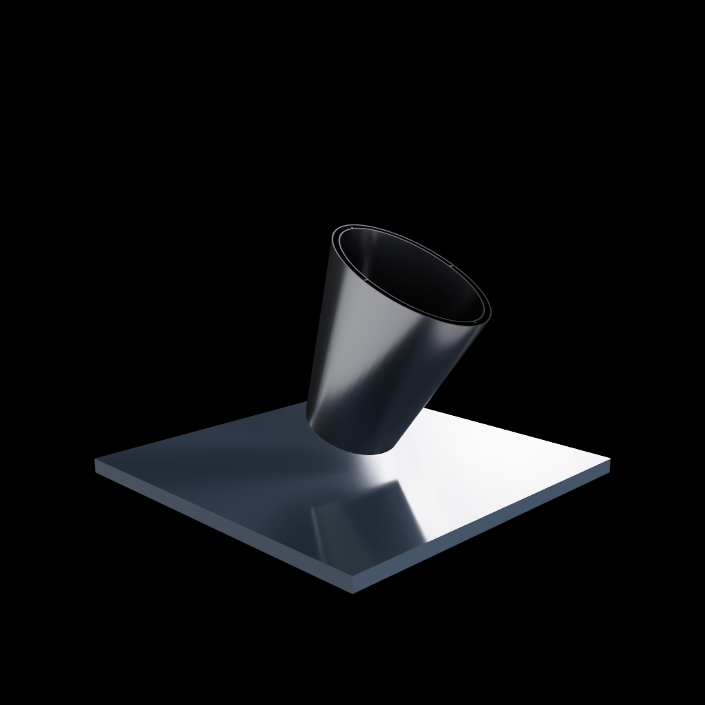
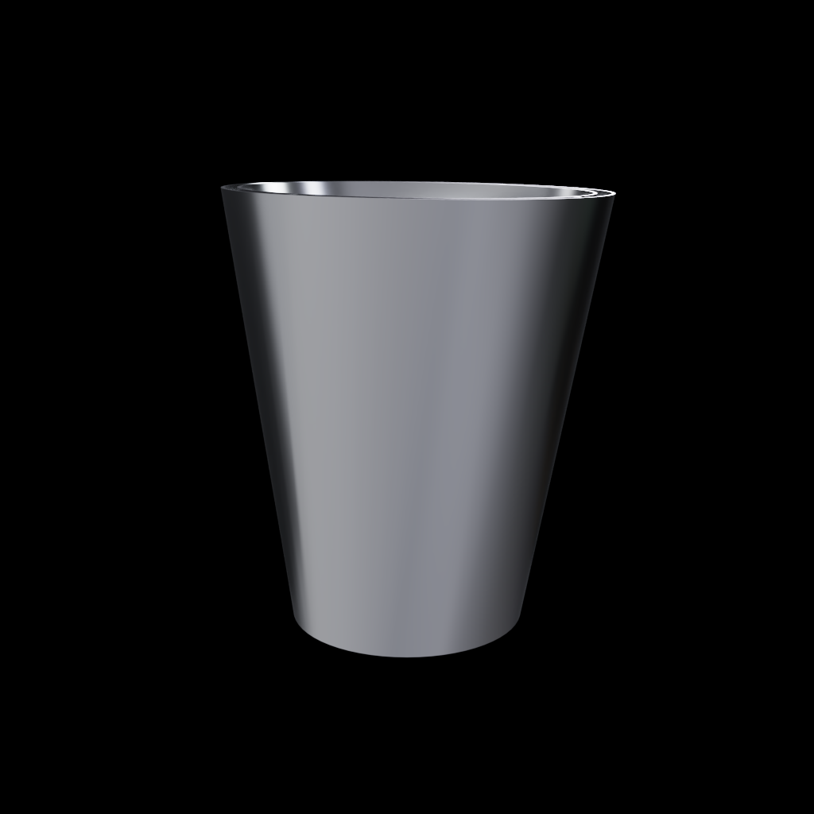

# Embout d'échappement ovale 993 — concept IN625 F0

FVD publie pour son jeu d'embouts inox `FVD11199300` une sortie de
**120 × 85 mm** destinée aux 993 étroites C2, C4 et RS. La fiche ne donne ni
diamètre d'entrée, ni longueur, ni angle, ni épaisseur, ni datum, ni tolérance.
PorscheFanatics recense séparément plusieurs échappements de 993 Turbo dont le
fabricant déclare l'IN625. Ce second fait justifie seulement l'étude matière ;
il ne transfère ni géométrie ni compatibilité à cet embout.

Le F0 est une transition indépendante ronde-vers-ovale de `120 mm`, avec un
conduit interne, une enveloppe externe de `0,8 mm` et huit attaches radiales.
L'entrefer reste ouvert aux deux extrémités, donc sans volume de poudre captif.
La sortie publiée est la seule dimension commerciale conservée ; l'entrée et
toute la construction interne sont des hypothèses révisables.

## Pourquoi l'AM est testée

Le LPBF permettrait de réunir le chemin de gaz, l'écran extérieur, les attaches
et une lame d'air ouverte dans un seul BREP. Cet intérêt de consolidation doit
encore battre un embout inox hydroformé ou soudé sur coût, masse, rugosité,
distorsion et endurance.

Le STEP pèse théoriquement `406,38 g` en IN625. Sans masse publiée du produit
FVD, cette valeur ne valide rien ; elle montre déjà que la double paroi IN625
n'est pas automatiquement une solution légère.

## Criblage analytique

Le rapport recalcule le volume des coques, le débit quatre-temps, la continuité,
Reynolds, une borne Borda-Carnot, la membrane mince, la dilatation, le
rayonnement, la capacité thermique et un premier mode de bande.

Le cas synthétique donne `107,05 m/s` à l'entrée, une borne d'expansion brusque
de `845,43 Pa` et `234,20 W`. Le vrai loft est progressif : ces valeurs ne sont
pas sa perte CFD. La dilatation libre atteint `0,669 mm`; la borne entièrement
bloquée atteint `1 137,48 MPa`, au-dessus des `640 MPa` ambiants de comparaison.
Le mode de bande vaut `44,12 Hz`, mais ne représente pas un mode de coque ou
une excitation véhicule.

## CFD OpenFOAM du conduit F0

Un calcul RANS stationnaire incompressible `k-epsilon` a été exécuté sous
OpenFOAM 13 sur le X1 Linux amd64 avec l'image conteneur verrouillée. Il reprend
le débit volumique chaud synthétique de `0,277017 m³/s`, une densité de
`0,416471 kg/m³` et une viscosité dynamique de `4e-5 Pa·s`. La pression totale
est un proxy calculé avec les vitesses moyennes de section.

| Maille | Tétraèdres | Perte totale proxy | Puissance de débit | Vitesse moyenne sortie |
|---:|---:|---:|---:|---:|
| 6,0 mm | 12 622 | 330,65 Pa | 91,60 W | 43,401 m/s |
| 4,0 mm | 40 186 | 446,70 Pa | 123,74 W | 43,813 m/s |
| 3,0 mm | 91 086 | 502,87 Pa | 139,30 W | 43,807 m/s |

Tous les solveurs satisfont les limites de résidus explicites et les maillages
passent `checkMesh` standard. La variation de perte entre 4 et 3 mm reste de
`11,17 %`, au-dessus du seuil de `10 %`, et le contrôle étendu conserve 83,
124 et 163 cellules à déterminant inférieur à `0,001`. La CFD reste donc
diagnostique. Compressibilité, pulsations, rugosité, courbures amont,
propriétés à chaud et transfert thermique conjugué sont absents.

## Simulation d'impression LPBF

Le STEP a été maillé en `469 950` triangles étanches puis réellement sectionné
sur les `3 702` couches de `40 µm` de l'orientation candidate `roll_y_25`.
L'écran trouve un nouvel îlot, `784` couches avec une région non soutenue, un
maximum de `0,843 mm²` et une enveloppe conservative de supports de
`7,194 cm³`. Aucun vide piégé n'est détecté au pas voxel de `0,5 mm`.

L'épaisseur locale minimale vaut `0,245 mm`, le centile 1 `0,636 mm`, et les
2 000 sondes sont sous `1,5 mm`. Cela ne prouve pas une paroi IN625 capable : la
capabilité `0,8 mm`, la rugosité, la distorsion et l'ovalisation demandent une
revue fournisseur.

La scène Omniverse dédiée place la pièce sur le plateau nominal EOS M 290
`250 × 250 × 325 mm`, dans `roll_y_25`. Elle passe OpenUSD minimum, NVIDIA
Asset Validator, Geometry et Physics. Le recoater animé est un guide : aucune
collision sur forme déformée, trajectoire EOSPRINT ou géométrie de supports
fournisseur n'est disponible.

## Asset Omniverse SimReady

L'asset isolé passe OpenUSD minimum, NVIDIA Asset Validator, Geometry, Physics
et `Prop-Robotics-Neutral 1.0.0`. Il porte la masse CAO `0,40638 kg`, une
densité IN625 de criblage `8 440 kg/m³` et un collider `convexHull` uniquement
pour inspection isolée. Les coefficients de frottement, restitution, la
gravité et l'identité inox proposés sans source par les agents ont été retirés.

L'annotation de préhension a été revue visuellement ; ce n'est pas une
validation de pince. Aucune interface échappement–collier–jupe arrière n'est
présente et aucun test fonctionnel d'assemblage n'a été exécuté.

PhysicsNeMo 2.2.0 a seulement passé un smoke CUDA sur le worker GPU. Aucun
surrogate n'est entraîné : trois maillages CFD non corrélés ne constituent pas
un dataset admissible.

## Verdict des onze étapes

Les étapes 02 et 08 passent pour le **F0 courant**. Les étapes 01 et 03 ne sont
que des criblages. Les étapes 04 à 07, 09 à 11 restent bloquées ou non
démarrées. Cela signifie : CAO calculable, tranchage intégral et asset isolé
conformes ; aucune preuve de procédé complet, d'installation ou d'endurance.

## Gates suivants

1. Définir virtuellement une enveloppe d'interface conservatrice pour
   emmanchement, longueur, angle, collier et jeu avec la jupe arrière.
2. Encadrer débit, température, pression et spectre pulsatoire par des cas
   minimum/nominal/maximal explicitement hypothétiques.
3. Comparer inox formé/soudé, IN625 simple paroi et IN625 double paroi.
4. Converger CFD transitoire, CHT, coque/contact, modal et fatigue thermique.
5. Importer supports, trajectoires et carte IN625 de la route fournisseur ;
   calculer distorsion, retrait et collision recoater.
6. Tester l'assemblage complet dans Omniverse, puis corréler métrologie, CT,
   fuite, vibration, acoustique et cycles thermiques avant tout véhicule.

Le STEP F0 n'est autorisé ni pour fabrication, ni pour montage.
