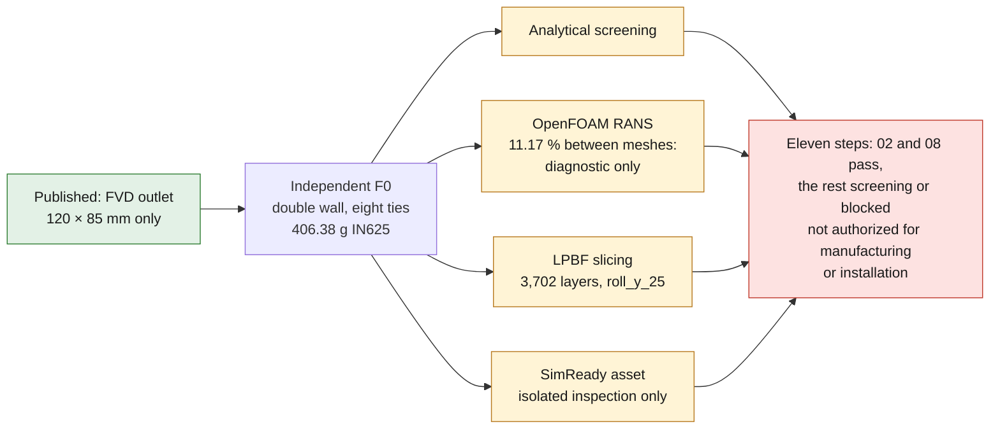

# 993 oval exhaust tip — IN625 F0 concept

FVD publishes, for its stainless tip set `FVD11199300`, an outlet of
**120 × 85 mm** intended for the narrow-body 993 C2, C4 and RS. The listing
gives no inlet diameter, length, angle, thickness, datum or tolerance.
PorscheFanatics separately lists several 993 Turbo exhausts whose manufacturer
declares IN625. This second fact only justifies the material study; it
transfers neither geometry nor compatibility to this tip.

The F0 is an independent round-to-oval transition of `120 mm`, with an inner
duct, an outer `0.8 mm` shell and eight radial ties. The air gap stays open at
both ends, hence no captive powder volume. The published outlet is the only
commercial dimension kept; the inlet and the whole internal construction are
revisable assumptions.

```mermaid
flowchart LR
  S["Published: FVD outlet<br/>120 × 85 mm only"] --> G["Independent F0<br/>double wall, eight ties<br/>406.38 g IN625"]
  G --> A["Analytical screening"]
  G --> C["OpenFOAM RANS<br/>11.17 % between meshes:<br/>diagnostic only"]
  G --> P["LPBF slicing<br/>3,702 layers, roll_y_25"]
  G --> U["SimReady asset<br/>isolated inspection only"]
  A --> V["Eleven steps: 02 and 08 pass,<br/>the rest screening or blocked<br/>not authorized for manufacturing<br/>or installation"]
  C --> V
  P --> V
  U --> V
  class S ok
  class A,C,P,U open
  class V stop
  classDef stop fill:#fde2e1,stroke:#c0392b,color:#1a1a1a;
  classDef ok fill:#e3f1e6,stroke:#2e7d32,color:#1a1a1a;
  classDef open fill:#fff4d6,stroke:#b7791f,color:#1a1a1a;
```

*Diagram: the dossier's own path, restated from the text below. It adds no number or result, and it proves nothing about the physical part.*

## Why AM is being tested

LPBF would allow the gas path, the outer screen, the ties and an open air gap
to be combined into a single BREP. This consolidation benefit must still beat
a hydroformed or welded stainless tip on cost, mass, roughness, distortion and
endurance.

The STEP weighs theoretically `406.38 g` in IN625. Without a published mass for
the FVD product, this value validates nothing; it already shows that the
double-wall IN625 is not automatically a lightweight solution.

## Analytical screening

The report recalculates the shell volume, the four-stroke flow, continuity,
Reynolds, a Borda–Carnot bound, the thin membrane, expansion, radiation,
thermal capacity and a first strip mode.

The synthetic case gives `107.05 m/s` at the inlet, a sudden-expansion bound of
`845.43 Pa` and `234.20 W`. The real loft is progressive: these values are not
its CFD loss. Free expansion reaches `0.669 mm`; the fully blocked bound
reaches `1,137.48 MPa`, above the `640 MPa` room-temperature comparison value.
The strip mode is `44.12 Hz`, but does not represent a shell mode or a vehicle
excitation.

## OpenFOAM CFD of the F0 duct

A steady incompressible `k-epsilon` RANS calculation was run under OpenFOAM 13
on the X1 Linux amd64 with the locked container image. It takes the synthetic
hot volumetric flow of `0.277017 m³/s`, a density of `0.416471 kg/m³` and a
dynamic viscosity of `4e-5 Pa·s`. Total pressure is a proxy computed with the
section-averaged velocities.

| Mesh | Tetrahedra | Total loss proxy | Flow power | Mean outlet velocity |
|---:|---:|---:|---:|---:|
| 6.0 mm | 12,622 | 330.65 Pa | 91.60 W | 43.401 m/s |
| 4.0 mm | 40,186 | 446.70 Pa | 123.74 W | 43.813 m/s |
| 3.0 mm | 91,086 | 502.87 Pa | 139.30 W | 43.807 m/s |

All solvers satisfy the explicit residual limits and the meshes pass standard
`checkMesh`. The loss variation between 4 and 3 mm remains `11.17 %`, above the
`10 %` threshold, and the extended check keeps 83, 124 and 163 cells with a
determinant below `0.001`. The CFD therefore stays diagnostic.
Compressibility, pulsations, roughness, upstream bends, hot properties and
conjugate heat transfer are absent.

## LPBF print simulation

The STEP was meshed into `469,950` watertight triangles, then actually sliced
over the `3,702` layers of `40 µm` of the candidate orientation `roll_y_25`.
The screen finds one new island, `784` layers with an unsupported region, a
maximum of `0.843 mm²` and a conservative support envelope of `7.194 cm³`. No
trapped void is detected at the `0.5 mm` voxel pitch.

The minimum local thickness is `0.245 mm`, the 1st percentile `0.636 mm`, and
all 2,000 probes are below `1.5 mm`. This does not prove a capable IN625 wall:
the `0.8 mm` capability, roughness, distortion and ovality require a supplier
review.

The dedicated Omniverse scene places the part on the nominal EOS M 290 build
plate `250 × 250 × 325 mm`, in `roll_y_25`. It passes OpenUSD minimum, NVIDIA
Asset Validator, Geometry and Physics. The animated recoater is a guide: no
collision on a deformed shape, no EOSPRINT toolpath and no supplier support
geometry is available.

## Omniverse SimReady asset

The isolated asset passes OpenUSD minimum, NVIDIA Asset Validator, Geometry,
Physics and `Prop-Robotics-Neutral 1.0.0`. It carries the CAD mass
`0.40638 kg`, a screening IN625 density of `8,440 kg/m³` and a `convexHull`
collider for isolated inspection only. The friction and restitution
coefficients, the gravity and the stainless identity proposed without a source
by the agents have been removed.

The grasp annotation was reviewed visually; it is not a gripper validation.
No exhaust–clamp–rear valance interface is present and no functional assembly
test has been run.

*The grasp annotation overlaid on the asset's points in four views. It is what was reviewed visually; it is not a gripper validation and says nothing about the part itself.*

PhysicsNeMo 2.2.0 only passed a CUDA smoke test on the GPU worker. No surrogate
model is trained: three uncorrelated CFD meshes do not constitute an
admissible dataset.

## Verdict of the eleven steps

Steps 02 and 08 pass for the **current F0**. Steps 01 and 03 are only
screenings. Steps 04 to 07 and 09 to 11 stay blocked or not started. This
means: computable CAD, full slicing and isolated asset compliant; no proof of a
complete process, installation or endurance.

## Next gates

1. Virtually define a conservative interface envelope for slip fit, length,
   angle, clamp and clearance with the rear valance.
2. Bracket flow, temperature, pressure and pulsation spectrum with explicitly
   hypothetical minimum/nominal/maximum cases.
3. Compare formed/welded stainless, single-wall IN625 and double-wall IN625.
4. Converge transient CFD, CHT, shell/contact, modal and thermal fatigue.
5. Import supports, toolpaths and IN625 map from the supplier route;
   calculate distortion, shrinkage and recoater collision.
6. Test the complete assembly in Omniverse, then correlate metrology, CT,
   leak, vibration, acoustics and thermal cycles before any vehicle.

The F0 STEP is authorized neither for manufacturing nor for installation.

<!-- print-screen:begin -->

## LPBF print simulation

The STEP was tessellated, then sliced over its full height at `40 µm`, on the EOS M 290 route of the candidate material. Orientation chosen by the automatic rule: `roll_y_25`.

| quantity | value |
|---|---:|
| layers | 3,702 |
| build height | 148.06 mm |
| layers with an unsupported region | 784 |
| support proxy | 7,183.26 mm³ |
| local thickness p01 | 0.674 mm |
| trapped powder at 1.00 mm | 0.00 mm³ |

This screening is neither an EOSPRINT project, nor a distortion calculation, nor a recoater check. **Printing remains prohibited.**

<!-- print-screen:end -->
