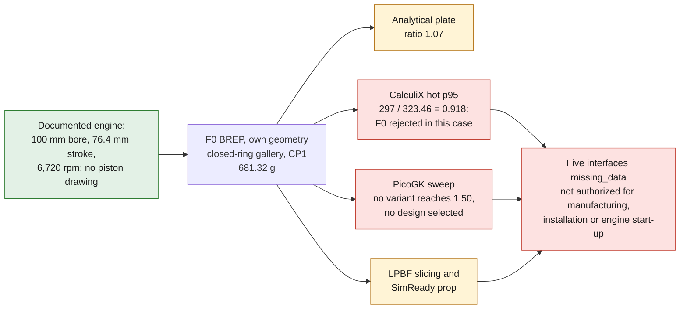
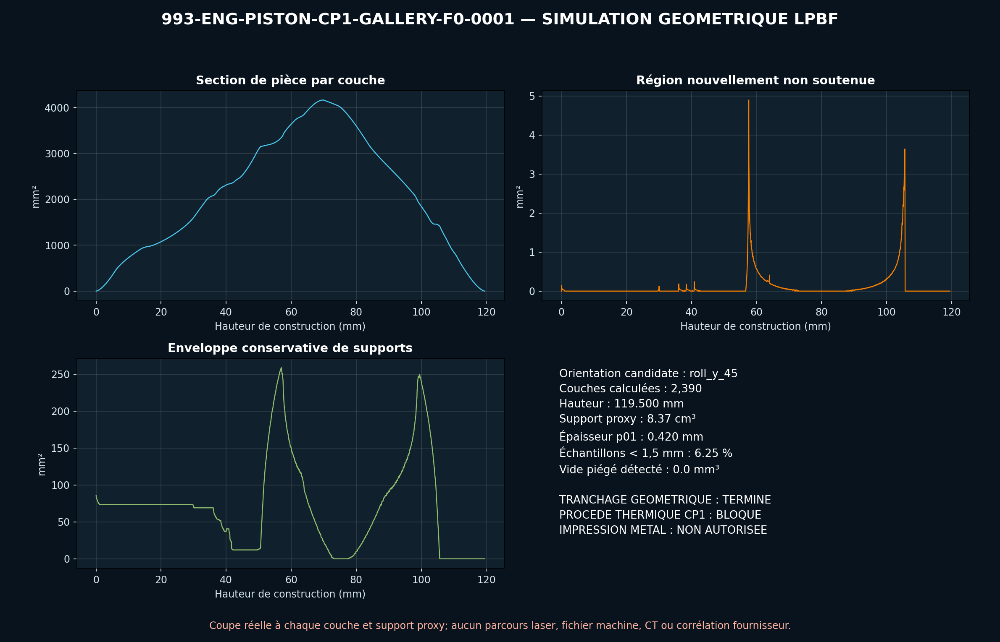
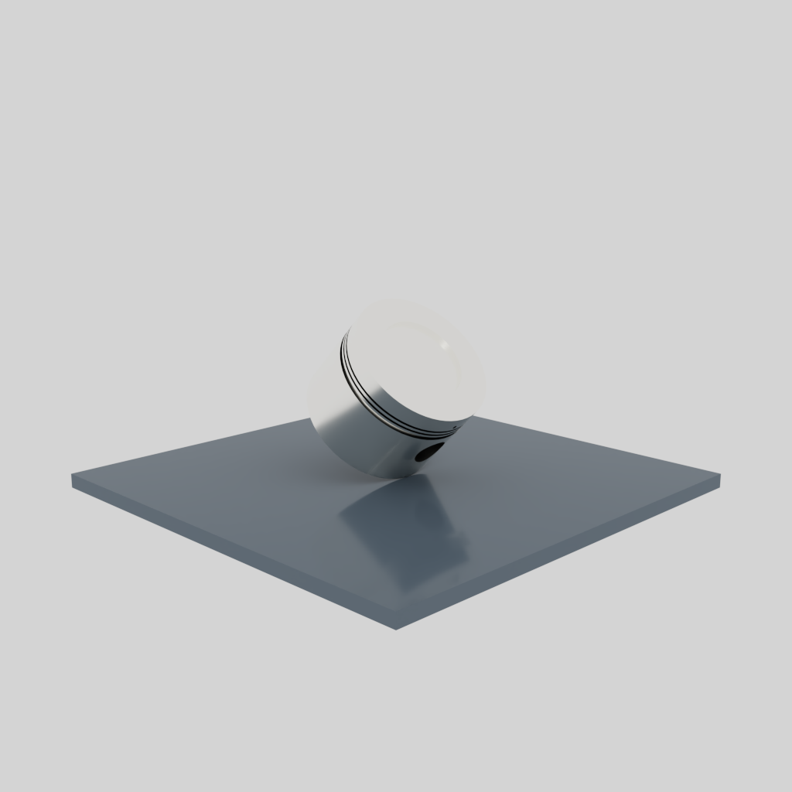
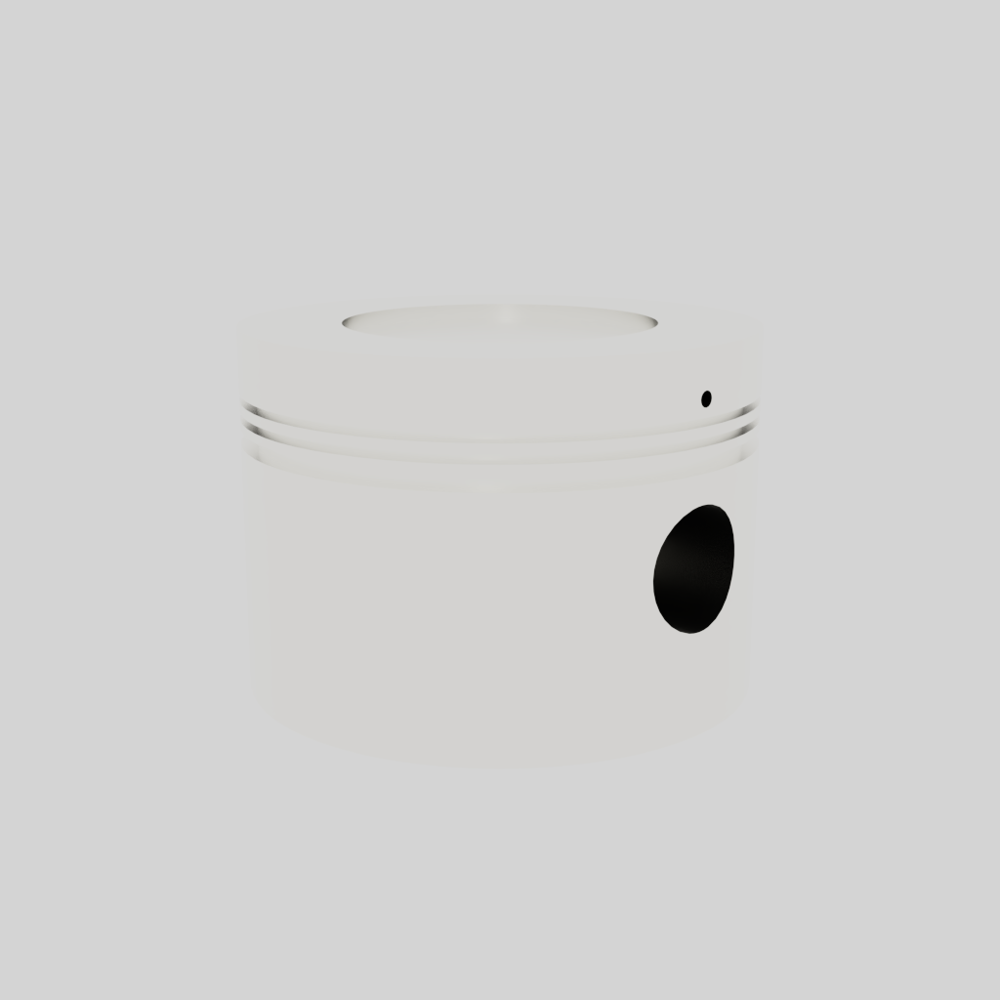

# M64/60 piston with cooling gallery — CP1 F0 concept

The M64/60 is documented with a `100 mm` bore, a `76.4 mm` stroke and a
`6,720 ± 20 rpm` rev limiter. These values define the engine, not the piston
geometry. PorscheFanatics cross-references the piston/cylinder sets of the 993
family and the Porsche additive precedent, without providing a 993 piston
drawing.

Porsche, MAHLE and TRUMPF produced a laser-fused piston for a modern 911 GT2 RS,
announced as `10 %` lighter than the forged part, optimized for the loads and
fitted with a closed gallery under the crown that the conventional methods
considered could not produce. Porsche also announces `200 h` of engine testing.
This is a precedent of method, not a validation transferable to the 993.

The record
[`TWIN-993-M64-60-PISTON-GALLERY-F0`](../../catalog/twins/twin-993-m64-60-piston-gallery-f0.json)
now links the CAD to the five indispensable interfaces: cylinder, rings,
pin–connecting rod, chamber–valves and oil jet–gallery. They all remain
`missing_data`: this status is deliberate and prevents confusing an F0 envelope
with a fitted M64/60 piston.



*Diagram: the dossier's own path, restated from the text below. It adds no number or result, and it proves nothing about the physical part.*

## Why additive makes sense here

The gallery under the crown is the function that conventional machining cannot
produce directly. The F0 uses a toroidal ring with a `34 mm` mean radius and a
`7 mm` hydraulic diameter. Two temporary radial ports provide depowdering; a
later process would have to close them, then verify the gallery by CT and proof
test. The choice must stay compared with a forged piston and with a solution
using a cast or drilled gallery.

The candidate material is Aheadd CP1 on the Velo3D Sapphire `50 µm` route,
followed by `400 °C for 4 h`. The data sheet publishes `2.67 g/cm³`, a machined
vertical minimum of `297 MPa` yield strength and `331 MPa` tensile strength.
Constellium publishes `187 W/(m·K)` at room temperature and qualitative
stability toward `250–300 °C`. These values do not form a hot or fatigue piston
map.

The re-read STEP contains a valid BREP solid in a synthetic envelope of
`99 × 99 × 70 mm`. Its volume is `255,175.45 mm³` and its theoretical mass
`681.32 g`. Diameter, height, skirt, cavity, bowl, pin, bosses, grooves and
gallery are entirely specific to the F0; no Porsche or MAHLE surface is copied.

## Screenings run

The regression case uses a synthetic cylinder pressure of `12 MPa`, a `127 mm`
connecting rod, `140 g` of pin and rings, `2 l/min` of oil, `5 kW` removed by
the gallery, `+200 K` and `100 h` at `6,720 rpm`.

With the CAD mass, the equations give `94.25 kN` of gas force, `20.21 kN` of
inertia and a pin load bound of `114.46 kN`. The clamped circular plate model
gives `277.57 MPa` and `0.486 mm` at the center for an analytical ligament of
`5.5 mm`. The ratio between the room-temperature CP1 minimum and this stress is
only `1.07`: the F0 has no demonstrated margin when hot.

At `6,720 rpm`, the published stroke gives a mean piston speed of
`17.1136 m/s`, a synthetic TDC acceleration of `2,509.25 g` and a hypothetical
rod/crank ratio of `3.3246`. The documentary bore and stroke return
`600.044 cm³` per cylinder and `3,600.265 cm³` for six cylinders; this
consistency check provides no piston dimension.

The projected pin pressure is `124.41 MPa`. The laminar gallery model gives
Reynolds `515`, `0.866 m/s` and `1.21 kPa` of linear loss. At `5 kW`, the
hypothetical flow would rise `88.24 K`. 1D conduction provides an upper bound
of `35.91 kW`, the free expansion of the diameter `0.455 mm` and the `100 h`
cycle `40.32 million` revolutions, i.e. `20.16 million` combustions per cylinder
for a four-stroke. `200 h` at maximum speed would mathematically correspond to
`80.64 million` revolutions; this is not the Porsche bench profile, which is
unpublished.

These numbers are reproducible mathematical checks, not an FEA, a CHT, a
multiphase CFD or a life prediction.

## CalculiX thermomechanical screening run

The sound STEP master, and not the non-manifold PicoGK STLs, was meshed in
C3D10 quadratic tetrahedra at `5`, `3.5` and `2.5 mm`. CalculiX 2.21 ran, for
each mesh, a cold static analysis and a sequential steady-state
temperature–displacement analysis, i.e. six real solves on the X1.

The hot case applies the synthetic axial pressure-plus-inertia envelope, a
total of `5 kW` distributed over the outer crown nodes, an ideal gallery at
`120 °C` and the skirt at `160 °C`. The pin bore is fully fixed: this bound
deliberately over-constrains expansion. It replaces neither pin–boss contact,
nor combustion CHT, nor the oil jet.

| Mesh | Nodes | C3D10 | Cold p95 | Hot p95 | Hot Tmax |
|---:|---:|---:|---:|---:|---:|
| 5.0 mm | 28,208 | 14,469 | 116.88 MPa | 333.87 MPa | 193.77 °C |
| 3.5 mm | 61,975 | 33,836 | 110.73 MPa | 326.31 MPa | 192.41 °C |
| 2.5 mm | 139,924 | 81,861 | 112.17 MPa | 323.46 MPa | 187.04 °C |

Between the two finest meshes, the cold p95 varies by `1.28 %`, the hot p95 by
`0.88 %` and the maximum temperature by `2.87 %`. The maximum hot displacement
on the fine mesh is `0.262 mm`. The raw stress maxima reach `379.11 MPa` cold
and `685.97 MPa` hot; they remain dominated by the ideal fixation and are kept,
not masked.

Even the hot p95 gives only `297 / 323.46 = 0.918` against the published
room-temperature CP1 limit. Since this limit is not a hot allowable, it cannot
validate the design; the exceedance is, however, enough to reject this F0 in
this conservative case. The `20.16 million` combustions per cylinder over
`100 h` are counted, but no life is calculated without a qualified hot CP1 S-N
curve.

The report, the hashes of the raw outputs and its independent verifier are in
[`evidence/calculix-f0`](../../twins/993-m64-60-piston-gallery-f0/evidence/calculix-f0/).

## PicoGK optimization screening run

The requested objective is now formalized as follows: minimize mass and crown
temperature, under constraints of hot static strength, fatigue, stiffness,
expansion, oil flow, depowdering and machining. "Very strong" is an
eliminating constraint; a lighter variant does not win if it weakens it.

The Porsche photographs show dense material kept around the grooves, the crown
edge and the pin, with an open internal structure oriented along the load
paths. The IAV sections provided separately show a triangulated skirt–crown
lattice and distinct circuits near the bowl and the first groove. They concern
a heavy diesel piston of about `130 mm`, with other materials and channels
partially filled with sodium: only the lattice architecture inspires the PicoGK
variables, never its dimensions or its thermal limits.

A first real sweep was run offline on the X1 with PicoGK 2.3.0 and the native
runtime `picogk.26.2`, with `0.5 mm` voxels. Six F0 geometric variants combine
open skirt pockets, a `7 to 9 mm` gallery and a triangulated skirt–crown
lattice with pin reinforcements. PicoGK served as a voxel/Boolean kernel and
mesh generator; it ran neither a structural nor a thermal calculation.

| Variant | CP1 voxel mass | Deviation from BREP mass | Relative wetted area | Relative laminar loss | Room-temperature plate margin |
|---|---:|---:|---:|---:|---:|
| P0 voxelized reference | 687.37 g | +0.89 % | 1.000 | 1.000 | 1.070 |
| P1 six pockets | 683.37 g | +0.30 % | 1.000 | 1.000 | 1.070 |
| P2 eight pockets | 680.96 g | -0.05 % | 1.000 | 1.000 | 1.070 |
| P3 8 mm gallery + lattice | 683.39 g | +0.30 % | 1.143 | 0.586 | 0.884 |
| P4 8.5 mm gallery + lattice | 681.21 g | -0.02 % | 1.214 | 0.460 | 0.798 |
| P5 maximum lightening of the sweep | 670.44 g | -1.60 % | 1.286 | 0.366 | 0.716 |

The provisional required margin was `1.50`; no variant passes it. The PicoGK
reinforcements are deliberately not credited by the plate equation: only a 3D
thermomechanical FEA can quantify their contribution. The downstream check
also reveals non-manifold edges in all six PicoGK STLs, despite zero open
edges. These raw outputs therefore stay in quarantine: none is rebuilt as
BREP, sent to LPBF slicing or promoted into Omniverse.

The result is a **PicoGK screening run with no design selected**, not a
validated optimization. The best raw lightening observed, `1.60 %`, is a
research candidate that fails the mechanical criterion and the mesh integrity
gate. See [`evidence/picogk-f0`](../../twins/993-m64-60-piston-gallery-f0/evidence/picogk-f0/).

## Print simulation and Omniverse run

The STEP was meshed into `273,988` watertight triangles, then actually sliced
over the `2,390` layers of `50 µm` of the candidate orientation `roll_y_45`.
The screen finds four new islands, `759` layers with an unsupported region, a
maximum of `4.898 mm²` and a conservative support envelope of `8.365 cm³`. No
trapped void is detected at the `1 mm` voxel pitch, which does not replace a
CT. The local p01 thickness is `0.420 mm` over 2,000 probes and `6.25 %` of the
probes are below `1.5 mm`: the design must therefore still be reviewed.

The same master passes OpenUSD minimum, NVIDIA Asset Validator, Geometry,
Physics and the SimReady profile `Prop-Robotics-Neutral 1.0.0`. The OVRTX
render is visible in the evidence folder. It is an isolated inspection prop;
the engine interfaces are absent.

A separate LPBF preparation scene places the piston in the `roll_y_45`
orientation on a nominal Sapphire `Ø315 mm` build plate, checks the envelope
and passes OpenUSD minimum, NVIDIA Asset Validator, Geometry and Physics. The
piston is present in the inspected flattened render. The animated recoater is
only a guide: distortion, supplier supports and recoater collision stay false
in the validation gates.

See [the pipeline and the detailed verdict](../AM_VALIDATION_PIPELINE.md),
[the LPBF results](../../twins/993-m64-60-piston-gallery-f0/evidence/lpbf-f0/)
and [the Omniverse summary](../../twins/993-m64-60-piston-gallery-f0/evidence/simready-f0/).

<table>
<tr>
<td width="33%"></td>
<td width="33%"></td>
<td width="33%"></td>
</tr>
<tr>
<td><em>Slicing screen, <code>roll_y_45</code>, 50 µm (labels in French).</em></td>
<td><em>LPBF preparation scene on a nominal Sapphire plate.</em></td>
<td><em>OVRTX render of the isolated inspection prop.</em></td>
</tr>
</table>

*These three images show the F0 geometry as sliced and rendered. None carries a distortion, a supplier support, a recoater collision or an engine interface, and none is evidence of how a printed piston would behave.*

## Software reproduction

The build123d master is run in the `linux/amd64` CAD image pinned by digest:

```bash
docker run --rm --platform linux/amd64 -v "$PWD:/work" -w /work \
  ghcr.io/cluster2600/3dprinting993-cad-author-f28@sha256:18dbfa559306a31c909480695acf0e89a9bc904c83d280065c1d9d29036fec57 \
  python parts/993-eng-piston-cp1-gallery-f0-0001/source/piston.py \
  --out parts/993-eng-piston-cp1-gallery-f0-0001/derived/piston_cp1_gallery_f0.step \
  --report parts/993-eng-piston-cp1-gallery-f0-0001/evidence/engineering-screen.json
```

## Next gates

1. Replace the F0 loads with an approved virtual domain with conservative
   envelopes, then set hot CP1 allowables and a crown temperature target; no
   additional data is invented.
2. Measure the piston, pin, rings, cylinder, connecting rod and clearances of
   the exact M64/60; record skirt profile, ovality, taper, compression height
   and masses.
3. Measure transient cylinder pressure, temperatures, fluxes, oil jet,
   capture, drainage, blow-by, knock, overspeed and duty cycle.
4. Rebuild the surfaces and tolerances, then size crown, bosses, grooves,
   skirt, gallery and ports with machining keep-outs.
5. Rerun PicoGK only within the authorized design domain, rebuild each
   retained candidate as BREP and require a converged manifold mesh.
6. Replace the acquired sequential linear screening with a nonlinear 3D FEA
   with contacts and transient fields, then correlate multibody,
   fatigue/creep and CFD/VOF of the oil under piston acceleration.
7. Qualify hot CP1, orientation, supports, distortion, heat treatment, HIP,
   port closure, CT, machining, coating and coupons.
8. Perform proof test, thermal cycles, full-scale fatigue, then `200 h` of
   instrumented engine running before any vehicle decision.

PhysicsNeMo awaits a correlated dataset with train, holdout and
out-of-distribution cases. The SimReady asset level is achieved, but the
Omniverse functional test still awaits the measured
piston–rings–pin–connecting rod–cylinder–valves interfaces. This F0 STEP is
authorized neither for manufacturing, nor for installation, nor for engine
start-up.
