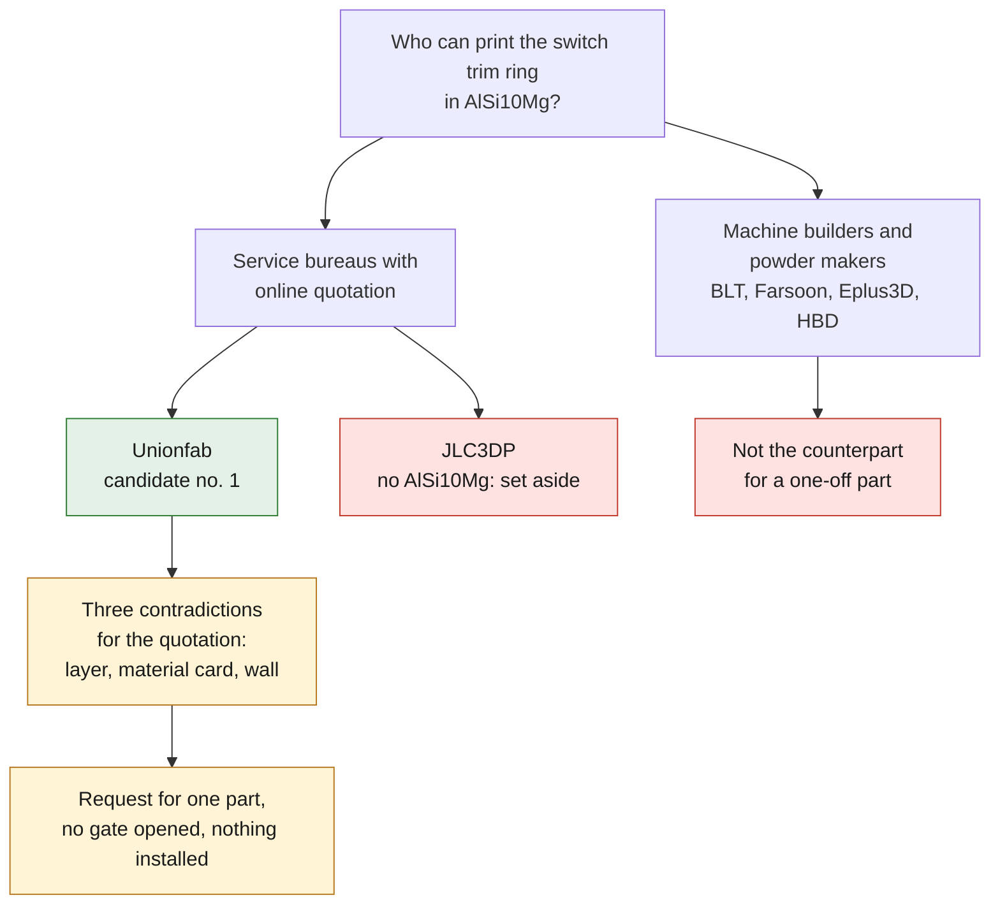

# LPBF sourcing in China — first pass

Purpose: find who can actually print
[`993-INT-SWITCH-TRIM-RING-F1-0001`](993_SWITCH_TRIM_RING_F1.md) in AlSi10Mg,
and answer the seven closed gates of step 04. This document recommends no
provider. It records what each one **publishes**, what it does not publish,
and the contradictions to resolve before paying for anything.

Every claim below is backed by a source record in `catalog/sources/`. A
commercial page is a level B source: the supplier is talking about itself, and
nothing is verified.

*Diagram: the page's own sort of candidates, restated from the text below. It recommends no provider and verifies nothing that the suppliers publish.*

## The sort that matters: service bureau or machine vendor

The search turns up two families that must not be confused.

**Machine builders and powder makers** — BLT (Xi'an Bright Laser Technologies),
Farsoon, Eplus3D, HBD. They sell machines and powder. BLT and Farsoon equip the
bureaus, Falcontech operates a factory of Farsoon machines. They publish
material cards useful for comparison, but they are not the counterparts for a
single 6 g part.

**Service bureaus with online quotation** — Unionfab, JLC3DP, and the many
intermediaries following the same model. This is where a one-off part is
handled.

## Candidates retained and set aside

| provider | AlSi10Mg | status | reason |
|---|---|---|---|
| Unionfab | yes | **candidate no. 1** | the only one in the batch to publish machine fleet, tolerances, minimum wall, lead time and certifications |
| JLC3DP | **no** | set aside for this part | metal catalogue limited to TC4, 316L and BJ-316L |
| Eplus3D | yes (powder) | not applicable | machine builder, no identified service bureau |
| BLT, Farsoon, Falcontech | yes | not approached | industrial scale, no point for a one-off part |

### Unionfab — what is published

A fleet of more than a hundred BLT, Farsoon, EOS and UnionTech machines, SLM
systems with four and six lasers. Build volume up to 800 × 800 × 700 mm.
Minimum wall **0.5 mm**. Tolerance ±0.2 mm below 100 mm. SLM lead time **5 to
7 working days**. **No minimum order**. ISO 9001, ISO 14001, ISO 13485 and
IATF 16949. CNC machining, polishing, heat treatment and anodizing as
post-processing. Inspection by CMM and 3D scanner.

On its AlSi10Mg sheet: Rp0.2 180 MPa, Rm 300 MPa, A ≥ 8 %, 2.67 g/cm³,
Brinell 120, Ra 12 to 25 µm, minimum order 1 part.

### Three contradictions to take to the quotation

**1. Layer thickness, again.** Step 04 had already found that the screening
sliced at 50 µm a route published at 30 µm. Unionfab adds two more: its service
page announces **0.035 mm**, and its own AlSi10Mg sheet announces **0.15 mm**.
The latter is not a plausible LPBF thickness for this alloy. Three values on
the same subject, two of them from the same supplier: the first question of
the quotation is therefore "at what thickness, on which machine".

**2. The material card changes with the provider.** Rp0.2 180 MPa at Unionfab
against 233 MPa vertical on the EOS coupons of the repository's card, Rm 300
against a 461 MPa minimum. This is not an error by one or the other: these are
two different routes. That is exactly what gate 04 asserts, and the
repository's process card will have to be replaced by that of the retained
provider, not supplemented by it.

**3. The wall.** Unionfab announces a 0.5 mm minimum wall, JLC3DP recommends
1.5 mm for SLM. The ring has a first percentile of local thickness of
**0.833 mm**, and **11.45 %** of its screening points below 1.5 mm. It passes
the rule of the former, not the recommendation of the latter. The question to
the supplier is therefore whether its minimum wall is a process limit or a
dimensional guarantee limit.

### What none of them publishes

None of the four publishes a heat treatment specification, CT scanning,
material certificate content, powder lot traceability or machining allowance.
These are five of the seven closed gates of step 04: desk research will not
open them, only a contractual exchange will.

## Concrete next step

Send the dossier
[`supplier-rfq.md`](../../twins/993-switch-trim-ring-f1/evidence/route-f1/993-int-switch-trim-ring-f1-0001-supplier-rfq.md)
and the STEP to Unionfab, adding the three contradictions above as questions.
The expected quotation covers **one** part; its value is not the ring, it is
learning what a Chinese provider agrees to put in writing when asked. That
answer will decide whether the same chain can carry more serious parts.

Framing reminder: the part is classified `non_critical`, no manufacturing gate
is open, and nothing that would come out of this quotation may be installed on
a vehicle before an original part and its housing have been measured.

## Sources

- `SRC-UNIONFAB-METAL-3D-PRINTING-SERVICE`
- `SRC-UNIONFAB-ALSI10MG-SLM-MATERIAL`
- `SRC-JLC3DP-SLM-METAL-SERVICE`
- `SRC-EPLUS3D-ALSI10MG-MATERIAL`
