# 993 switch trim ring — F1 twin

This non-critical aluminum ring is the first metal pilot of the 993 flow. The
commercial listing provides four dimensions: outer Ø 30.5 mm, depth 10.5 mm,
front inner Ø 23 mm and rear inner Ø 28 mm. The `build123d` master rebuilds a
ring with a conical bore and compares its OCCT volume with the analytical
volume of a cylinder minus a truncated cone.

The result is deliberately at the **F1 / concept** level. The inner cone is an
interpretation, not a measurement. The tolerances, radii, dashboard opening,
surface finish and aluminum grade remain unknown. The STEP must therefore not
be sent to manufacturing or installed on a vehicle.

```mermaid
flowchart LR
  S["Commercial listing<br/>Ø30.5 × 10.5 mm,<br/>bore 23 → 28 mm"] --> G["F1 build123d ring<br/>conical bore is an interpretation"]
  G --> S2["Step 02 BREP and mesh<br/>passed"]
  S2 --> S3["Step 03 slicing<br/>completed_screening, 580 layers"]
  S3 --> S4["Step 04 route<br/>blocked_missing_input,<br/>7 of 11 gates closed"]
  S4 --> T["Change of route<br/>turned EN AW-6063 T6, CNC"]
  T --> V["Ø30.5 still not toleranced<br/>not for manufacturing<br/>or a vehicle"]
  class S2 ok
  class S3,T open
  class S4,V stop
  classDef stop fill:#fde2e1,stroke:#c0392b,color:#1a1a1a;
  classDef ok fill:#e3f1e6,stroke:#2e7d32,color:#1a1a1a;
  classDef open fill:#fff4d6,stroke:#b7791f,color:#1a1a1a;
```



*Diagram: the dossier's own path, restated from the text below. It adds no number or result, and it proves nothing about the physical part.*

## Calculations run

- front radial wall: `(30.5 - 23) / 2`;
- rear radial wall: `(30.5 - 28) / 2`;
- volume: outer cylinder minus inner truncated cone;
- indicative mass: volume multiplied by 2.67 g/cm³, an AlSi10Mg screening
  density explicitly not attributed to the original part;
- thermal growth and clamping pressure left blocked until the OEM opening is
  measured and a qualified material map is selected.

On first reading the geometry is printable by LPBF, but its axisymmetric shape
probably makes CNC turning more rational. The pilot serves to validate the
digital chain; the industrial choice stays open.

## Reproduction

```sh
python3 parts/993-int-switch-trim-ring-f1-0001/source/switch_trim_ring.py \
  --report parts/993-int-switch-trim-ring-f1-0001/evidence/geometry-screen.json
```

The STEP export requires the repository's locked CAD image. PhysicsNeMo and a
Vast GPU are not required here: there is neither a complex field nor training
data justifying a surrogate model. The deterministic formulas and OCCT are the
authority for this first check.

## Steps 02 and 03 of the AM pipeline — 2026-09-09

The ring is the first of the 21 parts tracked by
[`am-validation-policy.json`](../../catalog/manufacturing/am-validation-policy.json)
with no step filled in to be carried through geometric screening. It was
chosen because it is the only `non_critical` part of the batch, and because it
already has a parametric master and a re-read STEP.

**Step 02 — BREP and mesh integrity: `passed`.** The master now also exports
an STL analysis surface, with a declared chord tolerance of 0.03 mm and an
angular tolerance of 0.08 rad. The mesh is **watertight**, a single component,
2,054 triangles. Its volume is 2,294.6 mm³ against 2,291.9 mm³ for the BREP,
i.e. 0.12 % — the expected deviation from faceting curved surfaces at this
tolerance. Master, STEP and STL are linked by SHA-256 in the report.

**Step 03 — full slicing and supports: `completed_screening`.**

| quantity | value |
|---|---|
| selected orientation | `roll_y_45` |
| layers actually sliced | **580** at 0.05 mm |
| build height | 29.0 mm |
| empty internal layers | 0 |
| new islands | **0** |
| layers with unsupported area | 10 |
| maximum unsupported area | **0.079 mm²** |
| trapped powder volume | none detected at the screening pitch |
| median wall thickness | 2.06 mm |

Zero new islands means that no layer shows material detached from the rest: in
this orientation, the part builds without internal support. The worst-case
0.079 mm² of unsupported area is an order of magnitude below what a support
would have to carry.

**Why this is not `passed`.** The orientation has not been reviewed by an
engineer, the supplier supports do not exist, and the recoater screening stays
closed for lack of a distortion field and blade clearance. The report's process
gates are all closed, and a test checks this explicitly:
`tests/test_993_switch_trim_ring_lpbf_f1.py` fails if any of them opened
without a coupon or a machine file.


*Step 03 slicing screen at 50 µm, 580 layers (labels in French). It shows the geometry layer by layer; it is not a machine file, and the ring has since moved to a turned route.*

**Reproduction** — the chain requires `numpy`, `matplotlib`, `trimesh`, `shapely`
and `rtree`:

```bash
python3 parts/993-int-switch-trim-ring-f1-0001/source/switch_trim_ring.py \
  --out parts/993-int-switch-trim-ring-f1-0001/derived/switch_trim_ring_f1.step \
  --surface parts/993-int-switch-trim-ring-f1-0001/derived/switch_trim_ring_f1.stl
python3 scripts/run_metal_am_geometry_screen.py \
  --part-id 993-INT-SWITCH-TRIM-RING-F1-0001 \
  --master parts/993-int-switch-trim-ring-f1-0001/derived/switch_trim_ring_f1.step \
  --master-sha256 <sha256-step> \
  --surface parts/993-int-switch-trim-ring-f1-0001/derived/switch_trim_ring_f1.stl \
  --surface-sha256 <sha256-stl> \
  --machine-card catalog/manufacturing/machines/eos-m290.json \
  --material "EOS AlSi10Mg" \
  --expected-envelope-mm 30.5 30.5 10.5 \
  --output twins/993-switch-trim-ring-f1/evidence/lpbf-f1
```

## Step 04 of the AM pipeline — 2026-09-10

Steps 02 and 03 said that a geometry can be sliced. They did not say that a
**route** exists: an alloy, a powder, a machine, an orientation, a layer
thickness, treatments and temperature-dependent properties that belong to the
same qualified process. Step 04 compares the geometric report with the two
catalogue cards —
[`machines/eos-m290.json`](../../catalog/manufacturing/machines/eos-m290.json) and
[`processes/eos-m290-alsi10mg-30um.json`](../../catalog/manufacturing/processes/eos-m290-alsi10mg-30um.json)
— and fails closed on each discrepancy.

**Status: `blocked_missing_input`. Seven gates out of eleven stay closed.**

| gate | result |
|---|---|
| consistent machine identity | open |
| consistent alloy identity | open |
| consistent layer thickness | **closed** |
| screened wall above the process minimum | open |
| bare part within the machine envelope | open |
| orientation reviewed by an engineer | closed |
| temperature-calibrated constitutive map | closed |
| heat treatment defined | closed |
| machining allowances defined | closed |
| part allowables derived from coupons | closed |
| powder lot traceability contracted | closed |

**The most useful gate is an inconsistency internal to the repository.** Step
03 sliced the ring at **50 µm**, whereas the only AlSi10Mg route published on
this machine is at **30 µm**. The 580 layers of step 03 would become **967** on
the qualified route, and above all the published coupon properties do not
carry over from one thickness to the other. The geometric screening was right;
what was missing was its link to a real route, and that is exactly what step
04 is meant to find.

The rest depends on the supplier, not on calculation: the process card
publishes no heat treatment, no machining allowance and no part allowables,
and no powder lot is committed.

What the step produces concretely is a **request-for-quotation dossier** that
can be signed by digest —
[`supplier-rfq.md`](../../twins/993-switch-trim-ring-f1/evidence/route-f1/993-int-switch-trim-ring-f1-0001-supplier-rfq.md)
— listing what is supplied, the candidate route, the seven questions to the
supplier and the deliverables expected with the price. It also asks for the
costed comparison with CNC turning of the same geometry, because the shape is
axisymmetric and nothing yet proves the benefit of LPBF here.

Orders of magnitude in the dossier, all from screening: build height 29.0 mm,
mass 6.12 g, exposure time 0.13 h at the published rate of 5.1 mm³/s —
without recoating, heating, inerting or build plate change.

**Reproduction and guard:**

```bash
make route-trim-ring        # writes the card and the quotation dossier
make route-trim-ring-check  # fails if the published files have gone stale
python3 -m unittest tests.test_993_switch_trim_ring_route_f1
```

The test fails if a gate opened without a coupon, without heat treatment and
without a powder lot, and if the layer thickness inconsistency were smoothed
over.

## Change of route — September 11, 2026

Step 04 had compared the part with a real LPBF route. The next question — "are
we sure it is the right material?" — showed that we were not: AlSi10Mg had
never been chosen, it was the only grade documented in the repository. See
[decision 0005](../decisions/0005-alsi10mg-nest-pas-un-choix.md) and
[decision 0006](../decisions/0006-bague-tournee-6063-t6.md).

The part is now **turned in EN AW-6063 T6**, bright anodized. Its
`preferred_process` is `CNC`. LPBF steps 02, 03 and 04 stay published: they
state what an additive screening can and cannot say, and they served to find
the layer thickness inconsistency.

The turning route has five closed gates instead of seven, but **the two that
matter have not moved**: the Ø30.5 mm is still not toleranced and comes from a
sales page, and the master still has sharp edges. Changing process does not
measure the housing.

The proposed way out is a series of three bare rings at Ø30.40, Ø30.50 and
Ø30.60 mm: on a turned part, the next two cost a fraction of the first.

```bash
make turning-trim-ring
make turning-trim-ring-check
python3 -m unittest tests.test_993_switch_trim_ring_turning_f1
```
