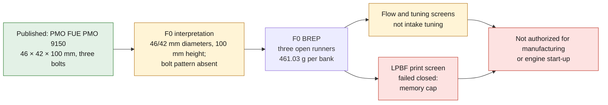

# 993 three-runner intake manifold — AlSi10Mg F0 concept

PorscheFanatics and Patrick Motorsports cross-check the PMO set `FUE PMO 9150`,
announced as **46 × 42 × 100 mm**, three bolts, two parts and raw aluminum
finish for Motronic conversions with a 964/993 3.6–3.8 L engine. No drawing
defines the dimension chain, the center distances, the ports or the fasteners.

The F0 provisionally interprets `46 mm` and `42 mm` as upper and lower inner
diameters, and `100 mm` as the height. It joins three `2 mm` conical runners,
slightly splayed in space, between two common flanges. The center distances
and the flanges are synthetic; the three-bolt pattern is deliberately absent.

*Diagram: the dossier's own path, restated from the text below. It adds no number or result, and it proves nothing about the physical part.*

## Why AM is being tested

LPBF would allow the three axes, sections and lengths to be customized
independently, then joined to the flanges in a single BREP. This advantage
must still beat the cast, machined or assembled aluminum manifold on cost,
mass, roughness, flatness, cleanliness and endurance.

The STEP weighs theoretically `461.03 g` per bank and `922.07 g` for the pair.
Since no commercial mass is published, this result does not validate the PMO
product.

## Screenings run

The report recalculates:

- truncated cone volumes, flange volume and mass `rho V`;
- four-stroke flow at `3.6 L`, `6,800 rpm`, volumetric efficiency `0.95` and
  six runners;
- continuity, Reynolds, Mach, kinetic pressure change and minor loss;
- firing frequency and quarter-wave tuning of the runner alone;
- membrane stress `p r/t`, expansion `alpha L delta_T`, blocked bound
  `E alpha delta_T` and thermal capacity;
- single OCCT BREP, three open channels, envelope and STEP re-read.

The synthetic case gives `19.44 m/s` at the top, `23.31 m/s` at the bottom,
Reynolds `59,782`, Mach `0.065` and `15.76 Pa` of loss with `K=0.05`. The
firing frequency is `340 Hz`, whereas the quarter-wave of the `100 mm` runner
is `896.44 Hz`; a first tuning at 340 Hz would require `263.66 mm`. This
comparison is not intake tuning, because the complete runner, the plenum, the
valves and the reflections are not modeled.

## Next gates

1. Scan a PMO part and measure cylinder head ports, throttles, center
   distances, flanges, bolts, gaskets, angles, roughness and tolerances.
2. Measure flow, pulsed pressure, temperature, valve timing and volumetric
   efficiency of the selected M64.
3. Compare cast/CNC/assembled and LPBF on mass, cost, loss, runner equality,
   distortion and cleanliness.
4. Run transient compressible CFD and CHT, then modal, fatigue, thermal cycles
   and backfire with qualified material maps.
5. Define orientation, supports and machining allowances; inspect by
   metrology, CT, dye penetrant, leak test and flow bench.
6. Correlate on an engine dyno before any vehicle installation.

PhysicsNeMo will wait for a set of correlated CFD/CHT/structure cases and
uncertainty gates. SimReady will wait for the measured interfaces and the
material map. The F0 STEP is not authorized for manufacturing or engine
start-up.

<!-- print-screen:begin -->

## LPBF print simulation

The simulation was run and **failed closed**: `failed_memory_cap` container killed at the 10g memory cap. No result is therefore published for this part, and no image is made up in its place.

<!-- print-screen:end -->
