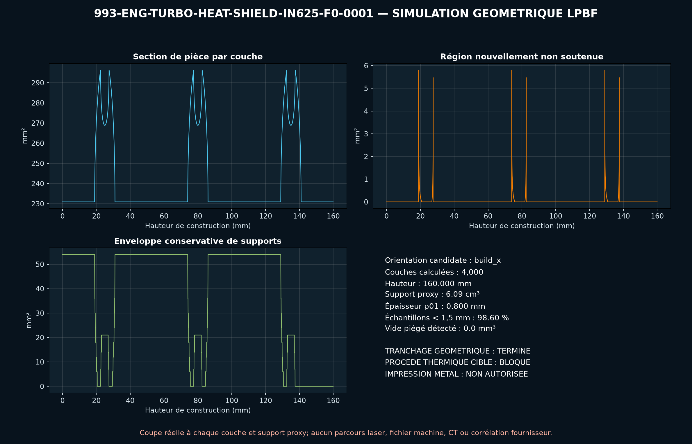

# Couvercle thermique gauche de turbo 993 — concept IN625 F0

Le catalogue PorscheFanatics confirme `993 123 113 51` dans le groupe turbo
`202-16`. FVD publie pour cette pièce une enveloppe de **160 × 110 × 105 mm**,
une masse de **0,23 kg** et une application 993 Turbo/GT2. Aucune surface,
épaisseur, fixation, tolérance, température ou matière n'est publiée.

Le modèle conserve uniquement cette enveloppe. Sa voûte trapézoïdale ouverte,
sa paroi nominale de `0,8 mm`, ses trois bossages et leurs alésages sont une
topologie indépendante. Le volume reste entièrement ouvert, donc sans poudre
prisonnière.

## Intérêt AM et concurrence tôle

Le LPBF IN625 permettrait une coque conformée avec bossages et raidisseurs
locaux intégrés, utile pour une petite série et une géométrie thermique complexe.
Mais la tôle emboutie ou assemblée reste le procédé de référence à battre.

Le F0 pèse théoriquement `325,58 g`, soit `41,6 %` de plus que les `230 g`
publiés par FVD. La matière du produit commercial étant inconnue, ce résultat
n'est pas une validation par masse ; il empêche surtout de déclarer l'AM
gagnante sans nouvelle optimisation et comparaison de coûts.

## Criblages exécutés

Le rapport recalcule :

- volume polygonal et masse `rho V` ;
- flexion d'une bande locale par `I=b t³/12`, `M=F L/4`, `sigma=M c/I` et
  `delta=F L³/(48 E I)` sous `50 N` synthétiques ;
- matage moyen des trois bossages ;
- dilatation libre `alpha L delta_T` ;
- borne entièrement contrainte `E alpha delta_T` ;
- rayonnement `epsilon sigma A (T1⁴-T2⁴)` avec températures, émissivité et
  facteur de vue hypothétiques ;
- résistance conductrice surfacique `t/k` et capacité thermique `m c_p` ;
- BREP OCCT unique, volume analytique et relecture du STEP.

La coque donne `175,78 MPa` en flexion nominale, `0,646 mm` de flèche et
`0,783 mm` de dilatation libre. La borne entièrement contrainte atteint
`997,74 MPa`, au-dessus des `640 MPa` ambiants de comparaison : les fixations
devront autoriser la dilatation. Ce n'est pas une prédiction véhicule.

## Gates suivants

1. Scanner la pièce et relever surfaces chaude/froide, fixations et jeux.
2. Mesurer températures, flux, émissivité, airflow et limite des composants
   protégés.
3. Définir vibration, précharges et cycles thermiques.
4. Comparer tôle et LPBF sur masse, coût, distorsion, finition et endurance.
5. Exécuter coque non linéaire, modal, transfert thermique conjugué, oxydation,
   fluage et fatigue thermique avec carte IN625 qualifiée.
6. Contrôler puis tester sur banc thermique et vibratoire avant véhicule.

PhysicsNeMo attendra un jeu de cas CAE ou d'essais corrélés. Le passage
SimReady est différé jusqu'aux interfaces mesurées et aux propriétés chaudes
qualifiées ; le STEP F0 n'est pas une pièce fabricable pour montage.

<!-- print-screen:begin -->

## Simulation d'impression LPBF

Le STEP a ete tessele puis tranche sur toute sa hauteur a `40 µm`, route EOS M 290 de la matiere candidate. Orientation retenue par la regle automatique : `build_x`.

| grandeur | valeur |
|---|---:|
| couches | 4 000 |
| hauteur de construction | 160,00 mm |
| couches avec region non soutenue | 177 |
| proxy de supports | 6 092,64 mm³ |
| epaisseur locale p01 | 0,800 mm |
| poudre piegee a 1,00 mm | 0,00 mm³ |

Ce criblage n'est ni un projet EOSPRINT, ni un calcul de distorsion, ni un controle du recoater. **L'impression reste interdite.**

<!-- print-screen:end -->
