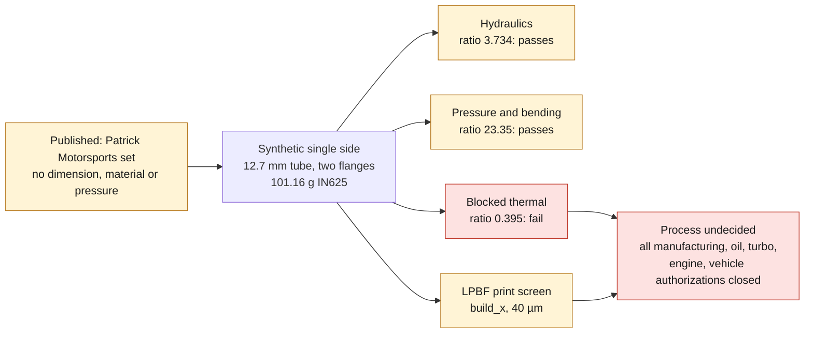

# Turbo oil return line — IN625 F0 concept

This part is a good additive preselection candidate: a low-volume curved line
can combine tube and flanges, eliminate welds and be adapted to a measured
engine bay. It is also a good example of a case where 3D printing must not be
chosen too early.

Patrick Motorsports sells a left/right set for the 993 Turbo `1996–1997`,
between oil pump and tank, with a shape announced to counter oil backflow.
The manufacturer asks for installation on the case side first, then for the
line to be adjusted toward the turbo. PorscheFanatics lists this circuit among
the points to improve.

No source publishes dimensions, material, wall, pressure, temperature or flow.
The F0 therefore represents a single, entirely synthetic side; the commercial
reference `TUR 993 107 338 53 PMS` is not treated as a Porsche part number.



*Diagram: the dossier's own path, restated from the text below. It adds no number or result, and it proves nothing about the physical part.*

## F0 geometry

The build123d master creates a swept tube of `12.7 mm` outer diameter,
`1.2 mm` wall, `10.3 mm` inner diameter, on an assumed `175 mm` centerline.
Two circular `30 × 4 mm` flanges and four holes are integrated.

The re-read STEP contains a single valid BREP solid with a continuous internal
passage. Its envelope is `140 × 60 × 94 mm`, its volume `11,985.86 mm³` and
its theoretical IN625 mass `101.16 g`. These values describe the concept, not
the commercial part.

## Hydraulics

The synthetic point uses `2 L/min` of oil at `120 °C`, density `850 kg/m³`,
dynamic viscosity `0.015 Pa·s`, a `90 mm` rise and a minor loss coefficient
`K = 4`.

`v = Q/A`, `Re = ρvD/μ`, then, since `Re = 233`, `f = 64/Re`.

The loss is calculated by:

`Δp = f(L/D)ρv²/2 + Kρv²/2 + ρgΔz`

The result is `1.339 kPa`, i.e. a ratio of `3.734` against the synthetic
threshold of `5 kPa / 1.5`. This screen passes, but it is single-phase:
aerated oil, pulsations, the scavenge pump and two-phase return are absent.

## Pressure and bending

At `0.3 MPa`, the thin-wall formulas give `1.288 MPa` hoop, `0.644 MPa` axial
and `1.115 MPa` von Mises. With a synthetic transverse load of `100 N` over
`120 mm`, the combined stress is `27.41 MPa`. The ratio to room-temperature
Rp0.2 `640 MPa` is `23.35`: this screen passes by a wide margin.

It covers neither the bend, nor the flange root, nor LPBF defects, nor residual
stress, nor vibration. The algebraic burst pressure is therefore not an
authorized pressure.

## Thermal and compliance

EOS IN625 M 290 `40 µm` provides the mechanical comparison. The density and
thermal constants come from the Special Metals wrought IN625 bulletin and are
not a hot LPBF allowable map.

Between `20` and `600 °C`, the free expansion of the line would be `1.391 mm`.
Fully blocked, the bound `σ = EαΔT` reaches `1,620.98 MPa`, i.e. a ratio of
only `0.395`: **fail**. To keep the `1.5` threshold, the model indicates that
the effective axial restraint fraction would have to stay below `0.263`.

Pure conduction power through the wall reaches an unrealistic bound of
`39.6 kW` because the oil/gas convective resistances are omitted. It only
proves that a CHT with coking and the true skin temperature is necessary.

## F0 decision

The line passes the hydraulic and membrane screens, but fails if it is
thermally constrained. Above all, the existing product must be adjusted at
installation: a rigid LPBF line makes no sense before the two reference cars,
the engine-turbo movements and the interfaces have been measured.

The reference process therefore stays **undecided** between formed/welded tube
and LPBF IN625. AM is only worthwhile if consolidation, the measured packaging,
internal cleanliness and repeatability actually offset the cost and the loss of
adjustability.

## Reproduction

```bash
docker run --rm --platform linux/amd64 -v "$PWD:/work" -w /work \
  ghcr.io/cluster2600/3dprinting993-cad-author-f28@sha256:18dbfa559306a31c909480695acf0e89a9bc904c83d280065c1d9d29036fec57 \
  python parts/993-eng-turbo-oil-return-line-in625-f0-0001/source/turbo_oil_return_line.py \
  --out parts/993-eng-turbo-oil-return-line-in625-f0-0001/derived/turbo_oil_return_line_in625_f0.step \
  --report parts/993-eng-turbo-oil-return-line-in625-f0-0001/evidence/engineering-screen.json
```

## Next gates

1. Scan both lines and their interfaces in several engine positions.
2. Measure flow, aerated oil, pressure, temperature, drainage and return.
3. Measure relative movements, skin temperature, fluxes and vibration.
4. Build two-phase CFD, CHT and flexible FEA with bench correlation.
5. Compare formed/welded tube and LPBF on mass, cost, fatigue and adjustability.
6. Qualify wall, supports, depowdering, heat treatment, machining and cleanliness.
7. Pass CT, pressure, leak, burst, flow, cycling and vibration tests.

PhysicsNeMo stays deferred until correlated CFD/CHT/structure series exist with
holdout and out-of-distribution cases. All manufacturing, oil, turbo, engine
and vehicle authorizations stay closed.

<!-- print-screen:begin -->

## LPBF print simulation

The STEP was tessellated, then sliced over its full height at `40 µm`, on the EOS M 290 route of the candidate material. Orientation chosen by the automatic rule: `build_x`.

| quantity | value |
|---|---:|
| layers | 3,500 |
| build height | 140.00 mm |
| layers with an unsupported region | 942 |
| support proxy | 43,851.08 mm³ |
| local thickness p01 | 1.180 mm |
| trapped powder at 1.00 mm | 0.00 mm³ |


This screening is neither an EOSPRINT project, nor a distortion calculation, nor a recoater check. **Printing remains prohibited.**

<!-- print-screen:end -->
