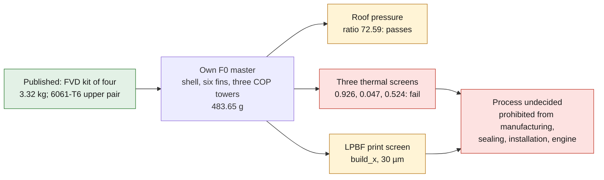
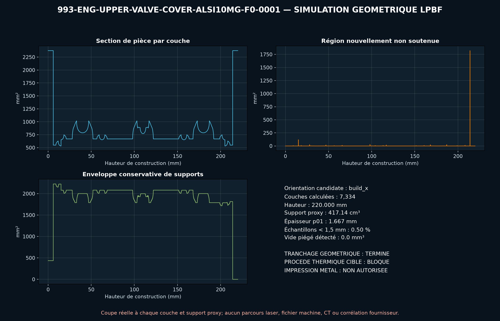

# 993 upper valve cover with COP towers — AlSi10Mg F0

This candidate uses additive manufacturing to consolidate an open shell, six
fins and three coil-on-plug coil mounts. PorscheFanatics specifically
identifies COP integration as the benefit of the BBi kit and catalogues
several machined aluminum covers.

FVD publishes a complete kit of four covers, gaskets and fasteners in billet
aluminum, with a commercial envelope of `400 × 150 × 200 mm` and a mass of
`3.32 kg`. Protomotive confirms an upper pair for the 993 Carrera/Turbo
machined from `6061-T6`. None of these figures defines an individual part.



*Diagram: the dossier's own path, restated from the text below. It adds no number or result, and it proves nothing about the physical part.*

## F0 geometry

The build123d master is therefore entirely our own: an open upper cover of
`220 × 95 × 25 mm`, `3 mm` roof, `6 mm` side flange, ten synthetic holes, six
fins and three COP towers. The overall envelope reaches `220 × 95 × 45 mm`.

The re-read STEP contains a valid BREP solid, an open oil face, ten holes,
three COP passages and six fins. Its volume is `181,143.43 mm³` and its
theoretical AlSi10Mg mass `483.65 g`. An envelope billet block would weigh
`2,511.14 g`, i.e. a theoretical ratio of `5.19`.

Projecting four F0s gives `1.935 kg`, but this value cannot be compared
directly with FVD's `3.32 kg`: the real kit contains different covers,
gaskets and fasteners.

## Pressure and clamping

The roof is screened as a simply supported strip under `20 kPa`:

`σ = 0.75 × p × a² / t²`

For `a = 45 mm` and `t = 3 mm`, the stress is `3.375 MPa`, i.e. a ratio to the
AlSi10Mg limit of `72.59`. This screen passes.

PorscheFanatics transcribes `9.7 Nm` for an M6 cover, but the OCR value stays
unverified. With the provisional model `F = T/(Kd)` and `K = 0.20`, each
fastener would give `8.08 kN`. The mean strip pressure is `22.23 MPa` and the
synthetic flange root `134.72 MPa`, i.e. a ratio of `1.819`. These
calculations constitute neither an installation torque nor proof of sealing.

## Three thermal failures

At `200 °C` from `20 °C`, the free growth over `220 mm` is `0.832 mm`. Fully
constrained, `σ = EαΔT` reaches `264.6 MPa` against `245 MPa`, ratio
`0.926`: **fail**.

A synthetic `50 K` gradient across the roof gives:

`κ = αΔT/t`, then `w = κL²/8`

The estimated warp is `2.117 mm`, against a gasket target of `0.10 mm`, ratio
`0.047`: **fail**. This deliberately severe model shows that ribs, machining
sequence and heat treatment compensation are indispensable.

Finally, with `h = 30 W/m²K`, the simplified surfaces reject `157.2 W` against
a synthetic target of `300 W`, ratio `0.524`: **fail**. Conduction to the
cylinder head, oil, radiation and the real airflow are missing.

## F0 decision

COP consolidation and the reduction of stock make AM interesting, but the F0
does not hold its thermal screens and no interface is measured. The process
stays undecided between original die casting, casting, 6061-T6 billet and
LPBF AlSi10Mg.

## Reproduction

```bash
docker run --rm --platform linux/amd64 -v "$PWD:/work" -w /work \
  ghcr.io/cluster2600/3dprinting993-cad-author-f28@sha256:18dbfa559306a31c909480695acf0e89a9bc904c83d280065c1d9d29036fec57 \
  python parts/993-eng-upper-valve-cover-alsi10mg-f0-0001/source/upper_valve_cover.py \
  --out parts/993-eng-upper-valve-cover-alsi10mg-f0-0001/derived/upper_valve_cover_alsi10mg_f0.step \
  --report parts/993-eng-upper-valve-cover-alsi10mg-f0-0001/evidence/engineering-screen.json
```

## Next gates

1. Scan the four covers, gaskets, cylinder head faces, coils and harness.
2. Verify the primary torque, the sequence and the real gasket law.
3. Measure crankcase pressure, temperatures, fluxes, oil, air and vibration.
4. Redesign flange, ribs, vents and COP towers on measured interfaces.
5. Run CHT, nonlinear gasket contact, modal, fatigue and relaxation.
6. Qualify orientation, supports, T6, quench, HIP, machining and anodizing.
7. Pass CT, FPI, flatness, pressure, leak, thermal cycle and endurance tests.

PhysicsNeMo stays deferred until correlated CHT/structure/gasket series exist,
split into training, validation, holdout and out-of-distribution. The F0 is
prohibited from manufacturing, sealing, installation and engine use.

<!-- print-screen:begin -->

## LPBF print simulation

The STEP was tessellated, then sliced over its full height at `30 µm`, on the EOS M 290 route of the candidate material. Orientation chosen by the automatic rule: `build_x`.

| quantity | value |
|---|---:|
| layers | 7,334 |
| build height | 220.00 mm |
| layers with an unsupported region | 983 |
| support proxy | 417,144.05 mm³ |
| local thickness p01 | 1.667 mm |
| trapped powder at 1.00 mm | 0.00 mm³ |



This screening is neither an EOSPRINT project, nor a distortion calculation, nor a recoater check. **Printing remains prohibited.**

<!-- print-screen:end -->
