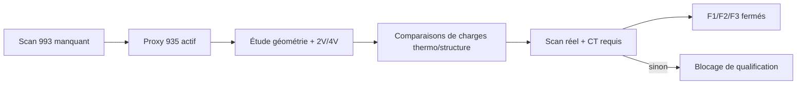

# Status journalier — 2026-09-14

Mise à jour pour la continuation culasse 993/964 (target 700 hp, 2V/4V).

## Où on en est

- Base exploitable: `work/993-cylinder-head-fast` (proxy, pas de scan 993 confirmé dans le repo).
- Lecture de preuves: `ready = failed`, `highest_verified_level = unverified`.
- `manufacturing_release_authorized = false` dans `physics-readiness.json`.
- OpenFOAM (stubs) : `checkMesh` échoue encore sur des cellules à petit déterminant.
  - baseline: `89` (`high_B`) / `91` (`low_B`)  
  - best connu après optimisation (`gmsh.model.mesh.optimize`) : `33` cellules sur les deux domaines (`low_B` et `high_B`) avec des maillages grossis (`a1_r0_C*` sur 3.0–5.0 mm / 9–12 mm) dans les sweeps `cfd-sweep5`, `cfd-sweep6` et `cfd-sweep6b`.
  - Blocage restant : `checkMesh` reste non validé (toutes ces runs échouent sur l’échec "Cells with small determinant < 0.001") tant que la géométrie/stratégie de maillage ne change pas.

## Sorties prêtes à montrer (sans prétendre à la validation moteur)

- Rendus: `work/993-cylinder-head-fast/reports/digital-twin-preview.png`
- Rendus de sections: `work/993-cylinder-head-fast/reports/sections/`
- Preview maillage courant (matrice de suivi): `work/993-cylinder-head-fast/reports/cfd_stub_preview_continuation.png`
- Rapport de conformité géométrique: `work/993-cylinder-head-fast/reports/output-verification.json`
- Rapport readiness: `work/993-cylinder-head-fast/reports/physics-readiness.json`

## Plan des 4 prochaines actions (immédiat)

1. **Geler baseline**
   - versionner/archiver `work/993-cylinder-head-fast` et ses rendus comme référence de travail.
2. **Corriger qualité maillage**
   - améliorer la qualité de maillage (réduction du volume des cellules mal conditionnées) : cibles atteintes à 33/561 cellules.
   - lancer ensuite la variante "topologie de maillage structurée" + étude de `Mesh.Optimize`/`addThruSections` pour tenter de passer sous 5 cellules.
3. **Préparer lot Vast**
   - conteneur + entrée `M64` + scripts 2V/4V + `outputs` JSON pour `pass/fail` machine.
4. **Passer au test physique dès que CT+mesures arrivent**
   - calibrage échelle, interne, pression/température, coupes de chambre/sièges/guides, charges.

## Bloqueurs de conformité

- Pas d’entrée scanner 993 fiable.
- Pas de géométrie interne étayée (galeries d’huile, sièges, guides, filetages).
- Pas de profils came, courbes de pression-température par angle vilebrequin.
- Pas de qualification matière/traitement pour aluminium + nickel/acier ciblés.
