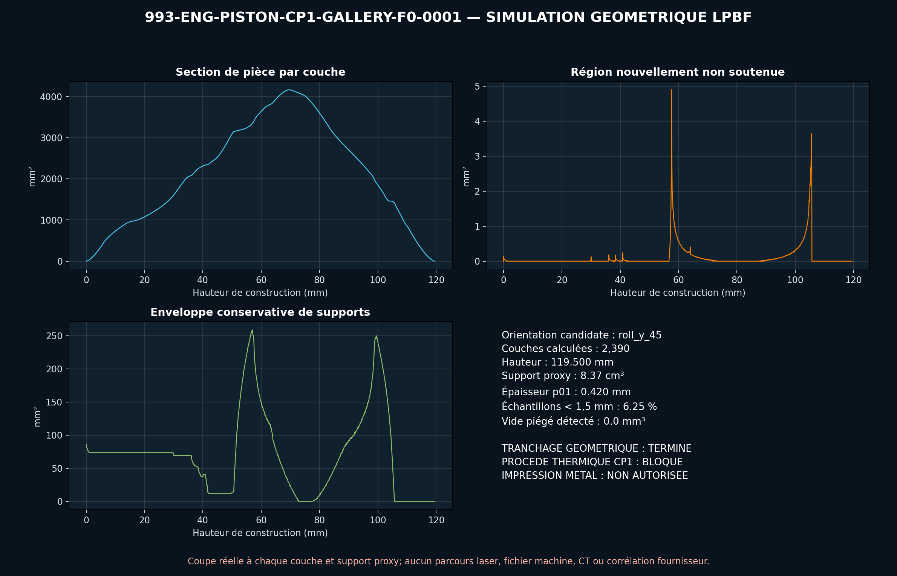
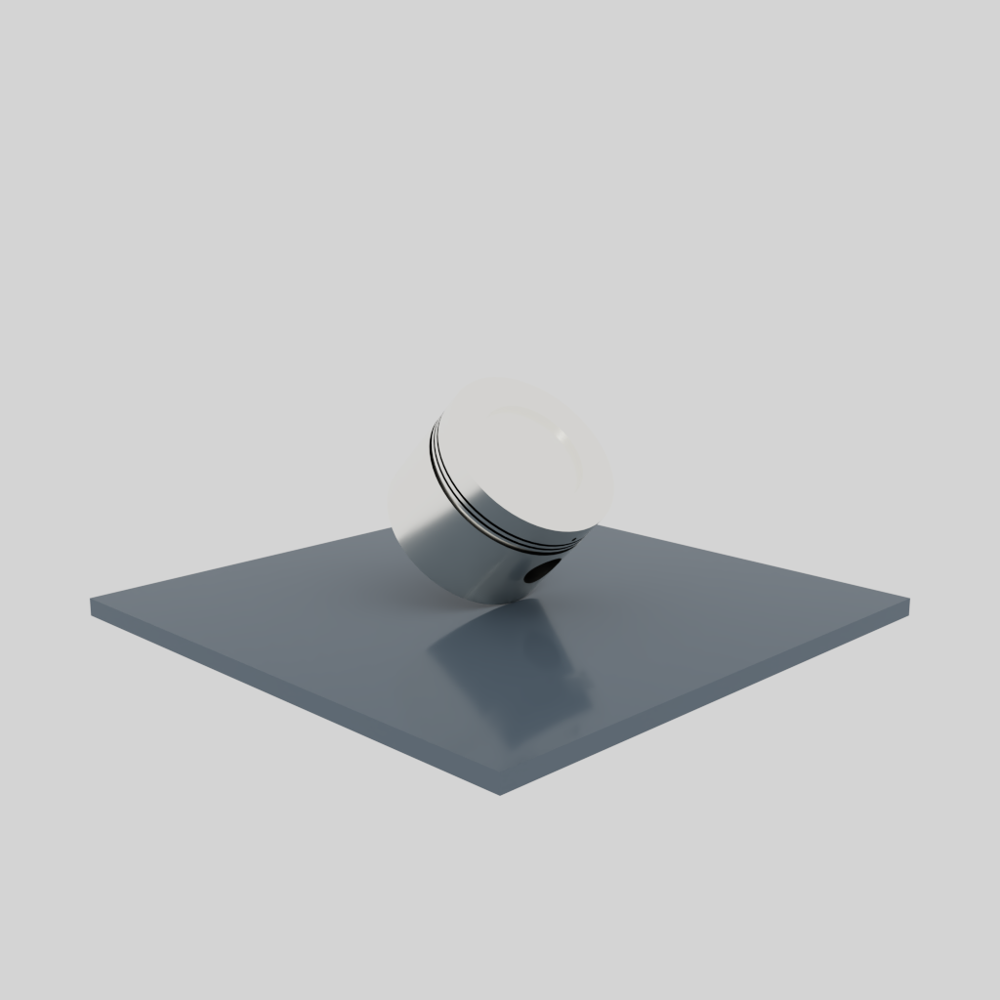

# Pipeline obligatoire d'impression métal et Omniverse

## Règle du dépôt

Toute fiche de `catalog/parts/*.json` qui propose `LPBF` ou `DMLS` doit être
suivie par
[`am-validation-policy.json`](../catalog/manufacturing/am-validation-policy.json).
Le contrôle est automatique : ajouter une nouvelle pièce additive sans
l'inscrire dans le registre fait échouer `make validate` et `make check`.

Une pièce ne peut atteindre `released` que si toutes les étapes obligatoires
sont `passed`. `completed_screening` signifie qu'un calcul numérique a été
exécuté, mais qu'il manque encore une entrée, une corrélation ou une revue pour
en faire une preuve de fabrication.

```mermaid
flowchart LR
    A[Sources et mesures] --> B[CAO BREP et maillage]
    B --> C[Tranchage intégral et supports]
    C --> D[Carte matière-machine-procédé]
    D --> E[Bain de fusion local]
    E --> F[Thermomécanique pleine construction]
    F --> G[Recoater et retrait supports]
    G --> H[Asset Omniverse SimReady]
    H --> I[Assemblage fonctionnel Omniverse]
    I --> J[Coupons, CT, métrologie et essais]
    J --> K[Revue d'ingénierie signée]
```



## Les onze étapes

| Étape | Calcul ou preuve | Porte de sortie |
|---|---|---|
| 01 | provenance, variante, mesures, hypothèses et SHA-256 | autorité géométrique approuvée |
| 02 | master éditable, STEP/BREP, maillage étanche et échelle | intégrité géométrique |
| 03 | section de chaque couche, îlots, overhangs, supports et dépoudrage | projet géométriquement imprimable |
| 04 | alliage, poudre, machine, orientation, paramètres, traitements et propriétés `f(T)` | route procédé cohérente |
| 05 | AdditiveFOAM ou solveur équivalent, convergence espace/temps, coupons | bain de fusion corrélé |
| 06 | activation des couches, plaque, supports, plasticité, détente et distorsion | forme déformée convergée |
| 07 | collision recoater et accès au retrait des supports | construction mécaniquement praticable |
| 08 | OpenUSD, Asset Validator, Geometry, Physics, profil SimReady et rendu OVRTX | asset Omniverse conforme |
| 09 | interfaces, tolérances, contacts, mouvement, charges et défauts dans l'assemblage | fonction numérique vérifiée |
| 10 | coupons, première pièce, CT/CND, métrologie, fatigue et corrélation | modèle relié au réel |
| 11 | revue professionnelle signée sur une révision précise | autorisation explicitement bornée |

PhysicsNeMo intervient seulement après constitution de jeux de calculs de
référence convergés et corrélés. C'est un surrogate accélérateur, pas une étape
capable d'autoriser une pièce par elle-même. Les Material et Physics Agents
peuvent proposer des métadonnées USD ; chaque propriété physique doit rester
sourcée ou être supprimée avant validation.

## Premier passage : piston CP1 F0

Le piston synthétique est le premier objet 993 traité avec cette chaîne. Le
maillage dérivé du STEP contient `136 988` sommets et `273 988` triangles ; il
est étanche, monocomposant et conserve l'enveloppe `99 × 99 × 70 mm`.

Le criblage pleine pièce a réellement intersecté le maillage à chaque couche de
`50 µm`. L'orientation candidate `roll_y_45` donne :

| Résultat | Valeur |
|---|---:|
| hauteur de construction | 119,500 mm |
| couches calculées | 2 390 |
| couches internes vides | 0 |
| nouveaux îlots | 4 |
| couches avec région non soutenue | 759 |
| région non soutenue maximale | 4,898 mm² |
| enveloppe conservative de supports | 8,365 cm³ |
| épaisseur locale p01, écran 2 000 points | 0,420 mm |
| fraction des points sous 1,5 mm | 6,25 % |
| vide piégé détecté au voxel de 1 mm | 0 mm³ |

La pièce nue tient dans l'enveloppe nominale de la Sapphire standard. Cette
orientation n'est pas encore une décision DfAM : les supports Velo3D Flow, les
surépaisseurs d'usinage, le retrait, le CT et le fichier machine ne sont pas
disponibles. Le résultat détaillé et les métriques de chaque couche sont dans
[`evidence/lpbf-f0`](../twins/993-m64-60-piston-gallery-f0/evidence/lpbf-f0/).



Le même STEP passe séparément NVIDIA Asset Validator, Geometry, Physics et le
profil `Prop-Robotics-Neutral 1.0.0`. Les coefficients de frottement,
restitution et la gravité proposés sans source par le Physics Agent ont été
retirés avant le passage final. Le dossier public est
[`evidence/simready-f0`](../twins/993-m64-60-piston-gallery-f0/evidence/simready-f0/).

Une seconde scène Omniverse exécute la préparation de construction : elle
place le piston en `roll_y_45`, le met au contact du plateau et contrôle son
enveloppe par rapport au volume nominal `Ø315 × 400 mm`. Cette scène passe
OpenUSD minimum, NVIDIA Asset Validator, Geometry et Physics ; son rendu a été
inspecté. Le recoater animé reste un guide sans collision calculée, car aucune
forme déformée CP1 calibrée ni géométrie de supports fournisseur n'est encore
disponible.



## Pourquoi la simulation thermique CP1 reste bloquée

La fiche Velo3D documente la route Sapphire `50 µm`, la densité et des
propriétés mécaniques ambiantes après `400 °C / 4 h`. Elle ne publie pas la
carte thermophysique et constitutive dépendante de la température ni la
stratégie laser nécessaires à un calcul AdditiveFOAM représentatif. La page
officielle EOS fournit maintenant deux routes CP1 `60 µm` de TRL 3 et quelques
propriétés supplémentaires, mais précise que le procédé doit être demandé à
EOS ; ce n'est pas la route Sapphire du piston et cela ne fournit toujours pas
une carte de solveur complète.

Par conséquent :

- aucun calcul AlSi10Mg n'est transféré au CP1 ;
- aucun champ thermique artificiel n'est publié comme prédiction du piston ;
- la thermomécanique pleine construction et le recoater restent
  `blocked_missing_input` ;
- l'impression métal et l'usage moteur restent interdits.

Références primaires : [Velo3D CP1 / Sapphire 50 et 100 µm](https://velo3d.com/wp-content/uploads/2025/04/Velo3D-Material-Datasheet-Aluminum-CP1.pdf),
[EOS Aluminium Constellium CP1](https://www.eos.info/metal-solutions/data-sheets/all-processes-and-materials?id=eos-aluminium-constellium-cp1).

## Reproduction

Le programme générique peut être appliqué à toute pièce après génération d'un
maillage de calcul étanche :

```bash
python3 scripts/run_metal_am_geometry_screen.py \
  --part-id 993-ENG-PISTON-CP1-GALLERY-F0-0001 \
  --master parts/993-eng-piston-cp1-gallery-f0-0001/derived/piston_cp1_gallery_f0.step \
  --master-sha256 <sha256-step> \
  --surface <maillage-stl-prive-ou-derive> \
  --surface-sha256 <sha256-stl> \
  --machine-card catalog/manufacturing/machines/velo3d-sapphire-standard.json \
  --material "Aheadd CP1 / Sapphire 50 um candidate" \
  --expected-envelope-mm 99 99 70 \
  --output work/piston-lpbf
```

Le contrôle universel, sans dépendance CAE, s'exécute partout :

```bash
python3 scripts/validate_am_pipeline.py
```

Au 8 septembre 2026, il suit automatiquement `25` pièces candidates
LPBF/DMLS. Une réussite virtuelle ne remplace jamais la corrélation physique ni
la revue d'ingénierie.
