# Pipeline obligatoire d'impression métal et Omniverse

## Règle du dépôt

Toute fiche de `catalog/parts/*.json` qui propose `LPBF` ou `DMLS` doit être
suivie par
[`am-validation-policy.json`](../catalog/manufacturing/am-validation-policy.json).
Le contrôle est automatique : ajouter une nouvelle pièce additive sans
l'inscrire dans le registre fait échouer `make validate` et `make check`.

Une pièce ne peut atteindre `released` que si toutes les étapes obligatoires
sont `passed`. `completed_screening` signifie qu'un calcul numérique a été
exécuté, mais qu'il manque encore une entrée, une corrélation ou une revue pour
en faire une preuve de fabrication.

```mermaid
flowchart LR
    A[Sources et mesures] --> B[CAO BREP et maillage]
    B --> C[Tranchage intégral et supports]
    C --> D[Carte matière-machine-procédé]
    D --> E[Bain de fusion local]
    E --> F[Thermomécanique pleine construction]
    F --> G[Recoater et retrait supports]
    G --> H[Asset Omniverse SimReady]
    H --> I[Assemblage fonctionnel Omniverse]
    I --> J[Coupons, CT, métrologie et essais]
    J --> K[Revue d'ingénierie signée]
```



## Les onze étapes

| Étape | Calcul ou preuve | Porte de sortie |
|---|---|---|
| 01 | provenance, variante, mesures, hypothèses et SHA-256 | autorité géométrique approuvée |
| 02 | master éditable, STEP/BREP, maillage étanche et échelle | intégrité géométrique |
| 03 | section de chaque couche, îlots, overhangs, supports et dépoudrage | projet géométriquement imprimable |
| 04 | alliage, poudre, machine, orientation, paramètres, traitements et propriétés `f(T)` | route procédé cohérente |
| 05 | AdditiveFOAM ou solveur équivalent, convergence espace/temps, coupons | bain de fusion corrélé |
| 06 | activation des couches, plaque, supports, plasticité, détente et distorsion | forme déformée convergée |
| 07 | collision recoater et accès au retrait des supports | construction mécaniquement praticable |
| 08 | OpenUSD, `nvidia_usd_validate`, Geometry, Physics, profil SimReady et rendu OVRTX | asset Omniverse conforme |
| 09 | interfaces, tolérances, contacts, mouvement, charges et défauts dans l'assemblage | fonction numérique vérifiée |
| 10 | coupons, première pièce, CT/CND, métrologie, fatigue et corrélation | modèle relié au réel |
| 11 | revue professionnelle signée sur une révision précise | autorisation explicitement bornée |

PhysicsNeMo intervient seulement après constitution de jeux de calculs de
référence convergés et corrélés. C'est un surrogate accélérateur, pas une étape
capable d'autoriser une pièce par elle-même. Les Material et Physics Agents
peuvent proposer des métadonnées USD ; chaque propriété physique doit rester
sourcée ou être supprimée avant validation.

## Premier passage : piston CP1 F0

Le piston synthétique est le premier objet 993 traité avec cette chaîne. Le
maillage dérivé du STEP contient `136 988` sommets et `273 988` triangles ; il
est étanche, monocomposant et conserve l'enveloppe `99 × 99 × 70 mm`.

Le criblage pleine pièce a réellement intersecté le maillage à chaque couche de
`50 µm`. L'orientation candidate `roll_y_45` donne :

| Résultat | Valeur |
|---|---:|
| hauteur de construction | 119,500 mm |
| couches calculées | 2 390 |
| couches internes vides | 0 |
| nouveaux îlots | 4 |
| couches avec région non soutenue | 759 |
| région non soutenue maximale | 4,898 mm² |
| enveloppe conservative de supports | 8,365 cm³ |
| épaisseur locale p01, écran 2 000 points | 0,420 mm |
| fraction des points sous 1,5 mm | 6,25 % |
| vide piégé détecté au voxel de 1 mm | 0 mm³ |

La pièce nue tient dans l'enveloppe nominale de la Sapphire standard. Cette
orientation n'est pas encore une décision DfAM : les supports Velo3D Flow, les
surépaisseurs d'usinage, le retrait, le CT et le fichier machine ne sont pas
disponibles. Le résultat détaillé et les métriques de chaque couche sont dans
[`evidence/lpbf-f0`](../twins/993-m64-60-piston-gallery-f0/evidence/lpbf-f0/).


Le même STEP passe séparément NVIDIA Asset Validator, Geometry, Physics et le
profil `Prop-Robotics-Neutral 1.0.0`. Les coefficients de frottement,
restitution et la gravité proposés sans source par le Physics Agent ont été
retirés avant le passage final. Le dossier public est
[`evidence/simready-f0`](../twins/993-m64-60-piston-gallery-f0/evidence/simready-f0/).

Une seconde scène Omniverse exécute la préparation de construction : elle
place le piston en `roll_y_45`, le met au contact du plateau et contrôle son
enveloppe par rapport au volume nominal `Ø315 × 400 mm`. Cette scène passe
OpenUSD minimum, NVIDIA Asset Validator, Geometry et Physics ; son rendu a été
inspecté. Le recoater animé reste un guide sans collision calculée, car aucune
forme déformée CP1 calibrée ni géométrie de supports fournisseur n'est encore
disponible.


### Gate d'optimisation générative du piston

PicoGK 2.3.0 a réellement généré six variantes F0. Le balayage cherche une
masse faible et une galerie plus favorable au refroidissement, mais impose une
marge de plaque ambiante provisoire de `1,50`. Le meilleur allègement brut est
`1,60 %`; aucune variante ne passe la marge. L'audit aval trouve en outre des
arêtes non-manifold dans chaque STL PicoGK.

Ce sous-gate relie les étapes 01, 02, 04 et 09 : objectifs et keep-outs sourcés,
géométrie manifold, carte CP1 chaude et fonction moteur. Il ne crée pas une
douzième étape et ne change pas le master BREP actuellement validé. Les sorties
PicoGK restent en quarantaine jusqu'à reconstruction BREP, FEA/CHT/CFD et
nouveau passage complet LPBF/Omniverse.

### Gate thermomécanique du master piston

Le master BREP sain a maintenant subi six résolutions CalculiX 2.21 : statique
froide et température–déplacement séquentiel sur trois maillages C3D10. À
`2,5 mm`, le modèle compte `139 924` nœuds et `81 861` éléments. Les p95 froid
et chaud valent respectivement `112,17` et `323,46 MPa`; la température maximale
du cas chaud vaut `187,04 °C`. Les variations fin/précédent restent sous `3 %`.

Le cas impose `5 kW` à la calotte, des puits idéaux de `120 °C` dans la galerie
et `160 °C` sur la jupe, ainsi que la charge axiale synthétique. Il est donc un
écran comparatif conservateur, pas une CHT moteur. Son ratio p95 chaud sur la
référence CP1 ambiante est défavorable (`0,918`) et bloque le F0. Les variantes
PicoGK ne sont pas simulées tant que leurs maillages ne sont pas manifold.

La preuve est dans
[`evidence/calculix-f0`](../twins/993-m64-60-piston-gallery-f0/evidence/calculix-f0/).

## Pourquoi la simulation thermique du procédé CP1 reste bloquée

La fiche Velo3D documente la route Sapphire `50 µm`, la densité et des
propriétés mécaniques ambiantes après `400 °C / 4 h`. Elle ne publie pas la
carte thermophysique et constitutive dépendante de la température ni la
stratégie laser nécessaires à un calcul AdditiveFOAM représentatif. La page
officielle EOS fournit maintenant deux routes CP1 `60 µm` de TRL 3 et quelques
propriétés supplémentaires, mais précise que le procédé doit être demandé à
EOS ; ce n'est pas la route Sapphire du piston et cela ne fournit toujours pas
une carte de solveur complète.

Par conséquent :

- aucun calcul AlSi10Mg n'est transféré au CP1 ;
- le champ thermique F0 de pièce est publié seulement comme enveloppe
  synthétique explicitement non corrélée ;
- la thermomécanique pleine construction et le recoater restent
  `blocked_missing_input` ;
- l'impression métal et l'usage moteur restent interdits.

Références primaires : [Velo3D CP1 / Sapphire 50 et 100 µm](https://velo3d.com/wp-content/uploads/2025/04/Velo3D-Material-Datasheet-Aluminum-CP1.pdf),
[EOS Aluminium Constellium CP1](https://www.eos.info/metal-solutions/data-sheets/all-processes-and-materials?id=eos-aluminium-constellium-cp1).

## Deuxième passage : embout ovale IN625 F0

Le second objet est un embout rond-vers-ovale double paroi. Seule sa sortie
commerciale `120 × 85 mm` est publiée ; la longueur, l'entrée, les parois et
les attaches restent synthétiques. Le STEP forme un BREP monocomposant de
`48 149,34 mm³`, soit `406,38 g` avec la densité IN625 retenue.

L'orientation `roll_y_25` a été sectionnée sur `3 702` couches de `40 µm` :
zéro couche interne vide, un nouvel îlot, `784` couches avec surface non
soutenue, `0,843 mm²` au maximum et `7,194 cm³` de supports conservatifs. Le
contrôle d'épaisseur trouve `0,636 mm` au centile 1 et les 2 000 sondes sous
`1,5 mm`; ce résultat est cohérent avec la double paroi nominale très mince et
reste un avertissement de capabilité.

La scène Omniverse place la pièce sur l'enveloppe nominale EOS M 290
`250 × 250 × 325 mm`. La scène et l'asset isolé passent OpenUSD minimum,
NVIDIA Asset Validator, Geometry et Physics ; l'asset passe aussi le profil
`Prop-Robotics-Neutral 1.0.0`. Les frottements, la restitution, la gravité et
l'identité inox proposés sans source par les agents ont été supprimés.


La CFD OpenFOAM est seulement diagnostique : les trois cas stationnaires sont
convergés en résidus, mais la perte de pression varie encore de `11,17 %`
entre les deux maillages les plus fins et les contrôles étendus conservent des
cellules à faible déterminant. Aucun calcul de bain de fusion, de distorsion,
de collision recoater, d'assemblage véhicule ou de fatigue thermique ne passe.
PhysicsNeMo n'a exécuté qu'un smoke CUDA, sans surrogate entraîné.

## Troisième passage : crochet de ressort de phare AlSi10Mg F0

Le troisième objet est un petit crochet de réparation. L'offre commerciale
confirme que cette fonction est déjà réalisée par impression 3D métal, mais ne
publie aucune cote. Le F0 `16 × 8 × 15 mm` est donc un concept indépendant de
`881 mm³`, soit `2,352 g` avec la densité EOS AlSi10Mg retenue.

L'orientation `roll_y_45` est sectionnée sur `425` couches de `30 µm`. Le
maillage est étanche et monocomposant; le proxy conservatif de supports vaut
`3,06 mm³`. Une seule couche contient une région non soutenue, de
`0,446 mm²`. Aucune poche fermée n'est détectée au voxel de `0,25 mm`.

Six calculs CalculiX 2.21 ont réellement été exécutés : froid et
thermo-mécanique stationnaire sur trois maillages C3D10. Sur le maillage fin de
`22 415` nœuds, le p95 vaut `10,786 MPa` à froid et `141,898 MPa` pour le champ
synthétique `80–180 °C`. Le maximum chaud de `303,467 MPa` et l'absence de
résistance chaude de pièce interdisent toute conclusion favorable.

Le STEP est ensuite converti par `usd-convert-cad 0.2.0`. L'asset binaire et la
scène rigide passent `nvidia_usd_validate 1.21.0` sans règle en échec. Enfin,
`ovstage 0.1.1.355824` et `ovphysx 0.5.11` exécutent `240` pas CPU : une sphère
témoin tombe de `22` à `17 mm` et se stabilise sur le crochet. Ce contact
synthétique vérifie l'intégration logicielle seulement; le ressort, le phare et
l'adhésif réels sont absents.

L'étape 08 reste donc `completed_screening`, pas `passed` : le profil SimReady
complet et le rendu OVRTX de cette révision manquent. Les étapes 05 à 07, 09 à
11 restent bloquées. Voir
[le dossier technique du crochet](993_HEADLAMP_SPRING_HOOK_ALSI10MG_F0.md).

## Reproduction

Le programme générique peut être appliqué à toute pièce après génération d'un
maillage de calcul étanche :

```bash
python3 scripts/run_metal_am_geometry_screen.py \
  --part-id 993-ENG-PISTON-CP1-GALLERY-F0-0001 \
  --master parts/993-eng-piston-cp1-gallery-f0-0001/derived/piston_cp1_gallery_f0.step \
  --master-sha256 <sha256-step> \
  --surface <maillage-stl-prive-ou-derive> \
  --surface-sha256 <sha256-stl> \
  --machine-card catalog/manufacturing/machines/velo3d-sapphire-standard.json \
  --material "Aheadd CP1 / Sapphire 50 um candidate" \
  --expected-envelope-mm 99 99 70 \
  --output work/piston-lpbf
```

Le contrôle universel, sans dépendance CAE, s'exécute partout :

```bash
python3 scripts/validate_am_pipeline.py
```

Au 8 septembre 2026, il suit automatiquement `25` pièces candidates
LPBF/DMLS. Une réussite virtuelle ne remplace jamais la corrélation physique ni
la revue d'ingénierie.
