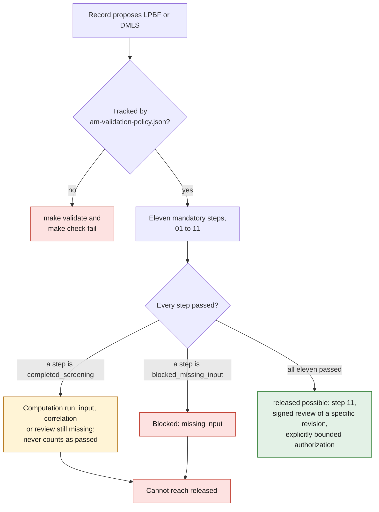

# Mandatory metal printing and Omniverse pipeline

## Repository rule

Every record in `catalog/parts/*.json` that proposes `LPBF` or `DMLS` must be
tracked by
[`am-validation-policy.json`](../catalog/manufacturing/am-validation-policy.json).
The check is automatic: adding a new additive part without registering it makes
`make validate` and `make check` fail.

A part can only reach `released` if every mandatory step is `passed`.
`completed_screening` means that a numerical computation was run, but that an
input, a correlation or a review is still missing to make it manufacturing
evidence.


```mermaid
flowchart LR
    A[Sources and measurements] --> B[BREP CAD and meshing]
    B --> C[Full slicing and supports]
    C --> D[Material-machine-process map]
    D --> E[Local melt pool]
    E --> F[Full-build thermomechanics]
    F --> G[Recoater and support removal]
    G --> H[Omniverse SimReady asset]
    H --> I[Omniverse functional assembly]
    I --> J[Coupons, CT, metrology and tests]
    J --> K[Signed engineering review]
```

How the step statuses gate release (fail-closed):


```mermaid
flowchart TD
    N["Record proposes LPBF or DMLS"] --> RG{"Tracked by<br/>am-validation-policy.json?"}
    RG -- no --> RF["make validate and<br/>make check fail"]:::stop
    RG -- yes --> S["Eleven mandatory steps,<br/>01 to 11"]
    S --> Q{"Every step passed?"}
    Q -- "a step is completed_screening" --> CS["Computation run; input, correlation<br/>or review still missing:<br/>never counts as passed"]:::open
    Q -- "a step is blocked_missing_input" --> BL["Blocked: missing input"]:::stop
    CS --> NR["Cannot reach released"]:::stop
    BL --> NR
    Q -- "all eleven passed" --> OK["released possible: step 11,<br/>signed review of a specific revision,<br/>explicitly bounded authorization"]:::ok
    classDef stop fill:#fde2e1,stroke:#c0392b,color:#1a1a1a;
    classDef ok fill:#e3f1e6,stroke:#2e7d32,color:#1a1a1a;
    classDef open fill:#fff4d6,stroke:#b7791f,color:#1a1a1a;
```

## The eleven steps

| Step | Computation or evidence | Exit gate |
|---|---|---|
| 01 | provenance, variant, measurements, assumptions and SHA-256 | geometric authority approved |
| 02 | editable master, STEP/BREP, watertight mesh and scale | geometric integrity |
| 03 | cross-section of every layer, islands, overhangs, supports and depowdering | geometrically printable design |
| 04 | alloy, powder, machine, orientation, parameters, treatments and properties `f(T)` | consistent process route |
| 05 | AdditiveFOAM or equivalent solver, space/time convergence, coupons | correlated melt pool |
| 06 | layer activation, build plate, supports, plasticity, stress relief and distortion | converged deformed shape |
| 07 | recoater collision and access for support removal | mechanically feasible build |
| 08 | OpenUSD, `nvidia_usd_validate`, Geometry, Physics, SimReady profile and OVRTX render | compliant Omniverse asset |
| 09 | interfaces, tolerances, contacts, motion, loads and defects in the assembly | digital function verified |
| 10 | coupons, first article, CT/NDT, metrology, fatigue and correlation | model tied to reality |
| 11 | signed professional review of a specific revision | explicitly bounded authorization |

PhysicsNeMo only comes in after converged and correlated sets of reference
computations have been built. It is an accelerating surrogate, not a step
able to authorize a part on its own. The Material and Physics Agents
may propose USD metadata; every physical property must stay
sourced or be removed before validation.

## First pass: CP1 F0 piston

The synthetic piston is the first 993 object run through this chain. The
mesh derived from the STEP has `136,988` vertices and `273,988` triangles; it
is watertight, single-body and keeps the `99 × 99 × 70 mm` envelope.

The full-part screening actually intersected the mesh at every `50 µm`
layer. The candidate orientation `roll_y_45` gives:

| Result | Value |
|---|---:|
| build height | 119.500 mm |
| computed layers | 2,390 |
| empty internal layers | 0 |
| new islands | 4 |
| layers with an unsupported region | 759 |
| maximum unsupported region | 4.898 mm² |
| conservative support envelope | 8.365 cm³ |
| local thickness p01, 2,000-point screen | 0.420 mm |
| fraction of points under 1.5 mm | 6.25% |
| trapped void detected at 1 mm voxel | 0 mm³ |

The bare part fits in the nominal envelope of the standard Sapphire. This
orientation is not yet a DfAM decision: Velo3D Flow supports, machining
allowances, shrinkage, CT and the machine file are not available. The detailed
result and the per-layer metrics are in
[`evidence/lpbf-f0`](../twins/993-m64-60-piston-gallery-f0/evidence/lpbf-f0/).


The same STEP separately passes NVIDIA Asset Validator, Geometry, Physics and
the `Prop-Robotics-Neutral 1.0.0` profile. The friction and restitution
coefficients and the gravity proposed without a source by the Physics Agent
were removed before the final pass. The public folder is
[`evidence/simready-f0`](../twins/993-m64-60-piston-gallery-f0/evidence/simready-f0/).

A second Omniverse scene runs the build preparation: it places the piston in
`roll_y_45`, brings it into contact with the build plate and checks its
envelope against the nominal `Ø315 × 400 mm` volume. This scene passes
OpenUSD minimum, NVIDIA Asset Validator, Geometry and Physics; its render was
inspected. The animated recoater remains a guide with no computed collision,
because no calibrated CP1 deformed shape nor supplier support geometry is
available yet.


### Piston generative optimization gate

PicoGK 2.3.0 actually generated six F0 variants. The sweep looks for a low
mass and a gallery more favorable to cooling, but imposes a provisional
room-temperature plate margin of `1.50`. The best gross weight reduction is
`1.60%`; no variant passes the margin. The downstream audit also finds
non-manifold edges in every PicoGK STL.

This sub-gate links steps 01, 02, 04 and 09: sourced objectives and keep-outs,
manifold geometry, hot CP1 map and engine function. It does not create a
twelfth step and does not change the currently validated BREP master. The
PicoGK outputs stay quarantined until BREP reconstruction, FEA/CHT/CFD and a
new full LPBF/Omniverse pass.

### Piston master thermomechanical gate

The sound BREP master has now gone through six CalculiX 2.21 solves: cold
static and sequential temperature–displacement on three C3D10 meshes. At
`2.5 mm`, the model has `139,924` nodes and `81,861` elements. The cold and hot
p95 are `112.17` and `323.46 MPa` respectively; the maximum temperature of the
hot case is `187.04 °C`. The fine/previous variations stay under `3%`.

The case imposes `5 kW` on the crown, ideal sinks of `120 °C` in the gallery
and `160 °C` on the skirt, plus the synthetic axial load. It is therefore a
conservative comparative screen, not an engine CHT. Its hot p95 ratio against
the room-temperature CP1 reference is unfavorable (`0.918`) and blocks the F0.
The PicoGK variants are not simulated as long as their meshes are not manifold.

The evidence is in
[`evidence/calculix-f0`](../twins/993-m64-60-piston-gallery-f0/evidence/calculix-f0/).

## Why the CP1 process thermal simulation stays blocked

The Velo3D datasheet documents the Sapphire `50 µm` route, the density and
room-temperature mechanical properties after `400 °C / 4 h`. It does not
publish the temperature-dependent thermophysical and constitutive map nor the
laser strategy needed for a representative AdditiveFOAM computation. The
official EOS page now provides two TRL 3 CP1 `60 µm` routes and a few
additional properties, but states that the process must be requested from
EOS; it is not the piston's Sapphire route and it still does not provide a
complete solver map.

Consequently:

- no AlSi10Mg computation is transferred to CP1;
- the F0 part thermal field is published only as an explicitly uncorrelated
  synthetic envelope;
- full-build thermomechanics and the recoater stay
  `blocked_missing_input`;
- metal printing and engine use remain prohibited.

Primary references: [Velo3D CP1 / Sapphire 50 et 100 µm](https://velo3d.com/wp-content/uploads/2025/04/Velo3D-Material-Datasheet-Aluminum-CP1.pdf),
[EOS Aluminium Constellium CP1](https://www.eos.info/metal-solutions/data-sheets/all-processes-and-materials?id=eos-aluminium-constellium-cp1).

## Second pass: F0 IN625 oval nozzle

The second object is a double-wall round-to-oval exhaust tip. Only its
commercial `120 × 85 mm` outlet is published; the length, the inlet, the walls
and the fasteners stay synthetic. The STEP forms a single-body BREP of
`48,149.34 mm³`, i.e. `406.38 g` with the selected IN625 density.

The `roll_y_25` orientation was sliced into `3,702` layers of `40 µm`:
zero empty internal layers, one new island, `784` layers with an unsupported
area, `0.843 mm²` at most and `7.194 cm³` of conservative supports. The
thickness check finds `0.636 mm` at the 1st percentile and all 2,000 probes
under `1.5 mm`; this result is consistent with the very thin nominal double
wall and remains a capability warning.

The Omniverse scene places the part in the nominal EOS M 290 envelope
`250 × 250 × 325 mm`. The scene and the isolated asset pass OpenUSD minimum,
NVIDIA Asset Validator, Geometry and Physics; the asset also passes the
`Prop-Robotics-Neutral 1.0.0` profile. The friction, restitution, gravity and
stainless-steel identity proposed without a source by the agents were removed.


The OpenFOAM CFD is diagnostic only: the three steady cases are converged in
residuals, but the pressure loss still varies by `11.17%` between the two
finest meshes and the extended checks keep low-determinant cells. No melt pool,
distortion, recoater collision, vehicle assembly or thermal fatigue
computation passes. PhysicsNeMo only ran a CUDA smoke, with no trained
surrogate.

## Third pass: F0 AlSi10Mg headlamp spring hook

The third object is a small repair hook. The commercial offer confirms that
this function is already made by metal 3D printing, but publishes no
dimension. The `16 × 8 × 15 mm` F0 is therefore an independent concept of
`881 mm³`, i.e. `2.352 g` with the selected EOS AlSi10Mg density.

The `roll_y_45` orientation is sliced into `425` layers of `30 µm`. The
mesh is watertight and single-body; the conservative support proxy is
`3.06 mm³`. Only one layer contains an unsupported region, of
`0.446 mm²`. No closed pocket is detected at the `0.25 mm` voxel.

Six CalculiX 2.21 computations were actually run: cold and steady
thermomechanical on three C3D10 meshes. On the fine mesh of `22,415` nodes,
the p95 is `10.786 MPa` cold and `141.898 MPa` for the synthetic
`80–180 °C` field. The hot maximum of `303.467 MPa` and the absence of a hot
part strength prohibit any favorable conclusion.

The STEP is then converted by `usd-convert-cad 0.2.0`. The binary asset and the
rigid scene pass `nvidia_usd_validate 1.21.0` with no failing rule. Finally,
`ovstage 0.1.1.355824` and `ovphysx 0.5.11` run `240` CPU steps: a test sphere
drops from `22` to `17 mm` and settles on the hook. This synthetic contact only
verifies software integration; the real spring, headlamp and adhesive are
absent.

Step 08 therefore stays `completed_screening`, not `passed`: the full SimReady
profile and the OVRTX render of this revision are missing. Steps 05 to 07 and
09 to 11 stay blocked. See
[the hook technical dossier](993/993_HEADLAMP_SPRING_HOOK_ALSI10MG_F0.md).

## Fourth pass: F0 AlSi10Mg interior door lever

The lever is selected as a small LPBF candidate because the concept
consolidates a perforated plate, a bridge and a clevis. PorscheFanatics
provides the PET references and FVD only a `108 × 45 × 27 mm` envelope and a
pair mass of `180 g`: all interfaces therefore stay hypothetical.

The reproducible normalized STEP and its watertight STL are linked by digest.
The candidate orientation `roll_y_45` is sliced into `2,664` layers of
`30 µm`; the support proxy is `2,714.4975 mm³`, the p01 thickness `2 mm` and
no trapped void is detected at the `0.75 mm` voxel.


*Step 03 screening of the lever in `roll_y_45`: real cross-section at every layer and a proxy support envelope. It has no laser path, machine file, CT or supplier correlation, and does not authorize metal printing.*

CalculiX 2.21 runs six cold/hot cases on three C3D10 meshes. On the fine mesh
of `31,666` nodes, the p95 is `45.227 MPa` cold and `46.546 MPa` in the
synthetic `20–80 °C` field. The p95 variation between the last two meshes is
`1.143%` and `0.276%`. The Goodman proxy produces no fatigue life and does not
transfer the EOS coupons to the handle.

The CAD-to-SimReady preflight stops the Material/Physics assignment for lack
of an active instance. Separately, the asset and the scene pass minimal USD
validation; `ovstage`/`ovphysx` run `240` steps and settle the test body from
`35` to `29 mm`. Step 08 stays `completed_screening`, while steps
05 to 07 and 09 to 11 stay blocked. See
[the lever technical dossier](993/993_DOOR_OPENER_LEVER_ALSI10MG_F0.md).

## Reproduction

The generic program can be applied to any part once a watertight computation
mesh has been generated:

```bash
python3 scripts/run_metal_am_geometry_screen.py \
  --part-id 993-ENG-PISTON-CP1-GALLERY-F0-0001 \
  --master parts/993-eng-piston-cp1-gallery-f0-0001/derived/piston_cp1_gallery_f0.step \
  --master-sha256 <sha256-step> \
  --surface <private-or-derived-stl-mesh> \
  --surface-sha256 <sha256-stl> \
  --machine-card catalog/manufacturing/machines/velo3d-sapphire-standard.json \
  --material "Aheadd CP1 / Sapphire 50 um candidate" \
  --expected-envelope-mm 99 99 70 \
  --output work/piston-lpbf
```

## First step 04: the switch trim ring

The ring `993-INT-SWITCH-TRIM-RING-F1-0001` is the first part in the
repository taken to step 04. The generator `scripts/build_process_route_card.py`
is generic: it takes a part record, a geometric screening report, a machine
card and a process card, and it writes a route card plus a request-for-quote
package linked to the files by SHA-256.

It immediately found an internal inconsistency: the step 03 screening slices
at 50 µm while the only published AlSi10Mg route on the EOS M 290 is at
30 µm. Full details in
[`docs/993/993_SWITCH_TRIM_RING_F1.md`](993/993_SWITCH_TRIM_RING_F1.md).

```bash
make route-trim-ring
make route-trim-ring-check
```

The universal check, with no CAE dependency, runs anywhere:

```bash
python3 scripts/validate_am_pipeline.py
```

As of September 8, 2026, it automatically tracks `25` LPBF/DMLS candidate
parts. A virtual success never replaces physical correlation nor
engineering review.
