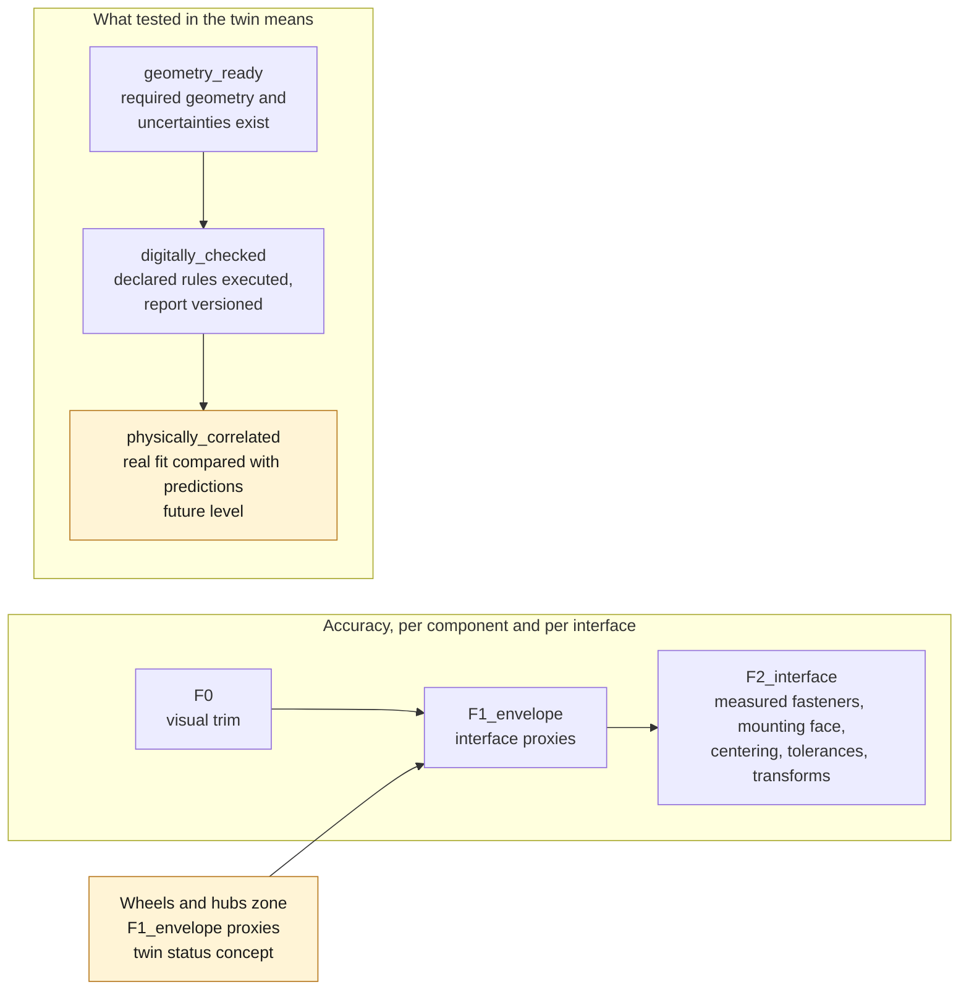

# Porsche 993 digital twin

## Purpose

The twin serves first to inventory, represent and assemble what is known. The
active phase plans no printing. When the evidence allows it, the twin may later
eliminate fitting errors and study mechanical or thermal behavior. It does not
claim to be a certified copy of every 993.

A component enters the active graph only if its size, mass, material and
application are sourced. A logical assembly asserts that parts go together; a
positioned assembly additionally requires their reference frames and 3D
transforms.

The model is built zone by zone: dashboard, door, seat, engine bay, running gear
and body. Accuracy is declared per component and per interface, because a single
zone can combine visual trim at `F0` and measured fasteners at `F2`.



## First geometric slice — dashboard, pending

The MVP assembles:

1. the candidate switch blank;
2. the opening and the thickness of the panel that receives it;
3. the free volume behind the panel;
4. the minimum insertion, overlap, clip-in and setback margins.

The script `twins/993-cabin-dashboard-switch-0001/source/check_fit.py` reads a
measurement record and refuses to compute if a dimension is missing. It produces
a JSON report with the nominal margin and the worst-case guaranteed margin,
uncertainties included.

```bash
python3 twins/993-cabin-dashboard-switch-0001/source/check_fit.py \
  --measurements catalog/measurements/meas-993-dashboard-switch-zone-0001.json \
  --out twins/993-cabin-dashboard-switch-0001/derived/fit-report.json
```

## First geometric integration — wheels and hubs

The register now holds a second active zone:
`TWIN-993-WHEEL-HUB-INTERFACES-0001`. It references four STEP solids
reproducible from the same build123d master:

- Fuchs 7J × 17 ET55, front;
- Fuchs 9J × 17 ET55, rear;
- Fuchs 8J × 18 ET52, front;
- Fuchs 10J × 18 ET65, rear.

These objects are `F1_envelope` interface proxies: nominal cylinder, nominal
width and center bore. They make the components visible and assemblable in
FreeCAD, but reproduce neither the spokes, nor the actual rim profile, nor the
bolt seats. The two hubs remain logical reference frames with no geometry. The
twin is therefore at status `concept`, not `digitally_checked`.


*The sourced state as a register: wheel sets, masses and known interfaces, logically assembled; the brakes are not admitted and the global 3D transforms are unknown. It shows what is recorded, not a positioned or validated assembly.*

Moving to `F2_interface` requires measuring or sourcing the mounting face, the
hub centering, the fastener seat type, the brake envelope, the tolerances and
the transforms in the vehicle frame. Only then can a collision or margin
calculation become numerical evidence.

## Build order

| Slice | Zone | First test |
|---|---|---|
| DT-01 | Dashboard | insertion and clip-in of the switch blank |
| DT-02 | Door | fitting and travel of the door pull |
| DT-03 | Seat rail | symmetry, collision and access to the fasteners |
| DT-04 | Engine bay | carrier interfaces, without structural validation |
| DT-05 | Body-shell frame | tying the zones to the body reference points |

The complete body and the visual scans come afterwards, as context. This
sequence makes it possible to test a first part without waiting months for a
reconstruction of the whole car.

## What "tested in the twin" means

- `geometry_ready`: all required geometry and uncertainties exist;
- `digitally_checked`: all declared rules have been executed and the report is
  versioned;
- `physically_correlated`: a real fit has been compared with the predictions.

Physical correlation remains a future level. For a critical part, a numerical
success will replace neither the engineering review nor the material and fatigue
tests if manufacturing is ever decided.
