# Gallery

The repository's existing figures in one place, grouped by workstream. Every
image below is a computed figure, a CAD render or a diagram. **None is a
photograph of a part, and none is evidence of physical behavior**: each caption
says what the image shows, and the linked page says what it does and does not
prove. Near-duplicates are left out; the `archive/` tree is not shown.

## 964 structure

The torsion model of the 964 body shell, built from a scan and the workshop manual. Explained in [`twins/964-chassis/fea/README.md`](../twins/964-chassis/fea/README.md) and [`twins/964-chassis/README.md`](../twins/964-chassis/README.md).

<table>
<tr>
<td width="33%" valign="top"> Full cell under torsion, rendered from a mesh and result snapshot. A computed field, not a measured car. <a href="../twins/964-chassis/fea/README.md">Explained here</a>.</td>
<td width="33%" valign="top"> What the shell model contains, from bare floor pan to full cell. A model description, not a test. <a href="../twins/964-chassis/fea/README.md">Explained here</a>.</td>
<td width="33%" valign="top"> Load path on the bare floor pan: the side rails carry the load. Computed, not measured. <a href="../twins/964-chassis/fea/README.md">Explained here</a>.</td>
</tr>
<tr>
<td width="33%" valign="top"> How the stiffness mechanism shifts along the architecture ladder, from the 3,000-case corpora. Numerical, not physical. <a href="../twins/964-chassis/fea/README.md">Explained here</a>.</td>
<td width="33%" valign="top"> The architecture ladder in both element orders, with the per-architecture deviation. A model comparison only. <a href="../twins/964-chassis/fea/README.md">Explained here</a>.</td>
<td width="33%" valign="top"><a href="../twins/964-chassis/README.md">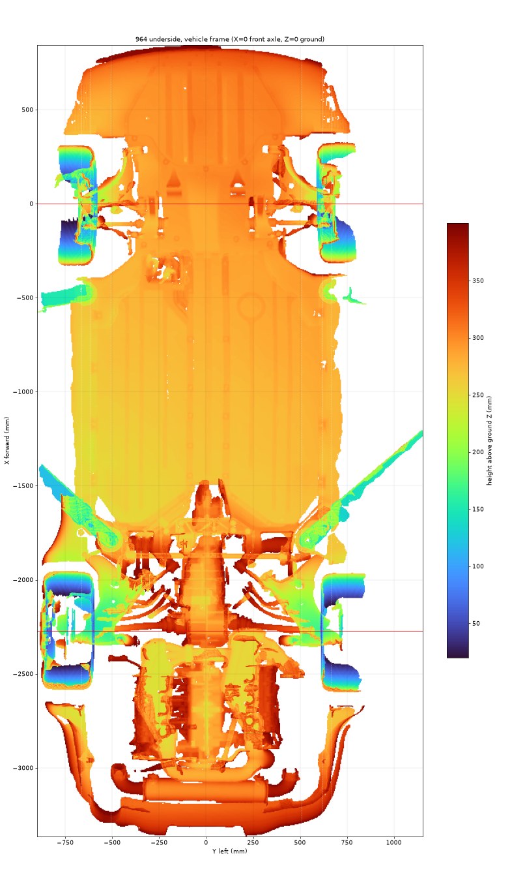</a> The scan after symmetry correction, in the vehicle frame. It locates no datum point. <a href="../twins/964-chassis/README.md">Explained here</a>.</td>
</tr>
<tr>
<td width="33%" valign="top"><a href="../twins/964-chassis/README.md">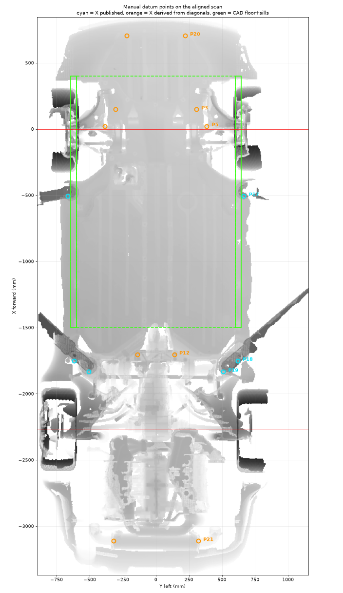</a> The datum network placed on the scan, with P21 landing in the rear bumper area. It proves no datum position. <a href="../twins/964-chassis/README.md">Explained here</a>.</td>
<td width="33%" valign="top"><a href="../twins/964-chassis/fea/README.md">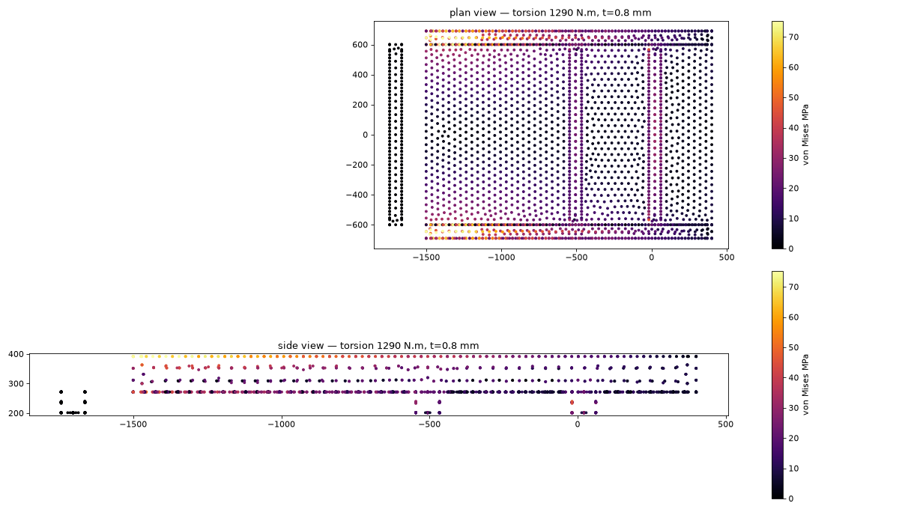</a> An earlier stress plot kept as evidence; it predates the removal of a cross member that carried nothing. <a href="../twins/964-chassis/fea/README.md">Explained here</a>.</td>
</tr>
</table>

## 993 parts: print screens and renders

Geometric LPBF slicing screens (labels in French) and Omniverse renders of F0/F1 concepts. Each slicing screen shows a real section at every layer and a proxy support envelope; none is a laser toolpath, a machine file or a distortion result, and printing stays prohibited for every part. See [`AM_VALIDATION_PIPELINE.md`](AM_VALIDATION_PIPELINE.md) and the dossiers in [`docs/993/`](993/).

<table>
<tr>
<td width="33%" valign="top"> Exhaust manifold F0, IN625, build_z, 40 µm. Geometry only. <a href="993/993_EXHAUST_MANIFOLD_IN625_F0.md">Explained here</a>.</td>
<td width="33%" valign="top"> K16 turbine wheel F0, IN718, roll_y_45. The F0 itself is rejected on its screens. <a href="993/993_K16_TURBINE_WHEEL_IN718_F0.md">Explained here</a>.</td>
<td width="33%" valign="top"> Intercooler bracket F0, Ti-6Al-4V, build_x. Provisional route is CNC. <a href="993/993_INTERCOOLER_BRACKET_TI_F0.md">Explained here</a>.</td>
</tr>
<tr>
<td width="33%" valign="top"> Left turbo heat shield F0, IN625, build_x. Geometry only. <a href="993/993_TURBO_HEAT_SHIELD_IN625_F0.md">Explained here</a>.</td>
<td width="33%" valign="top"><a href="993/993_DOOR_OPENER_LEVER_ALSI10MG_F0.md">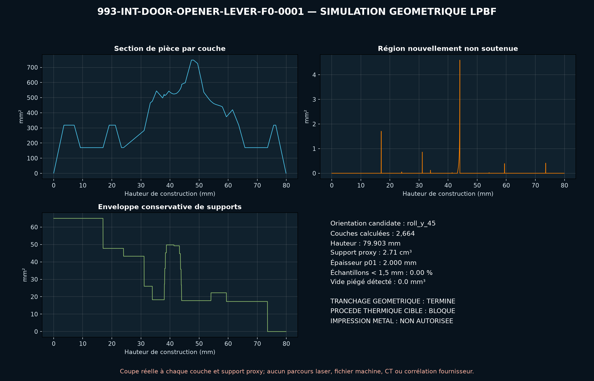</a> Door opener lever F0, roll_y_45, 2,664 layers. No print authorized. <a href="993/993_DOOR_OPENER_LEVER_ALSI10MG_F0.md">Explained here</a>.</td>
<td width="33%" valign="top"><a href="993/993_SWITCH_TRIM_RING_F1.md">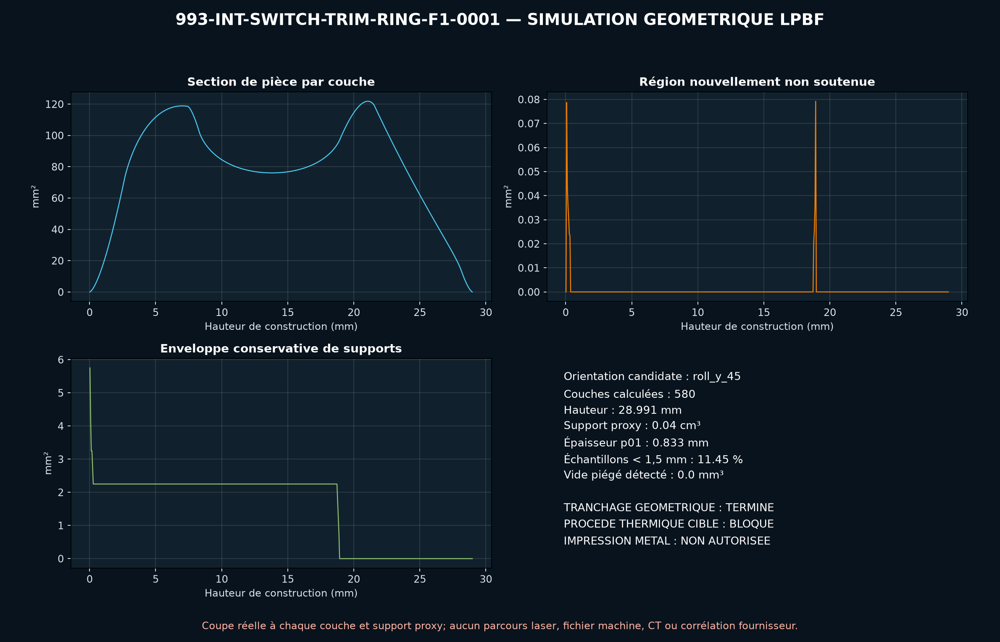</a> Switch trim ring F1 at 50 µm, 580 layers; the ring has since moved to a turned route. <a href="993/993_SWITCH_TRIM_RING_F1.md">Explained here</a>.</td>
</tr>
<tr>
<td width="33%" valign="top"><a href="993/993_EMBOUT_TITANE_F1.md">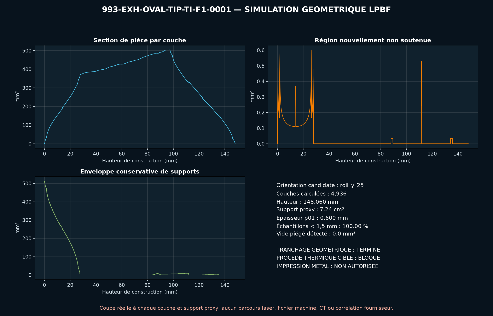</a> Titanium exhaust tip F1, roll_y_25. Depowdering of the annular channel is not demonstrated. <a href="993/993_EMBOUT_TITANE_F1.md">Explained here</a>.</td>
<td width="33%" valign="top"><a href="993/993_OVAL_EXHAUST_TIP_IN625_F0.md">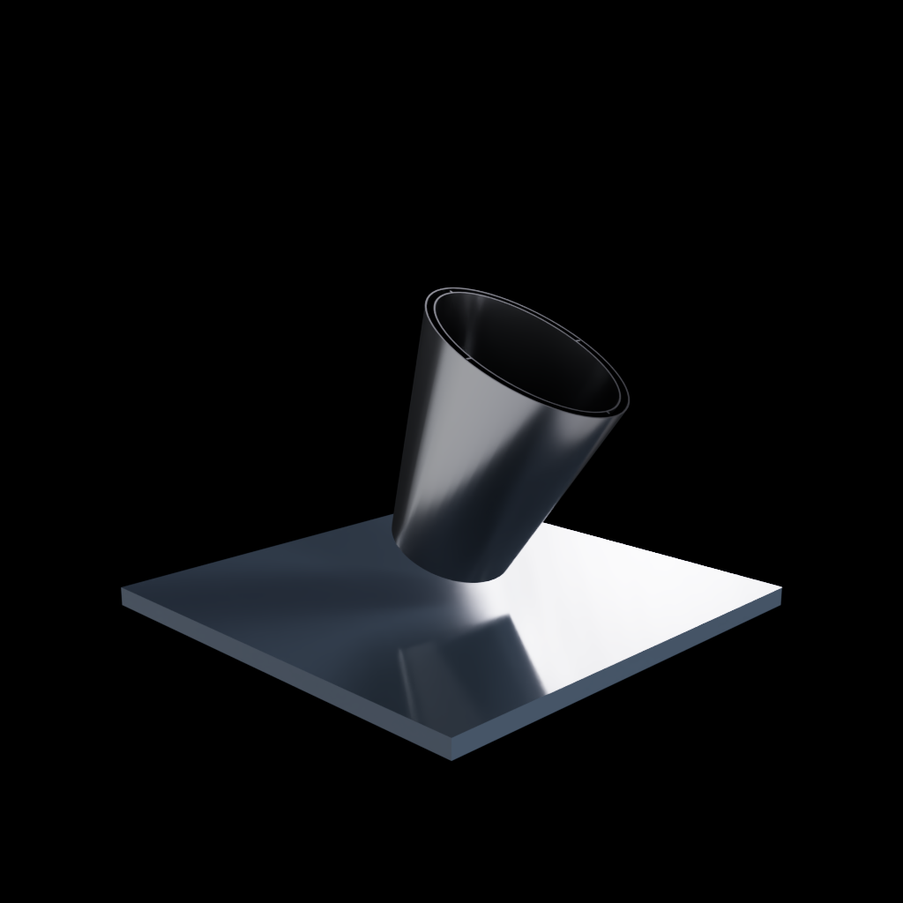</a> Oval tip on a nominal EOS M 290 plate in roll_y_25. No supports, toolpath or recoater collision. <a href="993/993_OVAL_EXHAUST_TIP_IN625_F0.md">Explained here</a>.</td>
<td width="33%" valign="top"><a href="993/993_OVAL_EXHAUST_TIP_IN625_F0.md">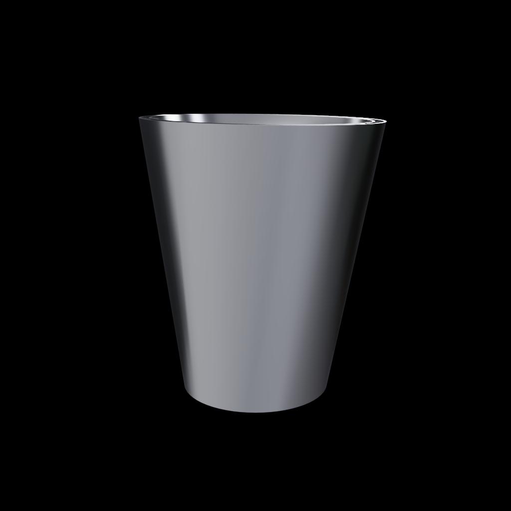</a> Isolated SimReady asset of the oval tip. An inspection prop, not a fitted part. <a href="993/993_OVAL_EXHAUST_TIP_IN625_F0.md">Explained here</a>.</td>
</tr>
<tr>
<td width="33%" valign="top"><a href="993/993_OVAL_EXHAUST_TIP_IN625_F0.md">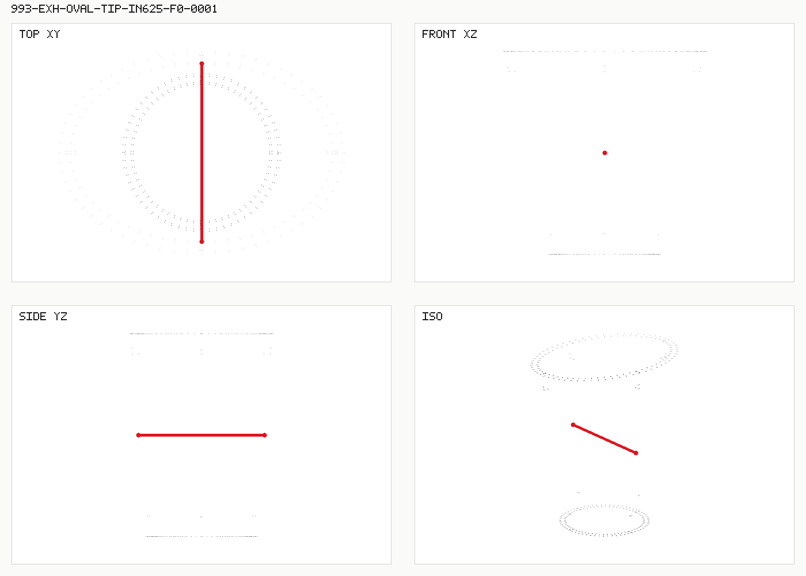</a> Grasp annotation reviewed visually; not a gripper validation. <a href="993/993_OVAL_EXHAUST_TIP_IN625_F0.md">Explained here</a>.</td>
<td width="33%" valign="top"> Piston F0 in roll_y_45 on a nominal Sapphire plate. The F0 is rejected on its hot screen. <a href="993/993_PISTON_CP1_COOLING_GALLERY_F0.md">Explained here</a>.</td>
<td width="33%" valign="top"> Isolated piston prop rendered in OVRTX; the engine interfaces are absent. <a href="993/993_PISTON_CP1_COOLING_GALLERY_F0.md">Explained here</a>.</td>
</tr>
</table>

## M64 cylinder head

The synthetic, non-qualified M64 head twin: CAD sections, mesh-quality counts and valvetrain screens. Each image is explained in its report under [`docs/reports/`](reports/).

<table>
<tr>
<td width="33%" valign="top"> Placeholder layout of the G1 skeleton, not sourced M64 dimensions. <a href="reports/M64_G1_PARAMETRIC_SKELETON_20260914.md">Explained here</a>.</td>
<td width="33%" valign="top"> G2 head section used for the compression audit; no sealed chamber is proven. <a href="reports/M64_G2_COMPRESSION_AUDIT_20260924.md">Explained here</a>.</td>
<td width="33%" valign="top"> Synthetic plug envelopes in section; no physical sealing or supplier fit. <a href="reports/M64_G2_SPARK_PLUG_PACKAGING_20260924.md">Explained here</a>.</td>
</tr>
<tr>
<td width="33%" valign="top"> Candidate intake seat in section; no sealing, contact pressure or manufacturability proven. <a href="reports/M64_G3_SEAT_CONTACT_20260925.md">Explained here</a>.</td>
<td width="33%" valign="top"><a href="reports/M64_FOUR_VALVE_DISTRIBUTION_MODULE_20260907.md">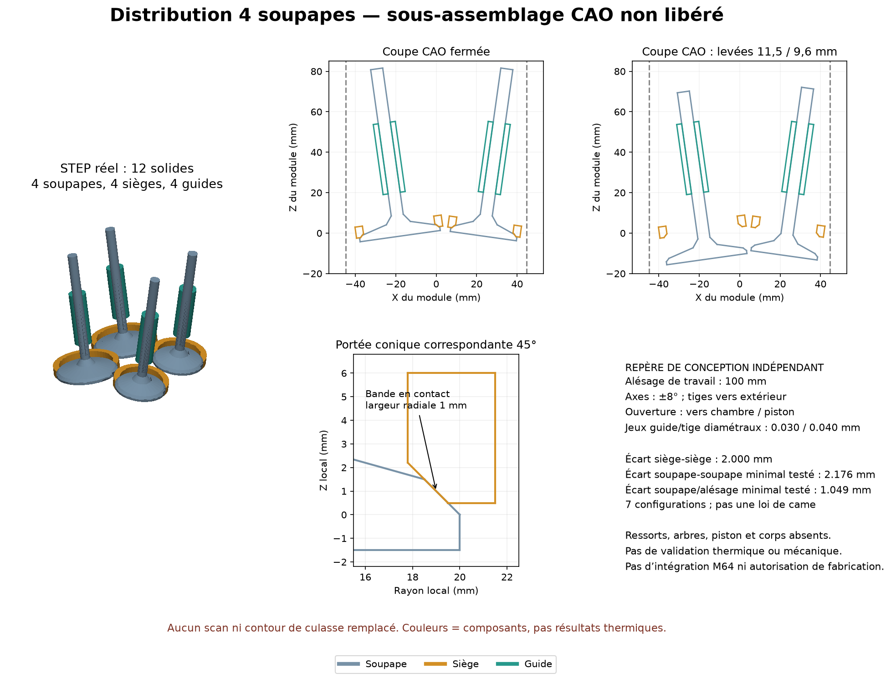</a> V2 sub-assembly from the reimported STEP; no head body, no engine fit. <a href="reports/M64_FOUR_VALVE_DISTRIBUTION_MODULE_20260907.md">Explained here</a>.</td>
<td width="33%" valign="top"><a href="reports/M64_V1_VALVETRAIN_20260914.md">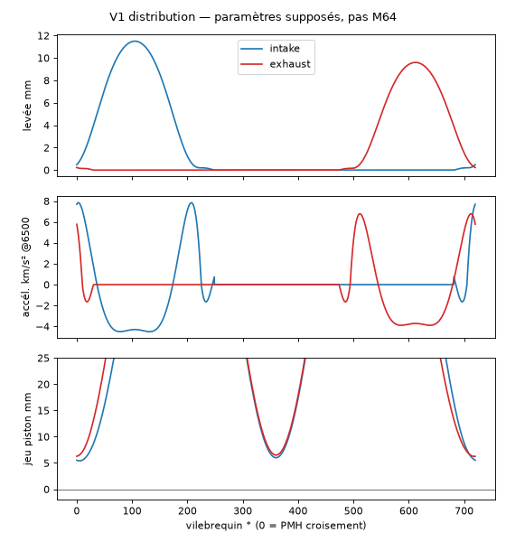</a> V1 lift, acceleration and piston clearance on assumed parameters, not M64 ones (labels in French). <a href="reports/M64_V1_VALVETRAIN_20260914.md">Explained here</a>.</td>
</tr>
<tr>
<td width="33%" valign="top"><a href="reports/M64_V1_VALVETRAIN_20260914.md">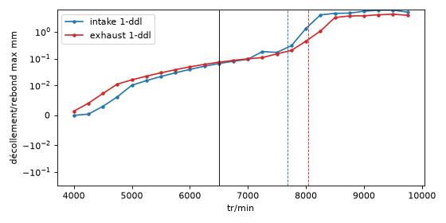</a> One-degree-of-freedom float sweep against speed; a model trend, not a rig result. <a href="reports/M64_V1_VALVETRAIN_20260914.md">Explained here</a>.</td>
<td width="33%" valign="top"> Candidate face groups on the scan-derived reference; a proposal, not a thermal result. <a href="reports/M64_THERMAL_FACE_PROPOSALS.md">Explained here</a>.</td>
<td width="33%" valign="top"><a href="reports/M64_SURFACE_METHOD_COMPARISON_20260909.md">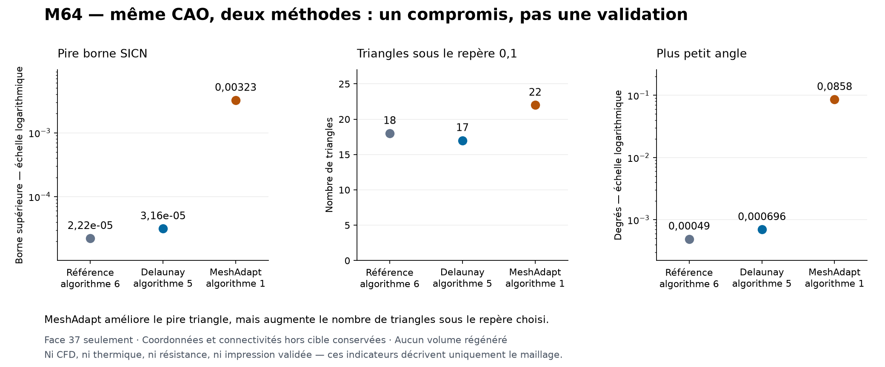</a> Mesh indicators of two trials; nothing about engine performance. <a href="reports/M64_SURFACE_METHOD_COMPARISON_20260909.md">Explained here</a>.</td>
</tr>
<tr>
<td width="33%" valign="top"> Mesh defect counts only, not a physical field or an accepted mesh. <a href="reports/M64_HYBRID_PAIR_CORRECTION_20260909.md">Explained here</a>.</td>
<td width="33%" valign="top"> Computed coupon values over a common window; not melt-pool measurements. <a href="reports/M64_F58_CORRECTED_COUPON_20260908.md">Explained here</a>.</td>
<td width="33%" valign="top"><a href="reports/M64_LOCAL_BERNSTEIN_REPAIR_20260907.md">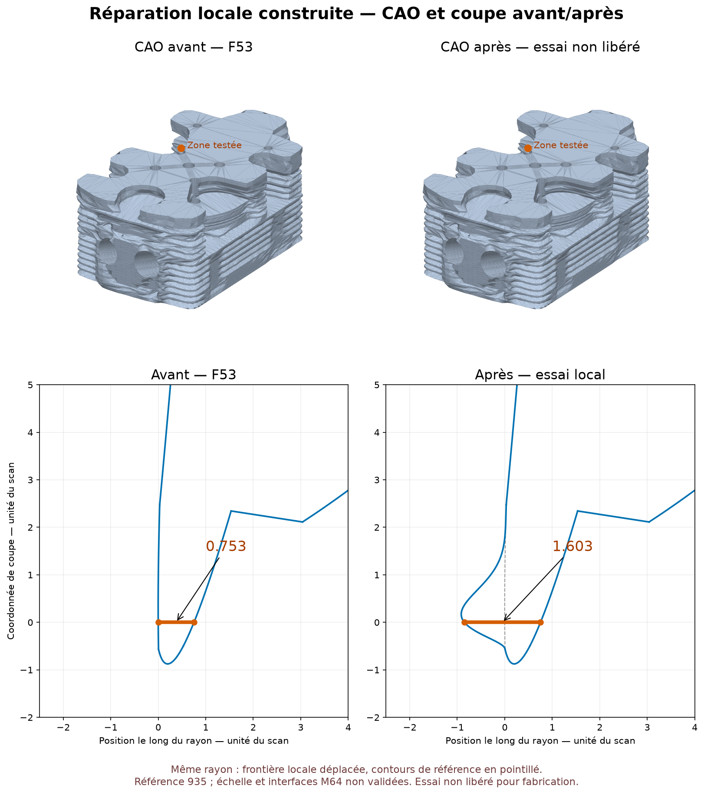</a> Before/after section of a local surface repair; a diagnostic, not a released geometry. <a href="reports/M64_LOCAL_BERNSTEIN_REPAIR_20260907.md">Explained here</a>.</td>
</tr>
</table>

## Digital twin and pipeline diagrams

Logical diagrams of the twin state and of the M64 execution chain. Some labels are in French. They show planned or recorded relationships, not results.

<table>
<tr>
<td width="33%" valign="top"> Sourced twin state as a register: wheel sets and known interfaces; brakes not admitted, 3D positions unknown. <a href="DIGITAL_TWIN.md">Explained here</a>.</td>
<td width="33%" valign="top"><a href="reports/M64_MULTIPHYSICS_EXECUTION.md"></a> The planned tool chain from scan to OpenUSD; a plan, not an executed validation. <a href="reports/M64_MULTIPHYSICS_EXECUTION.md">Explained here</a>.</td>
<td width="33%" valign="top"><a href="reports/M64_MULTIPHYSICS_EXECUTION.md"></a> The validation gates in order, with their loops back to CAD; no gate is shown as passed. <a href="reports/M64_MULTIPHYSICS_EXECUTION.md">Explained here</a>.</td>
</tr>
<tr>
<td width="33%" valign="top"><a href="reports/M64_PICOGK_EXECUTION.md"></a> How a rented compute run is bounded and cleaned up; a procedure, not a result. <a href="reports/M64_PICOGK_EXECUTION.md">Explained here</a>.</td>
<td width="33%" valign="top"> The research chain for the 700 PS target, ending on a question: are the criteria proven on the same product? Nothing in it is demonstrated. <a href="reports/M64_700CH_ENGINE_RESEARCH.md">Explained here</a>.</td>
</tr>
</table>

## 917 line (archived)

**Archived line.** The 917 work is retired as a product and kept as a numerical regression; see [`ARCHIVE.md`](../ARCHIVE.md) and [`twins/reference-917-engine/README.md`](../twins/reference-917-engine/README.md). Metal printing and engine start remain prohibited. Labels are in French.

<table>
<tr>
<td width="33%" valign="top"><a href="../twins/reference-917-engine/README.md">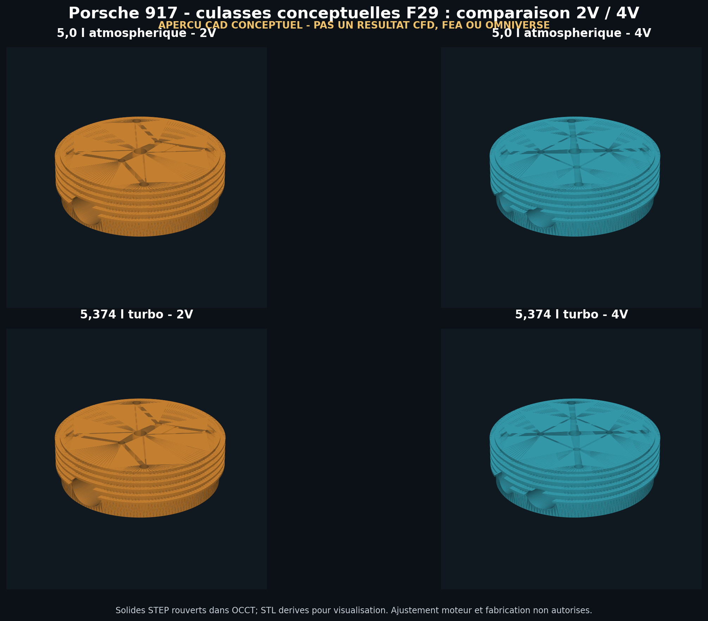</a> F29 clean-sheet solids reopened in OCCT; a CAD preview, not a CFD, FEA or Omniverse result. <a href="../twins/reference-917-engine/README.md">Explained here</a>.</td>
<td width="33%" valign="top"><a href="../twins/reference-917-engine/README.md">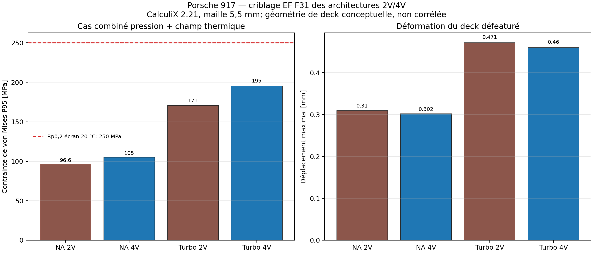</a> Uncorrelated CalculiX results on a defeatured deck; a comparison under one model only. <a href="../twins/reference-917-engine/README.md">Explained here</a>.</td>
<td width="33%" valign="top"><a href="../twins/reference-917-engine/evidence/f39-functional-video/README.md">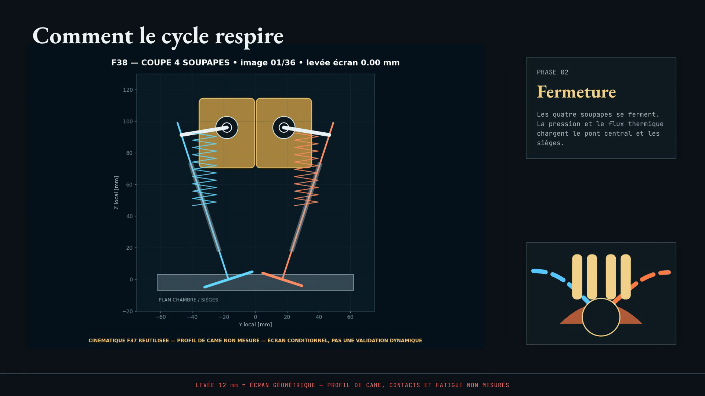</a> An explanatory frame reusing F37 kinematics with an unmeasured cam profile; not a dynamic validation. <a href="../twins/reference-917-engine/evidence/f39-functional-video/README.md">Explained here</a>.</td>
</tr>
<tr>
<td width="33%" valign="top"><a href="../twins/reference-917-engine/README.md">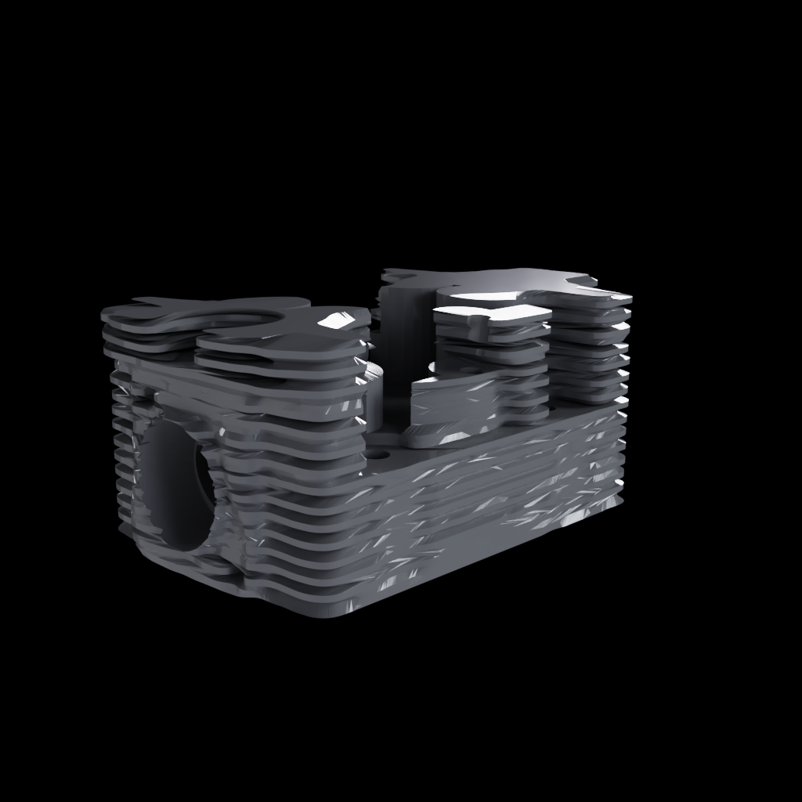</a> Shows that the USD opens and renders with a closed topology; not a photograph of a part. <a href="../twins/reference-917-engine/README.md">Explained here</a>.</td>
<td width="33%" valign="top"><a href="../twins/reference-917-engine/evidence/f49-solid/README.md">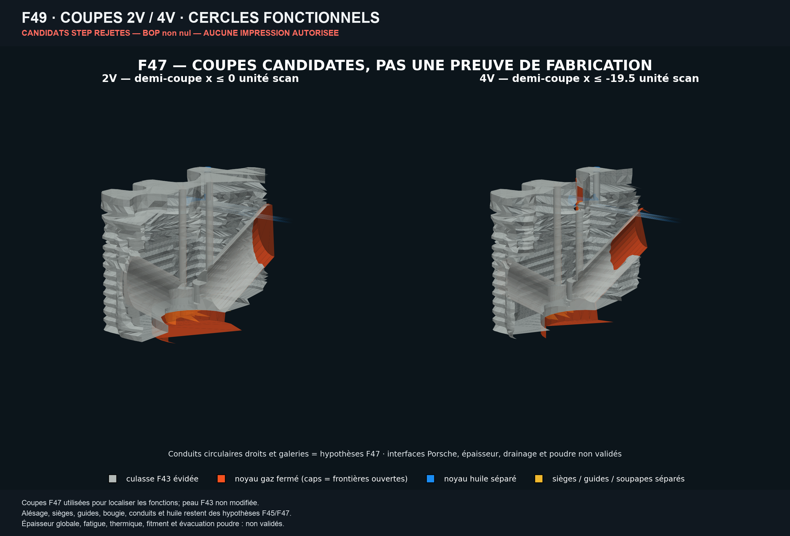</a> Candidate sections whose STEP files were rejected; not a proof of manufacture. <a href="../twins/reference-917-engine/evidence/f49-solid/README.md">Explained here</a>.</td>
<td width="33%" valign="top"><a href="../README.md">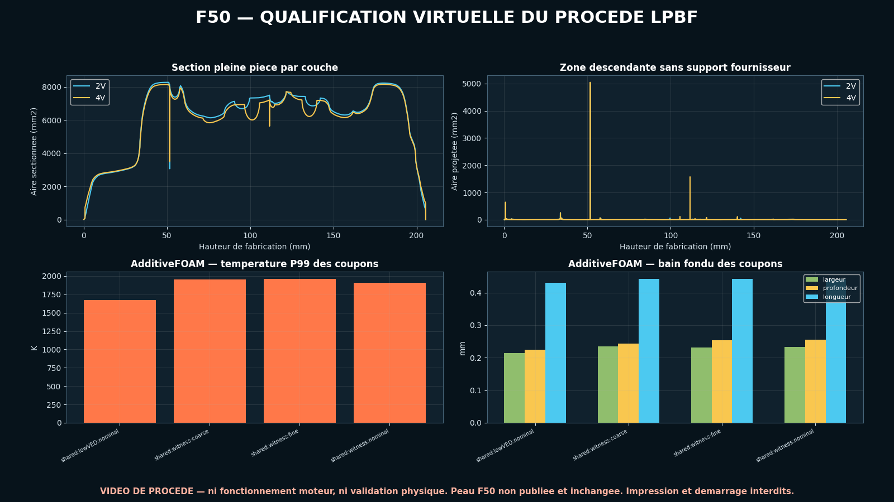</a> Virtual process screening; neither engine operation nor physical validation. <a href="../README.md">Explained here</a>.</td>
</tr>
</table>

---

*43 images. Adding one: link an existing file only, with a caption that says what it shows and what it does not prove (see [`TRANSLATION.md`](TRANSLATION.md), "Diagrams and images").*
