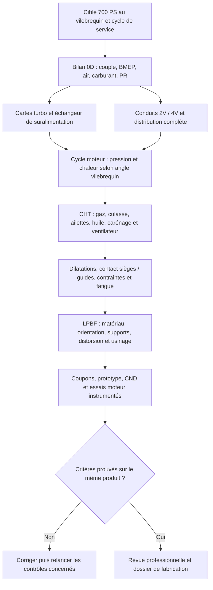

# M64 biturbo 700 ch : cible calculable et recherche moteur

État au 7 septembre 2026 : **dimensionnement exploratoire**, pas puissance
obtenue, ni validation thermique, mécanique ou d'impression. La cible utilisateur
est interprétée comme **700 ch métriques (PS) au vilebrequin**, soit
**514,849 kW / 690,424 hp mécaniques**. Le protocole de correction de banc, la
durée à pleine charge et le moteur donneur exact restent à définir. Une cible
aux roues serait différente : aucun rendement de transmission n'est inventé.

Cette recherche complète, sans les remplacer, le
[registre des interfaces](M64_INTERFACE_SOURCE_REGISTER.md), les
[références de soupapes](M64_VALVE_MODULE_PRIMARY_REFERENCES_20260907.md) et le
[module quatre soupapes](M64_FOUR_VALVE_DISTRIBUTION_MODULE_20260907.md).
Elle ne modifie ni les interfaces inconnues ni la géométrie actuelle.

## Base documentaire : ne pas confondre les moteurs

| Base | Fait primaire utile | Conséquence de conception |
| --- | --- | --- |
| 964 Turbo 3,6 | Porsche distingue son M64 du M30 de la précédente 3,3 ; alésage × course 100 × 76,4 mm et compression 7,5:1. [P1](https://newsroom.porsche.com/en/history/porsche-history-white-giants-991-turbo-964-turbo-3-6-993-turbo-s-13863.html) | Référence mono-turbo distincte ; ne pas lui attribuer automatiquement les pièces de la 993. |
| 993 Turbo | Porsche confirme 3,6 L, deux turbocompresseurs et 300 kW / 408 PS en version initiale. [P3, allemand](https://newsroom.porsche.com/de/pressemappen/60-Jahre-Porsche-911/30-Jahre-911-Carrera-der-Generation-993-%E2%80%93-Der-letzte-seiner-Art.html) | Baseline documentaire préférée pour un M64 biturbo, sans prétendre avoir identifié le donneur. |
| 993 Turbo S | 100 × 76,4 mm et 8,0:1 publiés par Porsche. [P1](https://newsroom.porsche.com/en/history/porsche-history-white-giants-991-turbo-964-turbo-3-6-993-turbo-s-13863.html) | Le diamètre d'alésage n'est ni celui du registre de culasse ni une échelle de scan. |
| 993 GT2 | Porsche nomme explicitement M64/60 R : six cylindres, 3 600 cm³, 100 × 76,4 mm, 8,0:1, 316 kW / 430 PS à 5 750 tr/min. [P2, allemand](https://newsroom.porsche.com/de/2024/szene-passion/porsche-911-993-gt2-coppa-florio-35734.html) | Le suffixe R ne doit pas disparaître dans un contrat d'interfaces censé désigner un M64/60 quelconque. |

Le calcul retient **3,600 L nominaux**, pas une cylindrée mesurée. Appliquer
la formule géométrique à 100 × 76,4 mm produit environ 3,6003 L : l'arrondi
de fiche commerciale ne constitue pas une incohérence métrologique.
Le cas 3,8 L est uniquement une sensibilité ; aucun alésage, cylindre ou
usinage du carter n'est sélectionné pour lui.

## Quatre soupapes : benchmark réel, ensemble mécanique complet

Swindon commercialise bien un kit 24 soupapes pour M64 refroidi à air et
annonce une distribution conçue jusqu'à 12 000 tr/min, utilisant
l'entraînement et la lubrification d'origine. C'est une déclaration fabricant
relative à son kit, pas un régime admis pour notre moteur turbo.
[S1, Swindon](https://swindonpowertrain.com/products/24-valve-porsche-911-m64-cylinder-head-kit/)

Le registre existant conserve les valeurs de sa fiche : admission 40 mm,
échappement 33 mm, levées 11,5 / 9,6 mm, durées 255° / 245° à 1 mm.
Elles fournissent un benchmark, **pas une loi de came**, ni la position de
ses axes. Ses rapports nominaux 11,5–12:1 et ses pistons associés ne sont
pas repris comme réglage turbo. Les porte-arbres, linguets, ressorts, sièges,
guides et retours d'huile font partie du problème, pas seulement les quatre
orifices. [Registre avec localisateurs de la fiche](M64_INTERFACE_SOURCE_REGISTER.md)

La comparaison 2V/4V devra garder cylindrée, carburant, charge, pression
d'admission et protocole thermique identiques. Une amélioration ne sera
retenue que si elle apparaît dans les débits, le travail de pompage, les
températures et la tenue, avec les incertitudes correspondantes.

## Gunther Werks : le refroidissement système est la piste transférable

La fiche officielle Turbo consultée annonce 4,0 L biturbo, 850 bhp,
600 lb-ft et un régime limite de 7 500 tr/min, avec ventilateur plat.
Ce sont des annonces du constructeur ; cette page ne livre pas la courbe
brute de banc et son protocole. [W1](https://guntherwerks.com/programs/turbo/)

La page F-26 est **internement incohérente** lors de la consultation :
l'en-tête affiche 1 067 hp, mais la fiche annonce 1 000 horsepower à
7 600 tr/min et 750 lb-ft à 5 600 tr/min. Ne pas fusionner ces chiffres.
La fiche décrit un moteur à air, un ventilateur plat, un échangeur de
suralimentation air/eau, un carter sec et une capacité à utiliser l'éthanol.
Elle ne fournit pas nos charges de culasse ni une définition 4V réutilisable.
[W2](https://guntherwerks.com/programs/f26/)

**Inférence pour notre projet :** comparer les carénages, la répartition du
débit entre les six cylindres et l'échangeur de suralimentation, en plus des
ailettes. Le terme « refroidi à air » n'interdit pas un échangeur air/eau
séparé. Il ne justifie pas non plus d'ajouter une galerie d'huile sans vérifier
débit, pression, dégazage, retour au carter sec et échangeur d'huile disponible.
L'affirmation fabricant d'un gain de débit de ventilateur n'est pas une carte
débit/pression utilisable directement dans notre CFD.

## Calcul 0D exécuté, unités et hypothèses

Le [contrat 700 PS](../twins/m64-cylinder-head/targets/700ps-biturbo.json)
sépare cible utilisateur, références, hypothèses, inconnues et qualifications
toutes à `false`. Le [calculateur](../twins/m64-cylinder-head/targets/700ps_envelope.py)
produit un [résultat reproductible](../twins/m64-cylinder-head/targets/700ps-balance-20260907.json)
lié aux SHA-256 du contrat et du script. Pas de GPU requis pour ce bilan.

Pour un moteur quatre temps, avec N en tr/min et Vd en m³ :

```text
P [W] = PS × 735,49875
C [N m] = P / (2 pi N / 60)
BMEP [Pa] = 120 P / (Vd N) = 4 pi C / Vd
débit carburant [kg/s] = P [kW] × BSFC [kg/kWh] / 3600
AFR = lambda × AFR stoechiométrique
débit air = débit carburant × AFR
p_admission_abs = débit air × R_air × T_admission / (VE × Vd × N / 120)
PR_compresseur = (p_admission_abs + pertes aval) / (p_atmosphère - pertes amont)
T_sortie = T_entrée × [1 + (PR^((gamma-1)/gamma)-1) / eta_compresseur]
Q_echangeur [W] = débit air × cp × (T_sortie - T_admission)
```

VE est ici rapporté à la **densité au collecteur**, pas à l'air extérieur.
Deux turbos parallèles partagent le débit massique ; on ne divise pas leur
rapport de pression par deux. Le débit corrigé fourni utilise explicitement
288,15 K / 101 325 Pa : vérifier la convention de chaque carte fabricant
avant de le placer dessus.

Garrett explique la méthode puissance–BSFC–AFR et donne 0,50–0,60 lb/hp/h
et davantage comme ordre de grandeur essence turbo. Notre plage
0,30–0,38 kg/kWh et les autres axes sont des choix de sensibilité, pas une
carte M64 mesurée. L'AFR stœchiométrique générique 14,7 ne définit pas un
carburant SP98/E10 réel ; 43 MJ/kg est un PCI exploratoire. L'éthanol exige
une nouvelle composition, stœchiométrie, BSFC et vérification des matériaux.
[G1, méthode Garrett](https://www.garrettmotion.com/news/newsroom/article/how-to-select-a-turbo-part-2-understanding-calculations-to-turbo-any-engine/)

### Cas central exploratoire

Hypothèses : 6 500 tr/min, 3,6 L, BSFC 0,34 kg/kWh, lambda 0,82,
VE 0,95, admission 60 °C, air compresseur 25 °C, pression atmosphérique
1,01325 bar, pertes amont/aval 0,03 / 0,15 bar, rendement compresseur 0,72.
Les propriétés de l'air sont constantes dans ce modèle réduit.

| Grandeur calculée | Résultat | Sens exact |
| --- | --- | --- |
| Couple / BMEP | 756,4 N m / 26,40 bar | Requis au point 700 PS, pas mesuré |
| Carburant | 175,05 kg/h | Dépend du BSFC supposé |
| Air moteur / par turbo | 0,586 / 0,293 kg/s | Parité idéale des deux bancs |
| Débit réel par turbo | 38,77 lb/min | Ne pas confondre avec débit corrigé |
| Débit corrigé par turbo | 40,64 lb/min | À notre référence explicitée ci-dessus |
| Collecteur | 3,026 bar absolus / 2,012 bar relatifs locaux | Besoin 0D, **pas consigne de boost** |
| Rapport de pression compresseur | 3,230 | Pertes incluses, pas marge à la survitesse |
| Température sortie compresseur | 189,8 °C | Air parfait, rendement supposé |
| Charge thermique échangeur de suralimentation | 76,44 kW | Pour atteindre 60 °C dans ce cas réduit |
| Puissance chimique PCI | 2 090,9 kW | Ne devient pas intégralement de la chaleur dans la culasse |

La différence carburant–puissance arbre de 1 576,0 kW contient notamment
l'énergie des gaz d'échappement et les autres rejets. **Ce n'est pas la
puissance à imposer aux ailettes.** La BMEP est un travail par volume balayé :
elle ne donne ni p_max, ni le gradient de pression, ni le cliquetis.

### Sensibilités calculées

Chaque ligne ci-dessous garde les hypothèses centrales sauf le régime. Ce
sont des positions alternatives du pic de 700 PS, **pas une courbe plate à
700 PS**.

| Régime tr/min | Couple N m | BMEP bar | Collecteur bar absolus | PR compresseur |
| --- | --- | --- | --- | --- |
| 6 000 | 819,4 | 28,60 | 3,278 | 3,486 |
| 6 500 | 756,4 | 26,40 | 3,026 | 3,230 |
| 7 000 | 702,3 | 24,52 | 2,810 | 3,010 |
| 7 500 | 655,5 | 22,88 | 2,622 | 2,820 |

À 6 500 tr/min, améliorer VE de 0,85 à 1,05 fait passer le besoin collecteur
de 3,382 à 2,738 bar absolus dans ce modèle. C'est une motivation quantitative
pour comparer les conduits/4V ; le gain de VE n'est pas acquis. À pression
atmosphérique 0,85 bar, le même cas central exige PR 3,873 et environ
94,6 kW à l'échangeur, au lieu de PR 3,230 / 76,4 kW.

Le calcul comprend 20 points à un facteur et 128 combinaisons d'extrémités
sur sept axes. Ces dernières donnent 0,492–0,687 kg/s d'air total et
PR 1,956–5,734. **Ce grand intervalle n'est ni une plage utilisable ni un
intervalle statistique** : certains coins seront éliminés par les cartes
turbo, le cliquetis ou la thermique. Il expose le coût des hypothèses non
figées, plutôt que de masquer ces cas derrière un seul résultat favorable.

## Turbos : comparer les cartes avant de louer davantage

Deux G25-550 et deux EFR 6258 sont des candidats à examiner, pas des achats
ni des sélections validées. Garrett précise que sa capacité HP dérive du
débit limite de la carte, non d'un résultat moteur garanti ; le G25-550 a
une limite publiée de 185 000 tr/min et des raccords de refroidissement eau.
Le refroidissement du CHRA et l'arrêt à chaud doivent donc entrer dans
l'architecture, même si la culasse reste à air.
[G2, fabricant](https://www.garrettmotion.com/de/racing-and-performance/performance-catalog/turbo/g-series-g25-550/)

BorgWarner fournit les cartes et encombrements EFR ainsi que MatchBot.
L'étude suivante devra confronter débit **corrigé**, PR, pompage, étranglement,
vitesse d'arbre, rendement, débit turbine, contre-pression et réponse
transitoire. Aucun point de notre rapport n'a encore été qualifié sur ces
cartes ; additionner deux puissances de catalogue ne suffit pas.
[B1, cartes EFR officielles](https://www.borgwarner.com/aftermarket/boosting-technologies/performance-turbochargers/efr-series-turbochargers)

## Comment ce travail alimente les calculs de culasse



[Rendu SVG](../diagrams/m64-700ps-execution.svg),
[PNG](../diagrams/m64-700ps-execution.png) et
[version éditable Excalidraw](../diagrams/m64-700ps-execution.excalidraw).

Le contrat garde quelques points de charge indépendants (pression maximale
80/120/160 bar, températures gaz/métal/huile distinctes) **explicitement
exploratoires**, non bornants et non déduits de 700 PS. Ils ne constituent
pas un cas solveur prêt : il manque la trace pression–angle, les transferts,
les charges de serrage et leur provenance. Une étude hypothétique doit
conserver cette étiquette jusque dans les vues Omniverse et les conclusions.

Prochaines données qui changent réellement le produit : débit/pression du
ventilateur et des carénages, courbes de conduits aux levées utiles, loi de
distribution, pression turbine, carte thermique matière après LPBF et
traitement, capacité de lubrification, interfaces de montage sourcées, cycle
de charge. Cantera/Wiebe ne créent pas seuls ces mesures ni un modèle de
cliquetis qualifié. Une température de gaz n'est jamais appliquée comme une
température uniforme de métal pour prétendre valider la dissipation.

## Exécution et vérifications

```sh
python3 twins/m64-cylinder-head/targets/700ps_envelope.py --output /tmp/m64-700ps-new-run.json
python3 -m unittest discover -s tests -p test_m64_700ps_envelope.py -v
```

Le chemin de sortie doit être neuf ; le calcul refuse d'écraser un résultat.
**14 tests concentrés passent** : unités PS/hp, identité indépendante
couple/BMEP, bilan masse et gaz parfait, exemple Garrett converti en SI,
répartition biturbo, altitude, pressions absolues, sensibilité régime,
entrées invalides, conflits de cible, empreintes et reproduction du rapport.
Ce sont des tests du calculateur, pas un essai du moteur.

Les sources web primaires ci-dessus ont été consultées directement pendant
cette recherche. La lecture complémentaire du PET 993 via le service web a
échoué : aucune nouvelle cote n'en a été promue. Aucune image constructeur,
aucun manuel, scan privé ou dessin fournisseur n'est ajouté. Aucun coût
Vast, achat ou contact externe n'est engagé par ce module de recherche.
