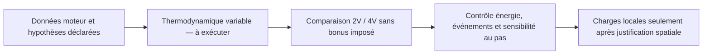

# M64 700 PS — contre-calcul thermodynamique et limites des modèles hérités

Le contre-calcul vérifie des équations et leur intégration, **pas une charge moteur validée**. Il ne démontre ni un gain du 4V, ni une tenue thermique ou mécanique, ni une aptitude à fabriquer la culasse. Le bilan 700 PS reste inchangé.

## Ce que les anciens modèles ne démontrent pas

- [F33](../twins/reference-917-engine/source/run_integrated_virtual_validation_f33.py) impose au 4V un coefficient de remplissage multiplié par `1.035` et un facteur de durée de combustion distinct. Ces avantages sont des entrées du modèle, pas des améliorations établies par les conduits ou les soupapes.
- [F46](../twins/reference-917-engine/source/run_cantera_2v_4v_crank_cycle_f46.py) concerne un autre moteur : 90 × 70,4 mm, 12 cylindres, 9 000 tr/min et rapport volumétrique 9,5. Sa branche cinétique utilise du n-dodécane et une auto-inflammation, pas une essence 98 RON à allumage commandé qualifiée.
- Dans F46, la capture de masse à la fermeture d'admission reste codée à `230°`. Modifier uniquement le contrat de distribution ne suffit donc pas pour une adaptation M64 correcte.
- Son échange thermique global, dit « Woschni-like », est un coefficient de présélection non calibré. La surface additionne deux surfaces de piston et la chemise exposée : ce n'est pas le flux local de la culasse.

L'[exemple moteur officiel Cantera](https://cantera.org/3.2/examples/python/reactors/ic_engine.html) est lui-même une illustration diesel simplifiée. Sa disponibilité ne valide pas son transfert à notre moteur.

## Données reprises et hypothèses déclarées

Le [bilan figé](../twins/m64-cylinder-head/targets/700ps-balance-20260907.json) décrit un scénario, pas un relevé au banc :

| Grandeur | Valeur et portée |
|---|---|
| Objectif moteur | 700 PS métriques au vilebrequin, 514,849 kW ; 6 cylindres, 6 500 tr/min, 3,6 L nominaux |
| Consommation et carburant | BSFC 0,34 kg/kWh, PCI 43 MJ/kg, AFR stœchiométrique 14,7 : hypothèses de bilan |
| Richesse | λ = 0,82 ; φ = 1/λ = 1,219512 ; la composition chimique reste à définir |
| Masse par combustion et par cylindre | Air 1,803450 g ; carburant 0,149614 g, issus du bilan à 325 événements/s |
| Référence géométrique documentaire | 100 × 76,4 mm et rapport volumétrique 8:1 pour la 993 Turbo S ; pas une certification des interfaces ou de la chambre 4V |
| Hypothèses propres au témoin | Bielle/manivelle 3,5 ; fermeture admission −130°, ouverture échappement +140°, zéro résidu ; angles référencés au PMH combustion |

La géométrie documentaire provient de [Porsche](https://newsroom.porsche.com/en/history/porsche-history-white-giants-991-turbo-964-turbo-3-6-993-turbo-s-13863.html). Elle donne 3,600265 L calculés, distincts de l'arrondi nominal à 3,6 L utilisé dans le bilan.

## Contre-calcul réellement exécuté

Un script local autonome a intégré uniquement la course fermée, sans nouvelle CAO, location ou installation de Cantera. Le fluide est un **gaz parfait à propriétés constantes** (`R = 287,05 J/kg/K`, `γ = 1,35`), sans conversion d'espèces. La masse air + carburant est supposée piégée ; `T_IVC = 333,15 K` et `p_IVC = mRT/V`, sans imposer cette pression égale à celle du collecteur.

Le dégagement de chaleur prescrit est une loi de Wiebe normalisée :

```text
x_b = [1 − exp(−a z^(m+1))] / [1 − exp(−a)],  z = (θ − θ0)/Δθ, limité à [0,1]
Q_prescrit = η_comb × m_carburant × PCI
dU/dθ = dQ_prescrit/dθ − p dV/dθ − dQ_parois/dθ
```

Hypothèses : `a = 6,908`, `m = 2`, `Δθ = 65°`, `CA50 = +12°`, `η_comb = 0,94`. Deux branches ont été exécutées : adiabatique et coefficient thermique global hérité de F46 avec paroi à 475 K. Chacune emploie les pas 1°, 0,5° et 0,25° ; ce ne sont ni deux physiques indépendantes ni deux architectures de culasse.

Six assertions sont passées. Sur le témoin entraîné adiabatique à 0,25°, l'écart relatif maximal à l'invariant analytique `pV^γ` est `2,92544 × 10⁻¹²` ; le travail net de la course symétrique vaut `7,66 × 10⁻¹² J`. Le résidu du premier principe contrôle la comptabilité de l'intégrateur, distincte de ce témoin analytique.

Cela ne prouve pas une convergence physique : l'intégrale de chaleur prescrite varie non monotonement avec le pas, notamment à la fin de combustion non alignée sur la grille. Les événements devront être alignés, ou leurs incréments intégrés exactement, avant de conclure sur un ordre de convergence. Aucune pression calculée ici n'est transférée comme charge FEA/CHT.

## Prochain contrat scientifique, non encore exécuté

Le prochain calcul doit employer des propriétés thermodynamiques variables et une composition explicitement choisie, avec les mêmes hypothèses de combustion pour 2V et 4V. Aucun supplément de remplissage ou de vitesse de combustion ne doit être attribué au seul nombre de soupapes.

Les [équations du réacteur Cantera](https://www.cantera.org/3.2/reference/reactors/ideal-gas-reactor.html) permettent `U = m ΣY_k u_k(T)`. Le premier principe doit inclure les enthalpies entrantes et sortantes lorsque les soupapes sont ouvertes ; une course fermée ne clôt ni le pompage, ni le frottement, ni la puissance au vilebrequin.



L'[échange de paroi Cantera](https://www.cantera.org/stable/reference/reactors/interactions.html) prescrit notamment un transfert `hA(T_g − T_w)` ; il ne résout pas la conduction dans notre culasse. Répartir le flux sur des surfaces natives, qualifier les coefficients et construire les interfaces solides restent nécessaires avant une comparaison CHT. La différence puissance carburant − puissance au vilebrequin n'est pas la chaleur de la culasse.

## Traçabilité et statut

- Bilan figé, SHA-256 : `db181428b99fdf23dea0cd7725e9b6ff3fa37dd6ec752eb2db9fd0f68c3a67ac` ; entrée vérifiée inchangée.
- Script autonome, SHA-256 : `c5b78586e52f2ed8d7efbf46dfe31279a52c93b288c394f7bd9808d27553585c`.
- Rapport privé conservé, SHA-256 : `597d6542433cd7ae34a9e6dc032b67a1922525af7180e947157ea246a2797e06`.
- F46 inspecté, SHA-256 : `29f5cf4984e7cba754c3427f1f6ff974a5677673d27110f8b7a17f9bd4a81045`.

Statut : contre-calcul numérique local terminé ; comparaison de performance 2V/4V non réalisée ; transfert FEA/CHT non autorisé ; validation physique et fabrication non autorisées.
