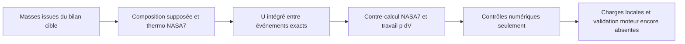

# M64 700 PS — premier calcul à thermodynamique variable

Le calcul 0D fermé a réellement été exécuté avec Cantera 3.2.0 : les propriétés et la composition varient, les événements prescrits sont intégrés à leurs angles exacts, et cinq contre-audits énergétiques indépendants passent. C'est un progrès de méthode, pas la validation d'une culasse, d'un moteur de 700 PS ou d'un gain quatre soupapes.

Ce checkpoint prolonge [l'audit des modèles hérités](M64_700PS_CYCLE_MODEL_AUDIT_20260908.md). Les sources et trajectoires détaillées restent privées ; les empreintes et mesures sont dans la [capsule de preuve](../twins/m64-cylinder-head/evidence/variable-thermo-cycle-20260908.json).

## Ce qui a changé

Cantera fournit les propriétés NASA7 ; SciPy intègre l'énergie totale. Le nouveau calcul ne reprend ni γ constant, ni gain de remplissage 4V imposé, ni auto-inflammation diesel au n-dodécane. Les [coefficients NASA fournis avec Cantera v3.2.0](https://raw.githubusercontent.com/Cantera/cantera/v3.2.0/data/nasa_gas.yaml) ont été comparés exactement aux six enregistrements utilisés.

Le modèle utilise `U = m Σ Yk uk(T)` et, pour ce témoin fermé adiabatique, `dU/dθ = −p dV/dθ`. Les énergies de formation sont incluses : aucun PCI ni dégagement de chaleur supplémentaire n'est ajouté. La composition suit `Y = (1−xb)Yréactifs + xbYproduits` ; `xb` est une loi de Wiebe normalisée, pas une cinétique calculée. Les [équations de conservation Cantera](https://cantera.org/3.2/reference/reactors/ideal-gas-reactor.html) explicitent cette dépendance à la composition.

## Hypothèses conservées visibles

- Masses air/carburant tirées du bilan cible à 6 500 tr/min, avec BSFC supposée : elles ne constituent pas une prédiction indépendante de 700 PS.
- Géométrie documentaire 100 × 76,4 mm, compression 8:1 ; rapport bielle/manivelle 3,5 supposé. Ce n'est pas la géométrie CAO de la culasse ni une preuve de compatibilité 4V.
- Charge initiale homogène à 333,15 K, tout le carburant gazeux, sans gaz résiduels. L'iso-octane pur est un substitut thermodynamique déclaré, pas l'essence réelle RON98.
- Produits riches prescrits : CO₂, CO, H₂O et N₂, avec conservation des éléments et de la masse. Pas de H₂, dissociation, NOx, suie, équilibre chimique ou vitesse de flamme calculés.
- Le rapport air/carburant réel conservé donne `λsubstitut = 0,802124`. Le `λ = 0,82` historique utilisait un AFR stœchiométrique de 14,7 ; celui du substitut vaut 15,027602. Ces deux valeurs ne sont pas confondues.
- IVC −130°, EVO +140°, CA50 +12°, durée Wiebe 65°, `a=6,908`, `m=2`, angles relatifs au PMH combustion. Début/fin de Wiebe : −18,189938°/+46,810062°. Ces angles sont supposés, non mesurés.

IVC et EVO sont les bornes effectives de l'intégration. Début/fin de Wiebe, PMH et CA50 sont aussi des bornes, même lorsqu'ils ne coïncident pas avec un pas régulier. Cela ne signifie pas que les échanges à travers des soupapes ouvertes sont simulés. Le témoin entraîné sans combustion s'arrête à +130°, symétrique de son point initial.

## Preuve numérique obtenue

Une exécution locale de cinq cas : 1,804 s, environ 96,4 Mo de mémoire maximale, sans nouvelle location Vast. Limites : 120 s CPU et 120 s réelles. Les entrées et sources sont restées inchangées.

Cantera utilise les [polynômes NASA7](https://cantera.org/3.2/reference/thermo/species-thermo.html#the-nasa-7-coefficient-polynomial-parameterization). Les états retournés par `UVY` et contrôlés aux évaluations du second membre et aux sorties sont refusés hors de 200–6 000 K ; cela n'atteste pas toutes les évaluations internes de l'algorithme d'inversion. La plage effectivement échantillonnée avec combustion est 333,15–2 521,776 K ; `cv` varie de 803,986 à 1 214,301 J/(kg·K). Ce sont des états du modèle supposé, pas des températures validées de culasse.

Le contre-auditeur n'importe ni Cantera ni le producteur. Il réévalue les coefficients bruts, l'équation d'état, la géométrie et la composition, puis intègre séparément `p dV` par Simpson sur les états intermédiaires enregistrés. Il ne réutilise pas un travail intégré avec l'état énergétique du producteur.

| Cas | Résiduel énergétique cumulatif maximal |
|---|---:|
| Entraîné, sans combustion | 2,670902 × 10⁻⁹ J |
| Combustion prescrite, pas maximal 1° | 4,110507 × 10⁻⁶ J |
| Même modèle, 0,5° | 2,467864 × 10⁻⁷ J |
| Même modèle, 0,25°, étiquettes 2V et 4V | 7,114585 × 10⁻⁸ J chacune |

Seuil numérique inchangé : `10⁻⁶ × 4 866,232173 J = 0,004866232 J`. Cette échelle est la baisse d'énergie interne de référence des produits prescrits ; elle n'est ni une chaleur externe injectée ni la chaleur reçue par la culasse. La dérive d'entropie du témoin entraîné est 2,665729 × 10⁻⁹ J/(kg·K), sous le seuil fixé de 10⁻⁴.

Les trois niveaux montrent une diminution de l'erreur de bilan, sans démontrer un ordre global de convergence du solveur adaptatif [DOP853](https://docs.scipy.org/doc/scipy-1.14.1/reference/generated/scipy.integrate.solve_ivp.html). Les fichiers CSV étiquetés 2V et 4V ont exactement la même empreinte : c'est un contrôle d'absence de bonus artificiel, pas une comparaison de deux géométries réelles.

Vérification : 13 tests du producteur et 11 de l'auditeur, tous réussis. Un prévol SciPy 1.15.3 avait échoué au chargement natif avant le calcul ; il reste conservé comme échec. La wheel officielle SciPy 1.14.1 macOS12 a ensuite été utilisée dans un environnement neuf isolé. Les six wheels et les coefficients amont sont vérifiés par empreinte. Le raffinement Newton de l'inversion `UVY` utilise le même `cv` natif, sans changer les données thermodynamiques ni assouplir le contrôle d'énergie.

## Ce qui bloque encore le transfert au produit

Il manque l'échange de gaz complet, les résiduels, les pertes et la puissance à l'arbre, une combustion calibrée et les effets réels des conduits/soupapes 2V et 4V. La paroi est adiabatique : aucune répartition de flux vers la culasse, les cylindres, l'air ou l'huile n'est calculée ici.

Les pressions de ce modèle ne sont pas des charges FEA validées ; elles ne sont pas comparées comme un gain aux anciennes valeurs à γ constant, puisque la composition et le bilan chimique ont aussi changé. Les prochaines charges locales devront être construites et contrôlées séparément avant une analyse de résistance ou de refroidissement. Aucun transfert FEA/CHT, aucun objectif 700 PS atteint et aucune autorisation de fabrication ne résultent de ce checkpoint.
