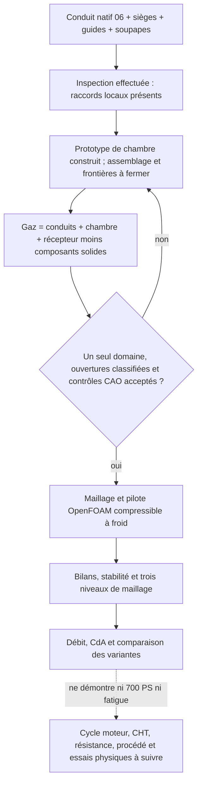

# M64 — admission, chambre et prochain calcul utile

## Résultat géométrique de cette reprise

Un **prototype de chambre à deux pans a été construit**, à partir des lèvres
des quatre sièges du module actuel, sans réinventer son enveloppe extérieure.
Ce n'est ni une géométrie OEM, ni un rapport volumétrique choisi, ni une
chambre assemblée et validée. Le maître antérieur reste intact.
Le [reçu d'exécution](../twins/m64-cylinder-head/evidence/intake-chamber-candidate-20260908.json)
lie les scripts, les entrées, les exports privés et les images réelles de CAO
par leurs empreintes. Les vues ne sont pas des photos d'une pièce fabriquée.

L'outil de coupe est un solide connecté de 27 001,825 unités³. Il retire
9 578,631 unités³ de matière du maître. Ces deux volumes sont distincts du
volume fermé de combustion, qui nécessite encore les soupapes, les portées
et la position du piston. Les huit inserts (sièges et guides) ne sont pas
recoupés en volume. Le candidat reste un solide B-Rep valide avant et après
relecture STEP ; cela ne constitue pas un contrôle BOP complet du corps.

La surface de fond hors du cylindre documentaire Ø100 n'est pas amputée
dans le contrôle booléen. La boîte englobante varie seulement de
2,2e−14 unité. La relecture du STEP du seul volume retiré change son volume
de 0,01158 unité³ ; cet écart est conservé, pas présenté comme une métrologie
exacte. Aucun perçage de bougie ni circuit d'huile n'est inventé.

## Inspection initiale, avant construction de cette chambre

L'inspection porte sur le **maître quatre logements avant évidement des
conduits**, le négatif natif d'admission 06 et les composants du module V2.
Ce ne sont pas encore les frontières d'un même domaine gazeux complet.
L'hypothèse `1 unité de scan = 1 mm` n'est pas une métrologie M64.

- Les deux colliers de gorge Ø35,6, entre les positions axiales 5,99 et 6,00,
  sont recouverts par le conduit dans la précision d'intégration enregistrée.
  Ce test local n'établit pas à lui seul l'étanchéité du montage.
- Le négatif brut recoupe encore chaque soupape d'admission ouverte à 6
  (735,415 unités³) et chaque guide (797,705 unités³). Ces pièces doivent être
  soustraites du gaz, pas ignorées dans une CFD.
- Le centre du maître est plein aux points axiaux testés entre Z=0,001 et 10.
  Ce maître initial ne contenait pas de toit de chambre conçu pour ce M64
  quatre soupapes ; le prototype décrit plus haut est une opération distincte.
- La couverture de la face inférieure sous le disque documentaire Ø100 vaut
  2 870,071 sur 7 853,982 unités². Le complément **n'est pas un taux de fuite** :
  sièges, soupapes fermées et autres frontières doivent être assemblés et
  classifiés avant cette interprétation.

Inspection native OCP 7.9.3.1 : 11,294 s, sortie 0, 2 CPU/4 Gio, réseau
désactivé, conteneur supprimé. L'image locale est identifiée par
`sha256:49979f46f421459dae4bf21aaa898e2253b07301c3e5b2cabaa6eaf06f54d696`.
Le reçu d'inspection privé a pour SHA-256
`e435eb2cd991e55401dc37c27c1baa00765552cd8df2cb677e8e85d66b9e4cec`.
Les empreintes exactes des cinq entrées sont liées au
[contrôleur d'inspection](../twins/m64-cylinder-head/source/flowbench-intake/inspect_pilot.py).
Les gros fichiers et les géométries privées ne sont pas redistribués ici.

## Raccord d'admission : distinguer budget CAO et précision physique

La préparation du vrai conduit révèle que les rayons 1 et 0,5 ne tiennent
pas intégralement dans le masque de calcul protégeant le contour extérieur.
Le rayon 0,25 tient dans la borne conservatrice de cette région ; cela ne
prouve ni un bénéfice de débit ni une résolution voxel suffisante.

Un congé natif R0,25 a été construit et relu. Son **rejet v1 est conservé** :
la règle historique exigeait qu'aucune tolérance topologique maximale
n'augmente, même sur des surfaces nouvellement approchées. Cette règle ne
permet pas à elle seule de conclure à un défaut mécanique.

Le [contre-audit v2 explicite](../twins/m64-cylinder-head/evidence/local-junction-cad-budget-20260908.json)
ne modifie aucune tolérance produite par le noyau et ne remplace pas v1.
Il distingue les entités inchangées des entités nouvelles/localement modifiées,
avec un budget **numérique** de 1e−4 unité pour ces dernières, lié aux paramètres
du [constructeur OCCT 7.9.3](https://raw.githubusercontent.com/Open-Cascade-SAS/OCCT/V7_9_3/src/ChFi3d/ChFi3d_Builder_1.cxx).
Ce n'est pas une tolérance d'ajustement moteur ni une précision mesurée du scan.

Le candidat rejoué possède la même empreinte que celui de v1. Les 70 contrôles
courbe 3D/p-curve, les 66 contrôles sommet/courbe, les quatre arêtes extérieures
protégées, les neuf sections examinées hors région autorisée et le BOP après
relecture passent les contrôles déclarés. Les modifications de section **dans**
la zone du raccord sont quantifiées : exiger leur absence contredirait le
changement de forme recherché.

La qualification locale n'est pourtant pas close : le gain de volume par
différence avant/après vaut 1,784650 unité³, contre 1,777202 par différences
booléennes, soit un résidu de 0,007448. Il dépasse les estimations de quadrature
cumulées de 0,001628 unité³. Les estimations relatives OCCT ont été converties
en volume ; elles ne constituent pas des bornes rigoureuses d'erreur géométrique.
Le désaccord reste publié. Aucun raccord n'est encore intégré au maître et
aucune épaisseur de paroi finale n'est déduite d'une distance à l'ancien corps.

## Banc virtuel préenregistré, pas encore exécuté

Le [contrat du pilote](../twins/m64-cylinder-head/targets/intake-flowbench-pilot.json)
fixe un écoulement d'air froid, admission ouverte à 6, échappement fermé,
avec récepteur d'alésage documentaire 100. Les levées 2 et 11,5 seront des
cas suivants, pas des résultats interpolés sans calcul.

Le protocole impose même montage, étanchéité, rayon d'entrée et conditions
pour comparer les variantes. La condition retenue de **28 pouces d'eau
conventionnels = 6 974,48948 Pa** est une dépression de banc ; ce n'est pas
une suralimentation ni une pression cylindre. Cette préparation s'appuie sur
les [consignes SuperFlow](https://superflow.com/tech-corner/understanding-and-working-with-superflow-flowbenches/).

Les conditions choisies sont `p0 entrée = 101 325 Pa`, `T0 entrée = 293,15 K`
et `p statique sortie = 94 350,51052 Pa`. Ce sont des hypothèses de laboratoire,
pas des mesures moteur. Le flux idéal isentropique de référence vaut
124,730079 kg/(m²·s), avec Mach idéal 0,320820 : la compressibilité ne sera
donc pas exclue sans vérification. **Ce n'est pas le débit de la culasse.**
La [formulation NASA](https://www.grc.nasa.gov/www/k-12/airplane/mflchk.html)
fournit la normalisation et la limite sonique du gaz parfait.

Le [calcul analytique reproductible](../twins/m64-cylinder-head/targets/flowbench_reference.py)
laisse explicitement le débit réel et le coefficient de débit à `null`.
Après une CFD admissible, `CdA = débit massique / flux idéal`, puis
`Cd = CdA / aire totale des deux gorges`. Cette aire est une référence
déclarée, pas une prétendue mesure de la section minimale de passage à chaque
levée. Aucun coefficient n'est converti directement en chevaux moteur.

Gardes exploratoires fixés avant le pilote : déséquilibre massique relatif
≤0,1 %, variation du débit moyen entre deux fenêtres finales ≤0,5 %, au moins
trois niveaux spatiaux et écart moyen/fin ≤2 %. La taille des fenêtres et
le traitement de la turbulence doivent être fixés dans le manifeste du cas
maillé avant exécution. Une séparation instationnaire invalide l'hypothèse
stationnaire ; elle exige un calcul transitoire et des statistiques adaptées.
Ces seuils ne sont pas une norme de certification ni une corrélation au banc.

## Ressources réellement vérifiées

OpenFOAM 14, `foamRun`, `checkMesh`, `snappyHexMesh`, le module compressible
`fluid` et Cantera 3.2.0 sont accessibles sur Kali. Ce prévol est une lecture
du runtime existant, **pas un calcul de cette culasse**. Image locale exacte :
`sha256:a233511bef9b4fbf0653ca94258061d61b3fccbd6b4e3ef6d71c669d70de1c17`.
Elle n'a pas de digest de registre dans cette vérification : ne pas la
confondre avec une image déjà qualifiée pour une nouvelle location Vast.

Le plafond utilisateur est de 44 USD, sans recharge automatique. Aucun
nouveau serveur n'a été loué pour cette inspection et cette préparation.
Avant une location : job concret, image amd64 par digest, paire SSH vérifiée,
association de clé à l'instance, plafond du lot et garde externe de suppression.
La disponibilité d'un logiciel ou d'un budget ne rend pas une géométrie prête.

## Limites de livraison

Ni le toit proposé, ni un futur pilote d'admission ne ferment les interfaces
du donneur, les conditions de pression/flux thermique, les cartes matière à
chaud, les précharges, les circuits d'huile, la distribution ou le procédé
LPBF. La puissance de 700 PS reste une cible. Le parcours complet demeure
celui du [plan multiphysique](M64_MULTIPHYSICS_EXECUTION.md).

## Vérification logicielle du lot

Après gel des sources, `make check` s'est terminé avec un code de sortie 0.
La suite principale a exécuté 2 211 tests en 174,406 s, dont 92 ignorés ;
les cibles supplémentaires se sont également terminées, avec un autre test
OCP ignoré. Ce résultat ne signifie donc pas que tous les runtimes optionnels
ont été exercés par cette commande.

Les 44 tests ciblés de ce lot ont été exécutés séparément dans les runtimes
CAO natif et QA disposant des dépendances nécessaires : tous réussis, aucun
ignoré. Le journal global privé porte l'empreinte SHA-256
`0c80a7b5fc15658695a52508b642e7bb35fbef88b3ac88d3b8e73748eab383be`.
Ces tests vérifient les scripts et les garde-fous déclarés, pas une culasse
physiquement éprouvée, un matériau qualifié ou un procédé d'impression validé.
