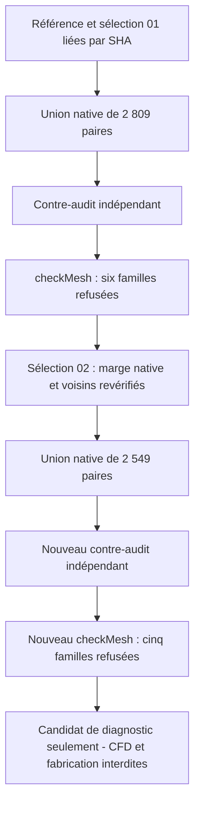

# M64 — essai d'agglomération locale de tétraèdres

## Résultat final : concavité corrigée, cinq familles toujours refusées

L'essai 03 avait ajouté **260 cellules signalées concaves** et porté les
refus de cinq à six familles : il n'est pas adopté. L'essai 04, après
correction de la sélection, retrouve **zéro cellule signalée concave**.
Les faibles déterminants passent de **5 442 à 2 886**, soit environ 47 %
de moins que la référence, mais **cinq familles restent refusées**.
L'essai 04 est conservé comme candidat de diagnostic, **pas comme maillage
qualifié pour CFD ou comme culasse autorisée à fabriquer**.

L'essai 04 réunit 2 549 paires disjointes : 399 412 cellules, dont 396 863
tétraèdres inchangés et 2 549 polyèdres à six faces. Le contre-audit
indépendant vérifie la conservation des 112 649 points, des 186 370 triangles
de frontière et du volume total selon les contrats explicités ci-dessous.
Cette preuve de transformation ne suffit pas à accepter la qualité CFD.

Le périmètre est uniquement le domaine gazeux d'admission du banc virtuel,
pas la culasse métallique complète ni un moteur biturbo en fonctionnement.
La source est un scan de référence 935, pas des interfaces M64 mesurées.
Ce travail ne démontre aucune amélioration thermique, mécanique ou LPBF.

La [capsule de preuves](../twins/m64-cylinder-head/evidence/agglomeration-local-trial-20260908.json)
complète le [maillage de référence et l'essai de subdivision rejeté](M64_MAILLAGE_PARTITION_UNIFIEE_20260908.md).
Les reçus privés antérieurs sont conservés, sans réécriture de leur résultat.

## Sélection limitée, puis véritable opération OpenFOAM

Le prévol `185535cc…`, en 2,787 s, sélectionne 2 809 paires parmi 4 013
paires individuellement admissibles. Il est glouton, **pas un appariement
maximum démontré**. Les paires touchent 2 901 cellules initialement signalées
à faible déterminant ; 2 411 paires touchent une frontière annulaire native.

Le prévol demande notamment une union convexe des points représentés,
`D ≥ 0,001`, un rapport d'aspect au plus 1 000, des poids d'interpolation
d'au moins 0,05, des rapports de volumes d'au moins 0,01 et une skewness
au plus 4. Il revérifie les voisins déjà sélectionnés. Ces estimations
ne sont ni le résultat natif de `checkMesh`, ni une conformité continue à la CAO.

L'utilitaire [natif d'agglomération](../twins/m64-cylinder-head/source/flowbench-intake/agglomerate_tet_pairs/agglomerateTetPairs.C)
utilise `polyTopoChange` : il retire uniquement la face partagée de chaque
paire et réaffecte les cellules. Il ne fusionne pas les autres triangles,
ne déplace pas les points et n'élargit aucun jeu fonctionnel. La référence
est le domaine `fab1338a…`, issu du MSH `c0cbb257…` converti auparavant.

| Essai conservé | Résultat observé |
| --- | --- |
| 01, source `13d6f77a…` | Compilation refusée : appel `fvMesh.boundaryMesh` incompatible avec cette API. Aucun candidat produit. |
| 02, source `0cdb836e…` | Compilation réussie, mais écriture de `m64FaceMap` interrompue dans le stockage temporaire plein. Candidat incomplet rejeté. |
| 03, même source `0cdb836e…` | Répertoire frais sur disque `/var/tmp` ; opération native réussie, code 0, 3 s de temps mural. |
| 04, même source `0cdb836e…` | Sous-ensemble corrigé de 2 549 paires ; opération native réussie, code 0, 4 s. |

Les anciens `input.msh`, `log.checkMesh` et diagnostics copiés avec le cas
ne constituent **pas** les résultats de ce nouveau maillage. Les `topoSets`
hérités ne sont pas remappés ; seule la `cellZone air` remappée fait autorité.
Les champs de solveur copiés n'ont pas été audités pour une simulation.

## Essai 03 : deux reçus d'audit distincts, sans effacement du premier refus

L'[auditeur indépendant](../twins/m64-cylinder-head/source/flowbench-intake/audit_tet_pair_agglomeration.py)
reconstruit les groupements depuis le `faceSet` source et les relations
owner/neighbour ; les quatre cartes du producteur sont des assertions à vérifier.

Le reçu initial `797ac0fe…`, source `3c0eb455…`, **refuse** la transformation
en 11,347 s pour différence de métadonnées de patch. Le fichier natif ajoute
`inGroups List<word> 1(wall)` à la paroi. Le constructeur officiel de
[`wallPolyPatch`, commit `7b05503f…`](https://github.com/OpenFOAM/OpenFOAM-14/blob/7b05503f98a85be88af930df48623b4d152bfc35/src/OpenFOAM/meshes/polyMesh/polyPatches/derived/wall/wallPolyPatch.C#L54-L69)
ajoute effectivement le groupe `wall` lorsque celui-ci manque : il était
donc déjà présent dans la représentation native en mémoire de la référence.

Le reçu distinct `d779d628…`, source `a16ec0eb…`, passe en **12,231 s** sur
le **même candidat inchangé**. Pour le seul type exact `wall`, il compare
les groupes effectifs `groupes explicites ∪ {wall}`. Tout autre groupe
ajouté/supprimé, type, propriété ou appartenance de triangle reste contrôlé.
Les 34 tests de l'auditeur incluent des mutations adversariales de ces champs.
Le refus initial n'est ni supprimé ni rétroactivement transformé en succès.

Le second audit prouve les bijections de points et de faces conservées,
les cartes de cellules reproduites indépendamment, les orientations et les
six faces exactes de chaque union. Les paires sont disjointes et couvrent
exactement leurs parents ; les cellules non ciblées restent identiques.
Chaque volume fusionné égale exactement la somme de ses deux volumes parents,
en rationnels dérivés des **valeurs binary64 lues**, ce qui conserve le volume
total par partition. L'absence globale d'auto-intersection du maillage source
n'est pas prouvée par cet audit.

L'écriture à 17 chiffres conserve les bits binary64 des coordonnées : elle
ne prouve **pas** l'identité des chaînes décimales avant/après. Elle ne remplace
pas non plus l'appariement antérieur MSH–OpenFOAM à 12 chiffres. Les frontières
restent 184 917 triangles de paroi, 1 191 de sortie et 262 d'entrée.
La conversion antérieure de 0,001 m par unité de scan reste une hypothèse,
pas une échelle ou un ajustement M64 certifiés. Aucune nouvelle CAO n'est créée.

## Nouveau diagnostic natif — améliorations partielles et aggravation

| Indicateur | Référence | Essai 03 | Essai 04 |
| --- | ---: | ---: | ---: |
| Cellules | 401 961 | 399 152 | 399 412 |
| Faible déterminant | 5 442 | 2 541 | 2 886 |
| Rapport d'aspect excessif | 3 | 3 | 3 |
| Skewness excessive | 10 | 10 | 10 |
| Cellules signalées concaves | 0 | **260** | 0 |
| Faible poids d'interpolation | 519 | 464 | 466 |
| Faible rapport de volumes | 149 | 146 | 146 |
| Faces de non-orthogonalité supérieure à 70° | 262 008 | 259 587 | 259 686 |
| Familles de qualité refusées | 5 | **6** | **5** |

Chaque diagnostic s'est exécuté sur une copie dont les empreintes correspondent au
candidat audité, sans nouvelle conversion ni nouvelle mise à l'échelle.
Le journal **propre à l'essai 03** `e2559952…` contient `Failed 6 mesh checks`, sans
`Mesh OK` ; le superviseur rend 2, en 5 s. Le rapport d'aspect maximal
reste à 2 011,04 et la skewness maximale à 13,1054. La topologie, la
connectivité en une région et les volumes de cellules passent séparément.
Ces succès ne compensent pas les six refus ; les critères restent inchangés.
La convexité annoncée par le prévol n'est donc pas suffisante selon le
test natif. Le diagnostic complémentaire ci-dessous précise cet écart,
sans modifier le candidat ni convertir ce refus en acceptation.

Un éventuel succès futur de maillage ne suffirait pas à valider CFD,
thermique, résistance, fatigue, matériau, impression, ajustement M64 ou moteur.

## Écart de prédicat reproduit — pas d'identité des labels revendiquée

Le diagnostic indépendant `bb797ce6…`, en 2,477 s, reproduit **le compte
de 260 cellules** signalées par OpenFOAM. Ses 260 cellules calculées sont
des unions sélectionnées et restent convexes au sens des demi-espaces
fermés testés en rationnels sur les points binary64 : 89 comportent une
coplanarité exacte, les 171 autres sont quasi coplanaires.

Le test natif compare la direction normalisée entre centres de faces avec
la normale sortante. Il signale aussi les situations planes ou presque
planes lorsque leur produit scalaire dépasse `−10⁻⁶` : **convexité
mathématique faible et admissibilité native ne sont pas équivalentes**.
Voir [`checkConcaveCells`, même commit officiel](https://github.com/OpenFOAM/OpenFOAM-14/blob/7b05503f98a85be88af930df48623b4d152bfc35/src/meshCheck/primitiveMeshCheck/primitiveMeshCheck.C#L1069-L1174).
Les maxima calculés par cellule se situent entre `−4,881×10⁻¹⁰` et
`+7,859×10⁻¹⁴`, donc dans la bande refusée. Trois témoins adversariaux
séparant coplanarité, quasi-coplanarité et marge convexe passent.

Les 260 labels natifs n'ont pas été exportés pour comparaison : seule la
**reproduction du compte**, pas l'identité de la liste native, est prouvée.
La sélection initiale couvrait donc insuffisamment le prédicat natif.
Ce constat a motivé le sous-ensemble 04 ci-dessous : marge intégrée,
voisins revérifiés, nouvelle union, contre-audit et `checkMesh`. Ni seuil,
ni géométrie, ni reçu historique ne sont modifiés par ce diagnostic.

## Essai 04 : sélection corrigée, amélioration partielle seulement

Le prévol `18450384…` retire les 260 paires calculées comme inadmissibles,
puis revérifie les voisins : **2 549 paires**, toutes issues de la sélection
initiale, aucune paire nouvelle. Il exige la même marge native `≤ −10⁻⁶`
en plus des critères antérieurs, sans relâcher ceux-ci. Il termine en
2,969 s et reste une proposition, distincte du résultat OpenFOAM exécuté.

L'opération native repart d'une copie de la référence, pas de l'essai 03.
Elle termine en 4 s, code 0. Le contre-audit `45785366…`, avec la même
source `a16ec0eb…`, passe en 12,231 s : 399 412 cellules, 894 558 faces,
2 549 faces internes retirées, coordonnées binary64 et frontière inchangées,
volumes conservés par les unions exactes. Les six fichiers `polyMesh`
contrôlés gardent leurs empreintes après le diagnostic qualité.

Le **nouveau** journal `46bd09e6…` confirme zéro cellule signalée concave,
mais contient **`Failed 5 mesh checks`**, sans `Mesh OK` ; le superviseur
rend 2, en 6 s. Rapport d'aspect, skewness, faible déterminant, poids
d'interpolation et rapport de volumes restent refusés. Les comptes sont
dans le tableau comparatif ; ils ne prouvent ni convergence ni précision CFD.

**Décision :** conserver l'essai 04 comme candidat de diagnostic, préserver
la référence et l'essai 03 rejeté, ne lancer aucun solveur. La prochaine
étape est de relocaliser les cinq familles restantes sur ce nouveau
maillage et de choisir une correction ciblée vérifiable. Aucun autre essai
n'est exécuté dans cette séquence et aucun résultat futur n'est anticipé.

## Ressources et suite limitée

L'essai utilise Kali x86, quatre CPU et 4 Gio, sans réseau du conteneur.
La limite murale est de 300 s ; le conteneur de l'opération native est retiré
et son absence vérifiée, de même que celui du diagnostic qualité.
Aucun GPU n'est nécessaire à cette transformation. Les conteneurs des
essais 03 et 04 et de leurs deux diagnostics sont supprimés ; leur absence
est vérifiée. Aucun solveur CFD et aucun calcul de fabrication n'ont été exécutés.

Le contrôle logiciel `make check` termine avec le code 0 : **2 425 tests**
principaux en 174,433 s, **84 ignorés**, puis toutes les suites
complémentaires passent. Il inclut les 34 tests de l'auditeur ; ce n'est
pas une acceptation physique ou une annulation du refus `checkMesh`.

Aucun travail Vast n'a été créé pour ces essais : **0 USD de nouvelle dépense
Vast**, sur un budget de projet autorisé de 44 USD. Les informations du
compte et les activités d'autres projets ne sont pas publiées dans cette preuve.
