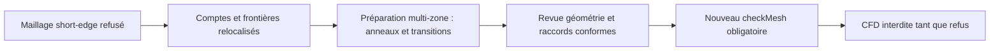

# M64 — localisation du maillage refusé, avant reconstruction multi-zone

Le dernier maillage reste refusé : **cinq familles de défauts**, sans CFD ni
autorisation de fabrication. Le diagnostic local trouve **4 655 des 5 733
cellules à faible déterminant au contact direct des bandes tige–guide** (81,2 %).
Mais l'unique cellule à rapport d'aspect excessif et les onze faces très gauches
se trouvent ailleurs : corriger uniquement les anneaux ne suffira pas.

Ce domaine est le **pilote gaz d'admission**, issu du candidat quatre soupapes,
pas le métal de la culasse complète ni un cycle moteur. Le scan 935 reste une
référence ; les interfaces M64 ne sont pas mesurées et l'échelle supposée
« une unité de scan = un millimètre » n'est pas certifiée.

## Ce qui a réellement été exécuté

Une analyse locale en lecture seule, en **7,982 s**, a recalculé les indicateurs
sur les cellules du [dernier essai short-edge](M64_SHORT_EDGE_REMESH_20260908.md).
Les cinq comptes reproduisent exactement son journal OpenFOAM 14 :

| Indicateur | Compte | Localisation par incidence de frontière |
|---|---:|---|
| Rapport d'aspect > 1 000 | 1 cellule | Paroi de conduit, face native 37 |
| Skewness > 4 | 11 faces | Siège 36 : 5 ; conduits 28 : 4 et 29 : 2 |
| Déterminant < 0,001 | 5 733 cellules | 4 655 touchent les huit bandes tige–guide |
| Poids d'interpolation < 0,05 | 535 faces | 834 cellules adjacentes, dont 30 touchent ces bandes |
| Rapport de volumes < 0,01 | 141 faces | 254 cellules adjacentes, dont 4 touchent ces bandes |

Les nombres de cellules adjacentes et de faces sélectionnées ne sont pas
interchangeables. Les comptes par rôle peuvent se recouvrir. Parmi les cellules
à faible déterminant, le nombre de faces internes vaut respectivement 1, 2, 3
et 4 pour **1, 730, 4 868 et 134 cellules**. Dans la formule OF14, les faces de
paroi non couplées n'entrent pas dans le tenseur du déterminant ; ce n'est donc
pas le jacobien du tétraèdre.
[Code primaire OF14](https://github.com/OpenFOAM/OpenFOAM-14/blob/7b05503f98a85be88af930df48623b4d152bfc35/src/meshCheck/primitiveMeshCheck/primitiveMeshCheck.C#L424-L514).

## Traçabilité et portée de la preuve

Le domaine natif `fab1338…` comporte 86 faces. Le maillage contrôlé est
`3b59b622…`, soit 401 854 tétraèdres. Une correspondance unique des 112 632
points tient compte des deux écritures FOAM à douze chiffres significatifs ;
elle ne prétend pas à l'identité binaire des coordonnées MSH et FOAM.
Les **186 364 triangles de frontière**, leur orientation et leurs rôles natifs
sont vérifiés par correspondance bijective, sans recherche de paroi la plus proche.
Toutes les entrées lues sont inchangées après l'analyse.

Les faces 28 et 29 proviennent de `raw_intake_face_7`, la face 37 de
`raw_intake_face_8` ; ce sont des parois de conduit B-splines. La face 36 est la
paroi cylindrique de `intake_2_seat_face_4`. Les SHA des quatre exports de face
ont été relus directement. Cette provenance est héritée du manifeste revu,
sans nouvelle opération booléenne de recouvrement.

**Les ensembles de labels natifs n'avaient pas été exportés dans ce dernier
essai.** Ce reçu prouve la reproduction des comptes par les formules et la
correspondance aux frontières, pas l'identité label par label avec de nouveaux
ensembles OpenFOAM. Huit tests ciblés passent ; ce ne sont pas des tests physiques.

## Décision pour le prochain essai — non exécuté

Le générateur actuel impose une taille isotrope aux bandes, sans construire
de couches radiales. La suite à soumettre à revue est **un candidat multi-zone** :
bandes guide–tige structurées radialement et traitement local des transitions
siège–conduit portant les douze défauts extrêmes. Les partitions ne doivent pas
déplacer les parois physiques, élargir les jeux ou fermer les passages.
La conformité entre blocs et cœur, les rôles, les frontières complètes et les
huit courbes d'interface devront être prouvés ; aucun raccord non conforme
implicite ni relâchement des seuils n'est autorisé.

Le reçu [JSON de localisation](../twins/m64-cylinder-head/evidence/annular-mesh-localisation-20260908.json)
contient les empreintes. Aucun nouveau maillage, solveur, conteneur ni achat Vast
n'a été lancé pour cette localisation. Aucune simulation thermique, mécanique,
LPBF, convergence ou qualification d'impression n'en découle.
