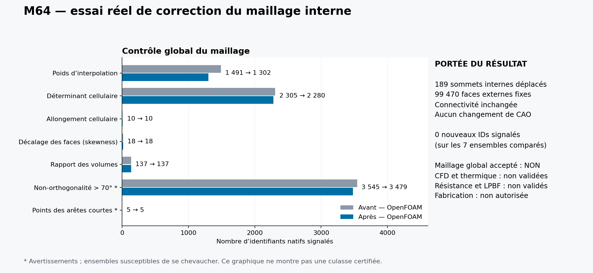
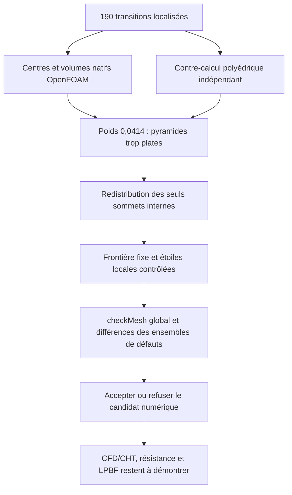

# M64 — correction ciblée des transitions hexaèdre/pyramide

Le [diagnostic précédent](M64_DEFECT_LOCALISATION_20260909.md) a isolé
190 transitions à faible poids d'interpolation. **189 sont maintenant corrigées,
avec 25 cellules à faible déterminant et 66 faces trop non orthogonales en moins,
sans nouvel identifiant défectueux dans les ensembles comparés. Les cinq familles
de qualité restent toutefois refusées.** Ce sont
des cellules du domaine d'air, pas une modification de la culasse métallique.
La CAO, le contour Porsche et les interfaces moteur ne changent pas dans ce lot.

## Mesure effectivement exécutée

Un lecteur C++ est compilé et exécuté avec **OpenFOAM Foundation
14-7b05503f98a8**, sur le cas original de 785 883 cellules. Il lit les centres
de faces/cellules, aires orientées, volumes et poids d'interpolation natifs.
Il ne déplace aucun point, ne recolle pas le maillage, ne convertit pas la
géométrie et ne lance aucun solveur. Le cas source est monté en lecture seule.

Les 190 faces correspondent exactement à 190 hexas, 190 pyramides et
190 sommets de pyramides distincts. Ces sommets sont tous internes au domaine ;
leurs étoiles comprennent **1 142 tétraèdres**, sans tétra partagé entre étoiles.
Les 99 470 faces externes sont recensées séparément.

| Mesure | Résultat sur les 190 interfaces |
|---|---|
| Poids d'interpolation minimal des deux côtés | 0,041395602449 à 0,041395602756 ; seuil natif 0,05 |
| Distance normale centre hexa / face | Environ 1,0000 × 10⁻⁴ |
| Distance normale centre pyramide / face | Environ 4,3183 × 10⁻⁶ |
| Hauteur normale du sommet de pyramide | Environ 1,7273 × 10⁻⁵ |
| Épaisseur normale de l'hexa | Environ 2,0000 × 10⁻⁴ |
| Rapport volume hexa / pyramide | Environ 34,736 |

Les longueurs sont celles du **repère numérique déjà mis à l'échelle** ;
elles ne sont pas des cotes physiques certifiées. Toutes les projections
signées de centres sont positives. Le défaut n'est donc pas expliqué ici
par des centres situés du mauvais côté de la face.

La compilation et la mesure prennent respectivement 1,781 s et 1,618 s ;
le processus complet, nettoyage compris, **4,314 s**. Les 29 fichiers du cas
source restent identiques. Pas de timeout, d'OOM ni d'avertissement natif.
Le conteneur exact est supprimé et son absence revérifiée. Kali suffit à
ce diagnostic ; aucune nouvelle location ou dépense Vast dans ce lot.

## Contre-calcul indépendant

Le second calcul relit le `polyMesh` et applique les formules du commit
épinglé : [centres/aires des faces](https://github.com/OpenFOAM/OpenFOAM-14/blob/7b05503f98a85be88af930df48623b4d152bfc35/src/OpenFOAM/meshes/meshShapes/face/faceTemplates.C#L72-L138),
[centres/volumes des cellules](https://github.com/OpenFOAM/OpenFOAM-14/blob/7b05503f98a85be88af930df48623b4d152bfc35/src/OpenFOAM/meshes/primitiveMesh/primitiveMeshCellCentresAndVols.C#L65-L144)
et [poids de contrôle](https://github.com/OpenFOAM/OpenFOAM-14/blob/7b05503f98a85be88af930df48623b4d152bfc35/src/meshCheck/polyMeshCheck/polyMeshCheck.C#L163-L214).
Il ne substitue pas une moyenne de sommets au centre natif d'un polyèdre.

Sur les 190 interfaces, centres, aires, volumes, distances signées et
hauteurs concordent **bit à bit** avec le C++. L'écart maximal des poids
est 1,249 × 10⁻¹⁶. Cela vérifie une implémentation numérique sur les mêmes
données ; ce n'est pas une validation indépendante de la physique moteur.
Le calcul pur prend 7,865 s et retrouve 1 142 demi-espaces tétraédriques
strictement positifs avec une arithmétique rationnelle des coordonnées stockées.

## Premier candidat : gain réel, mais une régression détectée

Un candidat déplace les 190 sommets vers un poids recalculé de 0,055.
La génération prend 13,418 s. Après sérialisation à 17 chiffres et relecture,
les 1 142 inégalités tétraédriques restent strictement positives ; les volumes
exacts des 190 étoiles sont conservés. Les autres lignes du fichier de points
restent inchangées. Les coordonnées externes et la connectivité sont conservées.

Le `checkMesh` global est réellement relancé sur une copie, en 11,097 s
(13,764 s avec préparation et nettoyage). Il retire les 190 défauts de poids,
25 cellules à faible déterminant et 67 faces trop non orthogonales, **mais ajoute
une nouvelle face trop non orthogonale**. Le bilan net de cette dernière famille
est donc −66, et non une disparition sans régression. Le candidat de 190
déplacements n'est pas retenu tel quel. Les cinq familles qualité restent refusées.

Cette régression concerne une seule étoile : la nouvelle face est partagée
par deux tétras de cette même étoile. Un second candidat conservateur a
rétabli ce sommet exactement à sa position source et conservé les 189 autres
déplacements, avant de repasser le contrôle global. Cette opération a été exécutée
en 5,931 s et contre-vérifiée indépendamment en 2,051 s. Les deux candidats et leurs
journaux sont conservés : le premier résultat n'est pas écrasé.

## Second candidat exécuté : 189 corrections conservées

Le second `checkMesh` prend **10,947 s**, soit **13,557 s** pour le processus
complet. Il vérifie le fichier de points réellement produit, pas une position
cible seulement calculée. Les cinq autres fichiers `polyMesh` sont identiques
au cas source, de même que les coordonnées des 99 470 faces externes.

| Ensemble natif | Avant | Second candidat | Nouveaux IDs |
|---|---:|---:|---:|
| Faible poids d'interpolation | 1 491 | **1 302** | 0 |
| Faible déterminant cellulaire | 2 305 | **2 280** | 0 |
| Non-orthogonalité > 70° | 3 545 | **3 479** | 0 |
| Allongement excessif | 10 | 10 | 0 |
| Skewness excessive | 18 | 18 | 0 |
| Faible rapport de volumes | 137 | 137 | 0 |
| Points signalés pour arêtes courtes | 5 | 5 | 0 |

Les deux ensembles de cellules ayant une/deux faces internes conservent aussi
leurs fichiers exacts : respectivement 2 et 465 cellules. Les groupes se
chevauchent ; ils ne s'additionnent pas en un nombre de cellules défectueuses.
Les volumes extrêmes et total restent identiques à la précision du journal.
La moyenne de non-orthogonalité s'améliore de 21,555279° à 21,555015° ; en revanche,
les moyennes de poids et de rapport de volumes diminuent légèrement
(0,434790 → 0,434744 et 0,787716 → 0,787637). **Ce n'est donc pas une amélioration
de toute métrique partout**, malgré l'absence de nouveaux franchissements
des seuils dans les ensembles comparés.

Cette version est une amélioration partielle retenue pour poursuivre les
contrôles de maillage. Elle ne reçoit **aucune admission CFD** : il reste
1 transition hexa/pyramide à faible poids, 1 301 autres faces à faible poids
entre tétras, ainsi que les autres défauts du tableau. Le prochain travail
doit traiter ce raccord restant et les défauts du cœur/paroi, en conservant
les critères natifs et les contrôles de voisinage. Aucun solveur thermique,
structurel ou LPBF n'est lancé sur ce maillage encore refusé.

## Critère de correction

La cible locale est un poids de **0,055**, avec le seuil d'acceptation natif
inchangé à 0,05. Seuls les sommets internes identifiés peuvent se déplacer,
le long de la normale à leur base. Toutes les autres coordonnées et toute
la connectivité doivent rester exactes. Les faces latérales internes des
pyramides changent donc conformément des deux côtés : elles ne peuvent plus
être déclarées identiques aux anciennes interfaces géométriques.

Les contrôles locaux doivent porter sur les coordonnées réellement réécrites,
les pyramides et les 1 142 tétras voisins, pas seulement sur le poids ciblé.
Un second `checkMesh` global doit ensuite comparer les identifiants des
défauts avant/après, afin de détecter de nouveaux défauts ailleurs dans les
étoiles. Une réussite du programme n'est pas une acceptation du maillage.

**Aucune validation de puissance, de refroidissement, de résistance ou
d'impression n'est déduite de ces contrôles de maillage.** Les données et
empreintes détaillées restent traçables ; les maillages, coordonnées et dérivés
géométriques restent privés suivant les règles du dépôt. Les essais logiciels
ciblés passent (inventaire 9, mesure/supervision 19, contre-calcul 8,
comparateur 2, candidat 13, contrôle global 20, retrait conservateur 7 ;
les 20 tests du contrôle sont aussi relancés pour V2).
`make check` termine avec le code 0 ; certains tests natifs optionnels restent
ignorés selon les dépendances présentes. Les empreintes et comptes sont dans
le [registre de preuves](../twins/m64-cylinder-head/evidence/geometry-checkpoint-20260908.json),
entrée `gas_hybrid_apex_correction`.
