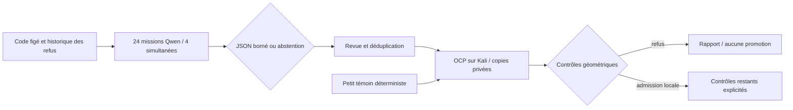

# M64 — pilote CAO avec agents Qwen sur Vast

## Résultat et portée

**24 missions exécutées sur Qwen/Vast en 80,134 s**, avec quatre requêtes
simultanées au maximum. Elles proposent uniquement un rayon et un mode de
construction existant, ou s'abstiennent. Elles ne corrigent pas directement la
culasse et ne produisent ni certification ni nouvelles mesures.

Le lot précédent effectuait des lectures documentaires. Ce pilote raccorde
l'inférence à un schéma de propositions CAO contrôlables ; l'exécution native
reste indépendante. Les essais concernent un **raccord local du négatif
d'admission**, pas la reconstruction ou l'optimisation complète de la culasse.

## Machine, accès et budget

- Autorisation utilisateur : **5 USD maximum pour ce lot**, pas par agent.
- Une L40S, 32 CPU effectifs, **193 475 MB de RAM attribuée selon l'offre**,
  100 GB de disque ; offre slovène 29679192, instance 50796709.
- Le GPU expose 46 068 MiB. Le champ RAM ultérieur de l'instance décrit l'hôte
  entier ; il n'est pas utilisé comme allocation disponible.
- Prix relu : **0,827778 USD/h**, stockage inclus. Plafond de tentative 2,50 USD,
  coût prévisionnel avec transferts et réserve : **2,321094 USD**.
- Échéance globale : 90 minutes, chargement et nettoyage inclus ; la machine
  a été détruite dès que les réponses et le journal avaient été collectés.
- Image vLLM 0.19.0 publique, manifeste linux/amd64
  `sha256:7a0f0fdd2771464b6976625c2b2d5dd46f566aa00fbc53eceab86ef50883da90`.
- Modèle `Qwen/Qwen3-Coder-30B-A3B-Instruct-FP8`, révision
  `dcaee4d4dfc5ee71ad501f01f530e5652438fde0`, contexte 16 384 tokens.
- Paire SSH vérifiée cryptographiquement, association à l'instance vérifiée,
  connexion BatchMode réelle. API uniquement sur 127.0.0.1:8000, tunnel local.
- Aucun secret Hugging Face/GitHub transmis ; aucun scan ou BRep envoyé au LLM.
  Les entrées sont trois extraits du code autorisé et un résumé des essais.

L'arrêt est confirmé par le wrapper, la garde externe et un inventaire vide.
Le tunnel est fermé. Crédit avant : 37,996967 USD ; au relevé de 20:41:05 UTC :
37,914869 USD, soit **0,082099 USD de baisse observée**. La facture finale reste
non confirmée ; le débit peut être différé. Les garde-fous ne sont pas une limite bancaire :
une panne fournisseur ou une perte durable du contrôleur peut retarder la
suppression. Le [reçu public](../twins/m64-cylinder-head/evidence/cad-proposal-pilot-20260912.json)
conserve budgets, versions, empreintes et statuts.

## Travail délégué et contrôle



Le [répartiteur](../twins/m64-cylinder-head/source/run_cad_proposal_agents.py)
ne possède ni outils, ni droit d'exécuter du code LLM, ni accès aux secrets.
Maximum 900 tokens par réponse, 120 s par requête, 1 200 s pour le lot, sans
nouvelle tentative automatique. L'identité du modèle et le contexte sont
contrôlés ; le client seul ne peut pas attester les poids distants, d'où la
vérification séparée du serveur et de sa révision.

SHA du contexte privé :
`5e1309cca6bc96106b9b141d5b8ec4b5fc88bdc36fff87b18855d87390da87f3`.
Chaque requête et réponse est conservée avec empreinte, durée et consommation.
Les rapports bruts restent privés et non approuvés.

| Proposition | Nombre | Traitement |
|---|---:|---|
| R0,1 / default | 14 | Paramètre retenu pour un essai diagnostique, pas bénéfice établi |
| R0,25 / default | 6 | Déjà essayé ; non rejoué comme nouvelle conception |
| R0,25 / strict | 2 | Non retenu dans ce petit lot |
| Abstention | 2 | Conservée ; incohérence de volume à traiter |

Les rayons sont en **unités du scan**, pas en millimètres certifiés.
Les 24 réponses respectent le schéma, mais cela ne vérifie pas leur contenu.
Plusieurs textes inventent des essais antérieurs sous R0,25 ou promettent une
conservation géométrique non calculée : ces affirmations sont rejetées.
Le nombre de propositions identiques ne constitue pas une preuve indépendante.

Consommation : **100 847 tokens d'entrée + 6 827 de sortie = 107 674 tokens
traités sur Vast**. Aucun pourcentage d'économie OpenAI n'est déduit :
la préparation et la revue ont aussi consommé des tokens, et il n'existe pas
de comparaison de bout en bout à qualité égale.

## Essais natifs

Le témoin synthétique existant passe sur Kali : **5 tests, aucun ignoré**,
OCP 7.9.3.1, Python 3.12.3, image locale épinglée
`sha256:49979f46f421459dae4bf21aaa898e2253b07301c3e5b2cabaa6eaf06f54d696`.
Deux CPU, 4 GiB, réseau coupé, sources en lecture seule, délai externe 300 s.
Le conteneur a été supprimé et son absence vérifiée. Aucun fichier de culasse
réelle n'était utilisé dans ce témoin.

SHA de son reçu de processus :
`0bd891fa9179725f30329b960ca660bb449ec8e94eb438a9e6d517164c4346fa`.

Le premier transport a été refusé avant création de conteneur à cause de
métadonnées AppleDouble ajoutées par tar sur macOS. Le paquet exact a été
recréé sans ces métadonnées ; les sources et leurs empreintes sont inchangées.

**Trois essais réels exécutés sur copies** du négatif d'admission :

| Rayon / mode | Temps supervisé | Résultat observé |
|---|---:|---|
| R0,1 / default — proposition Qwen | 5,589 s | Un solide BRep valide, contrôles BOP sans défaut avant/après relecture ; rejet v1 pour augmentation des tolérances |
| R0,1 / strict — croisement choisi par le contrôleur | 300,278 s | Limite 300 s atteinte, sortie 137, sans OOM ; BRep écrit, contrôle final incomplet |
| R0,125 / default — témoin déterministe | 5,445 s | Un solide BRep valide, contrôles BOP sans défaut avant/après relecture ; même motif de rejet v1 |
| R0,125 / strict | Non lancé | Arrêt de cette branche après le dépassement du premier cas strict |

Le LLM n'a pas proposé littéralement R0,1/strict : le contrôleur a croisé son
rayon avec le mode existant. Les reçus bruts conservent les étapes d'exécution ;
cette distinction évite d'attribuer toute la grille au LLM.

Pour les deux modes standard, les angles maximaux de tangence **échantillonnés**
sont 0,00026177° et 0,00017517°. Les tolérances des sommets montent respectivement
à 1e-4 et 1,00353e-4 unité de scan, contre 5,100001e-6 au maximum sur la source.
Ce sont des paramètres/précisions du noyau, pas des tolérances physiques
d'usinage. Une boîte englobante inchangée ne prouve pas, seule, l'identité du
contour extérieur ; aucun contrôle global G1 n'est revendiqué.

Les audits complets v2 de ROI, fil extérieur et réconciliation de volume n'ont
pas été exécutés sur ces nouveaux candidats. Aucun STEP n'a été demandé :
les sorties sont des BRep diagnostiques privés, dont un incomplet. **Aucun
candidat n'est promu.** Tous les conteneurs ont été supprimés, les sources et
entrées sont inchangées par empreintes ; aucune relaxation des seuils.

Ce pilote ne démontre aucun avantage de qualité du rayon proposé par Qwen sur
la petite grille déterministe, ni aucune accélération GPU des opérations OCP.
Il démontre l'inférence distante bornée et le filtrage natif des propositions.
Le prochain travail doit traiter la réconciliation volumique et localiser la
phase lente du contrôle strict, avant une nouvelle recherche de rayons.

## Vérification logicielle et reproduction

**52 tests logiciels ciblés passent** : 11 nouveaux tests de propositions,
12 du transport/lecteur réutilisé et 29 du profil Vast. Ils sont distincts des
cinq tests géométriques natifs. `git diff --check` passe.

```sh
python3 -m unittest discover -s tests -p 'test_*research*.py' -q
python3 -m unittest discover -s tests -p 'test_m64_cad_proposal_agents.py' -q

# Seulement après vérification du serveur, du tunnel et du contexte privé :
python3 twins/m64-cylinder-head/source/run_cad_proposal_agents.py \
  --context /chemin/prive/context.json \
  --endpoint http://127.0.0.1:18000/v1 \
  --model Qwen/Qwen3-Coder-30B-A3B-Instruct-FP8 \
  --output /chemin/prive/nouveau-lot \
  --limit 24 --concurrency 4
```

Aucune fusion proposée. Le contrôle global historique F46 reste à distinguer
de ces tests ciblés ; ses anciennes preuves n'ont pas été régénérées.
Voir le [plan d'exécution](M64_RESEARCH_EXECUTION_20260912.md), les
[lecteurs Vast](../deploy/vast/research/README.md) et le
[point géométrique](M64_GEOMETRY_CHECKPOINT_20260908.md).
