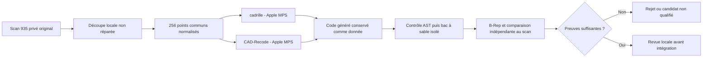

# Essai ciblé de cadrille et CAD-Recode — 12 septembre 2026

**Les deux modèles ont réellement généré une CAO, puis été contrôlés séparément.
Les deux candidats sont écartés du modèle maître : détails manquants et écarts au scan.**

## But et limites

Comparer deux modèles spécialisés sur **la même entrée**, avant correction de la culasse.
Ce pilote ne simule ni thermique, ni résistance, ni impression et ne qualifie aucun moteur 700 hp.
Un modèle génératif propose une hypothèse ; il ne justifie pas seul une modification du contour Porsche.



## Entrée réellement préparée

- Source : scan fourni de référence **935**, non M64 certifié ; bouche de conduit et bride locale `low_B`.
- 90 185 triangles originaux retenus, 46 844 sommets uniques exacts ; aucune
  surface inventée, réparation ou fermeture ajoutée.
- Découpe ouverte : 3 651 arêtes de frontière, 2 arêtes non-manifold et 2 triangles
  d’aire nulle. Une fermeture produite par un modèle sera donc une hypothèse.
- Entrée principale : 256 points `float32`, forme `(256, 3)`, FPS float32 depuis
  8 192 points de surface pondérés par aire, graine PCG64 `20260912`, départ 0.
  Cette stratégie suit les auteurs, sans identité bit à bit revendiquée avec leur
  générateur aléatoire ou noyau PyTorch3D. L’entrée uniforme initiale est conservée.
- Normalisation par centre de boîte et demi-plus-grande dimension ; transformation
  inverse enregistrée en privé. L’échelle absolue en millimètres n’est pas attestée.
- Références de contrôle distinctes : 32 768 points, graines `20260913` et `20260914`.

SHA-256 de l’entrée FPS principale `points.npy` :
`e2791955d76a2f2e27c39b4db61d71ff252c1953de9ac3a849f37111a20abd9c`.
Les données géométriques restent privées ; 256 points ne préservent pas nécessairement chaque détail.

## Modèles et provenance figés

| Élément | cadrille | CAD-Recode v1.5 |
| --- | --- | --- |
| Poids | `maksimko123/cadrille` | `filapro/cad-recode-v1.5` |
| Révision des poids | `2f422d1169e4362e2288b0e0f54bb3a2b504e0f9` | `765e8cc315a1a77bd8c69ccd0b403bad20ce35e8` |
| Dépôt du code | `col14m/cadrille` | `filaPro/cad-recode` |
| Révision du code | `d72acc687273d31d62afe62eb9ded8b66b835321` | `03e3262119b38939feaa44b8368ad8db99243d47` |

Le chargeur vérifie le SHA officiel avant import. CAD-Recode : seules les deux classes
du premier bloc du notebook sont extraites ; démos, rendus et `exec` sont exclus.
Les révisions des processeurs/tokenizers sont également figées.

Les **poids des deux modèles sont CC-BY-NC-4.0** : essai de recherche non commercial
uniquement, sans autorisation commerciale déduite de cet essai. Le code cadrille
Apache-2.0 ne supprime pas la restriction des poids. Sources :
[cadrille, fiche officielle](https://huggingface.co/maksimko123/cadrille),
[CAD-Recode v1.5, fiche officielle](https://huggingface.co/filapro/cad-recode-v1.5),
[code cadrille](https://github.com/col14m/cadrille),
[code CAD-Recode](https://github.com/filaPro/cad-recode).

## Exécution bornée et reproductibilité

Le [chargeur](../twins/m64-cylinder-head/source/run_cad_specialist_inference.py) utilise
Transformers, Safetensors et SDPA, sans `trust_remote_code` ni jeton implicite.
Exécution réelle locale Apple MPS : PyTorch 2.5.1, torchvision 0.20.1, Transformers 4.50.3,
paramètres float32, huit threads CPU, cast des embeddings adapté et tracé, sans repli CPU silencieux.
La première tentative MPS a échoué sur les seuils mémoire, pas sur la géométrie.
Les deux réussites utilisent haut/bas 0,5/0,4 ; le chargeur contrôle désormais leur ordre avant téléchargement.
Vast `50801707` : image non chargée en 15 min, instance supprimée et absence vérifiée ; aucune inférence distante.
Débit de crédit observé : **0,0073427022 USD**, provisoire, sans garantie de facturation finale.

```bash
python run_cad_specialist_inference.py --model cadrille --device mps \
  --points points.npy --output cadrille-run --noncommercial-research \
  --seed 42 --max-tokens 1536 --generation-seconds 120 --timeout-seconds 900
```

Répéter avec `--model cad-recode` et un nouveau dossier. Les deux exécutions séquentielles
emploient une génération gloutonne, graine 42, plafond réel 1 536 tokens, limite souple
120 s et superviseur 900 s. Pas de garantie bit à bit entre architectures GPU.

Sorties privées : code inerte, `generation.json`, `supervision.json`, journaux et audits.
Le contrôle séparé applique ×0,01 aux coordonnées CAO, sans recalage ICP ni ajustement d’échelle.
Driver CAD-Recode archivé et hashé ; hash du driver cadrille-v2 indisponible, non reconstruit a posteriori.

Le code généré a été lu avant exécution : les deux sorties ne contiennent que des
constructions CadQuery simples. Exécution puis audit natif dans **deux conteneurs
distincts** sur Kali : réseau coupé, utilisateur non privilégié, racine en lecture
seule, deux CPU, 4 GiB, 128 processus et 120 s par étape. L'analyse AST n'est pas
une frontière de sécurité. **Limite restante :** le volume cumulé du répertoire
de sortie et les journaux hôte ne sont pas plafonnés ; la limite par fichier ne
suffit pas. Ce pilote supervisé n'autorise donc pas un service autonome exécutant
du code LLM arbitraire. Il faudra des sorties à quota et des journaux bornés.

Le [reçu public expurgé](../twins/m64-cylinder-head/evidence/cad-specialists-20260912.json)
conserve identités, empreintes, durées, résultats et limites. Scan, code généré,
B-Rep et images comparatives dérivées restent privés tant que les droits de
redistribution du scan ne sont pas établis.

## Vérifications et résultats

Les [10 tests du chargeur](../tests/test_m64_cad_specialist_inference.py) passent ;
les résultats ci-dessous viennent des exécutions et audits, pas de ces tests logiciels.
Au total, **77 tests ciblés passent, aucun ignoré** : 50 contrôles du profil de
location/recherche, 10 du chargeur et 17 de géométrie/confinement. Les comparaisons
ont été rejouées avec vérification SHA des deux tableaux de référence réellement
consommés. Les deux exécutions natives ont aussi été rejouées avec preuve positive
d'absence des conteneurs ; B-Rep et distances sont identiques aux premiers essais.

`make check` a été lancé : il s'arrête sur le rapport de préparation historique
F46 différent des sources. Le même échec a été reproduit sur la branche publiée
avant ce lot, commit `3c00c0f08a96b9fca07e1b86f6483c78c357be9e`.
Ce rapport n'a pas été régénéré pour masquer l'écart ; la suite globale n'est pas
présentée comme verte et aucune fusion vers la branche principale n'est proposée.

| Mesure observée | cadrille | CAD-Recode v1.5 |
| --- | --- | --- |
| Génération seule | 32,279 s | 33,795 s |
| Nouveaux tokens / fin EOS | 185 / oui | 257 / oui |
| Chargement mesuré, caches différents | 5,078 s | 68,441 s |
| Mémoire MPS courante / pilote, Go décimaux, pas des pics | 8,879 / 9,757 | 6,209 / 7,776 |
| Audit CadQuery 2.8.0 / OCP 7.9.3.1 | 1 solide valide, 19 faces | 1 solide valide, 26 faces |
| Distance p95 scan → candidat, normalisée | 0,326215 | 0,352646 |
| Distance p95 candidat → scan, normalisée | 0,123551 | 0,197387 |

Distances entre deux échantillons de 32 768 points, pas des distances exactes aux
surfaces ni une borne de Hausdorff. Rééchantillonnage du scan seul : p95 **0,012359**,
repère de comparaison, pas tolérance d’acceptation prédéfinie. La plus grande dimension vaut 2.
Les deux reconstructions omettent quatre petits perçages ; leurs fermetures ne sont
pas observées dans le crop ouvert. Validité B-Rep seule ≠ auto-intersections indépendamment vérifiées.
Cadrille a de plus petits p95 sur **cet unique crop** : aucun classement général n’en découle.

## Suite retenue

Ne pas intégrer ces reconstructions génératives. Reprendre une reconstruction
paramétrique guidée par le scan : perçages et contours observés, provenance des
surfaces reconstruites, comparaison locale puis contrôle des interfaces connues.
N’inventer ni cotes M64 ni géométrie cachée. Aucune validation matériau, thermique,
pression, fatigue, fonctionnement moteur ou LPBF n’est apportée par ce pilote.
